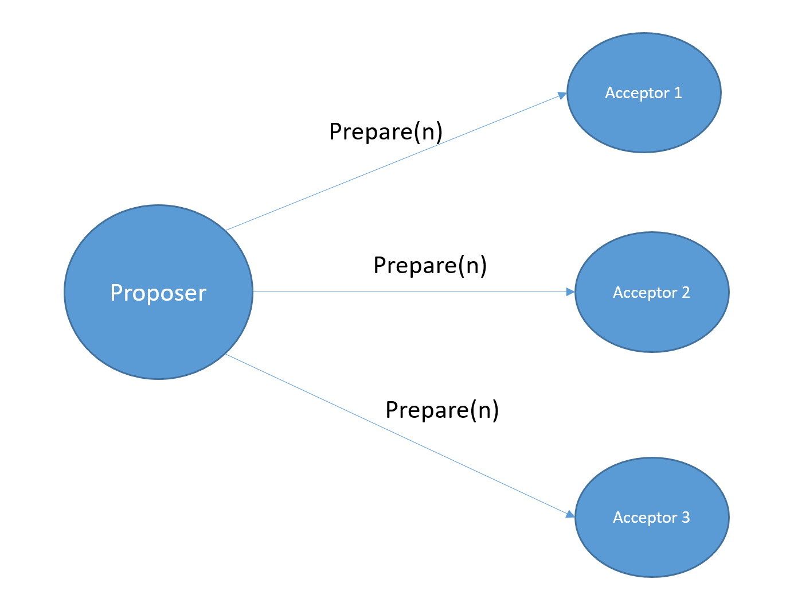
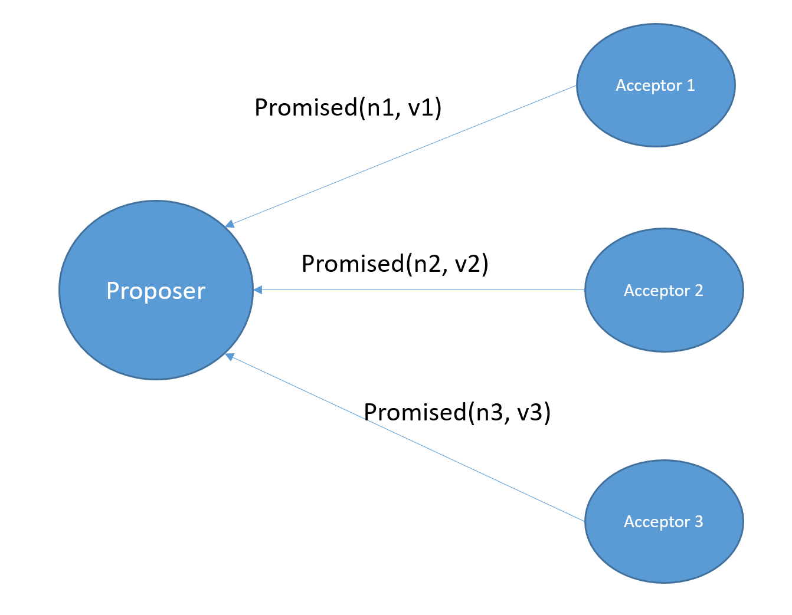
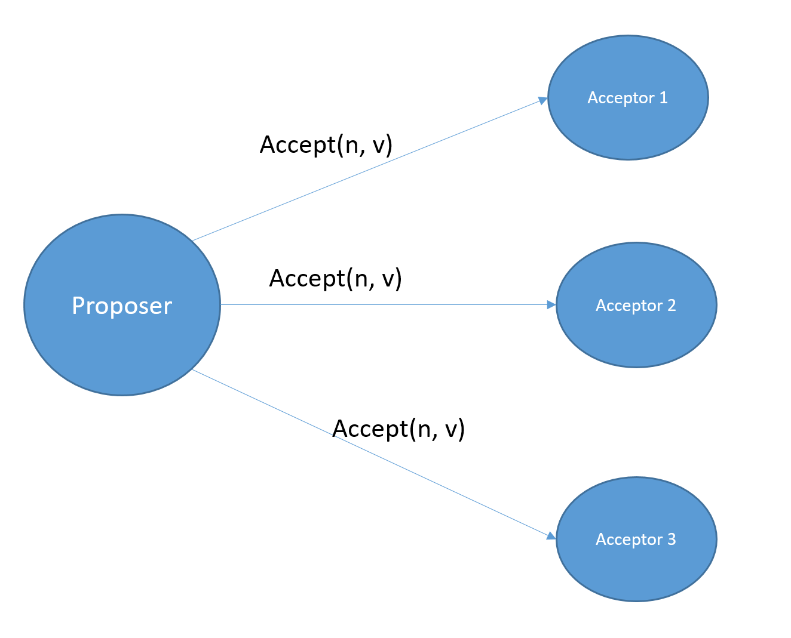
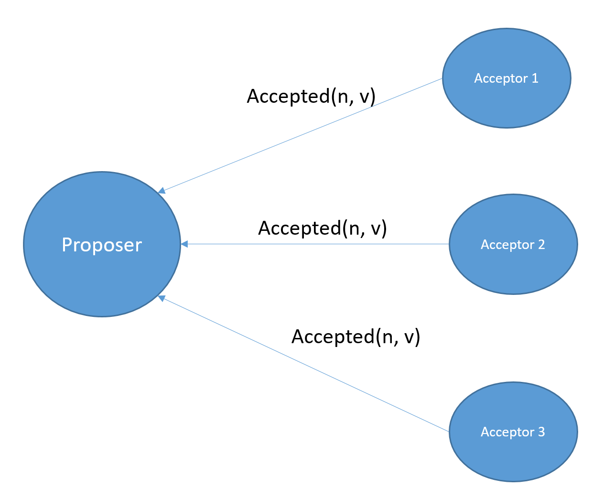
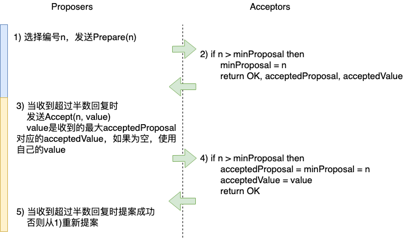
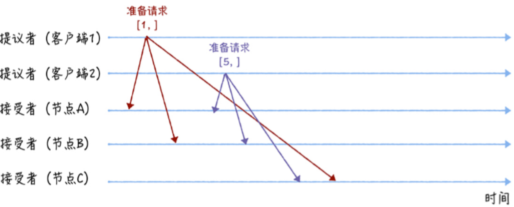
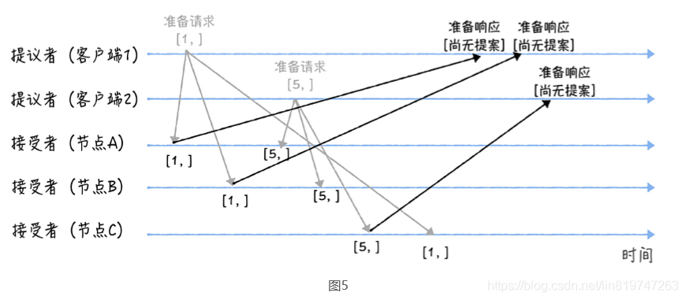
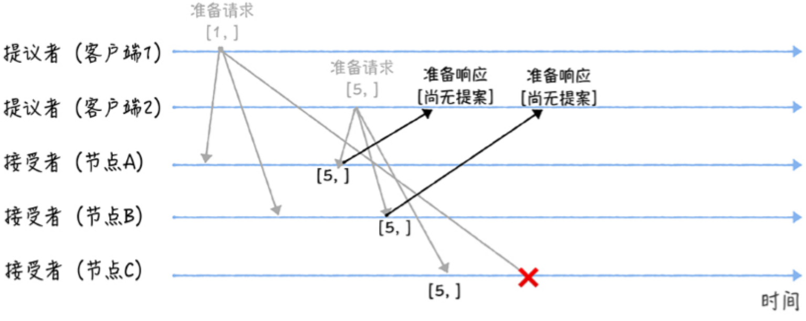
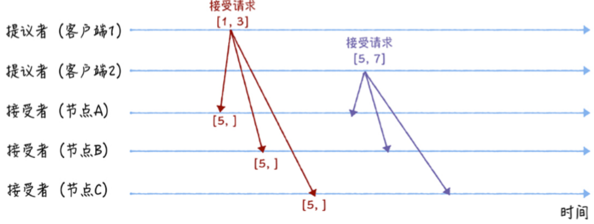
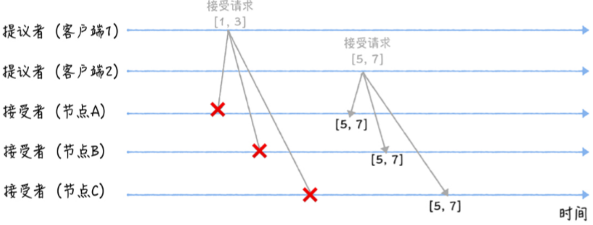

# Paxos算法

原文：https://www.toutiao.com/i6964378176881459742/

​        分布式一致性问题是分布式系统中最常遇到的一个基本问题。简单地说，就是在一个或多个进程发起一个提议以后，比如一个变量的取值应当是什么，系统中所有进程对这提议（变量的取值）达成一致意见。

​        针对这个问题，Leslie Lamport提出了一种基于消息传递的分布式一致性算法，即Paxos算法。他也因此获得2013年图灵奖。另外值得一提的是大名鼎鼎的论文排版工具LaTex也是Lamport的作品。

​        Paxos算法由Lamport于1998年在《*The Part-Time Parliament*》论文（兼职议会）中首次公开，最初的描述使用了希腊的一个小岛Paxos作为比喻，描述了Paxos小岛中通过决议的流程，并以此命名这个算法。

​        自Paxos算法问世以来，对于分布式一致性问题的解决有着革命性的影响，Paxos这个名词几乎等同于分布式一致性。Google的很多大型分布式系统都采用了Paxos算法来解决分布式一致性问题，如Chubby、Megastore以及Spanner等。ZooKeeper的Zab协议也是Paxos算法的一个变型。本文就来介绍一下这个著名的算法，理解了这个算法有利于我们更好地理解分布式系统的数据一致性问题。

## Paxos算法

​        Paxos算法解决的问题就是一个分布式系统中的各个进程如何就某个值（决议）达成一致。在Paxos算法中，将系统中的角色（节点）分为**提议者 (Proposer)**，**决策者 (Acceptor)**，和最终决策**学习者 (Learner)**。

- **Proposer**: 提出提案 (Proposal)。Proposal信息包括：提案编号 (Proposal ID) 和提议的值 (Value)
- **Acceptor**：参与决策，回应Proposers的提案。收到Proposal后可以接受提案，若Proposal获得多数Acceptors的接受，则称该Proposal被批准
- **Learner**：不参与决策，从Proposers/Acceptors学习最新达成一致的提案

​        

​        Paxos协议中所有节点就某一个提议达成共识，可分为三个阶段：

1. **Prepare阶段**：Proposer向Acceptor发Prepare请求，Acceptor返回承诺。
2. **Accept阶段**：Proposer再向Acceptor发Accept请求。如果大多数Acceptor都接受提议，那么提议被最终确定定。
3. **学习阶段**：Learner可以根据Proposer或Acceptor的状态，学习最终确定的值。

### Prepare阶段

​        Proposer首先选择一个提议编号n，向Acceptor广播Prepare(n)请求。

​        Acceptor接收到Prepare(n)请求，若提议编号n比之前接收到的Prepare请求编号都要大，那么Acceptor承诺将不会**接受（Accept）**提议编号比n小的提议，并且返回之前接受的提议中编号小于n的最大的提议，否则不予理会。

​        如果Acceptor之前都没有接受过Accept请求，那么就不用返回接受过的提议。

### Accept阶段

​         Proposer得到了多数Acceptor的承诺后，如果没有发现有一个Acceptor接受过一个值，那么向所有的Acceptor发起自己的值和提议编号n。否则，从所有接受过的值（v1、v2、v3）中选择对应的提议编号最大的，作为提议的值v，提议编号仍然为n。

​        Proposer发出Prepare(n)请求后，得到多数派的承诺应答即可。然后可以随便再选择超过半数的Acceptor节点广播Accept请求，而不一定要将Accept请求发给之前有应答的Acceptor。

​        Acceptor接收到提议后，如果该提议编号不违反自己做过的承诺，则回复Proposer表示接受该提议。

​        当Proposer收到超过半数的回复时，说明自己的提案已经被接受。否则回到第一步重新发起提案。

​        假如Proposer发给A1的Accept请求丢了，不过A2和A3成功接受了这个提议。因为这个提议被多数派（A2和A3形成多数派）接受，所以这个被多数派接受的提议也就被**最终选定（Chosen）**。

​        完整的Paxos算法可以用下图表示：

### 不止一个提议者的情况

​        为了让大家理解得更容易提议者多于一个的情况，下面举一个实际的例子，并且不止一个提议者。客户端1和2都是提议者，先后发起准备请求，编号分别为1和5。

​        节点A和节点B先收到了客户端1的提议，节点C先收到了客户端2的提议。客户端1收到了节点A和B的回应，表示尚无已接受的提案，而且承诺不会响应编号小于等于1的提案。客户端2收到了节点C的回应，也表示尚无提案，而且承诺不会响应编号小于等于5的提案。

​        之后节点A和节点B也收到了客户端2的提议，编号为5，5比1大，所以节点A和节点B可以响应。他们回应客户端2，承诺不响应编号小于5的提案。节点C收到了客户端1的提议，因为节点C已经承诺不会响应编号小于5的提案，直接丢弃不响应。

接下来是**Accept阶段。**

​        客户端1和2都收到了过半数的回应，因此向所有Acceptor分别发出了Accept请求。由于所有Acceptor都没有提议，所以客户端1和2都以自己的值作为提案。客户端1的提案是3，客户端2的提案是7。

​        节点A、B、C都已经承诺过不响应编号小于5的承诺，所以拒绝接受客户端1的提案，而接受了客户端2的提案。最后三个节点达成了共识。

