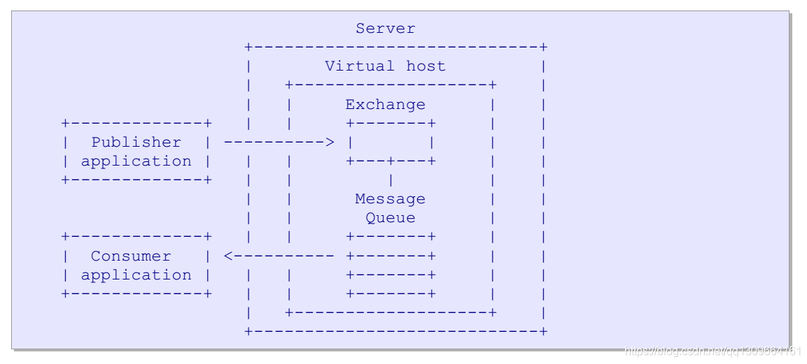

## AMQP协议详解

原文：https://blog.csdn.net/qq1309664161/article/details/117735003?spm=1001.2101.3001.6661.1&utm_medium=distribute.pc_relevant_t0.none-task-blog-2%7Edefault%7ECTRLIST%7ERate-1-117735003-blog-126130131.pc_relevant_3mothn_strategy_recovery&depth_1-utm_source=distribute.pc_relevant_t0.none-task-blog-2%7Edefault%7ECTRLIST%7ERate-1-117735003-blog-126130131.pc_relevant_3mothn_strategy_recovery&utm_relevant_index=1

### 一. 总体介绍

#### 1.1 什么是AMQP协议

AMQP（Advanced Message Queuing Protocol）是一个进程间传递异步消息的恶网络协议。它描述了在网络上传输的数据的格式，以字节为流。因此任何遵守此数据格式的工具，其创建和解释消息，都能 与其他兼容工具进行互操作。

#### 1.2 规模化部署

AMQP 范围涵盖不同等级规模，大致如下：

* 开发/临时使用：1台服务器，1个用户，10个消息队列，每秒1消息
* 产品应用程序：2台服务器，10-100个用户，10-50个消息队列，每秒10个消息（36K messages/hour）
* 部门关键任务应用：4台服务器，100-500个用户，50-100个消息队列，每秒100个消息（360K/hour）
* 区域任务关键应用：16台服务器，500-2000个用户，100-500个消息队列和主题，每秒1000个消息
* 全球任务关键应用：64台服务器，2k-10k个用户，500-1000个消息队列和主题，每秒10000个消息（36M/hour）
* 市场数据（交易）：200台服务器，5K哥用户 ，10K主题，每秒100K个消息

规模越大，消息传输延迟就越严重。例如，市场数据变化相当快，实现可以依据不同的服务管理和管理能力不区分对待，但必须与本规范兼容。

#### 1.3 功能范围

要支持多种消息传递架构：

* 使用多个writers 和一个reader 来存储转发
* 侍弄多个writers 和多个 readers 来分散工作负载
* 使用多个writers 和多个 readers 来发布订阅
* 使用多个writers 和多个 readers 来基于内容路由
* 使用多个writers 和多个 readers 来进行队列文件传输
* 在两个节点之间进行点对点连接
* 使用多个源和多个readers来分布市场数据

由此可知，**AMQP协议可以急性订阅-发布，文件传输，点对点连接等操作**。

#### 1.4 整体架构

**Virtual Host**:

虚拟机，消息队列以及相关对象的集合。虚拟机是共享同一个身份验证和加密环境的独立服务器域。

**Exchange**:

服务器中接收来自生产者应用程序的恶消息的实体，并可选择这些消息路由到服务器中的消息队列。

中间件服务器是什么:它是一个接受消息的数据服务器，并主要做两件事情，依据条件将消息路由给不同的消费者,当消费者消费速度不够快时，它会把消息缓存在内存或磁盘上．
在AMQP之前的服务器中，它们会通过实现了特定类型路由和缓存的庞大引擎来完成. AMQ模块使用较小的模块结合更多样和稳健的方案来实现. 它把这些任务分成了两个不同角色:

* 交换器，它接受来自生产者的消息并将它们路由到消息队列
* 消息队列，它存储消息并把它们转发给消费者应用程序

在交换器和消息队列之间有一个明显的界面，称为绑定(binding)。

一句话总结：AMQP的工作原理就是:生产者发送消息到达broker的交换器上，交换器将消息路由到不同的队列中。消费者从队列中获得消息。

上面对AMQP协议做了一个总体的，宏观的介绍，大致了解了AMQP协议。下面，重点讲解AMQP相关的组件和特性。

### 二. 交换器（exchange）和路由器（Routing Key）

#### 2.1 交换器

交换器接收来自生产者应用程序的消息，并将它们按照事先约定的规则(在消息的属性和内容中定义)路由到消息队列中。
这些预先约定的规则或条件称为绑定. 交换器会与路由引擎匹配。
也就是说，它们会检查消息，并使用它们的绑定表来决定如何将这些消息转发到消息队列或其他交换器中。**交换器永远不会存储信息**。“交换器”一词是指一类算法或算法实例。
更确切的说，谈到了交换器类型和交换器实例。
AMQP定义了许多交换器类型，它们覆盖了常见消息路由分发的基础类型。AMQP服务器提供了这些交换器的默认实例。使用AMQP的应用程序可额外创建它们自己的交换器实例。交换器类型是命名的，这样创建交换器的应用程序就可以告知服务器他们使用的交换器类型。
交换器实现也可以是命名的，这样应用程序可指定如何绑定队列来发布消息。
交换器还可以做更多的消息路由。它们可作为服务器内的智能路由代理，按需接受消息和生产消息。交换器概念的目的是定义一套模型或标准，使得可以合理地扩展AMQP服务器，因为可扩展性会对互操作产生影响。

##### 2.1.1 交换器类型

AMQP提供多种交换器，每种交换器都实现了某种路由算法。这里有许多标准的交换器类型，但是有两点很重要：

* 基于路由键来路由的 direct 交换器类型，**默认交换器是 direct 交换器**
* 基于路由模式来路由的 topic 交换器类型

在启动时，服务器将会创建一系列交换器，如 direct 和 topic。

交换器有如下几种类型：

* **Direct 交换器类型**

    direct交换器类型的工作方式：

    * 消息队列使用路由键K来绑定交换器
    * 发布者使用路由键R来向交换器发送消息
    * 在 **K = R** 时，消息会传递到消息队列中

    AMQP的Server必须实现 Direct 交换器，并且在每个虚拟主机中必须定义两个direct交换器：一个名为**amq.direct**，另一个无公共名称（为 publish 方法的默认交换器）

    注意：消息队列可以使用任何有效的路由键值进行绑定，但通常消息队列使用它们自己的名称做路由键来绑定。事实上，所有消息队列必须能够使用自身队列名称作为路由键自动绑定无名称的交换器上。

* **Fanout 交换器类型**

    Fanout交换器类型的工作方式：

    * 消息队列不使用参数来绑定交换器
    * 发布者向交换器发送消息
    * 消息无条件传递给消息队列

    Fanout交换器时微不足道的设计和实现，此交换器类型和预申明的交换器称为**amq.fanout**，它是强制的。

* **Topic 交换器类型**

    Topic交换器的工作方式：

    * 消息队列使用路由模式P来绑定到交换器
    * 发布者使用路由键R来向交换器发送消息
    * 当 **R匹配P** 时，消息将被传递到消息队列

    用于 Topic 交换器的路由键必须由点分隔的 **0个或多个** 单词组成，每个单词必须包含字母A-Z和a-z以及数字0-9。

    路由模式与路由键遵循相同的规则，***** 用于匹配单个**单词**，**#** 用于匹配 **0个或者多个** 单词，因此路由模式 ***.stock.#** 会匹配路由键 usd.stock 和 eur.stock.db，但不匹配 stock.nasdaq。

    对于 Topic 交换器，建议的设计是保持所有已知路由键的集合，当发布者使用了新的路由键时，才更新此集合。通过给定一个路由键来确实所有绑定时可能的，因此可为消息快速找到消息队列。此交换器类型时可选的。

    Server应该实现 Topic 交换器类型，在这种情况下，server必须在每个虚拟机中预先定义至少一个 topic 交换器，其名称为 amq.topic。

* **Headers 交换器类型**

    Headers 交换器类型按如下方式工作：

    * 消息队列使用包含匹配绑定和带有默认值的header参数来绑定交换器。在这种交换器类型中，不使用路由键
    * 发布者向交换器发送消息，这些消息的 headers 属性中包含名称、值对的表
    * 如果消息头属性与队列绑定的参数相匹配，则消息传递给队列

    匹配算法是由参数表中的名称值对这样的特殊绑定参数来控制的。这个参数的名称是 “x-match”。它可以接受两种值，以表示表格中其他的名称值对将如何来进行匹配：

    * “all”，表明所有其他的名称直对必须与路由消息的头属性相匹配（即 and 匹配）
    * “any”，表明只要消息头属性中的任何一个字段匹配参数表中的字段，则消息就应该被路由（即 OR 匹配）

    绑定参数中的字段必须与消息字段中的字段相匹配，这些情况包括：如果绑定参数中的字段没有值且在消息头中存在相同名称的字段，或者绑定参数中的字段有值，且消息属性中存在同样的字段且有相同的值。

    人何以 “x-” 而不是 “x-match” 开头的字段为将来保留使用并会被忽略。

    server应该实现headers交换器类型，且server必须在每个虚拟主机中预先声明至少一个headers交换器，且名称为amq.match。

* **System 交换器类型**

    system交换器类型按如下方式进行工作：

    - 发布者使用路由键S来向交换器发送消息
    - system交换器将其传递给系统服务S
        系统服务以 “amq.” 开头，为AMQP保留使用。在服务器环境中，所有其它名称可自由使用。 此交换器类型是可选的。

* **实现定义的交换器类型**

    所有非规范交换器类型必须以 "x-" 开头. 不以 "x-" 开头的交换器作为将来AMQP标准保留使用。

##### 2.1.2 交换器的生命周期

每个AMQP服务器都预先创建了许多交换器实例。这些交换器当服务器启动时就存在了，不能被销毁。AMQP应用程序也可以创建他们自己的交换器。AMQP不会使用像这样的 “create” 方法，相反它使用 “decleare” 方法。其意义是：如果你不存在就创建，否则继续。这个逻辑是合理的，因为：应用程序可以为了私有使用而创建交换器，并在完成工作时进行销毁。AMQP提供了方法来销毁交换器，但一般来说，应用程序不会这样做。

交换器的生命周期如下：

1. Client 请求 Server 确保交换器是否存在（Declare），Client 可细化到 “如果交换器不存在则进行创建”，或者“如果交换器不存在，警告我，不需要创建”
2. Client 发布消息到交换器
3. Client 可选择删除交换器（Delete）

交换器是一个虚拟主机内的消息路由代理。交换器实例（平时所说的交换器）接受消息和路由消息。主要是一个路由键-或者将消息传递到消息队列，或到内部服务。交换器是基于每个虚拟主机命名的。

应用程序可以在权限范围内自由地创建、共享、使用和销毁交换器实例。交换器可能是持久的、临时的或自动删除的。持久化的交换器会持续到他们被删除，临时的交换器会持续到服务器关闭。自动删除的交换器直到他们不再使用。服务器提供了一组特定的交换器类型。每个交换器类型都实现了一个特定的匹配和算法，如下一节中定义的。AMQP只要求少量的交换器类型，并推荐了一些。此外，每个服务器实现可以添加自己的交换类型。
交换器可以将单个消息并发地路由到的消息队列中。这将创建一个独立消息的多个实例。

* 用户定义的交换器类型前缀必须是 “X-”
* 标准交换器实例前缀是“amq.”
* 标准系统服务前辍是"amq."
* 标准消息队列前辍是"amq."
* 所有其他的交换器、系统服务和消息队列名称都在应用程序空间中

#### 2.2 路由键

在一般情况下，交换器会检查消息的属性，如，它的header字段，body内容，并使用这些和其他来源中的数据来决定如何消息路由。

* 在大多数简单情况下，交换器会检查某个单一的键字段，称之为“路由键”。
* 路由键是一个虚拟地址，该虚拟地址可用来决定如何路由消息。
* 对于点对点的路由，路由键通常是消息队列的名称。
* 对于主题发布订阅路由，路由键通常是topic层次结构值。
* 在更复杂的情况下，路由键可以是消息header字段和/或消息内容的组合体。

### 三. 消息队列（Message Queue）

存储消息直到它们可以被消费客户端应用程序(或多线程应用程序)安全处理。
消息队列用于在内存或磁盘上存储消息，并将它们依次投递给一个或多个消费者应用程序。消息队列是消息存储和分发的实体，每个消息队列是完全独立的，且是一个相当聪明的对象。
消息队列有多个属性：私有的或共享的， 持久的或临时的，客户端命名的或服务器端命名的等等。
通过选择希望的属性，可以使用消息队列来实现传统的中间件实体，如：

* 共享存储转发队列：它可以持有消息，并以round-robin方式在消费者之间分发消息.存储转发队列通常是在多个消费者之间是持久化的
*  私有回复队列：它可以持有消息，并把消息转发给单个消费者. 回复队列通常是临时的，服务端命名的，且对于某个消费者来说是私有的
*  私有订阅队列：它可持有来自不同订阅源的消息，并将它们转发给单个消费者
* 订阅队列通常是临时的，服务器端命名的，并对于某个消费者来说是私有的
* AMQP没有定义这些类别：这些只是如何使用消息队列的例子。创建如持久化，共享订阅队列的新实体没什么意义。

#### 3.1 消息队列属性

#### 3.2 消息队列生命周期

### 四. 绑定（Bingding）

**定义了消息队列与交换器之间的关系，并提供了消息路由条件**。
绑定表示的是交换器和消息队列之间的关系，该关系告诉交换器如何路由消息。绑定是从客户端应用程序命令（一个拥有和使用消息队列的应用程序）中来绑到交换器上的。我们可以在伪代码中表达一个绑定命令，如下所示：
     Queue.Bind TO WHERE

绑定是消息队列和交换器之间的关系.绑定特有的路由参数将告诉交换器那些队列应该得到消息。应用程序可根据需要来驱动消息流向它们的消息队列。 绑定的寿命依赖于定义它们的消息队列 - 当消息队列被销毁时，其绑定也会被销毁。Queue.Bind 方法的特定语义将依赖于交换器类型。

### 五. 通道（Channel）

AMQP是一个多通道协议。通道提供了一种方式来将一个重量级TCP/IP连接分成多个轻量级连接。
这使得协议对于防火墙更加友好，因为端口使用是可预测的。这也意味着传输调整和网络服务质量可以得到更好的利用。
通道是独立的，它们可以同时执行不同的功能，可用带宽会在当前活动之间共享。
这是令人期待的，鼓励多线程客户端应用程序经常使用“每个通道一个线程”编程模型。
然而，从单个client打开一个或多个AMQP servers连接也是完全可以接受的。

通道生命周期如下:

1. client打开一个新通道(Open).
2. server确认新通道准备就绪(Open-Ok).
3. client和server按预期来使用通道.
4. 一个节点(client或server) 关闭了通道(Close).
5. 另一个节点对通道关闭进行握手(Close-Ok).

### 六. Basic

Basic 类实现本规范中描述的消息功能。它支持如下主要语义：

* 从client发送消息给server，异步发生(Publish)
*  启动和停止消费者(Consume, Cancel)
*  从server发送消息给client, 异步发生(Deliver, Return)
*  应答消息(Ack, Reject)
*  同步从消息队列中取消息 (Get)
   

### 七. 事务（Transaction）

AMQP 支持两种类型的事务：

1. 自动事务： 每个发布的消息和应答都处理为独立事务．
2. Server 本地事务，服务器会缓存发布的消息和应答，并会根据需要由client来提交它们。

Transaction 类(“tx”) 使应用程序可访问第二种类型，即服务器事务。这个类的语义是：

1. 应用程序要求在每个通道中都有事务(Select)
2. 应用程序做一些工作(Publish, Ack)
3. 应用程序提交或回滚工作(Commit, Roll-back)
4. 应用程序做一些工作,循环往复

事务能覆盖发布内容和应答，但不能覆盖投递（deliveries）. 因此回滚不能导致消息重新入队或者重新投递, 客户端有权在事务中确认这些消息。

### 八. 错误处理

AMQP使用异常来处理错误。任何操作错误(未找到消息队列，访问权限不足)都会导致一个通道异常。任何结构化的错误(无效参数，坏序列的方法.)都会导致一个连接异常.异常会关闭通道或连接，同时也会向客户端应用返回响应码和响应文本。使用了类似于HTTP等协议和其它大多数协议中的三位回复代码和文字回复文本方案。

**异常**
使用标准的异常编程模型， AMQP不会发出成功信号，只在失败时才发出信号。AMQP定义了两种异常级别:

* 通道异常：指那些关闭通道引起的错误.通道异常通常是因为软错误引起的，这些错误并不影响应用程序的其它部分
* 连接异常：这些关闭socket连接的异常通常是因为硬错误造成的，如程序错误，错误配置或其他需要干预的情况

**回复代码格式**
AMQP 回复代码按照 IETF RFC 2821的回复代码的严重程度和理论进行定义。

### 九. 消息

一个AMQP消息由一组属性和不透明的内容组成。一个新消息是由生产者应用程序通过使用AMQP client API来创建的。生产者将“内容”附着在消息中，并对其设置一些消息“属性”。生产者使用路由信息来标记消息，其表面上类似于地址，但几乎可以创建任何模式。然后，生产者将消息发送到服务器上的交换器中。

当消息到达服务器时，交换器通常会将消息路由到一级存在于服务器上的消息队列中.如果消息不能路由,交换器会默默地丢弃或者将其返回给生产者。生产者可以选择如何来处理未路由消息。

单个消息可存在于多个消息队列。服务器可以不同方式进行处理，如通过拷贝消息或通过引用计数器等。这不影响互操作性。然而，当一个消息被路由到多个消息队列时，它在每个消息队列上都是一样的。没有独特的标识符来区分不同的副本。当消息到达消息队列时，消息队列会通过AMQP，立即尝试将消息传递给消费者应用程序。如果不行，消息队列会存储消息(按发布者要求存储在内存或磁盘中)，并等待消费者准备好.如果没有消费者，消息队列通过AMQP将消息返回给生产者(再次地，如果生产者对此有要求的话)。
当消息队列把消息投递给消费者后，它会从内部缓冲区中删除消息.这有可能立即发生，也有可能在消费者应答它已成功处理之后删除。消费者可选择如何以及何时来应答消息。同样地， 消费者也可以拒绝消息(一个否定应答)。
生产者消息和消费者应答可以组成事务。当一个应用程序同时扮演两种角色时，通常它会做混合工作:发送消息和发送应答,然后提交或回滚事务。

从服务器投递消息给消费者，这个过程不是事务的，它只能通过消息应答来处理。

消息可以持久化。一个持久化消息可以安全地存储在磁盘上，即使是在严重的网络故障，服务器崩溃、溢出等情况下也可确保投递。消息也可以有优先级。高优先级消息会在等待同一个消息队列时，在低优先级消息之前发送. 当消息必须被丢弃以确保服务器质量水平，将会优先丢弃低优先级消息。

服务器不能修改接收到并将传递给消费者应用程序的消息内容体。服务器可在内容头中添加额外信息，但不能删除或修改现有信息。

### 十. 虚拟主机（Virtual Hosts）

虚拟主机是服务器内的数据分区，它为在共享基础设施上的管理带来了方便。

一个虚拟主机包括其命名空间、一组交换器、消息队列以及所有相关对象。每个连接必须关联一个单个虚拟主机。

在认证后，客户端可在 connection.open 方法中选择虚拟主机。这意味着，服务器上的认证方案可在此服务器上的所有虚拟主机上共享。然而，对于每个虚拟主机来说，也可以拥有独特的认证方案，对于每个虚拟主机需要不同的身份验证方案的管理员应该使用单独的服务器。

连接中的所有通道都在同一个虚拟主机上工作。在同一个连接中，没有与不同虚拟主机通信的方式， 也没有在不断开连接重新开始的情况下，切换到其它虚拟主机的可能性。
该协议没有提供用于创建或配置虚拟主机的机制。
