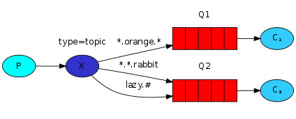
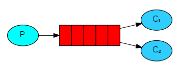

# RabbitMQ 面试题

原文：https://cloud.tencent.com/developer/article/1816305

又： https://blog.csdn.net/weixin_43122090/article/details/103651794

## 1. RabbitMQ 是什么？

RabbitMQ 是实现了高级消息队列协议（AMQP）的开源消息代理软件（也称为面向消息的中间价）。RabbitMQ 服务器使用 Erlang 语言编写的，而群集和故障转移是构建在开放电信平台架构上的。所有主要的编程语言均有代理接口通讯的客户端库。

PS：也可以直接问什么是消息队列？消息队列就是一个使用队列来通讯的组件。

## 2. RabbitMQ 特点？

* **可靠性**：RabbitMQ 使用一些机制来保证可靠性，如持久化机制、传输确认机制以及发布确认机制等等。
* **灵活路由**：在消息进入队列之前，通过交换器（exchanger）来路由消息。对于典型的路由功能，RabbitMQ 已经提供了一些内置的交换器来实现。针对更复杂的路由功能，可以将多个交换器绑定在一起，也可以通过插件机制来实现自己的交换器。
* **扩展性**：多个 RabbitMQ 节点可以组成一个集群，也可以根据实际业务情况动态地扩展集群中节点。
* **高可用性**：队列可以在集群中的机器上设置**镜像**，使得在部分节点出现问题的情况下队列仍然可用。
* **多种协议**：RabbitMQ 除了支持原生的 AMQP 协议外，还支持 STOMP、MQTT 等多种消息中间件协议。
* **多语言客户端**：RabbitMQ 几乎支持所有常用的语言，如： Java、Python、Ruby、PHP、C#、JavaScript 等。
* **管理界面**：RabbitMQ 提供了一个易用的用户界面，使得用户可以监控和管理消息、集群中的节点等等。
* **插件机制**：RabbitMQ 提供了许多插件，以实现从多方面进行扩展，当然也可以编写自己的插件。

## 3. AMQP 是什么?

RabbitMQ 就是 AMQP 协议的 Erlang 的实现（也支持 STOMP2、MQTT3 等协议）。AMQP 的模型架构和 RabbitMQ 的模型架构是不一样的，生产者将消息发送给交换器，交换器和队列绑定。

RabbitMQ 中的**交换器、交换类型、队列、绑定、路由键**等都是遵循的 AMQP 协议中的相应的概念。目前 RabbitMQ 最新版本默认支持的是 AMQP 0-9-1。

## 4. AMQP 协议3层？

* **Module Layer**：协议最高层，主要定义了一些客户端调用的命令，客户端可以用这些命令实现自己的业务逻辑
* **Session Layer**：中间层，主要负责客户端命令发送给服务器，再将服务端应答返回给客户端，提供可靠性同步机制和错误处理
* **TransportLayer**：最底层，主要传输二进制数据流，提供帧的处理、信道复用、错误检测和数据表示等等

## 5. AMQP 模型的几大组件

* **交换器（Exchange）**：消息代理服务器中用于把消息路由到队列的组件
* **队列（Queue）**：用来存储消息的数据结构，位于硬盘或内存中
* **绑定（Binding）**：**一套规则**，告知交换器消息应该将消息投递给哪个队列

## 6. Producer 和 Consumer

### 6.1 生产者

* 消息生产者，就是投递消息的一方
* 消息一般包含两部分：消息体（payload）和标签（Label）

### 6.2 消费者

* 消费消息，也就是接收消息的一方
* 消费者连接到 RabbitMQ 服务器，并订阅到队列上。消费消息时只消费消息体，丢弃标签

## 7. 为什么需要消息队列

## 8. Broker服务节点、Queue队列、Exchange 交换器

* **Broker**：就是 RabbitMQ 的服务节点。一个 Broker 就是一个 RabbitMQ 服务器
* **Queue**：RabbitMQ 的内部对象，用于存储消息。多个消费者可以订阅同一个队列，这时队列中的消息会被平摊（轮询）给多个消费者进行消费（处理 ）
* **Exchange**：生产者将消息发送到交换器，由交换器将消息路由到一个或者多个队列中。当路由不到时，或返回给生产者或者直接丢弃（*也可以放到死信队列里*）

## 9. 消息队列由什么优缺点

### 9.1 优点

​        特殊场景下，**解耦、异步、削峰**

* **解耦**：A系统发送数据到B、C、D三个系统，通过接口调用发送。如果 E 系统也要这个数据怎么办？又，如果C系统现在不需要了怎么办？A系统负责人几乎崩溃…… 这是因为A系统与其他系统存在严重耦合。

  如果使用 MQ，A系统产生的一条数据，发送到 MQ 里，哪个系统需要，就自己去 MQ 里消费；如果某个系统不再需要这数据了，就取消对 MQ 的消费即可。从而实现了 A 系统与其他系统的解耦。

* **异步**：A系统接收一个请求，需要在自己本地写库，还需要在 B、C、D 三个系统写库，自己本地写库需要 3ms，B、C、D 三个系统分别写库时间是 300ms、450ms、200ms。最终请求总延时就是： 3 + 300 + 450 + 200 = 953ms，接近 1s，用户感觉很慢。

  如果使用 MQ，那么 A系统连续发送 3 条消息到 MQ 队列中，假设耗时 5ms，A系统从接受一个请求到返回响应给用户，总时长是 3 + 5 = 8 ms

* **削峰**：减少高峰期对服务器的压力。主要还是来自于互联网业务的场景。例如，春运火车票抢购，大量的用户需要**同一时间**去抢购；以及大家熟知的阿里双11秒杀，这个时候在**同一时间点**请求来得太猛烈，服务器受不住。

  削峰，等于是减缓服务器压力，可以以漏斗，或者流水线（pipeline）的方式来进行消费。

### 9.2 缺点

* **系统可用性降低**。系统引入的外部依赖越多，越容易挂掉。万一 MQ 挂掉，整套系统可能会崩溃
* **系统复杂度提高**。增加了 MQ ，如何保证消息没有重复消费？如何处理丢失的消息？如何保证消息传递的顺序？等等
* **数据一致性问题**。不同服务之间如何保证数据的一致性

## 10. 如何保证消息的可靠性？

​        消息丢失的环节存在这三个地方：消息到 MQ 的过程中搞丢，MQ 自己搞丢，MQ 到消费过程中搞丢。

* **生产者到MQ**：事务机制 和 Confirm 机制。注意：**“事务机制”和 “Confirm 机制”是互斥的**，两者不能共存，会导致 RabbitMQ 报错。
* **MQ自身**：持久化、集群、普通模式、镜像模式
* **MQ到消费者**：basicAck 机制、死信队列、消息补偿机制

## 11. 什么是 RoutingKey 路由键

生产者将消息发送给交换器的时候，会指定一个 RoutingKey，用来指定这个消息的路由规则，这个 RoutingKey 需要与交换器类型和绑定键（BingingKey）联合使用才能最终生效。

## 12. Binding 绑定

通过绑定将交换器和队列关联起来，一般会指定一个 BindingKey，这样 RabbitMQ 就知道如何正确路由消息队列了。

可以这样简单的理解“binging”：一个映射关系，用于映射“消息”到“队列”的关系。

## 13. 交换器的类型

* **fanout**：消息广播的模式，即将消息广播到所有绑定到它的队列中，而不考虑 RoutingKey 的值（不管路键或是路由模式）。如果设置了 RoutingKey ，则 RoutingKey 依然被忽略。

* **direct**：把消息路由到那些 BindingKey 和 RoutingKey 完全匹配的队列中。

  Direct Exchange 是 RabbitMQ **默认的**交换器模式，也是最简单的模式。它根据 RoutingKey **完全匹配**去寻找队列。

* **topic**：主题模式。其实就是在Direct路由模式的基础上，支持了对key的通配符匹配（星号以及井号），以满足更加复杂的消息分发场景。

  

  支持通配符：

  * RoutingKey 为一个点号 “.” 分隔的字符串（被点号 “.” 分隔开的每一段独立的字符串称为一个单词），如：com.rabbitmq.client、java.util.concurrent、com.hidden.client；
  * BindingKey 和 RoutingKey 一样也是点号 “.” 分隔的字符串；
  * BindingKey 中可以存在两种特殊字符串星号 “*” 和井号 “#”，用于做模糊匹配，其中星号 “\*” 用于匹配一个单词，井号 “#”用于匹配多个规则单词（0个或者多个单词）；

* **headers**：Headers 类型的交换器不依赖于路由键的匹配规则来路由消息，而是根据发送的**消息内容中的 headers 属性进行匹配**。在绑定队列和交换器时制定一组键值对，当发送消息到交换器时，RabbitMQ 会获取到该消息的 headers（也是一个键值对的形式），对比其中的键值对是否完全匹配队列和交换器绑定时指定的键值对，如果完全匹配则消息会路由到该队列，否则不会路由到该队列。**Headers 类型的交换器性能会很差，而且不实用**，基本上不会看到它的存在。

## 14. 生产者生产消息过程

1. Producer 线连接到 Broker，建立连接 Connection，开启一个信道（Channel）
2. Producer 声明一个交换器并设置好相关属性
3. Producer 声明一个队列并设置好相关属性
4. Producer 通过路由键将交换器和队列绑定起来
5. Producer 发送消息到 Broker，其中包含路由键、交换器等信息
6. 相应的交换器根据接收到的路由键查找匹配的队列
7. 如果找到，将消息存入对应的队列；如果没有找到，会根据生产者的匹配丢弃或者退回给生产者
8. 关闭信道
9. 关闭连接

## 15. 消费者消费消息过程

1. Consumer 先连接到 Broker，建立连接 Connection，开启一个信道（Channel）
2. 向 Broker 请求消费响应的队列中消息，可能会设置响应的回调函数
3. 等待 Broker 回应并投递相应队列中的消息，接收消息
4. 消费者确认收到消息，ack
5. Broker 从队列中删除已经确定的消费
6. 关闭信道
7. 关闭连接

## 16. 死信队列

**DLX**，全称 Deal-Letter-Exchagne，死信交换器，死信邮箱。当消息在一个队列中变成死信（Dead Message）之后，它能被重新发送到另一个交换器中，这个交换器就是 DLX，绑定 DLX 的队列就是死信队列。

## 17. 导致死信的原因

* 消息被拒（Basic.Reject / Basic.Nack) **且** requeue = false
* 消息 **TTL** （Time-To-Live） 过期
* 队列满了，无法再添加

## 18. 延迟队列

存储对应的延迟消息，指当消息被发送以后，并不想让消费者立刻拿到消息，而是等待指定的时间后，消费者才能拿到这个消息进行消费。

RabbitMQ默认没有提供`延迟队列`功能，而是要通过插件提供的`x-delayed-message`（延迟交换机）来实现。

`延迟队列`：用户可以使用该类型声明一个交换，`x-delayed-message`然后使用自定义标头发布消息，`x-delay`以毫秒为单位表示消息的延迟时间。消息将在`x-delay`毫秒后传递到相应的队列。

## 19. 优先级队列

* 优先级高的队列先被消费
* 可以通过设置 x-max-priority 参数实现
* 当消费速度大于生产速度，且 Broker 没有堆积的情况下，优先级显得没有意义

## 20. 发送确认机制

生产者把信道设置为 confirm 确认模式，设置后，所有再改信道发布的消息都会被指定一个唯一的 ID，一旦消息被投递到所有匹配的队列之后，RabbitMQ 就会发送一个确认（Basic.Ack) 给生产者（包含消息的唯一 ID），这样生产者就知道消息到达对应的目的地了

## 21. 消息传输保证层级

* **At Most Once**：最多一次。消息可能会丢失，但不会重复传输（*只发一次*）
* **At Least Once**：至少一次。消息绝不会丢失，但可能会重复传输（*会重复发*）
* **Exactly Once**：恰好一次。每条消息肯定仅传输一次（*有，且只有一次被发送到Queue*）

## 22. 集群中的节点类型

* **内存节点**：RAM，将变更写入内存
* 磁盘节点：DISC，磁盘写入操作

​        RabbitMQ 要求***最少有一个磁盘节点***。

## 23. 队列结构

队列通常由两部分组成：

* **rabbit_amqqueue_process**：**负责协议相关的消息处理**，即接收生产者发布的消息，向消费者交付消息，处理消息的确认（包括生产端的 confirm 和消费端的 ack）等
* **backing_queue**：是消息存储的具体形式和引擎，并向 rabbit_amqqueue_process 提供相关的接口以供调用

## 24 RabbitMQ 中消息可能有几个状态？

主要涉及到 **消息** 以及 **消息索引**：

* **alpha**：消息内容（包括消息体、属性和 headers）和消息索引都存储在内存中
* **beta**：消息内容保存在磁盘中，消息索引保存在内存中
* **gamma**：消息内容保存在磁盘中，消息索引在磁盘和内存中都有
* **delta**：消息内容和索引都在磁盘中

## 25. 什么场景下使用消息中间件

* 接口之间耦合度比较严重
* 面对大量并发时，容易被冲垮
* 存在性能问题

## 26. 生产者如何将消息可靠投递到MQ

1. Client 发送消息给MQ
2. MQ 将消息持久化后，发送Ack 给 Client，此处有可能因为网络问题导致 Ack 消息无法发送到 Client，那么 Client 在等待超时候，会重发消息
3. Client 收到 Ack 后，认为消息已经投递成功

## 27. MQ 如何将消息可靠投递给消费者

1. MQ 将消息 push 给 Customer （或者 Customer过来 pull 消息）
2. Customer 得到消息并完成业务逻辑
3. Customer 发送 Ack 消息给MQ，通知 MQ 删除该消息。此处有可能因为网络问题导致 Ack 失败，那么 Client 会重复消费消息，这里就会引出**消费幂等**的问题 - *Customer要增加幂等处理*
4. MQ 将已经消费的消息删除

## 28. 如何保证 MQ 消息队列的高可用？

​        RabbitMQ 有三种模式：单机模式、普通集群模式、镜像集群模式

* **单机模式**：就是 Demo 级别，便于开发使用

* **普通集群模式**：

  在多台机器上启动多个 RabbitMQ 实例，每个机器启动一个。

  这种模式下，**创建的 Queue，只会放在一个 RabbitMQ 实例上**，但是每个实例都同步 Queue 的元数据（元数据可以认为是 Queue 的一些配置信息，通过元数据，可以找到 Queue 所在实例）。

  消费消息的时候，实际上如果连接到了另一个实例，那么这个实例会从 Queue 所在实例上拉取数据过来。

  这个方案主要是提高吞吐量的，就是说让集群中多个节点来服务某个 Queue 的读写操作。

* **镜像集群模式**：

  这个模式才是RabbitMQ的高可用模式。跟普通集群模式不一样的是，这种模式下创建的 Queue，**无论元数据（元数据指 RabbitMQ 的配置数据）还是 Queue 里的消息，都会存在于多个实例上**，就是说，每个 RabbitMQ 节点都有这个 Queue 的一个完整镜像，包含 Queue 的全部数据的意思。

  然后每次写消息到其中一个 Queue 时，都会自动把消息与多个 RabbitMQ 实例的 Queue 进行同步。

  RabbitMQ 有很好的管理控制台，就是在后台新增一个策略，这个策略是镜像集群模式的策略，指定的时候是可以要求数据同步到所有节点的，也可以要求同步到指定数量的节点，再次创建 Queue 的时候，应用这个策略，就会自动将数据同步到其他的节点上去。

  这样的**好处**是，任何一个机器宕机了，其他机器（节点）还包含了这个 Queue 的完整数据，别的 Consumer 都可以到其他节点上去消费数据。**坏处**是：这个性能开销太大了，消息需要同步到所有机器上，导致网络带宽压力和消耗很重；

## 29. RabbitMQ 与 Kafka 的对比

| 特性                    | RabbitMQ                                         | Kafka                                                        |
| ----------------------- | ------------------------------------------------ | ------------------------------------------------------------ |
| 单机吞吐量              | 万级，比Kafka 低一个数量级                       | 10 万级，高吞吐，一般配合大数据类的系统来进行实时数据计算、日志采集等场景 |
| topic数量对吞吐量的影响 | -                                                | topic 从几十到几百个时候，吞吐量会大幅度下降，在同等机器下，Kafka 尽量保证 topic 数量不要过多。如果要支撑大规模的 topic，需要增加更多的机器资源 |
| 时效性                  | 微秒级，这是 RabbitMQ的一个特点，延迟最低        | 延迟在 ms 级以内                                             |
| 可用性                  | 高，基于镜像（主从）框架时间的高可用             | 非常高，分布式，一个数据多个副本，少数机器宕机，不会丢失数据，不会导致不可用 |
| 消息可靠性              | 基本不丢                                         | 经过参数优化配置，可以做到 **0丢失**                         |
| 功能支持                | 基于 Erlang 开发，并发能力很强，性能极好，延迟低 | 功能较为简单，主要支持简单的 MQ 功能，在大数据领域的实时计算以及日志采集较大规模使用 |

## 30. RabbitMQ 的工作模式

### 30.1 Simple模式（最简单的收发模式）

1. 消息生产者生存消息，将消息放入队列
2. 消息的消费者监听消息队列，如果队列中有消息，就消费掉。消息被拿走后，自动从队列中删除（存在隐患：消息可能没有被消费者正确消费，已经从队列中消失了，造成消息的丢失，这里**可以设置成手动的 ACK**，但是如果设置成手动ACK，处理完后要及时发送 ACK 消息给队列，否则会造成Broker的内存溢出）

### 30.2 Work 工作模式（资源的竞争）

消息生产者将消息放入一个队列，而此时消费同一个队列的消费者可以有多个。消费者C1、消费者C2 同时监听同一个队列，消息被消费。C1、C2 共同争抢当前的消息队列内容，谁先拿到谁负责消费（存在隐患：高并发下，默认会产生某一个消息被多个消费者共同使用，可以设置一个开关（synchronize）保证一条消息只能被一个消费者使用）

### 30.3 publish/subscribe 发布订阅（共享资源）

1. 每个消费者**监听自己的队列**
2. 生产者将消息发给 Broker，由交换器将消息转发到绑定此交换器的每个队列，每个绑定交换器的队列都将接收到消息

### 30.4 routing 路由模式

1. 消息生产者将消息发送给交换机按照路由判断，路由是字符串（info）当前产生的消息携带路由字符（对象的方法），交换机根据路由的Key，只能匹配上路由Key 对应的消息队列，对应的消费者才能消费消息
2. 根据业务功能定义路由字符串
3. 从系统的代码逻辑中获取对应的功能字符串，将消息任务扔到对应的队列中
4. 业务场景：error 通知； Exception； 错误通知的功能；传统意义的错误通知；客户通知；利用key路由，可以将程序中的错误封装成消息传入到消息队列中，开发者可以自定义，消费者实时接收错误

### 30.5 topic 主题模式（路由模式的一种）

1. 星号、井号，代表通配符
2. 星号代表多个单词；井号代表一个单词
3. 路由功能添加模糊匹配
4. 消息生产者产生消息，把消息交给交换机
5. 交换机根据 Key 的规则模糊匹配到对应的队列，由队列的监听消费者接收消息消费

## 31. 如何保证消息的顺序性

* 拆分多个 queue，每个 queue 一个 Consumer。就是多一些 queue而已，麻烦
* 或者就一个 queue，但是对应一个 Consumer，然后这个 Consumer 内部使用内存队列做排队，然后分发给底层不同的 worker 来处理。就是 Consumer自己保证顺序

## 32. 如何保证消息消费的幂等性

* 为什么会重复消费：正常情况下，消费者在消费消息时，消费完后，会发送一个确认消息给消息队列（Broker），消息队列就知道该消息被消费了，就会将该消息从消息队列中删除
* 但是由于网络传输等各种原因，确认信息没有传递到消息队列，导致消息队列不知道此条消息已经被消费了，再次将消息发发给其他的消费者
* 上面的情况导致了消息被重复消费了
* 如何解决呢？一个思路是：保证消息的唯一性，就算是多次传输，也不要让消息的多次消费带来影响：
  * 在写入消息队列的数据做唯一标识，消费消息时（就是Consumer自己来做），根据唯一标识判断是否消费过
  * 假设有一个系统，消费一条消息就往数据库里插入一条数据，要是一个消息重复两次，就会插入两条。显然出现了业务逻辑的错误。所以可以根据数据库中是否已经存在当前消息来判断此消息是否已经被消费过了。

## 33. 如何保证 RabbitMQ 消息的可靠传输

* 消息不可靠的情况可能是消息丢失，劫持等原因
* 丢失又分为：生产者丢失消息、消息列表丢失消息、消费者丢失消息

### 33.1 生产者丢失消息情况

​        从生产者丢失数据这个角度看，RabbitMQ 提供 transaction 和 confirm 模式来确保生产者不丢失消息：

* **transaction 机制**：发送消息前，开启事务（channel.txSelect()），然后发送消息。如果发送过程中出现异常，事务就会回滚（channel.txRollback()）；如果发送成功则提交事务（channel.txCommit()）。

  然而，这种方式有个**缺点：吞吐量下降。**

* **Confirm 模式**：这种模式使用得多。一旦 channel 进入 confirm 模式，所有在该信道上发布的消息都将会被指派一个唯一的ID（从1开始），一旦消息被投递到所有匹配的队列之后，RabbitMQ 就会发送一个 ACK 给生产者（包含消息的唯一 ID），这就使得生产者知道消息已经正确到达目的队列了；如果 RabbitMQ 没能处理该消息，则会发送一个 Nack 消息给 Producer，producer 可以进行重试操作。

### 33.2 消息队列丢失消息情况

​        通过持久化消息的方式来保证消息队列里的消息不丢失，

​        处理消息队列丢失数据的情况，**一般是开启持久化磁盘的配置**。

​        这个持久化配置可以和 confirm 机制配合使用，可以在消息持久化磁盘后，再给生产者发送一个 ACK 消息。这样，如果消息持久化磁盘之前，RabbitMQ 崩了，那么生产者收不到 ACK，生产者会进行消息重发。

​        那么如何持久化呢？其实很容易，就两步：

1. 将 Queue 的持久化标识 durable 设置为 true，则代表是一个持久的队列
2. 发送消息的时候，将 deliveryMode = 2，即即使MQ挂了，重启后也能恢复数据

### 33.3 消息者丢失消息情况

​        消费者数据一般是因为采用了自动确认消息模式，**改为手动确认消息即可**。

​        消费者在收到消息之后，处理消息之前，会自动回复 RabbitMQ 已收到消息；如果此时处理消息失败，机会丢失消息。改成手动确认的话，等处理消息成功后，手动回复确认消息。