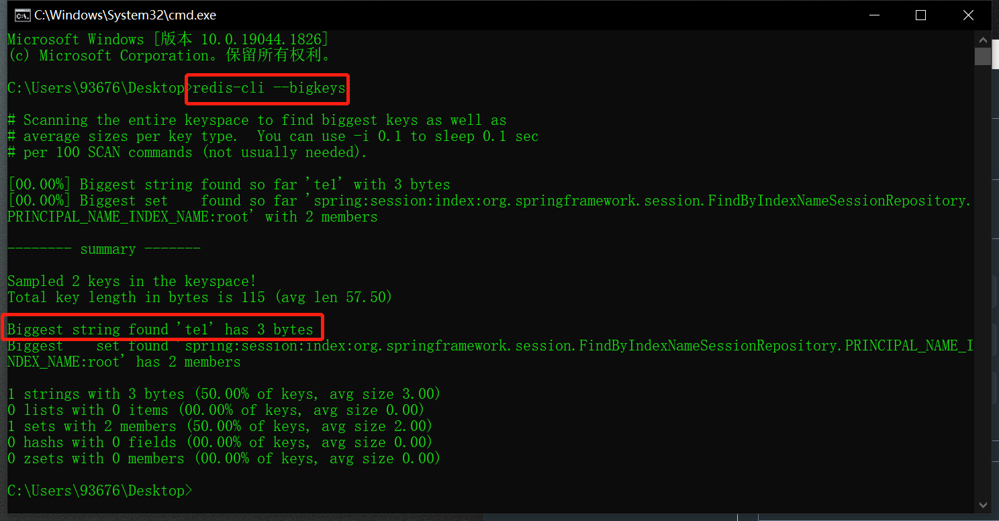

## Redis 中的 BigKey 问题及解决方案

原文：https://xie.infoq.cn/article/ffe2d4b6fa536a89f2d304dac

### 1. 什么是BigKey问题

BigKey 的具体表现是 redis 中的 key 对一个的 value 很大，占用的 Redis 空间比较大，本质上就是 **大value** 问题。

对于 redis 中不同的数据结构类型，常见的例子有：

* 对于 String 类型的 value 值，值超过 10MB（数据值太大）
* 对于 Set 类型的 value 值，含有的成员数量为 10000 个（成员数量多）
* 对于 List 类型的 value 值，含有的成员数量为 10000 个（成员数量多）
* 对于 Hash 类型的 Value 值，含有的成员数量为 10000 个，但是所有成员变量的总 Value 值大小为 1000MB （成员总的体积过大）

### 2. BigKey问题的产生

* Redis 中的 Key-Value 键值对设置不当，造成 Key 对应的 value 值特别大
* 对于 List、Set 这种类型的结构，无效的数据没有及时的删除
* 对业务分析不准确，导致实际业务中的 Value 值过大，如热点问题

### 3. BigKey 问题的定位

* 使用 redis 自带的命令 redis-cli --bigkeys 在线扫描大 key，显示的信息不详细，并且这个命令不是阻塞的，所以不影响 redis 的正常使用。

  

* 使用第三方工具 redis-rdb-tools，使用过程中会先使用 bgsave 命令 dump 一个 rdb 镜像，然后对这个镜像进行分析，因为 bgsave 是 redis 中的一个子线程进行生成镜像的，并不影响 redis 对外提供服务

* debug object 方法

  ``` shell
  c:\Users\abc\Desktop> redis-cli
  127.0.0.1:6379> set a "sadasd"
  OK
  127.0.0.1:6379> debug object a
  Value at:00007FCD3EC12FE0 refcount:1 encoding:embstr serializedlength:7 lru:14754079 lru_seconds_idle:15
  ```

  serializedlength 表示的是 a 这个key 对应的 value 经过 embstr 压缩之后的字节数，这里涉及到一点 redis 中的 string 底层结构的之后， redis 3.2 版本之后，当 string 不是数字字符串的时候，字节数大于 44，使用 raw 的方式存储，当小于 44 字节的时候使用 embstr 的方式存储，也就是压缩后的字符串。

### 4. BigKey 造成的影响

* **占用内存增大**

  相比于正常的Key，读取大 Key 需要的内存会有所增大，如果像是 value 中的 list 不断变大，可能会造成 OOM，还有一种就是达到 Redis 设置的最大内存 maxmemory 值会造成写阻塞或者部分重要的 Key 被 redis 的淘汰策略给删除。

* **网络阻塞延迟变大**

  在读取大 Key 的时候，由于读取的内容较多，占用较大的带宽，造成网络带宽的阻塞，也会影响其他的应用，导致网络阻塞延迟变大

* **I/O阻塞延迟增大**

  BigKey 问题对应的 value 相对较大，当对较大的 value 进行读写，耗时较长，这样就可能阻塞后续的请求处理，其实主要是 BigKey 的 value 进行 I/O 写的时候会耗费较长的时间，I/O 写是把处理之后值通过网络返回给请求端，因为 Redis 的核心线程是单线程，也就是工作线程是单线程，单线程中的任务处理是串行执行的，前面的任务完成之后，后面的任务才能继续执行，所以因为单个 BigKey 的原因可能造成 I/O 阻塞延迟

* **BigKey 迁移困难**

  这个问题是出现在 **Redis集群**中，当需要对大 value 进行迁移（对于Redis集群 slot 的迁移），主要是使用 migrate 命令进行迁移的， migrate 命令是通过 dump 和 restore 和 del 三个命令组合成原子命令完成，如果是存在 bigkey 的话，可能会因为大 value 的原因导致迁移失败，而且较慢的 migrate 会阻塞 Redis，影响Redis 服务。

### 5. BigKey问题如何解决

* **针对 BigKey 进行拆分**

  通过将 BigKey 拆分成多个小 key 的键值对，并且拆分后的对应的 value 大小和拆分成的成员数量比较合理，然后进行存储即可，在获取的时候通过 get 不同的 key 或者用 mget 批量获取存储的键值对

* **清理无效的数据**

  这个主要是针对像是 list 和 set 这种类型，在使用的过程中，List 和 Set 中对应的内容不断增加，但是由于之前存储的已经是无效的了，需要定时的对 List 和 Set 进行清理

* **压缩对应的 BigKey 的 Value**

  可以通过序列化或者压缩的方式对 Value 进行压缩，使其变为较小的 Value。但是如果压缩之后对应的 Value 还是特别大的话，就需要使用拆分的方法进行解决了

* **监控 Redis 中内存、带宽、增长率**

  通过监控系统监控 Redis 中内存占用大小和网络带宽的占用大小，以及固定时间内的内存占用增长率，当超过设定的阈值的时候，进行报警通知处理

------

拓展

### 热Key问题

相对于 BigKey，热 Key 也是值得关注的一个点。

**热Key**：对于 Redis 中的某个 Key 接收到的 QPS 显著高于其他的 Key，这个就被称为热Key

**热Key产生的问题**：热Key因为频繁的访问，占用大量的Redis CPU时间，使其性能变差并影响了其他的请求

**热Key的解决方案：**可以使用**读写分离架构**，如果热 Key 的产生来自于读请求，那么读写分离是一个很好的解决方案。在使用读写分离架构时可以通过不断的增加从节点来降低每个 Redis 实例中的读请求压力

------

### 总结 

BigKey 的问题原因：Redis键值对中对应的 Value 比较大

BigKey 问题的发现：通过第三方工具或者自带的命令进行扫描发现

BigKey的解决方案： 通过拆分、压缩、清理无效数据等方法对这些大 Value 进行处理