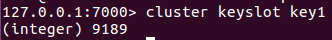
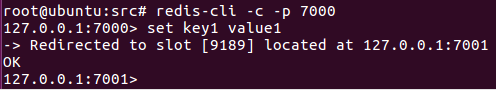
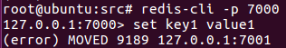
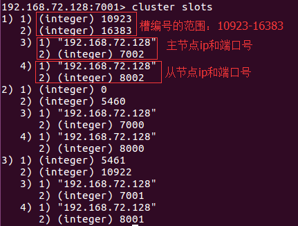

# Redis集群

https://www.cnblogs.com/kismetv/p/9853040.html


​        在前面的文章中，已经介绍了Redis的几种高可用技术：持久化、主从复制和哨兵，但这些方案仍有不足，其中最主要的问题是存储能力受单机限制，以及无法实现写操作的负载均衡。

​        Redis集群解决了上述问题，实现了较为完善的高可用方案。现在介绍集群，主要内容包括：集群的作用；集群的搭建方法及设计方案；集群的基本原理；客户端访问集群的方法；以及其他实践中需要的集群知识（扩容、故障转移、参数优化等）。


## 一、集群的作用

​        集群，即Redis Cluster，是Redis3.0开始引入的分布式存储方案。

​        集群由多个节点（Node）组成，Redis的数据分布在这些节点中。集群中的节点分为主节点和从节点：只有主节点负责读写请求和集群信息的维护；从节点只进行主节点数据和状态信息的复制。

​        集群的作用，可以归纳为以下两点：

1. 数据分区：数据分区（或称数据分片）是集群最核心的功能。

   ​        集群将数据分散到多个节点，一方面突破了Redis单机内存大小的限制，存储容量大大增加；另一方面，每个主节都可以对外提供读服务和写服务，大大提高了集群的响应能力。

   ​        Redis单机内存大小受限问题，在介绍持久化和主从复制时都提及到。例如，如果单机内存太大，bgsave和bgrewriteaof和fork操作可能导致主进程阻塞，主从环境下主机切换时可能导致从节点长时间无法提供服务；全量复制阶段，主节点的复制缓冲区可能溢出...

2. 高可用：集群支持主从复制和主节点的自动故障转移（与哨兵类似）；当任一节点发生故障时，集群仍然可以对外提供服务。

## 二、集群的搭建

​        我们尝试搭建一个简单的集群：共6个节点，3主3从。方便起见，所有节点在同一台电脑上，以端口号进行区分。3个主节点端口号：7000/7001/7002；从节点：8000/8001/8002。

​        集群的搭建有两种方式：

1. 手动执行Redis命令，一步步完成搭建
2. 使用Ruby脚本

​        两者的原理是一样的，只是Ruby脚本将Redis命令进行了打包封装。在实际应用中推荐脚本方式，简单快捷，也不容易出错。下面分别介绍这两种方式。

### 2.1 执行Redis命令搭建集群

​        集群的搭建可以分成4步：

1. 启动节点：将节点以集群模式启动，此时节点之间相互独立，并未建立联系
2. 节点握手：让独立的节点连成一个网络
3. 分配槽：将16384个槽分配给主节点
4. 指定主从关系：为从节点指定主节点

​        实际上，前三步完成后，集群便可以对外提供服务了。但指定从节点后，集群才能够提供真正高可用的服务。

#### 2.1.1 启动节点

​        集群节点的启动仍然是使用***redis-server***命令，但需要使用集群模式启动。下面是***7000***节点的配置文件（只列出了节点正常工作关键配置，其他配置，如开启AOF，可以参照单机节点进行）：

> ```properties
> #redis-7000.conf
> port 7000
> cluster-enabled yes
> cluster-config-file "node-7000.conf"
> logfile "log-7000.log"
> dbfilename "dump-7000.rdb"
> daemonize yes
> ```

​        其中的***cluster-enabled***和***cluster-config-file***是与集群相关的配置。

​        **cluster-enabled yes**：Redis实例可以分为单机模式（Standalone）和集群模式（cluster）；cluster-enabled yes 可以启动集群模式。在单机模式下启动的Redis实例，如果执行*info server* 命令，可以发现 ***redis_mode*** 项为 standalone， 如下图所示：


​        集群模式下的节点，其 ***redis_mode*** 项为cluster，如下图所示：


​        **cluster-config-file**：该参数指定了**集群配置文件的位置**。每个节点在运行过程中，会维护一份集群配置文件。每当集群信息发生变化时（如增减节点），集群内所有节点会将最新信息更新到该配置文件。当节点（主节点及从节点）重启后，会重新读区该配置文件，获取集群信息，可以方便的重新加入到集群中。**也就是说，当Redis节点以集群模式启动时，会首先寻找是否有集群配置文件。如果有，则使用文件中的配置启动；如果没有，则初始化配置并将配置保存到文件中**。集群配置文件由Redis主节点维护，不需要人工修改。

​        编辑好配置文件后，使用*redis-server*命令启动该节点：

```bash
redis-server redis-7000.conf
```

​        节点启动后，通过*cluster nodes* 命令可以查看节点的情况。如下图所示：


​        其中返回值第一项表示节点id，由40个16进制字符串组成，节点id与**主从复制**一文提到的runId不同：Redis每次启动runId都会重新创建，但是节点id只在集群初始化时创建一次，然后保存到集群配置文件中，以后节点重启时会直接在集群配置文件中读取。

​        其他节点使用相同办法启动，不在赘述。需要特别注意的，在启动节点阶段，节点是没有主从关系的，因此从节点不需要加slaveof配置。

#### 2.1.2 节点握手

​        节点启动以后是相互独立的，并不知道其他节点存在。需要进行节点握手，将独立节点组成一个网络。

​        节点握手使用 *cluster meet {ip} {port}* 命令实现。例如在 ***7000*** 节点中执行 ***cluster  meet 192.168.72.128 7001*** ，可以完成7000节点和7001节点的握手。注意，ip使用的是局域网ip而不是localhost或者127.0.01，是为了其他机器上的节点或者客户端也可以访问。此时再使用 *cluster nodes* 查看：


​        在7001节点上也可以类似查看：


​        同理，在7000节点中使用 cluster meet 命令，可以将所有节点加入到集群，完成节点握手：

```bash
cluster meet 192.168.72.128 7002
cluster meet 192.168.72.128 8000
cluster meet 192.168.72.128 8001
cluster meet 192.168.72.128 8002
```

​        执行完上述命令，可以看到7000节点已经感知到了所有其他节点：


​        通过节点之间的通信，每个节点都可以感知到所有其他节点，以8000节点为例：


#### 2.1.3 分配槽

​        在Redis集群中，借助槽实现数据分区，具体原理后面介绍。 集群有16384个槽，**槽，是数据管理和迁移的基本单位。** 当数据库中的16384个槽都分配了节点时，集群处于上线状态（ok）；如果有任意一个槽没有分配节点，则集群处于下线状态（fail）。

​        ***cluster info*** 命令可以查看集群状态，分配槽之前状态为fail：


​        分配槽使用 ***cluster addslots*** 命令，执行下面的命令将槽（编号0-16383）玩不分配完毕：

```bash
redis-cli -p 7000 cluster addslots {0..5461}
redis-cli -p 7001 cluster addslots {5462..10922}
redis-cli -p 7002 cluster addslots {10923..16383}
```

​        此时查看集群状态，现实所有槽分配完毕，集群进入上线状态：


#### 2.1.4 指定主从关系

​        集群中指定主从关系不再使用slaveof命令，而是使用 ***cluster replicate*** 令，参数使用节点id。

​        通过 cluster nodes获得几个主节点的节点id后，执行下面的命令为每个从节点指定主节点：

```bash
redis-cli -p 8000 cluster replicate be816eba968bc16c884b963d768c945e86ac51ae
redis-cli -p 8001 cluster replicate 788b361563acb175ce8232569347812a12f1fdb4
redis-cli -p 8002 cluster replicate a26f1624a3da3e5197dde267de683d61bb2dcbf1
```

​        此时执行 cluster nodes 查看各个节点状态，可以看到主从关系已经建立：


​        到这，手动搭建Redis集群完毕。

### 2.2 使用Ruby脚本搭建集群

​        在 ***{REDIS_HOME}/src*** 目录下，可以看到 ***redis-trib.rb*** 文件，这是一个Ruby脚本，可以实现自动化的集群搭建。

#### 2.2.1 安装Ruby环境

​        在Ubuntu Linux环境下，可以通过这个方式安装Ruby：

```ruby
apt-get install ruby #安装ruby环境
gem install redis #gem是ruby的包管理工具，该命令可以安装ruby-redis依赖
```

#### 2.2.2 启动节点

​        与第一种方法中的“启动节点”完全相同。

#### 2.2.3 搭建集群

​        ***redis-trib.rb*** 脚本提供了众多命令，其中 ***create*** 用于搭建集群，使用方法如下：

```ruby
./redis-trib.rb create --replicas 1 192.168.72.128:7000 192.168.72.128:7001 192.168.72.128:7002 192.168.72.128:8000 192.168.72.128:8001 192.168.72.128:8002
```

​        其中， ***--replicas=1*** 表示每个主节点有一个从节点，后面的多个 ***{ip:port}*** 表示节点地址，前面的做主节点，后面的做从节点。<font color='red'>**使用 redis-trib.rb 搭建集群时，要求节点不能包含任何槽和数据**</font>。

​        执行创建命令后，脚本会给出创建集群的计划，如下图所示。计划包括哪些是主节点，哪些是从节点，以及如何分配槽：


​        输入yes确认执行计划，脚本就开始按照计划执行，如下图所示：


​        至此，通过redis-trib.rb脚本搭建集群方式完毕。

### 2.3 集群方案设计

​        设计集群方案时，至少要考虑一下因素：

1. **高可用要求**：根据故障转移的原理，至少需要3个主节点完成故障转移，且3个主节点<font color='red'>**不应该**</font>在同一台**物理机**上。每个主节点至少需要1个从节点，而且主从节点<font color='red'>不应该</font>在一台物理机上。因此高可用集群至少包含6个节点。
2. **数据量和访问量**：估算应用需要的数据量和总访问量（考虑业务发展，留有冗余），结合每个主节点的容量和能承受的访问量（可以通过benchmark得到较准确的估算），计算需要的主节点数量。
3. **节点数量限制**：Redis官方给出的节点数量限制为1000，主要是考虑节点之间通讯带来的消耗。**在实际应用中应尽量避免大集群**。如果节点数量不足以满足应用对Redis数据量和访问量的要求，可以考虑：
   * 业务分割，大集群分为多个小集群
   * 减少不必要的数据
   * 调整数据过期策略
   * 其他（看具体情况）
4. **适度冗余**：Redis可以在不影响集群服务的情况下增加节点，因此节点数量适当冗余即可，不用太大。

## 三、集群的基本原理

​        **集群最核心的功能是数据分区**。因此首先介绍数据的分区规则；然后介绍集群实现的细节：通信机制和数据结构；最后以cluster meet(节点握手)、cluster addslots(槽分配)为例，说明节点是如何利用数据结构和通信机制实现集群命令的。

### 3.1 数据分区方案

​        数据分区有顺序分区、哈希分区等，其中哈希分区由于其天然的随机性，使用广泛。**Reids的集群分区方案便是哈希分区的一种**。

​        哈希分区的基本思路是：对数据的特征值（如Key）进行哈希，然后根据哈希值决定数据落在哪个节点。常见的哈希分区包括：哈希取余分区、一致性哈希分区、带虚拟节点的一致性哈希分区等。

​        衡量数据分区方法好坏的标准很多，其中比较重要的两个因素是：

* 数据分布是否均匀
* 增加或者删减节点，对数据分布的影响

​        由于哈希的随机性，哈希分区基本可以保证数据分布均匀，因此在比较哈希分区方案时，重点要看增、删节点对数据分布的影响。

#### 3.1.1 哈希取余分区

​        哈希取余分区思路很简单：计算Key的hash值，然后对节点数量进行取余，从而决定数据映射到哪个节点。该方案最大的问题是，当新增或删减节点时，节点数量发生变化，系统中所有的数据都需要重新计算映射关系，引发大规模数据迁移。

#### 3.1.2 一致性哈希分区

​        一致性哈希算法将整个哈希值空间组织成一个虚拟的圆环。如下图所示，范围为$$[0, (2^{32}-1)]$$，对于每个数据，根据Key计算hash值，确定数据在环上的位置，然后从此位置沿环顺时针行走，找到的第一台服务器就是其应该映射的服务器


​        **与哈希取余分区相比，一致性哈希分区将增减节点的影响限制在相邻的节点上**。以上图为例，如果在node1和node2之间增加node5，则只有node2中的一部分数据会迁移到node5；如果去掉node2，则原来node2中的数据只会迁移到node4中，只有node4会受影响。

​        一致性哈希分区的主要问题在于：当节点数量较少时，增加或者删减节点，对单个节点的影响可能很大，造成数据的严重不均衡。还是用上图为例，如果去掉node2，node4中的数据由总数据的$$\frac{1}{4}$$ 左右变为$$\frac{1}{2}$$，与其他节点相比负载过高。

#### 3.1.3 带虚拟节点的一致性哈希分区

​        该方案在一致性哈希分区的基础上，引入了虚拟节点的概念。Redis集群使用的便是该方案，其中的**虚拟节点称为槽(slot)** 。槽，是介于数据和实际节点之间的虚拟概念。每个实际节点包含一定数量的槽，每个槽包含哈希值在一定范围内的数据。数据的映射关系由***[数据hash->实际节点]***，变成了***[数据hash->槽->实际节点]***。

​        在使用了槽的一致性哈希分区中，槽，是数据管理和迁移的基本单位。槽，解耦了数据和实际节点之间的关系，增加和删除节点对系统的影响很小。仍以上图为例，系统中有4个实际节点，假设为其分配16个槽$$[0,15]$$：*node1$$[0,3]$$, node2$$[4,7]$$, node3$$[8,11]$$, node4$$[12,15]$$*。如果此时删除node2，只需要将槽4-7重新分配即可。例如，将槽4-5分配给node1，槽6分配给node3，槽7分配给node4。可以看出，删除node2后，数据在其他节点的分布依然比较均匀。

​        槽的数量一般远小于$$2^{32}$$，远大于实际节点的数量。在Redis集群中，槽的数量为16384。下面的图，很好的总结了Redis集群数据映射到实际节点的过程：


* Redis对数据的特征值（如Key）计算哈希值，使用的算法是CRC16
* 根据哈希值，计算数据属于哪个槽
* 根据槽与节点的映射关系，计算数据属于哪个节点

### 3.2 节点通信机制

​        集群要作为一个整体工作，离不开节点之间的通信。

#### 3.2.1 两个端口

​        在哨兵系统中，节点分为数据节点和哨兵节点：前者存储数据，后者实现额外的控制功能。在集群中，没有数据节点和非数据节点之分，所有节点都存储数据，也都参与集群状态的维护。为此，集群中的每个节点，都提供了两个TCP端口：

* 普通端口：就是配置时指定的端口（如7000，8000等）。普通端口用于为客户端提供服务（与单机节点类似）。但在节点间数据迁移时也会用到。
* 集群端口：端口号是普通端口+10000（10000是固定值，无法改变）。如7000节点的集群端口是17000。集群端口只用于节点之间的通信。如搭建集群、增删节点、故障转移等操作时节点间的通讯。不要使用客户端连接集群端口。为了保证集群可以正常工作，在配置防火墙时，要同时开启普通端口和集群端口。

#### 3.2.2 Gossip协议

​        节点通讯，按照通讯协议可以分为几种类型：单对单、广播、Gossip协议等。重点是广播和Gossip的对比。

​        广播是指向集群内所有节点发送消息。**优点**是集群的收敛速度快（集群收敛，是指集群内所有节点获得的集群信息是一致的）；**缺点**是每条消息都要发送给所有节点，CPU、带宽等消耗很大。

​        Gossip协议的特点是：在**节点数量有限**的网络中，每个节点都“随机”的与部分节点通信（并不是真正的随机，而是根据特定的规则选择通信节点），经过一番杂乱无章的通信，每个节点的状态很快达到一致。Gossip协议的优点有负载（比广播）低、去中心化、容错性高（因为通讯有冗余）等；**缺点**主要是集群的收敛速度慢。

#### 3.2.3 消息类型

​        集群中的节点采用固定频率（如10次/秒）的定时任务进行通信相关的工作：判断是否需要发送消息及消息类型、确定接收节点、发送消息等。如果集群状态发生了变化，如增删节点、槽状态变更，通过节点通信，所有节点会很快得知整个集群的状态，使集群收敛。

​        节点间发送的消息主要分为5钟：meet消息、ping消息、pong消息、fail消息、publish消息。不同的消息类型，通讯协议、发送的频率和时机、接收节点的选择都是不同的。

* **meet消息**：在节点握手阶段，当节点收到客户端的cluster meet命令时，会向新加入的节点发送meet消息，请求新节点加入到当前集群；新节点收到meet消息后，会回复一个pong消息
* **ping消息**：集群里每个节点**每秒**钟会选择**部分节点**发送ping消息，接收者收到后会回复一个pong消息。ping消息的内容是自身节点和部分节点的状态信息，作用是彼此交换信息，以及检测节点是否在线。ping消息使用Gossip协议，接收节点的选择兼顾了收敛速度和带宽成本，具体规则如下：
  * 随机找5个节点，在其中选择**最久**没有通信的一个节点
  * 扫描节点列表，选择最近一次收到pong消息时间大于**cluster_ndoe_timeout/2** 的所有节点，防止这些节点长时间未更新
* **pong消息**：pong消息封装了自身状态数据。可以分成两种：
  * 接收到meet/ping消息后回复的pong消息
  * 向集群广播pong消息，让其它节点可以获得该节点的最新消息。例如故障恢复后，信的主节点会广播pong消息
* **fail消息**：当一个主节点判断另一个主节点进入fail状态时，会向集群广播这一fail消息，接收节点会将这一fail消息保存起来，便于后续的判断
* **publish消息**：节点收到publish消息后，会先执行该消息的命令，然后向集群广播这一消息，接收节点也会执行该publish消息里的命令

### 3.3 数据结构

​        节点需要专门的数据结构来存储集群的状态。所谓集群的状态，是一个比较大的概念，包括：集群是否处于上线状态、集群中的哪些节点、节点是否可达、节点的主从状态、槽的分布……

​        节点为了存储集群状态而提供的数据结构中，最关键的是***clusterNode***和***clusterState***结构：前者记录了一个节点的状态，后者记录了集群作为一个整体的状态。

#### 3.3.1 clusterNode

​        clusterNode结构保存了一个节点的当前状态，包括创建时间、节点id、ip和port等。每个节点都会用一个clusterNode结构记录自己的状态，并为集群内所有其他节点都创建一个clusterNode结构来记录节点状态。

​        下面列举了clusterNode的部分字段：

```c
typedef struct clusterNode {
    //节点创建时间
    mstime_t ctime;
 
    //节点id
    char name[REDIS_CLUSTER_NAMELEN];
 
    //节点的ip和端口号
    char ip[REDIS_IP_STR_LEN];
    int port;
 
    //节点标识：整型，每个bit都代表了不同状态，如节点的主从状态、是否在线、是否在握手等
    int flags;
 
    //配置纪元：故障转移时起作用，类似于哨兵的配置纪元
    uint64_t configEpoch;
 
    //槽在该节点中的分布：占用16384/8个字节，16384个比特；每个比特对应一个槽：比特值为1，则该比特对应的槽在节点中；比特值为0，则该比特对应的槽不在节点中
    unsigned char slots[16384/8];
 
    //节点中槽的数量
    int numslots;
 
    …………
 
} clusterNode;
```

​        除了上述字段，clusterNode还包括节点连接、主从复制、故障发现和转移需要的信息等等。

#### 3.3.2 clusterState

​        clusterState结构保存了当前节点视角下，集群所处的状态。主要字段有：

```c
typedef struct clusterState {
 
    //自身节点
    clusterNode *myself;
 
    //配置纪元
    uint64_t currentEpoch;
 
    //集群状态：在线还是下线
    int state;
 
    //集群中至少包含一个槽的节点数量
    int size;
 
    //哈希表，节点名称->clusterNode节点指针
    dict *nodes;
  
    //槽分布信息：数组的每个元素都是一个指向clusterNode结构的指针；如果槽还没有分配给任何节点，则为NULL
    clusterNode *slots[16384];
 
    …………
     
} clusterState;
```

​        除此之外，clusterState还包括故障转移、槽迁移等需要的信息。

### 3.4 集群命令的实现

​        现在以 *cluster meet、cluster addslots* 为例，说明节点是如何利用上述数据结构和通信机制来实现集群命令的。

#### 3.4.1 cluster meet

​        假设要向节点A发送 *cluster meet* 命令，将B节点加入到A所在的集群，则A节点收到命令后，执行的操作如下：

* A为B创建一个clusterNode结构，并将其添加到clusterState的nodes字典中
* A向B发送meet消息
* B收到meet消息后，会为A创建一个clusterNode结构，并将其添加到clusterState的nodes字典中
* B回复A一个pong消息
* A收到B的pong消息后，便知道B已经成功接收到meet消息
* 然后，A向B再发一个ping消息
* B收到A的ping消息后，便知道A已经成功接收到自己的pong消息，握手完成
* 之后，A通过Gossip协议，将B的信息广播给集群内的其他节点，其他节点也会与B握手；一段时间后，集群收敛，B成为集群里的一个普通节点

​        通过上述过程发现，集群中两个节点的握手过程与TCP的过程类似，都是三次握手：A向B发送meet -> B向A发送pong -> A向B发送ping。

#### 3.4.2 cluster addslots

​        集群中槽的分配信息，存储在clusterNode的slots数组和clusterState的slots数组中。两个数组的结构前面已经介绍。二者之间的区别在于：前者存储的是该节点中分配了哪些槽，后者存储的是集群中所有槽分别分布在哪个节点。

​        cluster addslots命令接收一个槽或者多个槽为参数。例如，在A节点上执行***cluster addslots {0..10}*** 命令，是将编号为0-10的槽分配给A节点，具体执行过程如下：

* 遍历输入槽，检查它们是否都没有分配过。如果有一个槽被分配过，命令执行失败；方法是检查输入槽在 *clusterState.slots[]* 中对应的值是否为null
* 遍历输入槽，将其分配给节点A。方法是修改 *clusterNode.slots[]* 中对应的比特为1，以及 *clusterState.slots[]* 中对应的指针指向A节点
* A节点执行完成后，通过节点通信机制通知其他节点，所有节点都会知道0-10的槽分配给了A节点

## 四、客户端访问集群

​        在集群中，数据分布在不同的节点中，客户端通过某个节点访问数据时，数据可能不在该节点中。下面介绍集群是如何处理这个问题的。

### 4.1 redis-cli

​        当节点收到redis-cli发来的命令（如get/set）时，过程如下：

* 计算key属于哪个槽： CRC16(key) & 16383

  集群提供的cluster keyslot命令也是使用这个公式实现的。如：

  

* 判断key所在的槽点是否在当前节点：假设key位于第$$i$$个槽，*clusterState.slots[$$i$$]* 则指向了槽所在的节点：如果*clusterState.slots[$$i$$] == clusterState.myself*，说明槽在当前节点，可以直接在当前节点执行命令；否则，槽不在当前节点，则查询槽所在的节点地址（*clusterState.slots[$$i$$].ip/port*) ，并将其包装到MOVED错误中，返回给redis-cli

* redis-cli收到MOVED错误后，根据返回的ip和port，重新发送请求

​        下面的例子展示了redis-cli和集群的互动过程：在7000节点中操作key1，但key1所在的槽9189在节点7001上，因此节点返回MOVED错误（包含7001节点的ip和port）给redis-cli，redis-cli重新向7001发起请求：



​        上面，redis-cli通过-c制定了集群模式，如果没有指定，redis-cli无法处理MOVED错误。下面是redis-cli无法处理MOVED信息：



### 4.2 Smart客户端

​        redis-cli这一类客户端称为Dummy客户端，因为它们在执行命令前，不知道数据在哪个节点上，需要借助MOVED重新定向。与Dummy客户端对应的是Smart客户端。

​        Smart客户端（如JedisCluster）的基本原理：

1. JedisCluster初始化时，在内部维护slot->node的缓存，方法是连接任一节点，执行cluster slots命令，该命令返回如下内容：

   

2. 此外，JedisCluster为每个节点创建连接池（即JedisPool）

3. 当执行命令时，JedisCluster根据key->node选择需要连接的节点，发送命令。如果成功，则命令执行完毕；如果失败，则会随机选择其他节点进行重试，并在出现MOVED时，使用cluster slots重新同步slot->node的映射关系

​        下面代码演示了如何使用JedisCluster访问集群（为考虑资源释放、异常处理）：

```java
public static void test() {
   Set<HostAndPort> nodes = new HashSet<>();
   nodes.add(new HostAndPort("192.168.72.128", 7000));
   nodes.add(new HostAndPort("192.168.72.128", 7001));
   nodes.add(new HostAndPort("192.168.72.128", 7002));
   nodes.add(new HostAndPort("192.168.72.128", 8000));
   nodes.add(new HostAndPort("192.168.72.128", 8001));
   nodes.add(new HostAndPort("192.168.72.128", 8002));
   JedisCluster cluster = new JedisCluster(nodes);
   System.out.println(cluster.get("key1"));
   cluster.close();
}
```

​        注意事项有：

1. JedisCluster中已经包含所有节点的连接池，因此**JedisCluster要使用单例**
2. 客户端维护了slot->node映射关系，以及为每个节点创建了连接池，当节点数量较多时，应注意客户端内存资源和连接资源的消耗
3. Jedis较新版本针对JedisCliuster做了性能优化，如cluster slots缓存更新和锁阻塞等方面的优化，尽量使用2.8版本以上的Jedis

## 五、实践须知

### 5.1 集群伸缩

​        实践中，集群的伸缩是经常遇到的。如访问量增大时的扩容操作。Redis集群可以在不影响对外服务的情况下实现伸缩。**伸缩的核心是槽转移：修改槽与节点的对应关系，实现槽（即数据）在节点之间的移动**。例如：如果槽均匀分布在集群的3个节点中，此时增加一个节点，则需要从3个节点中分别拿出一部分槽给新节点，从而实现槽在4个节点中的均匀分布。

#### 5.1.1 增加节点

​        假设要增加7003节点和8003节点，其中8003是7003的从节点。步骤如下：

1. 启动节点：方法参见前面

2. 节点握手：可以说过cluster meet命令，但在生成环境中，建议使用redis-trib.rb的add-node工具，其原理也是cluster meet，但它会先检查新节点是否已经加入其他集群或者存在数据，避免加入到集群后带来混乱：

   ```bash
   redis-trib.rb add-node 192.168.72.128:7003 192.168.72.128 7000
   redis-trib.rb add-node 192.168.72.128:8003 192.168.72.128 7000
   ```

3. 迁移槽：推荐使用redis-trib.rb的***reshard***工具实现。reshard自动化程度很高，只需要输入 ***redis-trib.rb reshard {ip}:{port}*** ，然后按照提示输入一下信息，槽迁移就会自动完成：

   * 待迁移的槽数量：16384个槽均匀分给4个节点，每个节点4096个，因此待迁移的槽数量是4096
   * 目标节点id：7003的节点id
   * 源节点id：7000/7001/7002节点的id

4. 指定主从关系：方法见前面介绍

#### 5.1.2 减少节点

​        假设要下线7000/8000节点，分下面两步：

1. 迁移槽：使用reshard将7000节点中的槽均匀迁移到7001/7002/7003节点

2. 下线节点：使用 ***redis-trib.rb del-node*** 工具，应先下线从节点，再下线主节点，因为若主节点先下线，从节点会被指向其他主节点，造成不必要的全量复制。

   ```bash
   redis-trib.rb del-node 192.168.72.128:7001 {节点8000的id}
   redis-trib.rb del-node 192.168.72.128:7001 {节点7000的id}
   ```

#### 5.1.3 ASK错误

​        集群伸缩的核心是槽迁移。在槽迁移过程中，如果客户端向源节点发送命令，源节点执行流程如下：


​        客户端收到ASK错误后，从中读取目标节点的地址信息，并向目标节点重新发送请求，就像收到MOVED错误时一样。但二者有很大区别：ASK错误说明数据正在迁移，不知道何时迁移完成，因此重定向时临时的，Smart客户端不会刷新slots缓存。而MOVED错误重定向则是（相对）永久的，Smart客户端要刷新slots缓存。

### 5.2 故障转移

​        在***[哨兵](Redis_Sentinel.md)*** 一文中，介绍了哨兵实现故障发现和故障转移的原理。虽然细节上有很大不同，但集群的实现与哨兵思路类似：通过定时任务发送 *ping*消息检测其他节点状态。节点下线分为主观和客观。客观下线后，选取从节点进行故障转移。

​        与哨兵一样，集群只实现了主节点的故障转移；从节点故障时只会被下线，不会进行故障转移。因此，使用集群时，应谨慎使用读写分离技术，因为从节点故障会导致读服务不可用，可用性变差。

​        这里不再详细介绍故障转移的细节，只对重要事项进行说明：

1. **节点数量**：在故障转移阶段，需要由主节点投票选出哪个从节点成为新的主节点，从节点选举胜出需要的票为$$\frac{n}{2} + 1$$，其中$$n$$ 为主节点的数量（包括故障节点），但故障主节点实际上不能投票。因此为了能够在故障发生时顺利选出从节点，集群中至少需要3个主节点（且部署在不同物理机器上）

2. **故障转移时间**：从主节点故障发生到完成转移，所以需要的时间主要消耗在主观下线识别、主管下线传播、选举延迟等几个环节。具体时间与参数 *cluster-node-timeout* 有关，一般来说：

   * 故障转移时间（毫秒） $$\leq$$ 1.5 * cluster-node-timeout + 1000

   cluster-node-time的默认值是15000ms (15s)，因此故障转移时间会在20s量级

### 5.3 集群的限制及应对方法

​        由于集群中的数据分布在不同节点中，导致一些功能受限，包括：

1. Key批量操作受限：例如mget、mset操作，只有当操作的key都位于一个槽时，才能进行。针对该问题，一种思路是在客户端记录槽与key的信息，每次针对特定槽执行mget/mset，另一种思路是，使用Hash Tag
2. keys/flushall等操作：keys/flushall等操作可以在任意一个节点执行。但是结果针对当前节点。例如，keys操作只返回当前节点的所有键。针对该问题，可以在客户端使用cluster nodes获取所有节点信息，并对其中的所有主节点执行keys/flushall等操作
3. 事物/Lua脚本：集群支持事物及Lua脚本，但前提条件是所涉及的key必须在同一个节点。Hash Tag可以解决该问题
4. 数据库：单机Redis节点可以支持16个数据库，集群模式下只支持一个，即db0
5. 复制结构：只支持一层复制结构，不支持嵌套

### 5.4 Hash Tag

​        Hash Tag原理：**当一个Key包含{}的时候，不对整个key做hash，而仅对{}包括的字符串做hash**。

​        Hash Tag可以让不同的key拥有相同的hash值，从而分配在同一个槽里。这样针对不同key的批量操作(mget/mset等)、以及事务、Lua脚本等都可以支持。不过Hash Tag可能会带来分配不均的问题。这时需要：

1. 调整不同节点中槽的数量，使数量分布尽量均匀
2. 避免对热点数据使用Hash Tag，导致请求分布不均匀

​       下面是使用Hash Tag的一个例子：通过对product加Hash Tag，可以将所有产品信息放到同一个槽中，便于操作。


### 5.5 参数优化

#### 5.5.1 cluster_node_timeout

​        cluster_node_timeout参数在前面已经初步介绍；它的默认值是15s，影响包括：

1. 影响PING消息接收节点的选择：值越大对延迟容忍度越高，选择的接收节点越少，可以降低带宽，但会降低收敛速度；应根据带宽情况和应用要求进行调整。

2. 影响故障转移的判定和时间：值越大，越不容易误判，但完成转移消耗时间越长；应根据网络状况和应用要求进行调整。

#### 5.5.2 cluster-require-full-coverage

​        前面提到，只有当16384个槽全部分配完毕时，集群才能上线。这样做是为了保证集群的完整性，但同时也带来了新的问题：当主节点发生故障而故障转移尚未完成，原主节点中的槽不在任何节点中，此时会集群处于下线状态，无法响应客户端的请求。

​        cluster-require-full-coverage参数可以改变这一设定：如果设置为no，则当槽没有完全分配时，集群仍可以上线。参数默认值为yes，如果应用对可用性要求较高，可以修改为no，但需要自己保证槽全部分配。

### 5.6 redis-trib.rb

​        Redis-trib.rb提供了众多实用工具：创建集群、增删节点、槽迁移、检查完整性、数据重新平衡等。通过help命令可以查看相信内容。在实践中，如果能够使用redis-trib.rb工具则尽量使用。不但方便快捷，而且大大降低了出错概率。