# Redis主从复制

https://www.cnblogs.com/kismetv/p/9236731.html

​        在Redis的持久化中曾提到，Redis高可用的方案包括持久化、主从复制（及读写分离）、哨兵和集群。其中持久化侧重解决的是Redis数据的单机备份问题（从内存到硬盘的备份）；而主从复制则侧重解决数据的多机热备。此外，主从复制还可以实现负载均衡和故障恢复。

​        这篇文章中，将详细介绍Redis主从复制的方方面面，包括：如何使用主从复制、主从复制的原理（重点是全量复制和部分复制、以及心跳机制）、实际应用中需要注意的问题（如数据不一致问题、复制超时问题、复制缓冲区溢出问题）、主从复制相关的配置（重点是repl-timeout、client-output-buffer-limit slave）等。

## 主从复制概述

​        主从复制，是指将一台Redis服务器的数据，复制到其他的Redis服务器。前者称为主节点(master)，后者称为从节点(slave)；数据的复制是单向的，只能由主节点到从节点。

​        默认情况下，每台Redis服务器都是主节点；且一个主节点可以有多个从节点(或没有从节点)，但一个从节点只能有一个主节点。

**主从复制的作用**

1. 数据冗余：主从复制实现了数据的热备份，是持久化之外的一种数据冗余方式
2. 故障恢复：当主节点出现问题时，可以由从节点提供服务，实现快速的故障恢复。实际上是一种服务的冗余
3. 负载均衡：在主从复制的基础上，配合读写分离，可以由主节点提供写服务，从节点提供读服务（即写Redis数据时应用连接主节点，读Redis数据时应用连接从节点），分担服务器负载。尤其是在写少读多的情况下，通过多个从节点分担读负载，可以大大提高Redis服务器的并发量
4. 高可用基石：除了上述作用以外，主从复制还是哨兵和集群能够实施的基础，因此说主从复制是Redis高可用的基础

## 如何使用主从复制

​        为了更直观的理解主从复制，在介绍其内部原理之前，先说明我们需要如何操作才能开启主从复制

### 建立复制

​        需要注意，主从复制的开启，**完全是在从节点发起的**，不需要主节点做任何事情。

​        从节点开启主从复制，有3种方式：

* 配置文件

  在从服务器的配置文件中加入：slaveof <master_ip> <master_port>

* 启动命令

  redis-server启动命令后加入: --slaveof <master_ip> <master_port>

* 客户端命令

  Redis服务器启动后，直接通过客户端执行命令： slaveof <master_ip> <master_port>， 则该Redis实例成为从节点

​        上述3种方式是等效的，下面以客户端命令的方式为例，看一下当执行了slaveof后，Redis主节点和从节点的变化。

### 实例

#### 准备工作：启动两个节点

​        方便起见，实验所使用的主从节点是在一台机器上的不同Redis实例，其中主节点监听6379端口，从节点监听6380端口；从节点监听的端口号可以在配置文件中修改：

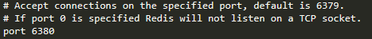

启动后可以看到：

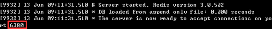

两个Redis节点启动后（分别是6379端口和6380端口的两个节点），默认都是主节点。

#### 建立复制

​        此时在6380节点执行slaveof命令，使之变为从节点：

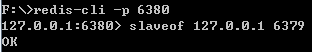

#### 观察效果

​        下面验证一下，在主从复制建立后，主节点的数据会复制到从节点中：

1. 首先在从节点查询一个不存在的key：

   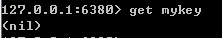

2. 然后在主节点中增加这个key：

   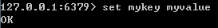

3. 此时在从节点再次查找这个key，会发现主节点的操作已经同步到从节点中：

   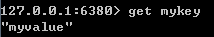

4. 然后在主节点删除这个key：

   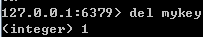

5. 此时在从节点再次查找这个key，会发现主节点的操作已经同步到从节点中：

   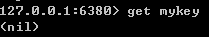

### 断开复制

​        通过 *Slavedof <master_ip> <master_port>* 命令建立主从复制关系后，可以通过 *slaveof no one* 断开。需要注意的是，从节点断开复制后，不会删除已有的数据，只是不再接收主节点新的数据变化。

​        从节点执行 slaveof no one后，打印日至如下：从节点又变回了主节点：

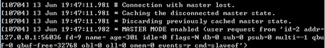

​        主节点打印日至如下：

## 主从复制的实现原理

​        下面开始介绍一下主从复制的实现原理。

​        主从复制过程大致分成3个阶段：连接建立阶段、数据同步阶段、命令传播阶段。

### 1. 连接建立阶段

​        该阶段的主要作用，是在主从节点之间建立连接，为数据同步做好准备

* ##### 保存主节点信息

  ​        从节点服务器内部维护了两个字段：masterhost和masterport，用于存储主节点的ip和port信息。需要注意的是，slaveof是**异步命令**，从节点完成主节点ip和port的保存后，向发送slaveof命令的客户端直接返回OK，实际的复制操作在这之后才开始进行。

  ​        这个过程中，可以看到从节点打印日志如下：

  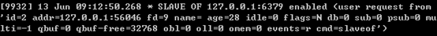

* ##### 建立Socket连接

  ​        从节点每秒一次调用复制定时函数 *replicationCron()* ， 如果发现了有主节点可以连接，便会根据主节点的ip和port，创建socket连接。如果连接成功，则：

  *  从节点：为该socket建立一个专门处理复制工作的文件事件处理器，负责后续的复制工作。如接受RDB文件、接收命令传播等
  * 主节点：接收到从节点的socket连接后（即accepted之后），为该socket创建相应的客户端状态，并将从节点看作是连接到主节点的一个客户端，后面的步骤会以从节点向主节点发送命令请求的形式来进行

  ​        这个过程中，从节点打印的日志如下：

  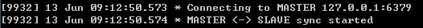

* ##### 发送ping命令

  ​        从节点成为主节点的客户端之后，发送ping命令进行首次请求，目的是：检查socket连接是否可用，以及主节点当前是否能够处理请求。

  ​        从节点发送ping命令后，可能出现一下三种情况：

  * 返回pong：说明socket连接正常，且主节点可以处理请求，复制过程继续
  * 超时：一定时间后，从节点仍未收到主节点的回复，说明socket连接不可用，则从节点断开socket连接，然后重连
  * 返回pong以外的结果：如果主节点返回其他结果，如正在处理超时运行的脚本，说明主节点当前无法处理命令，则从节点断开socket，然后重连

  主节点返回pong的情况下，从节点的日志如下：

  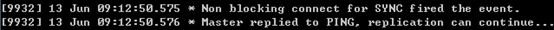

* ##### 身份验证

  ​        如果从节点中设置了 *masterauth* 选项，则从节点需要向主节点进行身份验证。没有设置该项，则不需要验证。从节点进行身份验证是通过向主节点发送auth命令进行的，auth命令的参数即为配置文件中的masterauth的值。

  ​        如果主节点设置密码的状态，与从节点masterauth的状态一致（一致是指都存在，且密码相同，或者都不存在），则身份验证通过，复制过程继续；如果不一致，则从节点断开socket连接，然后重连。

* ##### 发送从节点端口信息

  ​        身份验证之后，从节点会向主节点发送其监听的端口号（如前面例子的6380），主节点将该信息保存到该从节点对应的客户端的slave_listening_port字段中，该端口信息除了在主节点中执行inifo Replication时显示以外，没有其他作用。

### 2. 数据同步阶段

​        主从节点之间的连接建立以后，便可以开始进行数据同步。该阶段可以理解为从节点数据的初始化。具体执行的方式是：从节点向主节点发送psync命令（redis2.8以前是sync），开始同步。

​        数据同步阶段是主从复制最核心的阶段。根据主从节点当前状态的不同，可以分为全量复制和部分复制。下面会专门讨论。

​        需要注意的是，在数据同步阶段之前，从节点是主节点的客户端，主节点不是从节点的客户端；而到了“数据同步”阶段后，**主从节点互为客户端**。原因在于：在此之前，主节点只需要响应从节点的请求即可，不需要主动发请求；而在数据同步阶段和后面的命令传播阶段，主节点需要主动向从节点发送请求（如推送缓冲区中的写命令），才能完成复制。

### 3. 命令传播阶段

​        数据同步阶段完成后，主从节点进入命令传播阶段。在这个阶段，主节点将自己执行的写命令发送给从节点，从节点接收命令并执行，从而保证主从节点数据的一致性。

​        在命令传播阶段，除了发送写命令，主从节点还维持着心跳机制：PING和REPLCONF ACK。由于心跳机制的原理涉及部分复制，因此将在介绍了部分复制的相关内容中介绍心跳机制。

######         延迟与不一致

​        需要注意的是，**命令传播是异步的**。即主节点发送写命令并不会等待从节点的回复，因此实际上主从节点之间很难保持实时的一致性，延迟在所难免。数据不一致的程度，与主从节点之间的网络状况、主节点写命令的执行频率、以及主节点中的repl-disable-tcp-nodelay配置等有关。

​        repl-disable-tcp-nodelay no：该配置作用于命令传播阶段，控制主节点是否禁止与从节点的TCP_NODELAY，**默认是no**，即不禁止TCP_NODELAY。当设置为yes时，TCP会对包进行合并从而减少带宽，但是发送的频率会降低，从节点数据延迟增加，一致性变差。具体发送频率与Linux内核的配置有关，**默认配置为40ms**。当设置为no时，TCP会立马将主节点的数据发送给从节点，带宽增加但延迟变小。

​        一般来说，只有当应用对Redis数据不一致的容忍度较高，且主从节点之间网络状况不好时，才会设置为yes；多数情况使用默认值no。

## [数据同步阶段]全量复制和部分复制

## [命令传播阶段]心跳机制

## 应用中的问题

## 总结