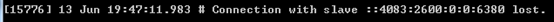
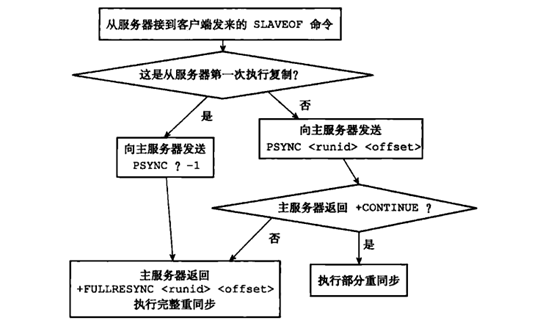

# Redis主从复制

https://www.cnblogs.com/kismetv/p/9236731.html

​        在Redis的持久化中曾提到，Redis高可用的方案包括持久化、主从复制（及读写分离）、哨兵和集群。其中持久化侧重解决的是Redis数据的单机备份问题（从内存到硬盘的备份）；而主从复制则侧重解决数据的多机热备。此外，主从复制还可以实现负载均衡和故障恢复。

​        这篇文章中，将详细介绍Redis主从复制的方方面面，包括：如何使用主从复制、主从复制的原理（重点是全量复制和部分复制、以及心跳机制）、实际应用中需要注意的问题（如数据不一致问题、复制超时问题、复制缓冲区溢出问题）、主从复制相关的配置（重点是repl-timeout、client-output-buffer-limit slave）等。

## 主从复制概述

​        主从复制，是指将一台Redis服务器的数据，复制到其他的Redis服务器。前者称为主节点(master)，后者称为从节点(slave)；数据的复制是单向的，只能由主节点到从节点。

​        默认情况下，每台Redis服务器都是主节点；且一个主节点可以有多个从节点(或没有从节点)，但一个从节点只能有一个主节点。

**主从复制的作用**

1. 数据冗余：主从复制实现了数据的热备份，是持久化之外的一种数据冗余方式
2. 故障恢复：当主节点出现问题时，可以由从节点提供服务，实现快速的故障恢复。实际上是一种服务的冗余
3. 负载均衡：在主从复制的基础上，配合读写分离，可以由主节点提供写服务，从节点提供读服务（即写Redis数据时应用连接主节点，读Redis数据时应用连接从节点），分担服务器负载。尤其是在写少读多的情况下，通过多个从节点分担读负载，可以大大提高Redis服务器的并发量
4. 高可用基石：除了上述作用以外，主从复制还是哨兵和集群能够实施的基础，因此说主从复制是Redis高可用的基础

## 如何使用主从复制

​        为了更直观的理解主从复制，在介绍其内部原理之前，先说明我们需要如何操作才能开启主从复制

### 建立复制

​        需要注意，主从复制的开启，**完全是在从节点发起的**，不需要主节点做任何事情。

​        从节点开启主从复制，有3种方式：

* 配置文件

  在从服务器的配置文件中加入：slaveof <master_ip> <master_port>

* 启动命令

  redis-server启动命令后加入: --slaveof <master_ip> <master_port>

* 客户端命令

  Redis服务器启动后，直接通过客户端执行命令： slaveof <master_ip> <master_port>， 则该Redis实例成为从节点

​        上述3种方式是等效的，下面以客户端命令的方式为例，看一下当执行了slaveof后，Redis主节点和从节点的变化。

### 实例

#### 准备工作：启动两个节点

​        方便起见，实验所使用的主从节点是在一台机器上的不同Redis实例，其中主节点监听6379端口，从节点监听6380端口；从节点监听的端口号可以在配置文件中修改：

启动后可以看到：

两个Redis节点启动后（分别是6379端口和6380端口的两个节点），默认都是主节点。

#### 建立复制

​        此时在6380节点执行slaveof命令，使之变为从节点：

#### 观察效果

​        下面验证一下，在主从复制建立后，主节点的数据会复制到从节点中：

1. 首先在从节点查询一个不存在的key：

   

2. 然后在主节点中增加这个key：

   

3. 此时在从节点再次查找这个key，会发现主节点的操作已经同步到从节点中：

   

4. 然后在主节点删除这个key：

   

5. 此时在从节点再次查找这个key，会发现主节点的操作已经同步到从节点中：

   

### 断开复制

​        通过 *Slavedof <master_ip> <master_port>* 命令建立主从复制关系后，可以通过 *slaveof no one* 断开。需要注意的是，从节点断开复制后，不会删除已有的数据，只是不再接收主节点新的数据变化。

​        从节点执行 slaveof no one后，打印日至如下：从节点又变回了主节点：

​        主节点打印日至如下：

## 主从复制的实现原理

​        下面开始介绍一下主从复制的实现原理。

​        主从复制过程大致分成3个阶段：连接建立阶段、数据同步阶段、命令传播阶段。

### 1. 连接建立阶段

​        该阶段的主要作用，是在主从节点之间建立连接，为数据同步做好准备

* ##### 保存主节点信息

  ​        从节点服务器内部维护了两个字段：masterhost和masterport，用于存储主节点的ip和port信息。需要注意的是，slaveof是**异步命令**，从节点完成主节点ip和port的保存后，向发送slaveof命令的客户端直接返回OK，实际的复制操作在这之后才开始进行。

  ​        这个过程中，可以看到从节点打印日志如下：

  

* ##### 建立Socket连接

  ​        从节点每秒一次调用复制定时函数 *replicationCron()* ， 如果发现了有主节点可以连接，便会根据主节点的ip和port，创建socket连接。如果连接成功，则：

  *  从节点：为该socket建立一个专门处理复制工作的文件事件处理器，负责后续的复制工作。如接受RDB文件、接收命令传播等
  * 主节点：接收到从节点的socket连接后（即accepted之后），为该socket创建相应的客户端状态，并将从节点看作是连接到主节点的一个客户端，后面的步骤会以从节点向主节点发送命令请求的形式来进行

  ​        这个过程中，从节点打印的日志如下：

  

* ##### 发送ping命令

  ​        从节点成为主节点的客户端之后，发送ping命令进行首次请求，目的是：检查socket连接是否可用，以及主节点当前是否能够处理请求。

  ​        从节点发送ping命令后，可能出现一下三种情况：

  * 返回pong：说明socket连接正常，且主节点可以处理请求，复制过程继续
  * 超时：一定时间后，从节点仍未收到主节点的回复，说明socket连接不可用，则从节点断开socket连接，然后重连
  * 返回pong以外的结果：如果主节点返回其他结果，如正在处理超时运行的脚本，说明主节点当前无法处理命令，则从节点断开socket，然后重连

  主节点返回pong的情况下，从节点的日志如下：

  

* ##### 身份验证

  ​        如果从节点中设置了 *masterauth* 选项，则从节点需要向主节点进行身份验证。没有设置该项，则不需要验证。从节点进行身份验证是通过向主节点发送auth命令进行的，auth命令的参数即为配置文件中的masterauth的值。

  ​        如果主节点设置密码的状态，与从节点masterauth的状态一致（一致是指都存在，且密码相同，或者都不存在），则身份验证通过，复制过程继续；如果不一致，则从节点断开socket连接，然后重连。

* ##### 发送从节点端口信息

  ​        身份验证之后，从节点会向主节点发送其监听的端口号（如前面例子的6380），主节点将该信息保存到该从节点对应的客户端的slave_listening_port字段中，该端口信息除了在主节点中执行inifo Replication时显示以外，没有其他作用。

### 2. 数据同步阶段

​        主从节点之间的连接建立以后，便可以开始进行数据同步。该阶段可以理解为从节点数据的初始化。具体执行的方式是：从节点向主节点发送psync命令（redis2.8以前是sync），开始同步。

​        数据同步阶段是主从复制最核心的阶段。根据主从节点当前状态的不同，可以分为全量复制和部分复制。下面会专门讨论。

​        需要注意的是，在数据同步阶段之前，从节点是主节点的客户端，主节点不是从节点的客户端；而到了“数据同步”阶段后，**主从节点互为客户端**。原因在于：在此之前，主节点只需要响应从节点的请求即可，不需要主动发请求；而在数据同步阶段和后面的命令传播阶段，主节点需要主动向从节点发送请求（如推送缓冲区中的写命令），才能完成复制。

### 3. 命令传播阶段

​        数据同步阶段完成后，主从节点进入命令传播阶段。在这个阶段，主节点将自己执行的写命令发送给从节点，从节点接收命令并执行，从而保证主从节点数据的一致性。

​        在命令传播阶段，除了发送写命令，主从节点还维持着心跳机制：PING和REPLCONF ACK。由于心跳机制的原理涉及部分复制，因此将在介绍了部分复制的相关内容中介绍心跳机制。

######         延迟与不一致

​        需要注意的是，**命令传播是异步的**。即主节点发送写命令并不会等待从节点的回复，因此实际上主从节点之间很难保持实时的一致性，延迟在所难免。数据不一致的程度，与主从节点之间的网络状况、主节点写命令的执行频率、以及主节点中的repl-disable-tcp-nodelay配置等有关。

​        repl-disable-tcp-nodelay no：该配置作用于命令传播阶段，控制主节点是否禁止与从节点的TCP_NODELAY，**默认是no**，即不禁止TCP_NODELAY。当设置为yes时，TCP会对包进行合并从而减少带宽，但是发送的频率会降低，从节点数据延迟增加，一致性变差。具体发送频率与Linux内核的配置有关，**默认配置为40ms**。当设置为no时，TCP会立马将主节点的数据发送给从节点，带宽增加但延迟变小。

​        一般来说，只有当应用对Redis数据不一致的容忍度较高，且主从节点之间网络状况不好时，才会设置为yes；多数情况使用默认值no。

## 全量复制和部分复制

​        这两个情况发生在数据同步阶段。

​        在Redis2.8之前的版本，从节点向主节点发送***sync***命令请求同步数据，此时的同步方式是全量复制。在Redis2.8及其之后的版本，从节点可以发送 ***psync*** 命令请求同步数据，此时根据主从节点当前的状态，同步方式可能是全量复制，也可以是部分复制。接下来都是介绍2.8及其后续版本

1. 全量复制：

   用于初次复制或其他无法进行部分复制的情况，将主节点的所有数据都发送给从节点，是一个非常重型的操作

2. 部分复制：

   用于网络终端等情况后的复制，只将中断期间主节点执行的写命令发送给从节点，与全量复制相比更高效。需要注意的是，如果网络中断时间过长，导致主节点没有能够完整的保存中断期间执行的写命令，则无法进行部分复制，仍然使用全量复制

### 全量复制

​       Redis通过 **psync** 命令进行全量复制的过程如下：

1. 从节点判断无法进行部分复制，向主节点发送全量复制的请求；或从节点发送部分复制的请求，但主节点判断无法进行部分复制（具体判断过程需要在建树了部分复制原理后再介绍）
2. 主节点收到全量复制的命令，执行bgsave，在后台生成RDB文件，并使用一个缓冲区（称为复制缓冲区）记录从现在开始执行的所有写命令
3. 主节点的bgsave执行完成后，将RDB文件发送给从节点。**从节点首先清除自己的旧数据，然后载入接收到的RDB文件**，将数据库状态更新至主节点执行bgsave时的数据库状态
4. 主节点将前述复制缓冲区中的所有写命令发送给从节点，从节点执行这些写命令，将数据库状态更新至主节点的最新状态
5. 如果从节点开启AOF，则会触发bgrewriteaof的执行，从而保证AOF文件更新至主节点的最新状态

​       下面是执行全量复制时，主从节点打印的日志。从日志可以看到上述的过程：

* 主节点日志

  

* 从节点日志

  

​       其中，有几点需要注意：从节点接收了来自主节点的89260字节的数据；从节点在载入主节点的数据之前，要先将老数据清除，从节点在同步完数据后，调用了bgrewriteaof。

​       这个过程显示，全量复制是非常重型的操作：

* 主节点通过bgsave命令fork子进程进行RDB持久化，该过程非常消耗CPU、内存（页表复制）、硬盘I/O
* 主节点通过网络将RDB文件传给从节点，对主节点的带宽也有很大影响
* 从节点清空老数据、载入新RDB文件的过程是阻塞的，无法响应客户端的命令。如果从节点执行bgrewriteaof，也会带来额外的消耗

### 部分复制

​       由于全量复制在主节点数据量较大时效率太低，因此Redis2.8开始提供部分复制，用于处理网络中断时的数据同步。

​       部分复制的实现，依赖于三个重要的概念：

* **复制偏移量**

  ​       主节点和从节点分别维护一个复制偏移量（offset），代表的是主节点向从节点传递的字节数。主节点每次向从节点传播N个字节数据时，主节点的offset增加N；从节点每次收到主节点传来的N个字节数据时，从节点的offset增加N

  ​       offset用于判断主从节点的数据库状态是否一致：如果二者offset相同，则一致，否则就是不一致。此时可以根据两个offset找出从节点缺少的那部分数据。例如：如果主节点的offset是1000，而从节点的offset是500，那么部分复制就需要将offset为501-1000的数据传递给从节点。而offset为501-1000的数据存储的位置，就是下面要介绍的复制积压缓冲区。

* **复制积压缓冲区**

  ​       复制积压缓冲区，是**由主节点维护**的、固定长度的、先进先出（FIFO）队列，默认大小1MB。当主节点开始有从节点时创建，其作用是备份主节点最近发送给从节点的数据。注意：无论主节点有一个还是多个从节点，都只需要一个复制积压缓冲区。

  ​       在命令传播阶段，主节点除了将写命令发送给从节点，还会发送一份给复制积压缓冲区，作为写命令的备份。除了存储写命令，复制积压缓冲区中还存储了其中的每个字节对应的复制偏移量（offset）。由于复制积压缓冲区定长且是先进先出，所以它保存的是主节点最近执行的写命令，时间较早的写命令会被基础上缓冲区。

  ​       **由于该缓冲区长度固定且有限，因此可以备份的写命令也有限，当主从节点offset的差距超过缓冲区长度时，将无法进行部分复制，只能执行全量复制。** 反过来说，为了提高网络中断时部分复制执行的概率，可以根据需要增大复制积压缓冲区的大小(通过配置repl-backlog-size)。例如，如果网络中断的平均时间是60s，而主节点平均每秒产生的写命令(特定协议格式)所占的字节数为100KB，则复制积压缓冲区的平均需求为6MB，保险起见，可以设置为12MB，来保证绝大多数断线情况都可以使用部分复制。

  ​       从节点将offset发送给主节点后，主节点根据offset和缓冲区大小决定能否执行部分复制：

  * 如果offset偏移量之后的数据，仍然都在复制积压缓冲区里，则执行部分复制
  * 如果offset偏移量之后的数据已不在复制积压缓冲区中（数据已被挤出），则执行全量复制

* **服务器运行ID (runid)**

  ​       每个Redis节点（无论主从），在启动时都会自动生成一个随机ID(每次启动都不一样)，由40个随机的十六进制字符组成；runid用来唯一识别一个Redis节点。通过info Server命令，可以查看节点的runid：

  

  ​       

  ​       主从节点初次复制时，主节点将自己的runid发送给从节点，从节点将这个runid保存起来；当断线重连时，从节点会将这个runid发送给主节点；主节点根据runid判断能否进行部分复制：

  * 如果从节点保存的runid与主节点现在的runid相同，说明主从节点之前同步过，主节点会继续尝试使用部分复制(到底能不能部分复制还要看offset和复制积压缓冲区的情况)
  * 如果从节点保存的runid与主节点现在的runid不同，说明从节点在断线前同步的Redis节点并不是当前的主节点，只能进行全量复制

### psync命令的执行

​       在了解了复制偏移量、复制积压缓冲区、节点运行id之后，现在介绍psync命令的参数与返回值，从而说明psync命令执行过程中，主从节点是如何确定使用全量复制还是部分复制的。

​       psync命令的执行过程如下图所示：

1. 首先，从节点根据当前状态，决定如何调用psync命令
   * 如果从节点之前未执行过slaveof或最近执行了salveof no one，则从节点发送命令为 psync ? -1，向主节点请求全量复制
   * 如果从节点之前执行了slaveof，则发送命令为 psync <runid> <offset>，其中runid为上次复制的主节点的runid，offset为上次复制截止时从节点保存的复制偏移量
2. 主节点根据收到的psync命令，以及当前服务器状态，决定执行全量复制还是部分复制：
   * 如果主节点版本低于2.8版本，则返回 **-ERR** 回复，此时从节点重新发送sync命令执行全量复制
   * 如果主节点版本满足要求，且runid与从节点发送的runid相同，且从节点发送的offset之后的数据在复制积压缓冲区中都存在，则回复 **+CONTINUE** ，表示将进行部分复制，从节点等待主节点发送其缺少的数据
   * 如果主节点版本满足要求，但是runid与从节点发来的runid不同，或从节点发送的offset之后的数据已不在复制积压缓冲区（在队列中被挤出了），则回复 +FULLRESYNC <runid> <offset>， 表示要进行全量复制，其中runid表示主节点当前的runid，offset表示主节点当前的offset，从节点保存这两个值，以备使用

### 部分复制演示

​       下面的演示中，网络中断几分钟后恢复，断开连接的主从节点进行了部分复制。为了便于模拟网络中断，本例中的主从节点在局域网中的两台机器上。

#### 网络中断

​       网络中断一段时间后，主节点和从节点都会发现失去了与对方的连接（关于主从节点对超时的判断机制，*参考心跳机制*）。此后，从节点便开始执行对主节点的重连。由于此时网络还没有恢复，重连失败，从节点会一直尝试连接。

​       主节点日志：

​       从节点日志：

#### 网络恢复

​       网络恢复后，从节点连接主节点成功，并请求进行部分复制。主节点接收请求后，二者进行部分复制以同步数据。

​       主节点日志：

​       从节点日志：

## 心跳机制      

​        心跳机制发生在命令传播阶段。在这个阶段，除了发送写命令，主从节点还维持着心跳机制：PING和REPLCONF ACK。心跳机制对于主从复制的超时判断、数据安全等有作用。

#### 主->从：PING

​        每隔指定的时间，**主节点会向从节点发送PING命令**，这个PING命令的作用，主要是为了让从节点进行超时判断。

​        PING发送的频率，由参数 ***epl-ping-slave-period*** 控制，单位事秒，**默认值为 10s**。

​        关于PING命令究竟是由主节点发给从节点，还是相反，存在争议。因为Redis的官方文档中，对该参数的注释中说到：是从节点向主节点发送PING命令，截图如下：

但是根据该参数的名称（含有ping-slave），以及代码实现，一般认为PING命令是主节点发送给从节点的。相关代码如下：

#### 从->主：REPLCONF ACK

​        在命令传播阶段，**从节点向主节点发送 REPLCONF ACK 命令**，频率是每秒1次。命令格式为：*REPLCONF ACK {offset}* ，其中offset指从节点保存的复制偏移量。REPLCONF ACK命令的作用包括：

1. 实时监测主从节点网络状态：该命令会被主节点用于复制超时的判断。此外，在主节点中使用 *info Replication*， 可以看到其从节点的状态中的lag值，代表的是主节点上次收到该REPLCONF ACK 命令的时间间隔。在正常情况下，该值是0或者1，如下图所示：

   

2. 检测命令丢失：从节点发送自身的offset，主节点会与自己的offset对比。如果从节点数据缺失（如网络丢包），主节点会推送缺失的数据（也会利用复制积压缓冲区）。**注意：offset和复制积压缓冲区，不仅可以用于部分复制，也可以用于处理命令丢失等情形。区别在于，前者是在断线重连后进行，后者是在主从节点没有断线的情况下进行的**。

3. 辅助保证从节点的数量和延迟：Redis主节点中使用 *min-slaves-to-write* 和 *min-slaves-max-lag* 参数，来保证主节点在不安全的情况下不会执行写命令。所谓不安全，是指从节点数量太少，或延迟过高。例如：min-slaves-to-write 和 min-slaves-max-lag 分别是3和10，表示，如果从节点数量少于(<)3个，或者所有从节点的延迟值都大于10s，则主节点拒绝执行写命令。而这里从节点延迟的获得，就是通过主节点接收到REPLCONF ACK命令的时间来判断的，即前面所说的 info Replication 中的 **lag** 值。

## 应用中的问题

### 1. 读写分离及其中的问题

#### 延迟与不一致问题

#### 数据过期问题

#### 故障切换问题

#### 总结

### 2. 复制超时问题

#### 超时判断

#### 判断机制

### 3. 复制中断问题

#### 复制缓冲区溢出

### 4. 各场景下复制的选择及优化技巧

#### 第一次建立复制

#### 主节点重启

#### 从节点重启

#### 网络中断

### 5. 复制相关配置

#### 与主从节点都有关的配置

#### 主节点相关配置

#### 从节点相关配置

### 6. 单机内存大小限制

### 7. Info Replication

## 总结