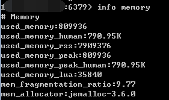

# Redis内存模型

https://www.cnblogs.com/kismetv/p/8654978.html


Redis是目前最火爆的内存数据库之一，通过在内存中读写数据，大大提高了读写速度，可以说Redis是实现网站高并发不可或缺的一部分。

Redis有5种对象类型（字符串、哈希、列表、集合、有序集合），丰富的类型是Redis相对于Memcached等一大优势。在了解Redis的5种对象类型的用法和特点的基础上，进一步了解Redis的内存模型，对Redis的使用有很大帮助，例如：

1. 估算Redis内存使用量。目前为止，内存的使用成本依然相对较高，使用内存不能无所顾忌；根据需求合理的评估Redis的内存使用量，选择合适的机器配置，可以在满足需求的情况下节约成本。
2. 优化内存占用。了解Redis内存模型可以选择更合适的数据类型和编码，更好的利用Redis内存
3. 分析解决问题。当Redis出现阻塞、内存占用等问题时，尽快发现导致问题的原因，便于分析解决问题。

这篇文章主要介绍Redis的内存模型（以3.0为例），包括Redis占用内存的情况及如何查询、不同的对象类型在内存中的编码方式、内存分配器(jemalloc)、简单动态字符串(SDS)、RedisObject等；然后在此基础上介绍几个Redis内存模型的应用。


### 1. Redis内存统计

在说明Redis内存之前首先说明如何统计Redis使用内存的情况。

在客户端通过redis-cli连接服务器后（后面如果没有特殊说明，客户端一律使用redis-cli），通过info命令可以查看内存使用情况：

```shell
info memory
```



其中，info命令显示redis服务器的许多信息，包括服务器基本信息，CPU、内存、持久化、客户端连接信息等；memory是参数，表示只显示内存相关的信息。

### 2. Redis内存划分

#### 2.1 数据（或称为对象）

#### 2.2 进程本身运行需要的内存

#### 2.3 缓冲内存

#### 2.4 内存碎片

### 3. Redis数据存储细节

#### 3.1 概述

#### 3.2 jemalloc

#### 3.3 redisObject

#### 3.4 SDS

### 4. Redis的对象类型与内部编码

#### 4.1 字符串

#### 4.2 列表

#### 4.3 哈希

#### 4.4 集合

#### 4.5 有序集合

### 5. 应用举例

#### 5.1 估算Redis内存使用量

#### 5.2 优化内存占用

#### 5.3 关注内存碎片