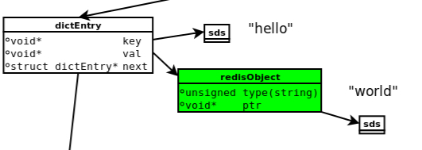
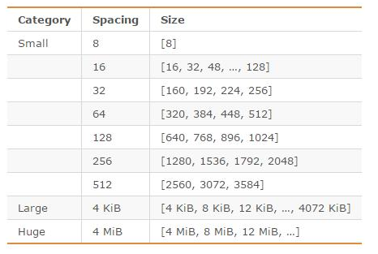

# Redis内存模型

https://www.cnblogs.com/kismetv/p/8654978.html


Redis是目前最火爆的内存数据库之一，通过在内存中读写数据，大大提高了读写速度，可以说Redis是实现网站高并发不可或缺的一部分。

Redis有5种对象类型（字符串、哈希、列表、集合、有序集合），丰富的类型是Redis相对于Memcached等一大优势。在了解Redis的5种对象类型的用法和特点的基础上，进一步了解Redis的内存模型，对Redis的使用有很大帮助，例如：

1. 估算Redis内存使用量。目前为止，内存的使用成本依然相对较高，使用内存不能无所顾忌；根据需求合理的评估Redis的内存使用量，选择合适的机器配置，可以在满足需求的情况下节约成本。
2. 优化内存占用。了解Redis内存模型可以选择更合适的数据类型和编码，更好的利用Redis内存
3. 分析解决问题。当Redis出现阻塞、内存占用等问题时，尽快发现导致问题的原因，便于分析解决问题。

这篇文章主要介绍Redis的内存模型（以3.0为例），包括Redis占用内存的情况及如何查询、不同的对象类型在内存中的编码方式、内存分配器(jemalloc)、简单动态字符串(SDS)、RedisObject等；然后在此基础上介绍几个Redis内存模型的应用。


### 1. Redis内存统计

在说明Redis内存之前首先说明如何统计Redis使用内存的情况。

在客户端通过redis-cli连接服务器后（后面如果没有特殊说明，客户端一律使用redis-cli），通过info命令可以查看内存使用情况：

```shell
info memory
```


其中，info命令显示redis服务器的许多信息，包括服务器基本信息，CPU、内存、持久化、客户端连接信息等；memory是参数，表示只显示内存相关的信息。

返回结果中比较重要的几个说明：

* **used_memory**: Redis分配器分配的内存总量（单位是字节），**包括**使用的虚拟内存（即swap）；Redis分配器后面介绍。used_memory_human是次值的友好显示

* **used_memory_rss**: Redis进程占用操作系统的内存（单位是字节），与**top**及**ps**命令看到的值是一致的；除了分配器分配的内存之外，used_memory_rss还包括进程运行本身需要的内存、内存碎片等，但是**不包括虚拟内存**。

  此外，**used_memory和used_momory_rss，前者是从Redis角度看到的量，后者是从操作系统角度看到的量**。二者之所以不同，一方面是因为内存碎片和Redis进程运行需要占用内存，使得前者比后者小；另一方面虚拟内存的存在，使得前者可能比后者大。

  由于在实际应用中，Redis的数据量会变大，此时进程运行占用的内存与Redis数据量和内存碎片相比，都会小很多；因此，used_memory_rss和used_memory的比例，便成为了衡量Redis内存碎片的参数，这个参数就是接下来的mem_fragmentation_ratio。

* **mem_fragmentation_ratio**: **内存碎片比率** ，是 used_memory_rss / used_memory 的比值。

  mem_fragmentation_ratio **一般大于1** ，<font color='red'>且该值越大，内存碎片比例越大</font>；mem_fragmentation_ratio <font color='red'>小于 1， 说明Redis使用了虚拟内存</font>。由于虚拟内存的媒介是磁盘，比内存速度慢很多。当这种情况出现时，应该及时排查，如果内存不足应该及时处理，如增加Redis节点、增加Redis服务器内存、优化应用等等。

  一般来说，mem_fragmentation_ratio在**1.03左右是比较监控的状态**（对于jemalloc来说）；上面截图中的mem_fragmentation_ratio值很大，是因为还没有向Redis存入数据，Redis进程本身运行的内存使得used_memory_rss比used_memory大得多。

* **mem_allocator**: Redis使用的内存分配器，在编译时指定；可以是libc、jemalloc或者tcmalloc，默认是jemalloc；截图中使用的就是默认的jemalloc。

### 2. Redis内存划分

Redis作为内存数据库，在内存中存储的内容主要是数据（键值对）；通过前面的叙述可以知道，除了数据以外，Redis的其它部分也会占用内存。

Redis的内存占用主要分为一下几个部分：

#### 2.1 数据（或称为对象）

作为数据库，数据是最主要的部分；这部分占用的内存会统计在**used_memory**中。

Redis使用键值对存储数据，其中的值（对象）包括5种类型：字符串、哈希、列表、集合、有序集合。 这5种类型是Redis对外提供的，实际上，在Redis内部，每种类型可能有2种或者更多的内部编码实现；此外，Redis在存储对象外，并不是直接将数据扔进内存，而是会对对象进行各种包装，如redisObject、SDS等。后面会详细介绍Redis种的数据存储细节。

#### 2.2 进程本身运行需要的内存

Redis主要进程本身运行肯定需要占用内存，如代码、常量池等等；这部分内存大约几兆。在大多数生产环境中与Redis数据占用的内存相比可以忽略。这部分内存不是有jemalloc分配，因此**不会**统计在used_memory里。

> 补充：除了主进程外，Redis创建的子进程运行也会占用内存，如Redis执行AOF、RDB重写时创建的子进程。当然，这部分内存不属于Redis进程，**也不会**统计在used_memory和used_memory_rss中。

#### 2.3 缓冲内存

缓冲内存包括客户端缓冲区、复制积压缓冲区、AOF缓冲区等。其中，客户端缓冲存储客户端连接的输入输出缓冲；复制缓冲区用于部分复制功能；AOF缓冲用于在进行AOF重写时，保存最近写入的命令。在了解相应功能之前，不需要知道这些缓冲区的细节。这部分内存由jemelloc分配，因此**会统计**在used_memory中。

#### 2.4 内存碎片

内存碎片是Redis在分配、回收物理内存过程中产生的。例如，如果对数据的更改频繁，而且数据之间的大小相差很大，可能导致Redis释放的空间在物理空间中并没有释放，但Redis又无法有效利用，这就形成了内存碎片。内存碎片不会统计在used_memory中。

内存碎片的产生与对数据进行的操作、数据的特点等都有关系。此外，与使用的内存分配器也有关系。如果内存分配器设计合理，可以尽可能地减少内存碎片的产生。后面将要说到的jemalloc便在控制内存碎片方面做的很好。

如果Redis服务器中的内存碎片已经很大，可以通过安全重启的方式减少内存碎片：因为重启后，Redis重新从备份文件中读取数据，在内存中进行重排，为每个数据重新选择合适的内存单元，减少内存碎片。

### 3. Redis数据存储细节

#### 3.1 概述

关于Redis数据存储的细节，涉及到内存分配器（jemalloc）、简单动态字符串（SDS）、5中对象类型及内部编码、redisObject等。在讲述具体内容之前，需要先说明一下这几个概念之间的关系。

下图是执行

```shell
set hello world
```

时，所涉及到的数据类型：



1. dictEntry: 

   Redis是Key-Value数据库，因此对**每个键值对都会有一个dictEntry**，里面存储了指向Key和Value的指针；next指向下一个dictEntry，与本Key-Value无关

2. Key:

   从图中右上角可见，**Key** ("hello") 并不是直接以字符串存储，而是**存储在SDS结构中**

3. redisObject:

   **Value** ("world") 既不是直接以字符串存储，也不是像Key一样直接存储在SDS中，而**是存储在redisObject中** 。实际上，不论Value是5种类型的哪一种，都是通过redisObject来存储的；而redisObject中的type字段指明了Value对象的类型。**ptr**字段则指向对象所在的地址。不过可以看出，字符串对象虽然经过了redisObject的包装，但仍然需要通过SDS存储。

   实际上，redisObject除了type和ptr字段外，还有其它字段图中没有给出。如用于指定对象内部编码的字段，后面再详细介绍。

4. jemalloc:

   无论是dictEntry对象，还是redisObject、SDS对象，都需要内存分配器（如：jemalloc）分配内存进行存储。以dictEntry对象为例，有3个指针组成，在64位机器下占24个字节，jemalloc会为它分配32字节大小的内存单元。

   下面分别介绍jemalloc、redisObject、SDS、对象类型及内部编码。

#### 3.2 jemalloc

Redis在编译时便会指定内存分配器。内存分配器可以是libc、jemallic或者tcmalloc，默认是jemalloc。

jemalloc作为Redis的默认内存分配器，在减小内存碎片方面做得相对较好。jemalloc在**64位系统**中，将内存空间划分为小、大、巨大三个范围；每个范围内又划分了许多小的内存块单位；当Redis存储数据时，会选择大小最合适的内存块进行存储。

jemalloc划分的内存单元如下图所示：



*Spacing：表示每次增长的增量值*

举例：如果需要存储大小为130字节的对象，jemalloc会将其放入160字节的内存单元中。

#### 3.3 redisObject

Redis对象有5种类型，无论哪种类型，Redis都不会直接存储，而是通过redisObject对象进行存储。

redisObject对象非常重要，Redis对象的类型、内部编码、内存回收、共享对象等功能，都需要redisObject支持。下面将通过redisObject的结构来说明它是如何起作用的。

redisObject的定义如下（版本不同可能有差异）：

```c
typedef struct redisObject {
　　unsigned type:4;
　　unsigned encoding:4;
　　unsigned lru:REDIS_LRU_BITS; /* lru time (relative to server.lruclock) */
　　int refcount;
　　void *ptr;
} robj;
```

redisObject的每个字段的含义和作用如下：

* type

  

* encoding

* lru

* refcount

* ptr

* 总结

#### 3.4 SDS

### 4. Redis的对象类型与内部编码

#### 4.1 字符串

#### 4.2 列表

#### 4.3 哈希

#### 4.4 集合

#### 4.5 有序集合

### 5. 应用举例

#### 5.1 估算Redis内存使用量

#### 5.2 优化内存占用

#### 5.3 关注内存碎片