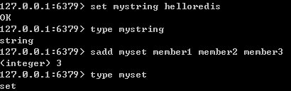
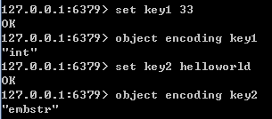
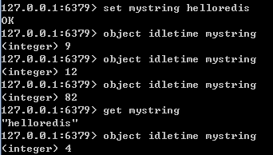
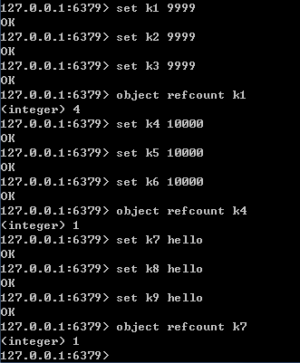
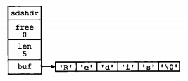
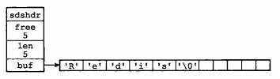
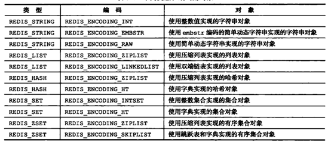
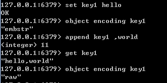
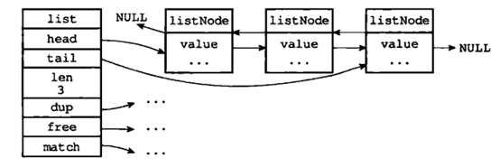
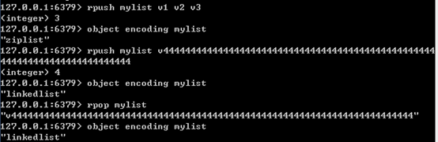

# Redis内存模型

https://www.cnblogs.com/kismetv/p/8654978.html


Redis是目前最火爆的内存数据库之一，通过在内存中读写数据，大大提高了读写速度，可以说Redis是实现网站高并发不可或缺的一部分。

Redis有5种对象类型（字符串、哈希、列表、集合、有序集合），丰富的类型是Redis相对于Memcached等一大优势。在了解Redis的5种对象类型的用法和特点的基础上，进一步了解Redis的内存模型，对Redis的使用有很大帮助，例如：

1. 估算Redis内存使用量。目前为止，内存的使用成本依然相对较高，使用内存不能无所顾忌；根据需求合理的评估Redis的内存使用量，选择合适的机器配置，可以在满足需求的情况下节约成本。
2. 优化内存占用。了解Redis内存模型可以选择更合适的数据类型和编码，更好的利用Redis内存
3. 分析解决问题。当Redis出现阻塞、内存占用等问题时，尽快发现导致问题的原因，便于分析解决问题。

这篇文章主要介绍Redis的内存模型（以3.0为例），包括Redis占用内存的情况及如何查询、不同的对象类型在内存中的编码方式、内存分配器(jemalloc)、简单动态字符串(SDS)、RedisObject等；然后在此基础上介绍几个Redis内存模型的应用。


### 1. Redis内存统计

在说明Redis内存之前首先说明如何统计Redis使用内存的情况。

在客户端通过redis-cli连接服务器后（后面如果没有特殊说明，客户端一律使用redis-cli），通过info命令可以查看内存使用情况：

```shell
info memory
```


其中，info命令显示redis服务器的许多信息，包括服务器基本信息，CPU、内存、持久化、客户端连接信息等；memory是参数，表示只显示内存相关的信息。

返回结果中比较重要的几个说明：

* **used_memory**: Redis分配器分配的内存总量（单位是字节），**包括**使用的虚拟内存（即swap）；Redis分配器后面介绍。used_memory_human是次值的友好显示

* **used_memory_rss**: Redis进程占用操作系统的内存（单位是字节），与**top**及**ps**命令看到的值是一致的；除了分配器分配的内存之外，used_memory_rss还包括进程运行本身需要的内存、内存碎片等，但是**不包括虚拟内存**。

  此外，**used_memory和used_momory_rss，前者是从Redis角度看到的量，后者是从操作系统角度看到的量**。二者之所以不同，一方面是因为内存碎片和Redis进程运行需要占用内存，使得前者比后者小；另一方面虚拟内存的存在，使得前者可能比后者大。

  由于在实际应用中，Redis的数据量会变大，此时进程运行占用的内存与Redis数据量和内存碎片相比，都会小很多；因此，used_memory_rss和used_memory的比例，便成为了衡量Redis内存碎片的参数，这个参数就是接下来的mem_fragmentation_ratio。

* **mem_fragmentation_ratio**: **内存碎片比率** ，是 used_memory_rss / used_memory 的比值。

  mem_fragmentation_ratio **一般大于1** ，<font color='red'>且该值越大，内存碎片比例越大</font>；mem_fragmentation_ratio <font color='red'>小于 1， 说明Redis使用了虚拟内存</font>。由于虚拟内存的媒介是磁盘，比内存速度慢很多。当这种情况出现时，应该及时排查，如果内存不足应该及时处理，如增加Redis节点、增加Redis服务器内存、优化应用等等。

  一般来说，mem_fragmentation_ratio在**1.03左右是比较监控的状态**（对于jemalloc来说）；上面截图中的mem_fragmentation_ratio值很大，是因为还没有向Redis存入数据，Redis进程本身运行的内存使得used_memory_rss比used_memory大得多。

* **mem_allocator**: Redis使用的内存分配器，在编译时指定；可以是libc、jemalloc或者tcmalloc，默认是jemalloc；截图中使用的就是默认的jemalloc。

### 2. Redis内存划分

Redis作为内存数据库，在内存中存储的内容主要是数据（键值对）；通过前面的叙述可以知道，除了数据以外，Redis的其它部分也会占用内存。

Redis的内存占用主要分为一下几个部分：

#### 2.1 数据（或称为对象）

作为数据库，数据是最主要的部分；这部分占用的内存会统计在**used_memory**中。

Redis使用键值对存储数据，其中的值（对象）包括5种类型：字符串、哈希、列表、集合、有序集合。 这5种类型是Redis对外提供的，实际上，在Redis内部，每种类型可能有2种或者更多的内部编码实现；此外，Redis在存储对象外，并不是直接将数据扔进内存，而是会对对象进行各种包装，如redisObject、SDS等。后面会详细介绍Redis种的数据存储细节。

#### 2.2 进程本身运行需要的内存

Redis主要进程本身运行肯定需要占用内存，如代码、常量池等等；这部分内存大约几兆。在大多数生产环境中与Redis数据占用的内存相比可以忽略。这部分内存不是有jemalloc分配，因此**不会**统计在used_memory里。

> 补充：除了主进程外，Redis创建的子进程运行也会占用内存，如Redis执行AOF、RDB重写时创建的子进程。当然，这部分内存不属于Redis进程，**也不会**统计在used_memory和used_memory_rss中。

#### 2.3 缓冲内存

缓冲内存包括客户端缓冲区、复制积压缓冲区、AOF缓冲区等。其中，客户端缓冲存储客户端连接的输入输出缓冲；复制缓冲区用于部分复制功能；AOF缓冲用于在进行AOF重写时，保存最近写入的命令。在了解相应功能之前，不需要知道这些缓冲区的细节。这部分内存由jemelloc分配，因此**会统计**在used_memory中。

#### 2.4 内存碎片

内存碎片是Redis在分配、回收物理内存过程中产生的。例如，如果对数据的更改频繁，而且数据之间的大小相差很大，可能导致Redis释放的空间在物理空间中并没有释放，但Redis又无法有效利用，这就形成了内存碎片。内存碎片不会统计在used_memory中。

内存碎片的产生与对数据进行的操作、数据的特点等都有关系。此外，与使用的内存分配器也有关系。如果内存分配器设计合理，可以尽可能地减少内存碎片的产生。后面将要说到的jemalloc便在控制内存碎片方面做的很好。

如果Redis服务器中的内存碎片已经很大，可以通过安全重启的方式减少内存碎片：因为重启后，Redis重新从备份文件中读取数据，在内存中进行重排，为每个数据重新选择合适的内存单元，减少内存碎片。

### 3. Redis数据存储细节

#### 3.1 概述

关于Redis数据存储的细节，涉及到内存分配器（jemalloc）、简单动态字符串（SDS）、5中对象类型及内部编码、redisObject等。在讲述具体内容之前，需要先说明一下这几个概念之间的关系。

下图是执行

```shell
set hello world
```

时，所涉及到的数据类型：


1. dictEntry: 

   Redis是Key-Value数据库，因此对**每个键值对都会有一个dictEntry**，里面存储了指向Key和Value的指针；next指向下一个dictEntry，与本Key-Value无关

2. Key:

   从图中右上角可见，**Key** ("hello") 并不是直接以字符串存储，而是**存储在SDS结构中**

3. redisObject:

   **Value** ("world") 既不是直接以字符串存储，也不是像Key一样直接存储在SDS中，而**是存储在redisObject中** 。实际上，不论Value是5种类型的哪一种，都是通过redisObject来存储的；而redisObject中的type字段指明了Value对象的类型。**ptr**字段则指向对象所在的地址。不过可以看出，字符串对象虽然经过了redisObject的包装，但仍然需要通过SDS存储。

   实际上，redisObject除了type和ptr字段外，还有其它字段图中没有给出。如用于指定对象内部编码的字段，后面再详细介绍。

4. jemalloc:

   无论是dictEntry对象，还是redisObject、SDS对象，都需要内存分配器（如：jemalloc）分配内存进行存储。以dictEntry对象为例，有3个指针组成，在64位机器下占24个字节，jemalloc会为它分配32字节大小的内存单元。

   下面分别介绍jemalloc、redisObject、SDS、对象类型及内部编码。

#### 3.2 jemalloc

Redis在编译时便会指定内存分配器。内存分配器可以是libc、jemallic或者tcmalloc，默认是jemalloc。

jemalloc作为Redis的默认内存分配器，在减小内存碎片方面做得相对较好。jemalloc在**64位系统**中，将内存空间划分为小、大、巨大三个范围；每个范围内又划分了许多小的内存块单位；当Redis存储数据时，会选择大小最合适的内存块进行存储。

jemalloc划分的内存单元如下图所示：


*Spacing：表示每次增长的增量值*

举例：如果需要存储大小为130字节的对象，jemalloc会将其放入160字节的内存单元中。

#### 3.3 redisObject

Redis对象有5种类型，无论哪种类型，Redis都不会直接存储，而是通过redisObject对象进行存储。

redisObject对象非常重要，Redis对象的类型、内部编码、内存回收、共享对象等功能，都需要redisObject支持。下面将通过redisObject的结构来说明它是如何起作用的。

redisObject的定义如下（版本不同可能有差异）：

```c
typedef struct redisObject {
　　unsigned type:4;
　　unsigned encoding:4;
　　unsigned lru:REDIS_LRU_BITS; /* lru time (relative to server.lruclock) */
　　int refcount;
　　void *ptr;
} robj;
```

redisObject的每个字段的含义和作用如下：

* **type**

  type字段表示对象的类型，占4个比特；目前包括REDIS_STRING（字符串）、REDIS_LIST（列表）、REDIS_HASH（哈希）、REDIS_SET（集合）、REDIS_ZSET（有序集合）

  当执行type命令时，便是通过读取RedisObject的type字段获得对象的类型，如下图所示：

  

* **encoding**

  encoding表示对象的内部编码，占4个比特。

  对于Redis支持的每种类型，**都有至少两种内部编码**。例如对于字符串，有int、embstr、raw三种编码。通过encoding属性，Redis可以根据不同的使用场景来为对象设置不同的编码，大大提供了Redis的灵活性和效率。以列表对象为例，有压缩列表和双端列表两种编码方式；如果列表中的元素较少，Redis倾向于使用压缩列表进行存储，因为压缩列表占用内存更少，而且比双端链表可以更快载入；当列表对象元素较多时，压缩列表就会转化为更适合存储大量元素的双端链表。

  通过object encoding命令，可以查看对象采用的编码方式，如下图所示：

  

  5种对象类型对应的编码方式以及使用条件，后面会介绍。

* **lru**

  lru记录的是对象最后一次被命令程序访问的时间，占用的比特数，不同的版本有所不同（如4.0版本占24比特，2.6版本占22比特）

  通过对比lru时间与当前时间，可以计算某个对象的空转时间。Object idletime命令可以显示该空转时间（单位是秒）。**Object idletime命令的一个特殊之处在于它不改变对象的lru值**。

  

  lru值除了通过object idletime命令答应之外，还与Redis的内存回收有关系：如果redis打开了maxmemory选项，且内存回收算法选择的是volatile-lru或allkeys-lru，那么当redis内存占用超过maxmemory指定的值时，Redis会优先选择空间转时间最长的对象进行释放。

* **refcount**

  **refcount与共享对象**

  refcount记录的是该对象被引用的次数，类型为整数，占4个字节。refcount的作用，主要在于对象的引用计数和内存回收。当创建新对象时，refcount初始化为1；当有新程序使用该对象时，refcount加1；当对象不再被一个新程序使用时，refcount减1；当refcount变为0时，对象占用的内存会被释放。

  Redis中被对此使用的对象（refcount > 1），被称为共享对象。Redis为了节省内存，当有一些对象重复出现时，新的程序不会创建新的对象，而是仍用原来的对象。这个被重复使用的对象，就是共享对象。目前共享对象仅支持整数值的字符串对象。

  **共享对象的具体实现**

  Redis的共享对象目前只支持整数值的字符串对象。之所以如此，实际上是对内存和CPU（时间）的平衡：共享对象虽然会降低内存消耗，但是判断两个对象是否相等却要消耗额外的时间。对于整数值，判断操作复杂度为O(1)；对于普通字符串，判断复杂度为o(n)；对于哈希、列表、集合和有序集合，判断的复杂度为O(n^2)。

  虽然共享对象只能是整数值的字符串对象，但是5种类型都可能使用共享对象（如哈希、列表等元素可以使用）。

  就目前的实现来说，Redis服务器在初始化时，会创建10000个字符串对象，值分别是0--9999的整数值；当Redis需要使用值为0--999的字符串对象时，可以直接使用这些共享对象。10000个数字可以通过调整参数REDIS_SHARED_INTEGERS（4.0是OBJ_SHARED_INTEGERS）的值进行修改。

  共享对象的引用次数可以通过object refcount命令查看，如下图所示。命令执行的结果页佐证了只有0--9999之间的整数会被作为共享对象。

  

* **ptr**

  ptr指针指向具体的数据，如前面的例子中，set hello world， ptr指向包含字符串world的SDS。ptr指针占据的字节数与系统有关。例如64位的OS占用8个字节。

* **总结**

  综山所述，redisObject的结构与对象类型、编码、内存回收、共享对象都有关系。在64位系统中，一个redisObject对象的大小为16字节：

  4bit+ 4bit + 24bit + 4Byte = 16Byte

#### 3.4 SDS

Redis没有直接使用C语言的字符串（即以空字符串'\0'结尾的字符串数组）作为默认的字符串表示，而是使用了SDS。SDS是**简单动态字符串**(Simple Dynamic String)的缩写。

* **SDS结构**

  SDS的结构如下：

  ```c
  struct sdshdr { 
    int len;
    int free;
    char buf[];
  };
  ```

  其中，buf表示字符数组，用来存储字符串；len表示buf已使用的长度，free表示buf未使用的长度。下面是两个例子：

  

  

  通过SDS的结构可以看出，buf数组的长度=free + len + 1 （其中1表示字符串结构的空字符）。所以，一个SDS结构占据的空间为：

  ​     *free所占长度 + len所占长度 + buf数组长度  = 4 + 4 + free + len + 1  = free + len + 9*

* **SDS与C字符串的比较**

  SDS在C字符串的基础上加入了free和len字段，带来了很多好处：

  * 获取字符串长度： SDS是O(1)， C字符串是O(n)

  * 缓冲区溢出：使用C字符串的API时，如果字符串长度增加（如strcat操作）而忘记了重新分配内存，很容易造成缓冲区的溢出；而SDS由于记录了长度，相应的API在可能造成缓冲区溢出时会自动重新分配内存，杜绝了缓冲区溢出

  * 修改字符串时内存的重新分配：对于C字符串，如果要修改字符串，必须要重新分配内存（先释放再申请），因为如果没有重新分配，字符串长度增大时会造成缓冲区溢出，字符串长度减小时会造成内存泄漏。

    而对于SDS，由于记录len和free，因此解除了字符串长度和空间数组长度的关联，可以在此基础上进行优化：空间预分配策略（即分配内存时比实际需要的多）是的字符串长度增大时重新分配内存的概率大大减小；惰性空间释放策略使得字符串长度减小时重新分配内存的概率大大减小。

  * 存取二进制数据：SDS可以，C字符串不可以。因为C字符串以空字符串作为字符串结束的标志，而对于一些二进制文件（如图片等），内容可以包括空字符串，因此C字符串无法正确存取；而SDS以字符串长度len来作为字符串结束标志，因此没有这个问题。

  此外，由于SDS中的buf仍然使用了C字符串（即以'\0\'结尾），因此SDS可以使用C字符串中的部分函数；但是需要注意的是，只有当SDS用来存储文本数据时才可以这样使用，在存储二进制数据时不行（'\0\'不一定是结尾）。

* **SDS与C字符串的应用**

  Redis在存储对象时，一律使用SDS替代C字符串。例如*set hello world*命令，hello和world都是SDS的形式存储的。而*add myset member1 member2 member3*命令，不论是键("myset") ，还是集合中的元素("member1" 、"member2"、 "member3")，都是以SDS的形式存储。除了存储对象，SDS还用于存储各种缓冲区。

  只有在字符串不会变的情况下，如打印日志时，才会使用C的字符串。

### 4. Redis的对象类型与内部编码

前面已经说过，Redis支持5种对象类型，而每种结构都有至少两种编码。这样的好处在于：一方面接口与现实分离，当需要增加或改变内部编码时，用户使用不受影响，另一方面可以根据不同的应用场景切换内部编码，提高效率。

Redis各种对象类型支持的内部编码如下图所示（版本3.0，后续版本又增加了内部编码）：



关于redis内部编码的转换，都符合以下规律：**编码转换在Redis写入数据时完成，且转换过程不可逆，只能从小内存编码向大内存编码转换**。

#### 4.1 字符串

* **概况**

  字符串是最基础的类型，因为所有的键都是字符串类型，且字符串之外的其他几种复杂类型的元素也是字符串。

  **字符串长度不能超过512MB**。

* **内部编码**

  字符串内部的内部编码有3种，它们的应用场景如下：

  1. int：8个字节的长整型。字符串值时整型时，这个值使用long整形表示

  2. embstr：<=39字节的字符串。embstr与raw都使用redisObject和sds保存数据，区别在于，embstr的使用只分配一次内存空间（因此redisObject和sds是连续的），而raw需要分配两次内存空间（分别为redisObject和sds分配空间）。因此与raw相比，embstr的好处在于创建时少分配一次空间，删除时少释放一次空间，以及对象的所有数据连在一起，寻找方便。而embstr的坏处也很明显，如果字符串的长度增加需要重新分配内存时，整个redisObject和sds都需要重新分配空间，因此redis中的embstr实现为只读。

  3. raw：>39个字符的字符串

     示例如下图：

     

     embstr和raw进行区分的长度，是39：是因为redisObject的长度是16字节，sds的长度是9+字符串长度；因此当字符串长度是39时，embstr的长度正好是16+9+39=64，jemalloc正好可以分配64字节的内存单元。

* **编码转换**

  当int数据不再是整数，或大小超过了long的范围时，**自动转化为raw**。

  而对于embstr，由于其实现是只读的，因此在对embstr对象进行修改时，都会先转化为raw再进行修改，因此，只要是修改embstr对象，修改后的对象一定是raw的，无论是否达到了39个字节。示例如下图所示：

  

#### 4.2 列表

* **概况**

  列表（list）用来存储多个**有序的**字符串，每个字符串称为元素：一个列表可以存储2^32-1个元素。Redis中的列表支持两端插入和弹出，并可以获得指定位置（或范围）的元素，**可以充当数组、队列、栈等**。

* **内部编码**

  列表的内部编码可以是压缩列表（ziplist）或双端链表（linkedlist）。

  **双端链表**：由**一个list结构**和**多个listNode结构**组成，典型的结构如下图所示：

  

  通过上图可以看出，双端链表同时保存了表头指针和表尾指针，并且每个节点都有指向前和指向后的指针；链表中保存了列表的长度；dup，free和match为节点值设置类型特定函数，所以链表可以用于保存各种不同类型的值。而链表中每个节点（listNode）指向的是type为字符串的redisObject。

  **压缩列表**：压缩列表是Redis为了节省内存而开发的，是由一系列特殊编码的**连续内存块**（而不是像双端链表一样，每个节点都是指针）组成的顺序型数据结构。具体结构相当复杂，这里不详细介绍。与双端链表相比，压缩列表可以节省内存空间，但是进行修改或者删除时，复杂度高。因此当节点数量较少时，可以使用压缩列表，但是当节点数量多时，还是使用双端链表划算。

  压缩列表不仅用于实现列表，**也用于实现哈希、有序列表**，使用非常广泛。

* **编码转换**

  只有同时满足下面两个条件，才会使用压缩列表：

  1. 列表中元素数量小于512个
  2. 列表中所有字符串对象都不足64字节

  如果有一个条件不满足，则使用双端列表；且编码只可能由压缩列表转化为双端链表，反向则不可能。

  下图展示了列表编码转换的特点：

  

  其中，单个字符串不能超过64字节，是为了便于统一分配每个节点的长度。这里的64字节是指字符串的长度，不包括SDS结构。因为压缩列表使用连续、定长内存块存储字符串，不需要SDS结构指明长度。后面提到压缩列表，也会强调长度不超过64字节，原理与这里类似。

#### 4.3 哈希

* **概况**

  哈希（作为一种数据结构），不仅是redis对外提供了5种对象类型的一种（与“字符串、列表、集合、有序结合”并列），也是Redis作为Key-Value数据库所使用的数据结构。

  为了说明的方便，在文本后面当使用“**内层的哈希**”时，代表的是Redis对外提供的5种对象类型的一种；使用“**外层的哈希**”代指Redis作为Key-Value数据库所使用的数据结构。

* **内部编码**

  内层的哈希使用的内部编码可以是压缩列表（ziplist）和哈希表（hashtable）两种；Redis的外层的哈希则只使用了hashtable。

* **编码转换**

#### 4.4 集合

#### 4.5 有序集合

### 5. 应用举例

#### 5.1 估算Redis内存使用量

#### 5.2 优化内存占用

#### 5.3 关注内存碎片