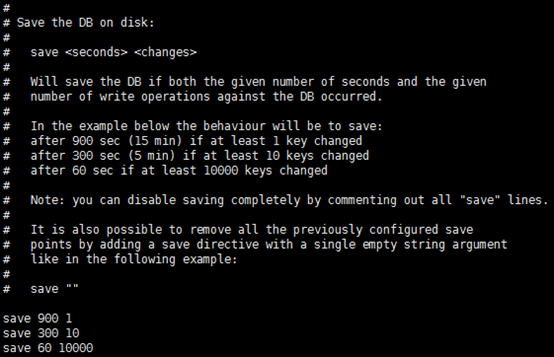
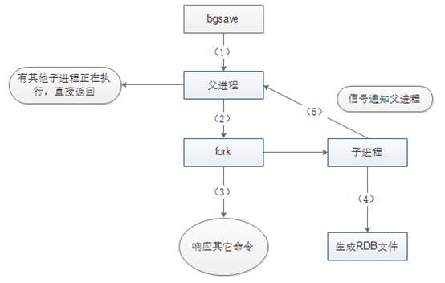
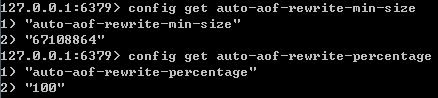
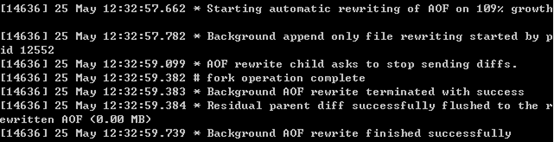
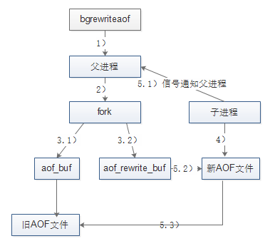
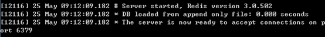

# Redis持久化

https://www.cnblogs.com/kismetv/p/9137897.html

## Redis高可用概述

​        在介绍Redis高可用之前，先说明一下在Redis的语境中高可用的含义。

​        我们知道，在web服务器中，高可用是指服务器可以正常访问的时间，衡量的标准是在多长时间内可以提供正常服务（99.9%、99.99%、99.999% 等等）。但是在Redis语境中，高可用的含义似乎要宽泛一些，除了保证提供正常服务(如主从分离、快速容灾技术)，还需要考虑数据容量的扩展、数据安全不会丢失等。

​        在Redis中，实现高可用的技术主要包括持久化、复制、哨兵和集群，下面分别说明它们的作用，以及解决了什么样的问题。

1. 持久化：持久化是最简单的高可用方法(有时甚至不被归为高可用的手段)，主要作用是数据备份，即将数据存储在硬盘，保证数据不会因进程退出而丢失。
2. 复制：复制是高可用Redis的基础，哨兵和集群都是在复制基础上实现高可用的。复制主要实现了数据的多机备份，以及对于读操作的负载均衡和简单的故障恢复。缺陷：故障恢复无法自动化；写操作无法负载均衡；存储能力受到单机的限制。
3. 哨兵：在复制的基础上，哨兵实现了自动化的故障恢复。缺陷：写操作无法负载均衡；存储能力受到单机的限制。
4. 集群：通过集群，Redis解决了写操作无法负载均衡，以及存储能力受到单机限制的问题，实现了较为完善的高可用方案。

## Redis持久化概述

​        持久化的功能：Redis是内存数据库，数据都是存储在内存中，为了避免进程退出导致数据的永久丢失，需要定期地将Redis中的数据以某种形式（数据或者命令）从内存保存到磁盘上。当下次Redis重启时，利用持久化文件实现数据恢复。除此外，为了进行灾难备份，可以将持久化文件拷贝到一个远程位置。

​        Redis持久化分为RDB和AOF两种方式：前者将当前数据保存到硬盘，后者是将每次执行的命令保存到硬盘（类似于MySQL的binlog）。由于AOF持久化的实时性更好，即当进程意外退出时丢失的数据更少，因此AOF是目前主流的持久化方式，不过RDB仍然有其用武之地。

​        下面依次介绍RDB和AOF。由于各个Redis版本有差异，以Redis3.0为依据。

## RDB持久化

​        RDB持久化是将当前进程中的数据生成快照保存到硬盘（因此也称为快照持久化），保存的文件后缀是rdb。当Redis重启时，可以读取快照文件来恢复数据。

* ### 触发条件

  RDB持久化的触发分为**手动触发**和**自动触发**两种。

  1. **手动触发**

     **save**命令和**bgsave**命令都可以生成rdb文件。

     * save命令会**阻塞**Redis服务器进程，知道RDB文件创建完毕为止。在Redis服务器阻塞期间，服务器不能处理任何命令请求。

     

     * bgsave命令会**创建一个子进程**，由子进程来负责创建RDB文件，父进程（即Redis主进程）则继续处理请求。

       

       此时服务器执行日至如下：

       

       bgsave命令执行过程中，只有fork子进程时会阻塞服务器，而对于save命令，整个过程都会阻塞服务器，因此save命令已基本被废弃，线上环境杜绝使用save，后面也只介绍bgsave。此外，在自动触发RDB时，Redis也会选择bgsave进行持久化。

  2. **自动触发**

     **save m n**

     自动触发最常见的情况是在配置文件中通过save m n，**指定当m秒内发生n次变化时，会触发bgsave**。

     例如，查看Redis的默认配置文件（Linux下为Redis根目录下的redis.conf），可以看到如下配置信息：

     

     其中 *save 900 1* 的含义是：当时间到900秒时，如果redis数据发生了至少1次变化，则执行bgsave； *save 300 10* 和 *save 60 10000* 同理。当三个save条件***满足任何一个***，都会引起bgsave的调用。

     **save m n 的实现原理**

     Redis的save m n，是通过***serverCron函数、dirty计数器、lastsave时间戳***来实现的。

     ***serverCron***函数，是Redis服务器的周期性操作函数，**默认每隔100ms执行一次**。该函数对服务器的状态进行维护，其中一项工作就是检查save m n配置的条件是否满足，如果满足就执行bgsave。

     ***dirty***计数器，是Redis服务器维持的一个状态，记录了上一次执行bgsave/save命令后，服务器状态进行了多少次修改（包括增删改）。而当save/bgsave执行完成后，会将dirty重新置为0。

     例如：如果Redis执行了set mykey helloworld，则dirty值会 +1； 如果执行了sadd myset v1 v2 v3，则dirty值会 +3。注意：dirty记录的是服务器进行了多少次修改，而不是客户端执行了多少修改数据的命令。

     ***lastsave***时间戳，也是Redis服务器维持的一个状态，记录的是上一次成功执行save/bgsave的时间。

     save m n 的原理如下：每个100ms，执行serverCron函数，在serverCron函数中，遍历save m n配置的保存条件，只要有一个条件满足，就进行bgsave。对于每一个save m n 条件，只有下面两条**同时满足**时才算满足：

     * 当前时间 - lastsave  > m 
     * dirty >= n

     **save m n 执行日志**

     下图是save m n 触发bgsave执行时，服务器打印的日志信息：

     

     

     **其他自动触发机制**

     除了save m n以为，还有一些其他情况会触发bgsave：

     * 在主从复制场景下，如果从节点执行全景复制操作，则主节点会执行bgsave命令，并将rdb文件发送给从节点

     * 执行shutdown命令时，自动执行rdb持久化，如下图：

       

     

* ### 执行流程

  前面介绍了触发bgsave的条件，下面说说bgsave的执行过程。如下图所示：

  

  图中的5个步骤所执行的操作如下：

  1. Redis父进程首先判断：当前是否在执行save、bgsave/bgrewriteaof的子进程，如果在执行，则bgsave命令直接返回。bgsave/bgrewriteaof的子进程不能同时执行，主要是基于性能方面的考虑：两个并发的子进程同时执行大量的磁盘写操作，可能会引起严重的性能问题
  2. 父进程执行fork操作创建子进程。这个过程中，父进程是阻塞的，Redis不能执行来自客户端的任何命令
  3. 父进程fork完成后，bgsave命令返回“Background saving started”信息并不再阻塞父进程，并可以相应其他的命令
  4. 子进程创建RDB文件，根据父进程内存快照生成临时快照文件，完成后对原有文件进行原子替换
  5. 子进程发送信号给父进程表示完成，父进程更新统计信息

* ### RDB文件

  RDB文件是经过压缩的二进制文件，下面介绍RDB文件的一些细节。

  **存储路径**

  RDB文件的存储路径既可以在启动前配置，又可以通过命令动态设定。

  * 配置：dir 配置指定路径，dbfilename指定文件名，默认是Redis跟目录下的dump.rdb文件。
  * 动态设定：Redis启动后也可以动态修改RDB存储路径，在磁盘损坏或空间不足时非常有用。执行命令为：***config set dir {new_dir}*** 和 ***config set dbfilename {new_filename}***。 如下图所示：

  

  

  **RDB文件格式**

  RDB文件格式如下图所示：

  

  各个字段的含义如下：

  1. REDIS：常量，存储“REDIS”5个字符串
  2. db_version：RDB文件的版本号，注意，*不是Redis的版本号*
  3. SELECTDB 0 pairs：表示一个完成的数据库（0号数据库），同理，SELECTDB 3 pairs表示完整的3号数据库。只有当数据库中有键值对时，RDB文件中才会有该数据库的信息（上图所示的Redis中只有0号和3号数据库有键值对）。如果Redis中所有的数据库都没有键值对，则这一部分直接省略掉。其中：SELECTDB是一个常量，代表后面跟着的是数据库号码；0和3是数据库号码；pairs则存储了具体的键值对信息，包括key、value，及其数据类型、内部编码、过期时间、压缩信息等
  4. EOF：常量，标志RDB文件正文内容结束
  5. check_sum：前面所有内容的校验和。Redis在载入RBD文件时，会计算前面的校验和，并与check_sum的值进行对比，判断文件是否损坏

  **压缩**

  ​        Redis默认采用**LZF算法**对RDB文件进行压缩。虽然压缩耗时，但是可以大大减少RDB文件的体积，因此压缩默认开启，也可以通过命令关闭：

  

  ​        需要注意的是，**RDB文件的压缩并不是针对整个文件进行的**，而是针对数据库中的字符串进行的，且只有在字符串达到一定长度（20字节）时才会进行压缩。

* ### 启动时加载

  ​        RDB文件的载入工作是在服务器启动时**自动执行**的，并没有专门的命令。但是由于**AOF的优先级更高**，因此当AOF开启时，Redis会优先载入AOF文件来恢复数据。只有当AOF关闭时，才会在Redis服务器启动时检测RDB文件，并自动载入。服务器载入RDB文件期间处于阻塞状态，直到载入完成为止。

  ​        Redis启动日志中可以看到自动载入的执行过程：

  

  ​        Redis载入RDB文件时，会对RDB文件进行校验，如果文件损坏，则日志中会打印错误，Redis启动失败。

* ### RDB常用配置总结

  下面是RDB常用的配置项，以及默认值。前面介绍过的就不在赘述。

  * save m n：bgsvae自动触发的条件。如果没有save m n的配置，相当于自动的RDB持久化关闭，不过此时仍可以通过其他方式触发
  * stop-writes-on-bgsave-error yes：当dbsave出现错误时，Redis是否停止执行写命令。设置为yes，则当硬盘出现问题时，可以及时发现，避免数据的大量丢失；如果设置为no，则Redis无视bgsave的错误继续执行写命令，当对Redis服务器的系统（尤其是硬盘）使用了监控时，该选项考虑设置为no
  * rdbcompression yes：是否开启RDB文件压缩
  * rdbchecksum yes：是否开启RDB文件的校验，在写入文件和读取文件时都起作用。关闭checksum在写入文件和启动文件时，大约能带来10%的性能提升，但是数据损坏时无法发现
  * dbfilename dum.rdb：RDB文件名
  * dir ./ ：RDB文件和AOF文件所在目录

## AOF持久化

​        RDB持久化是将进程数据写入文件，而AOF持久化（即Append Only File），则是将Redis每次执行的**写命令**写入到单独的日志文件中（类似MySQL的binlog）。当Redis重启时，再次执行AOF文件中的命令来恢复数据。

​        与RDB相比，AOF的实时性更好，因此也成为了Redis主流的持久化方案。

* ### 开启AOF

  Redis服务器默认开启的是RDB，关闭AOF。要开启AOF，需要在配置文件中设置：

  appendonly yes

* ### 执行流程

  由于需要记录Redis的每条写命令，因此AOF不需要触发，下面介绍AOF的执行流程：

  1. 命令追加（append）：将Redis的写命令追加到缓冲区aof_buf
  2. 文件写入（write）和文件同步（sync）：根据不同的同步策略，将aof_buf中的内容同步到硬盘
  3. 文件重写（rewrite）：定期重写AOF文件，达到压缩的目的

  

  **命令追加（append）**

  ​        Redis先将写命令追击到缓冲区，而不是直接写入文件，主要是为了避免每次有写命令都直接写硬盘，导致硬盘I/O称为Redis的负载瓶颈。

  ​        命令追加的格式是Redis的命令请求的协议格式，它是一种纯文本格式，具有兼容性好、可读性强、容易处理、操作简单、避免二次开销等优点。在AOF文件中，除了用于指定数据库的select命令（如select 0为选中0号数据库）是由Redis自动添加的，其他都是客户端发送来的命令。

  

  **文件写入（write）和文件同步（sync）**

  ​        Redis提供了多种AOF缓冲区的同步文件策略，策略设计到操作系统的write函数和fsynce函数。

  ​        为了提高文件写入效率，在现代的操作系统中，当用户调用write函数将数据写入文件时，操作系统通常会将数据暂存到一个内存缓冲区里，当缓冲区被填满或超过了指定的时限后，才真正将缓冲区的数据写入到硬盘里。这样的操作虽然提高了效率，但也带来了安全问题：如果计算机停机，缓冲区的数据就会丢失。因此系统同时提供了fsync、fdatasync等**同步函数**，可以强制操作系统立即将缓冲区的数据写入到硬盘，从而确保数据的安全性。

  ​        AOF缓冲区的同步文件策略由参数appendfsync控制，各个参数值含义如下：

  * always：命令写入aof_buf后立即调用系统fsync函数同步到AOF文件，fsync完成后线程返回。这种情况下，每次有写命令都要同步到AOF文件，硬盘I/O成为性能瓶颈，Redis智能支持大约几百TPS写入，严重降低了Redis的性能，即便是SSD，美妙大约也只能处理几万个命令，而且大大降低了SSD的寿命
  * no：命令写入aof_buf后调用系统的write函数，不对AOF文件做fsync同步，同步由操作系统负责，**通常同步周期为30秒**。这种情况下，文件同步的时间不可控，且缓冲区堆积的数据会很多，数据安全性无法保证
  * everysec：命令写入aof_buf后调用系统的write函数，write完成后线程返回；fsync同步文件操作由专门的线程美妙调用一次。everysec是前两种策略的折中方案，是性能和数据安全性的平衡。因此，这个策略是Redis的默认配置，也是推荐配置

  

  **文件重写（rewrite）**

  ​        随着时间流逝，Redis服务器执行的命令会越来越多，AOF文件也会越来越大。过大的AOF文件不仅影响服务器的正常运行，也会导致数据恢复需要的时间过长。

  ​        “文件重写”是指：定期重写AOF文件，减小AOF文件的体积。需要注意的是：**AOF重写是把Redis进程内的数据转化为写命令，同步到新的AOF文件，不会对旧的AOF文件进行任何的读取、写入操作。**

  ​        关于文件重写需要注意的另一点是：对于AOF持久化来说，文件重写虽然是强烈推荐，但并不是必须的。即使没有文件重写，数据也可以被持久化并在Redis启动时导入。因此在一些实现中，会关闭自动的文件重写，然后通过定时任务的方式，在每天的某个时刻定时执行。

  ​        文件重写之所以能够压缩AOF文件，原因在于：

  * 过期的数据不再写入文件

  * 无效的命令不再写入文件。如有些数据被重复设置（set mykey v1, set mykey v2)、有些数据被删除了（sadd myset v1, del myset）等等

  * 多条命令可以合并成一个：如sadd myset v1, sadd myset v2, sadd myset v3 可以合并为sadd myset v1 v2 v3。不过，为了防止单条命令过大造成客户端缓冲区溢出，对于list、set、hash、zset类型的key，并不一定只使用一条命令，而是以某个常量为界，将命令拆分成多条。这个常量在*redis.h/REDIS_AOF_REWRITE_ITEMS_PER_CMD* 中定义，不可修改的。3.0版本的Redis使用的值是64

    

    通过上述内容来看，由于重写后AOF，执行的命令减少了，文件重写既可以减少文件中用空间，也可以加速数据恢复。

  

  **文件重写的触发**

  ​        文件重写的触发，分为手动和自动。

  ​        **手动触发**

  ​        直接调用bgrewriteaof命令，该命令的执行与bgsave有些类似，都是fork子进程进行具体的工作，且都只有在fork时阻塞。

  

  ​        此时日志如下：

  

  

  ​        **自动触发**

  ​        根据 *auto-aof-rewrite-min-size* 和 *auto-aof-rewrite-percentage* 参数，以及 *aof_current_size* 和 *aof_base_size* 状态确定触发时机。

  * auto-aof-rewrite-min-size：执行AOF重写时，文件的最小体积，默认是64M
  * auto-aof-rewrite-percentage：执行AOF重写时，当前AOF大小（即aof_current_size）和上次重写时AOF大小（aof_base_size）的比值

  ​        其中，参数可以通过 *config get* 命令查看：

  

  ​        状态通过 *info persistence* 查看：

  

  ​        只有当 *auto-aof-rewrite-min-size* 和 *auto-aof-rewrite-percentage* 两个参数同时满足时，才会自动触发AOF重写，即 *bgrewriteaof* 操作。

  ​        自动触发bgrewriteaof时，可以看到服务器日志如下：

  

  

  **文件重写的流程**

  ​        文件重写流程如下图所示：

  

  ​        关于文件重写的流程，有亮点需要特别注意：

  1. 重写由父进程fork子进程进行
  2. 重写期间Redis执行的写命令，需要追加到新的AOF文件中，为此Redis引入了aof_rewrite_buf缓存

  ​        对照上面的流程图，文件重写的流程如下：

  1. Redis父进程首先判断当前是否存在正在执行的bgsave/bgrewriteaof的子进程。如果存在，则bgrewriteaof命令直接返回；如果存在bgsave，则等待bgsave执行完成后再执行。这样做的原因主要是因为性能方面的考量

  2. 父进程执行fork操作，创建子进程。这个过程Redis被阻塞

  3. * 父进程fork后，bgrewriteaof命令返回“Backgroud append only file rewrite started”信息并不再阻塞父进程，并可以响应其他命令。Redis的所有写命令依然写入AOF缓冲区，并根据appendfsynce策略同步到硬盘，保证原有AOF机制的正确性

     * 由于fork操作使用写时复制技术，子进程只能共享fork操作时的内存数据。由于父进程依然在响应命令，因此Redis使用AOF重写缓冲区（图中的aof_rewrite_buf）保存着部分数据，防止新AOF文件生成期间丢失这部分数据。也就是说，**bgrewriteaof执行期间，Redis的写命令同时追加到aof_buf和aof_rewrite_buf两个缓冲区**

  4. 子进程根据内存快照，按照命令合并规则写入到**新的**AOF文件

  5. * 子进程写完新的AOF文件后，向父进程发信号，父进程更新统计信息，具体可以通过 info persistence查看
     * 父进程把AOF重写缓冲区的数据写入到新的AOF文件，这样就保证新的AOF文件保存的数据库状态和服务器当前状态一致
     * 使用新的AOF文件替换老文件，完成AOF重写

     

* ### 启动时加载

  ​        前面提到过，当AOF开启时，Redis启动时会优先载入AOF文件来恢复数据。只有当AOF关闭时，才会载入RDB文件进行恢复。

  ​        当AOF开启，且AOF文件存在时，Redis启动日志大约如下：

  

  ​        当AOF开启，但AOF文件不存在时，即使RDB文件存在**也不会**加载（早期版本可能会加载，但3.0版本不会），Redis启动信息如下：

  

  

  **文件校验**

  ​        与载入RDB文件类似，Redis载入AOF文件时，会对AOF文件进行校验。如果文件损坏，则日志中会打印错误信息，Redis启动失败。但如果AOF文件结尾不完整（机器突然单宕机等导致文件尾部不完整），且 *aof-load-truncated* 参数开启，则日志中会输出警告，Redis忽略掉AOF文件的尾部，启动成功。 *aof-load-truncated*参数默认是开启的。

  

  **伪客户端**

  ​        因为Redis的命令只能在客户端上下文中执行，而载入AOF文件时命令是直接从文件中读取的，并不是由客户端发送；因此Redis服务器在载入AOF文件之前，会创建一个没有网络连接的客户端，之后用它来执行AOF文件中的命令，命令执行的效果与带网络连接的客户端完全一样。

* ### AOF常用配置总结

  ​        下面是AOF常用的配置项，以及默认值；前面介绍过的这里不再详细介绍。

  - appendonly no：是否开启AOF
  - appendfilename "appendonly.aof"：AOF文件名
  - dir ./：RDB文件和AOF文件所在目录
  - appendfsync everysec：fsync持久化策略
  - no-appendfsync-on-rewrite no：AOF重写期间是否禁止fsync；如果开启该选项，可以减轻文件重写时CPU和硬盘的负载（尤其是硬盘），但是可能会丢失AOF重写期间的数据；需要在负载和安全性之间进行平衡
  - auto-aof-rewrite-percentage 100：文件重写触发条件之一
  - auto-aof-rewrite-min-size 64mb：文件重写触发提交之一
  - aof-load-truncated yes：如果AOF文件结尾损坏，Redis启动时是否仍载入AOF文件

## 方案选择与常见问题

​        前面介绍了RDB和AOF两种持久化方案的细节，下面介绍RDB和AOF的特点、如何选择持久化方案，以及在持久化过程中常遇到的问题等。

* ### RDB和AOF的优缺点

  RDB和AOF各有优缺点：

  **RDB持久化**

  * 优点：RDB文件紧凑，体积小，网络传输快，适合全量复制；恢复速度比AOF快很多。当然，与AOF相比，RDB最重要的优点之一是对性能的影响相对较小。

  * 缺点：RDB文件的致命缺点在于其数据快照的持久化方式决定了必然做不到实时持久化，而在数据越来越重要的今天，数据的大量丢失很多时候是无法接受的，因此AOF持久化成为主流。此外，RDB文件需要满足特定格式，兼容性差（如老版本的Redis不兼容新版本的RDB文件）。

  **AOF持久化**

  ​        与RDB持久化相对应，AOF的优点在于支持秒级持久化、兼容性好，缺点是文件大、恢复速度慢、对性能影响大。

  

* ### 持久化策略选择

  ​        在介绍持久化策略之前，首先要明白无论是RDB还是AOF，持久化的开启都是要付出性能方面代价的：对于RDB持久化，一方面是bgsave在进行fork操作时Redis主进程会阻塞，另一方面，子进程向硬盘写数据也会带来IO压力；对于AOF持久化，向硬盘写数据的频率大大提高(everysec策略下为秒级)，IO压力更大，甚至可能造成AOF追加阻塞问题（后面会详细介绍这种阻塞），此外，AOF文件的重写与RDB的bgsave类似，会有fork时的阻塞和子进程的IO压力问题。相对来说，由于AOF向硬盘中写数据的频率更高，因此对Redis主进程性能的影响会更大。

  ​        在实际生产环境中，根据数据量、应用对数据的安全要求、预算限制等不同情况，会有各种各样的持久化策略；如完全不使用任何持久化、使用RDB或AOF的一种，或同时开启RDB和AOF持久化等。此外，**持久化的选择必须与Redis的主从策略一起考虑**，因为主从复制与持久化同样具有数据备份的功能，而且主机master和从机slave可以独立的选择持久化方案。

  ​        下面分场景来讨论持久化策略的选择。下面的讨论也只是作为参考，实际方案可能更复杂更具多样性。

  1. 如果Redis中的数据完全丢弃也没有关系（如Redis完全用作DB层数据的cache），那么无论是单机，还是主从架构，都可以不进行任何持久化

  2. 在单机环境下（对于个人开发者，这种情况可能比较常见），如果可以接受十几分钟或更多的数据丢失，选择RDB对Redis的性能更加有利；如果只能接受秒级别的数据丢失，应该选择AOF

  3. 但在多数情况下，我们都会配置主从环境，slave的存在既可以实现数据的热备，也可以进行读写分离分担Redis读请求，以及在master宕掉后继续提供服务。这种情况下，一般可行的做法是：

     * master：完全关闭持久化（包括RDB和AOF），这样可以让master的性能达到最好
     * slave：关闭RDB，开启AOF（如果对数据安全要求不高，开启RDB关闭AOF也可以），并定时对持久化文件进行备份（如备份到其他文件夹，并标记好备份的时间）；然后关闭AOF的自动重写，然后添加定时任务，在每天Redis闲时（如凌晨12点）调用bgrewriteaof

     这里需要解释一下，为什么开启了主从复制，可以实现数据的热备份，还需要设置持久化呢？因为在一些特殊情况下，主从复制仍然不足以保证数据的安全，例如：

     * master和slave进程同时停止：考虑这样一种场景，如果master和slave在同一栋大楼或同一个机房，则一次停电事故就可能导致master和slave机器同时关机，Redis进程停止；如果没有持久化，则面临的是数据的完全丢失
     * master误重启：考虑这样一种场景，master服务因为故障宕掉了，如果系统中有自动拉起机制（即检测到服务停止后重启该服务）将master自动重启，由于没有持久化文件，那么master重启后数据是空的，slave同步数据也变成了空的；如果master和slave都没有持久化，同样会面临数据的完全丢失。需要注意的是，即便是使用了哨兵(关于哨兵后面会有文章介绍)进行自动的主从切换，也有可能在哨兵轮询到master之前，便被自动拉起机制重启了。因此，应尽量避免“自动拉起机制”和“不做持久化”同时出现

  4. 异地灾备：上述讨论的几种持久化策略，针对的都是一般的系统故障，如进程异常退出、宕机、断电等，这些故障不会损坏硬盘。但是对于一些可能导致硬盘损坏的灾难情况，如火灾地震，就需要进行异地灾备。例如对于单机的情形，可以定时将RDB文件或重写后的AOF文件，通过scp拷贝到远程机器，如阿里云、AWS等；对于主从的情形，可以定时在master上执行bgsave，然后将RDB文件拷贝到远程机器，或者在slave上执行bgrewriteaof重写AOF文件后，将AOF文件拷贝到远程机器上。一般来说，由于RDB文件文件小、恢复快，因此灾难恢复常用RDB文件；异地备份的频率根据数据安全性的需要及其他条件来确定，但最好不要低于一天一次

* ### fork阻塞：CPU的阻塞

  ​        在Redis的实践中，众多因素限制了Redis单机的内存不能过大，例如：

  * 当面对请求的暴增，需要从库扩容时，Redis内存过大会导致扩容时间太长
  * 当主机宕机时，切换主机后需要挂载从库，Redis内容过大导致挂在速度过慢
  * 内存过大，在持久化过程中，fork操作也会影响。如何影响？下面细说。

  

  ​        首先，说明一下fork操作过程：

  ​        父进程通过fork操作可以创建子进程。**子进程创建后，父子进程共享代码段，不共享进程的数据空间，但是子进程会获得父进程的数据空间的副本**。在操作系统fork的实际实现中，基本都是采用了写时复制技术，即：在父/子进程试图修改数据空间之前，父子进程实际上共享数据空间，但是当父/子进程的任何一个试图修改数据空间是，操作系统会为修改的那一部分（内存的一页）制作一个副本。

  ​        虽然fork时，子进程不会复制父进程的数据空间，但是会复制内存页表（页表相当于内存的索引、，目录），父进程的数据空间越大，内存页表越大，fork时复制耗时也会越多。

  

  ​        在Redis中，无论是RDB的bgsave，还是AOF重写的bgrewriteaof，都需要fork出子进程来进行操作。如果Redis内存过大，会导致fork操作时复制内存页表耗时过多，而Redis主进程在进行fork时，是完全阻塞的，也就意味着无法响应客户端的请求，会造成请求延迟过大。

  ​        对于不同的硬件、不同的操作系统，fork操作的耗时会有所差别。一般来说，如果Redis单机内存达到了10GB，fork耗时可能会达到百毫秒级别（如果使用Xen虚拟机，这个耗时可能达到秒级）。因此，一般来说，Redis单机内存一般要限制在10GB以内。不过，这个数据也不是绝对的，可以通过观察线上环境fork的耗时来进行调整。观察的方法如下：执行命令 *info stats* ，查看 *latest_fork_usec* 的值，单位为微妙。

  ​        为了减轻fork操作带来的阻塞问题，除了控制Redis单机的内存大小外，还可以适当放宽AOF重写的触发条件，选用物理机或高效支持fork操作的虚拟化技术，例如使用Vmware或者KVM虚拟机，不要使用Xen虚拟机。

* ### AOF追加阻塞：硬盘的阻塞

  ​        前面提到过，在AOF中，如果AOF缓冲区的文件同步策略为everysec，则：在主线程中，命令写入aof_buf后调用系统write操作，write完成后主线程返回；fsync同步文件操作由专门的文件同步线程每秒调用一次。

  ​        这种做法的问题在于，如果硬盘负载过高，那么fsync操作可能会超过1s；如果Redis主线程持续高速向aof_buf写入命令，硬盘的负载可能会越来越大，I/O资源消耗更快；如果此时Redis进程异常退出，丢失的数据也会越来越多，可能远超过1s。

  ​        为此，Redis的处理策略是这样的：主线程每次进行AOF会对比上次fsync成功的时间；如果距上次不到2s，主线程直接返回；如果超过2s，则主线程阻塞直到fsync同步完成。因此，如果系统硬盘负载过大导致fsync速度太慢，会导致Redis主线程的阻塞；**此外，使用everysec配置，AOF最多可能丢失2s的数据，而不是1s**。

  

  ​        AOF追加阻塞问题定位的方法：

  1. 监控 *info Persistence* 中的 *aof_delayed_fsync* ：当AOF追加阻塞发生时（即主线程等待fsync而阻塞），该指标累加。
  2. AOF阻塞时的Redis日志：Asynchronous AOF fsync is taking too long (disk is busy?). Writing the AOF buffer without waiting for fsync to complete, this may slow down Redis.
  3. 如果AOF追加阻塞频繁发生，说明系统的硬盘负载太大；可以考虑更换I/O速度更快的硬盘，或者通过I/O监控分析工具对系统的I/O负载进行分析，如iostat（系统级io）、iotop（i/o版的top）、pidstat等

* ### info命令与持久化

  前面提到了一些通过info命令查看持久化相关状态的方法，下面来总结一下。

  1. info persistence

     执行结果如下所示：

     

     其中比较重要的包括：

     - rdb_last_bgsave_status：上次bgsave 执行结果，可以用于发现bgsave错误
     - rdb_last_bgsave_time_sec：上次bgsave执行时间（单位是s），可以用于发现bgsave是否耗时过长
     - aof_enabled：AOF是否开启
     - aof_last_rewrite_time_sec:：上次文件重写执行时间（单位是s），可以用于发现文件重写是否耗时过长
     - aof_last_bgrewrite_status:：上次bgrewrite执行结果，可以用于发现bgrewrite错误
     - aof_buffer_length和aof_rewrite_buffer_length：AOF缓存区大小和AOF重写缓冲区大小
     - aof_delayed_fsync：AOF追加阻塞情况的统计

  2. info stats

     其中与持久化关系较大的是：latest_fork_usec，代表上次fork耗时，可以参见前面的讨论。

## 总结

​        本文主要内容可以总结如下：

1. 持久化在Redis高可用中的作用：数据备份，与主从复制相比强调的是由内存到硬盘的备份。

2. RDB持久化：将数据快照备份到硬盘；介绍了其触发条件（包括手动出发和自动触发）、执行流程、RDB文件等，特别需要注意的是文件保存操作由fork出的子进程来进行。
3. AOF持久化：将执行的写命令备份到硬盘（类似于MySQL的binlog），介绍了其开启方法、执行流程等，特别需要注意的是文件同步策略的选择（everysec）、文件重写的流程。
4. 一些现实的问题：包括如何选择持久化策略，以及需要注意的fork阻塞、AOF追加阻塞等。

