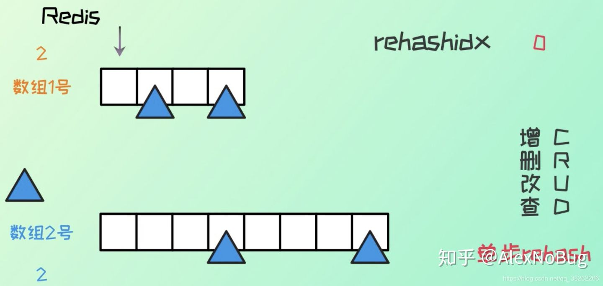

# Redis中的hash扩容、渐进式rehash过程

原文：https://zhuanlan.zhihu.com/p/258340429

​        Redis 字典 （Hash 表）当数据越来越多的时候，就会发生扩容，也就是 rehash。

​        Java 的HashMap，当数据量达到阈值的时候（0.75），就会发生rehash，hash 表长度变为原来的二倍，将原 hash 表数据全部重新计算 hash 地址，重新分配为之。

​        Redis 的 hash 表采用的是**渐进式** hash 的方式：

1. Redis 字典底层有两个数组，还有一个 rehashidx 用来控制 rehash：

   

2. 初始默认 hash 长度为 4，当元素个数与 hash 表长度一致时，就发生扩容，hash 长度变为原来的二倍

   

3. Redis 中的 hash 则是执行的单步 rehash 的过程：

   

   每次的增删改查，rehashid + 1 ，然后执行对应原 hash 表 rehashidx 索引位置的 rehash

### 总结

​        在扩容和收缩的时候，如果哈希字典中有很多元素，一次性将这些键全部 rehash 到 ht[1] 的话，可能会导致服务器在一段时间内停止服务。所以，采用渐进式 rehash 的方式，详细步骤如下：

1. 为 ht[1] 分配空间，让字典同时持有 ht[0] 和 ht[1] 两个哈希表
2. 将 rehashindex 的值设置为 0， 表示 rehash 工作正式开始
3. 在 rehash 期间，每次对字典执行增删改查操作时，程序除了执行指定的操作以外，还会顺带将 ht[0] 哈希表在 rehashindex 索引上的所有键值对 rehash 到 ht[1]，当 rehash 工作完成后，rehashindex 的值 +1
4.  随着字典操作的不断执行，最终会在某一个时间段上，ht[0] 的所有键值对都会被 rehash 到 ht[1]，这时将 rehashindex 的值设置为 -1，表示 rehash 操作结束

渐进式 rehash 采用的是一种分而治之的方式，将 rehash 的操作分摊到每一个的访问中，避免集中式 rehash 带来的庞大计算量。

​        需要注意的是，渐进式 rehash 的过程，如果有增删改查操作时，如果 index 大于 rehashindex，访问 ht[0]， 否则访问 ht[1]。