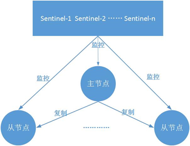
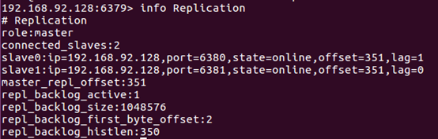
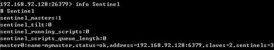
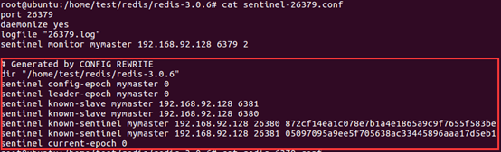
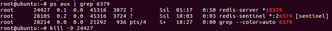
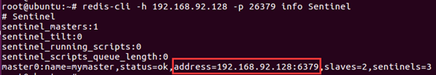
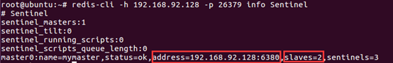
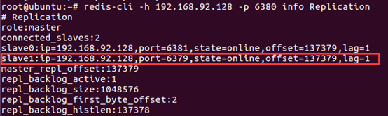
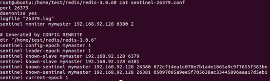

# Redis哨兵

https://www.cnblogs.com/kismetv/p/9609938.html

​        Redis的哨兵，给予Redis主从复制，主要作用便是解决主节点故障恢复的自动化问题，进一步提高系统的高可用性。

​        本文首先介绍哨兵的作用和架构，然后讲述哨兵系统的部署方法，以及通过客户端访问哨兵系统的方法，然后再简要说明哨兵实现的基本原理，最后给出关于哨兵实践的一些建议。本文内容基于Redis3.0版本。


## 作用和架构

### 作用

​        在介绍哨兵前，首先从宏观角度回顾一下Redis实现高可用相关的技术。它们包括：持久化、复制、哨兵和集群，其主要作用和解决的问题是：

* **持久化**：持久化是最简单的高可用方案（有时甚至不被归为高可用的手段），主要作用是数据备份，即将数据存储在硬盘上，保证数据不会因进程退出而丢失
* **复制**：复制是高可用Redis的基础，哨兵和集群都是在复制基础上实现高可用的。复制主要实现了数据的多机备份，以及对于读操作的负载均衡和简单的故障恢复。缺陷：故障恢复无法自动化；写操作无法负载均衡；存储能力受到单机限制
* **哨兵**：在复制的基础上，哨兵实现了自动化的故障恢复。缺陷：写操作无法负载均衡；存储能力受到单机限制
* **集群**：通过集群，Redis解决了写操作无法负载均衡，以及存储能力受到单机限制的问题，实现了较为完善的高可用方案


​        下面说说哨兵的作用。Redis的哨兵从2.8版本开始引入。**哨兵的核心功能是主节点自动故障转移**。下面是Redis官方文档对于哨兵功能的描述：

* **监控(Monitoring)**：哨兵会不断地检查主节点和从节点是否运作正常
* **自动故障转移(Authomatic Failover)**：当主节点不能正常工作时，哨兵会开始自动故障转移操作，它会将失效主节点的其中一个从节点升级为新的主节点，并让其他从节点改为复制新的主节点
* **配置提供者(Configuration Provider)**：客户端在初始化时，通过连接哨兵来获得当前Redis服务的主节点地址
* **通知(Notification)**：哨兵可以将故障转移的结果发送给客户端

其中，监控和自动故障转移功能，使得哨兵可以及时发现主节点故障并完成转移；而配置提供者和通知功能，则需要在与客户端的交互中才能体现。

​        这里对“客户端”一词在文中的用法做个说明：前面的文章中，只要通过API访问Redis服务器，都会称为客户端，包括redis-cli、Java客户端Jedis等。为了便于区分说明，文本中的客户端并不包括redis-cli，而是比redis-cli更加复杂：redis-cli使用的是redis提供的底层接口，而**客户端则对这些接口、功能进行了封装，以便充分利用哨兵的配置提供者和通知功能**。


### 架构

​        典型的哨兵架构图如下所示：



​        它由两部分组成：

* **哨兵节点**：哨兵系统有一个或多个哨兵节点组成，**哨兵节点是特殊的Redis节点，不存储数据**
* **数据节点**：主节点和从节点都是数据节点


## 部署

​        进入部署的实操阶段。部署一个简单的哨兵系统，包含一个主节点、2个从节点和**3个哨兵节点**。方便起见，所有这些节点都部署在一台机器上（局域网IP: 192.168.92.128），使用端口号来区分不同的节点。


### 部署主从节点

​        哨兵系统中的主从节点，与普通的主从节点配置是一样的，并不需要做任何额外配置。下面分别是主节点（port=6379）和2个从节点（port=6380/6381）的配置文件：

```properties
#redis-6379.conf
port 6379
daemonize yes
logfile "6379.log"
dbfilename "dump-6379.rdb"
 
#redis-6380.conf
port 6380
daemonize yes
logfile "6380.log"
dbfilename "dump-6380.rdb"
slaveof 192.168.92.128 6379
 
#redis-6381.conf
port 6381
daemonize yes
logfile "6381.log"
dbfilename "dump-6381.rdb"
slaveof 192.168.92.128 6379
```

配置完成后，**依此**启动主节点和从节点：

```shell
redis-server redis-6379.conf
redis-server redis-6380.conf
redis-server redis-6381.conf
```

节点启动后，连接主节点查看主从状态是否正常，如下所示：




### 部署哨兵节点

​        哨兵节点本质上就是一个Redis节点，只是稍微特殊点儿。

​        3个哨兵节点的配置几乎是完全一样的，主要是端口号的区别（分别是 26379/26380/26381）。下面以26379节点为例，介绍节点的配置和启动方式。当前配置简单些，后面再介绍更多的配置信息。

```properties
#sentinel-26379.conf
port 26379
daemonize yes
logfile "26379.log"
sentinel monitor mymaster 192.168.92.128 6379 2
```

其中，“ *sentinel monitor mymaster 192.168.92.128 6379 2* ” 配置的含义是：该哨兵节点监控 *192.168.92.128:6379* 这个主节点；该主节点的名称是 “mymaster”；<font color='red'>最后的 “2” 含义与主节点的故障判定有关：至少需要2个哨兵节点同意，才能判定主节点故障并进行故障转移</font>。

​        哨兵节点的启动有两种方式，而这作用是完全相同的：

```sh
redis-sentinel sentinel-26379.conf
```

或者：

```shell
redis-server sentinel-26379.conf --sentinel
```

​        按照上述方式配置和启动后，整个哨兵系统就启动完毕了。可以通过 redis-cli 连接哨兵节点进行验证。如下图所示：可以看出26379哨兵节点已经在监控mymaster主节点，并发现了其2个从节点和另外2个哨兵节点：



​        如果这个时候修改哨兵节点的配置文件，会发现一些变化。以26379节点为例：



其中，dir只是显示声明了数据和日志所在的目录（在哨兵语境下只有日志）；known-slave和known-sentinel显示哨兵已经发现了从节点和其他哨兵；带有epoch的参数与配置纪元有关（配置纪元是一个从0开始的计数器，每进行一次领导者哨兵选举，都会增1（+1）；领导者哨兵选举是故障转移阶段的一个操作，后面介绍）。


### 演示故障转移

​        哨兵4个作用中，配置提供者和通知需要客户端的配合，后面再详述。现在主要演示当主节点发生故障时，哨兵的监控和自动故障转移功能。

1. 首先，使用kill命令杀掉主节点：

   

2. 如果此时立即在哨兵节点中使用 info sentinel 命令查看，会发现主节点还没有切换过来，因为哨兵发现主节点故障并转移是需要一段时间的：

   

3. 一段时间后，再次在哨兵节点中执行 info sentinel 命令，发现主节点已经切换成6380节点

   

   但是，同时发现，哨兵节点认为新的主节点仍然有2个从节点，这是因为哨兵在将6380切换为主节点的同时，将6379节点置为从节点。虽然6379从节点已经挂掉，但是由于哨兵并不会对从节点进行客观下线（其含义将在原理部分介绍），因此认为该从节点一直存在。当6379节点重启后，会自动变成6380节点的从节点。下面验证。

4. 重启6379，可以看到6379节点成为了6380的从节点

   

5. 在故障转移阶段，哨兵和主从节点的配置文件都会被改写。        

​        对于主从节点，主要是slaveof配置的变化：新的主节点没有了slaveof配置，其从节点则slaveof新的主节点；对于哨兵节点，除了从节点信息的变化，纪元（epoch）也会变化，下图可以看到纪元相关参数都加1了：




### 总结

​        哨兵系统的搭建过程，有几点需要注意：

1. 哨兵系统中的主从节点，与普通的主从节点并没有什么区别，故障发现和转移是由哨兵来控制和完成的。

2. 哨兵节点本质上是redis节点。

3. **每个哨兵节点，只需要配置监控主节点**，便可以自动发现其他的哨兵节点和从节点。

4. 在哨兵节点启动和故障转移阶段，各个节点的配置文件会被重写(config rewrite)。

5. 本章的例子中，一个哨兵只监控了一个主节点；**实际上，一个哨兵可以监控多个主节点，通过配置多条sentinel monitor即可实现**。