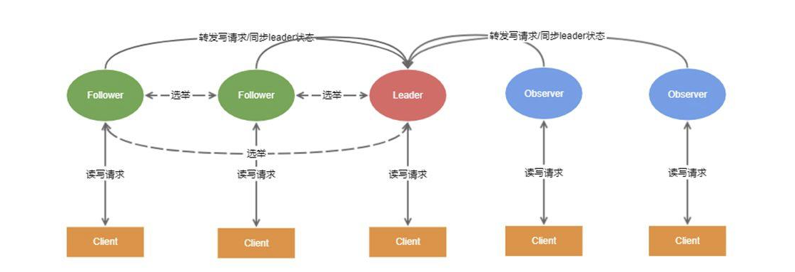
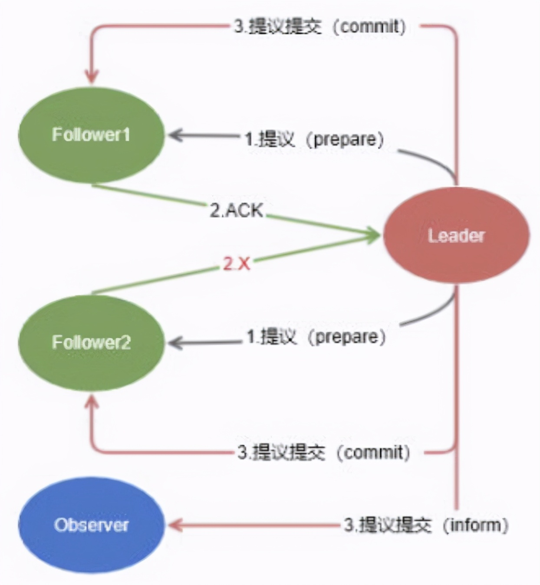
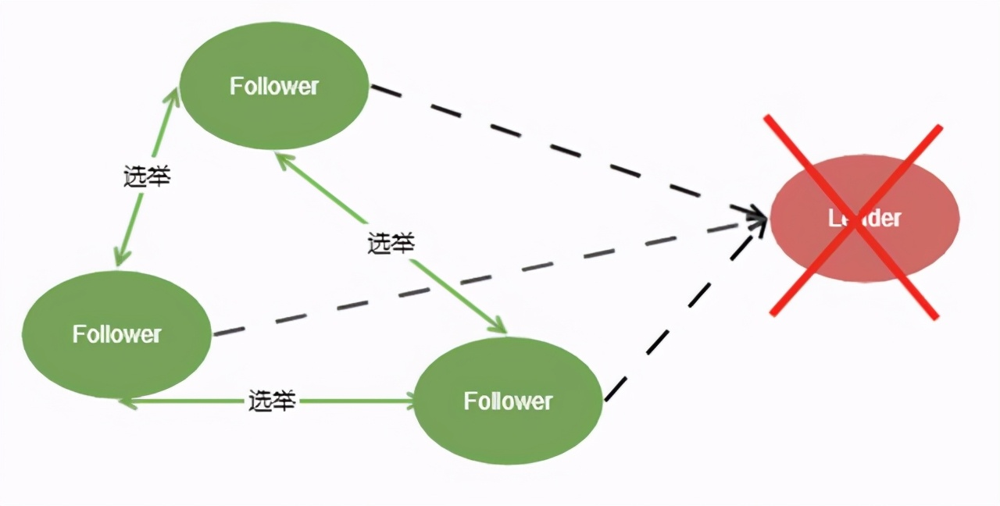
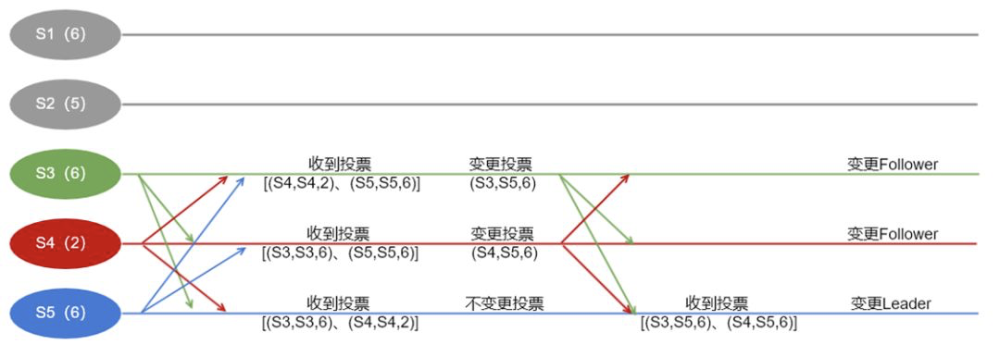

# Zookeeper原子广播协议的原理

原文：https://www.toutiao.com/i6961677630336811531/

​        通常都会使用ZooKeeper集群，ZooKeeper集群为了保证数据一致性，采用了原子广播协议来解决主机间数据同步的问题。

## ZK集群角色

​        在ZooKeeper集群中，所有事务请求必须由一个全局唯一的服务器来协调处理，这样的服务器被称为**领导者（Leader）**，剩下的服务器是**学习者（Learner）**。

​        Learner服务器包括**跟随者（Follower）**和**观察者（Observer）**，其中Follower用于接收客户端请求并向客户端返回结果，在选举过程中参与投票。

​        在3.3.0版本之后，ZK引入了Observer角色。Observer可以接收客户端连接，将写请求转发给Leader，但Observer不参与投票，只同步Leader的状态。**引入Observer的目的是为了扩展系统，提高读取速度**。

​        ZooKeeper集群采用**写任意(Write Any)**的方式，即客户端对数据的读取和修改可提交给集群中任意的节点，Follower和Observer自主处理读请求，将写请求转发给Leader。因此ZK集群的读吞吐能力和响应能力扩展性是非常好的，随着机器增加，写吞吐能力肯定会受影响。

## ZK协议的原子广播

​        原子广播协议的事务处理过程大致分为3个步骤：

- Leader 服务器负责将一个客户端事务请求转换成一个**事务提议（proposal）**，生成**全局唯一单调递增**的**事务ID（zxid）**，并通过**Prepare消息**将该 proposal分发给集群中所有的Follower服务器。
- Follower收到提议后，写入本地事务日志，**根据自身情况**，是否同意该事务的提交。
- 一旦超过半数的Follower服务器进行了确定的反馈后，那么 Leader 就会再次向所有Follower服务器分发**Commit消息**，将提议进行提交，并向Observer服务器发送**Inform消息**，通知同步信息。

​        如果一个服务器刚加入集群，发现已经存在一个 Leader 服务器在进行消息广播 ， 那么新加入的服务器就会自觉并与Leader进行数据同步，然后一起参与到消息广播中。

​        Zab协议的事务处理方式和**两阶段提交协议**（2PC）很像，两者又有何区别呢？ZAB协议与2PC区别在于：2PC协议的第二阶段中，需要等到**所有**参与者的"YES"回复才会提交事务，只要有一个参与者说"NO"或者超时无反馈，都需要中断和回滚事务。

​        在整个集群中，**写请求**都集中在一个Leader节点上，如果Leader节点挂了怎么办？这就涉及到到Zab协议的崩溃恢复机制。

## ZK协议的崩溃恢复

​        Zab协议的崩溃恢复机制，不仅可以用于Follewer们无法联系上Leader了，在ZK集群初始化阶段也适用，此时每个Follower都开始进入选举模式。**选举过程**如下：

1. Follower节点**第一次投票先选自己**，然后将自己的选票广播给剩余的Follower节点。
2. Follower节点接收到其他的选票。
3. 比较自己的zxid与接收到的选票的zxid，谁的zxid更大，表示数据更新，谁就有优先被选为Leader的资格(最后生成zxid的Follower节点更具优势)。如果数据相同的情况下，那么就比较服务器id（myid）。
4. 如果自己的选票不是最优选票，变更自己的选票，投最优选票的节点。
5. 统计自己收到的选票，如果某个节点获得了过半的节点的投票。确认该节点为新的Leader节点。
6. 确认Leader节点后，每个节点变更自己的角色，完成投票选举。

​        为了便于理解选举的过程，下面再举一个例子来说明：集群中有5个主机，S1和S2挂掉，其中S2假如之前是Leader。S3、S4和S5要重新选举新的Leader，最大的zxid分别为6、2、6。选票的格式为（投票的节点ID，被投节点ID，被投节点最大事务ID）。

​        **Leader的选举过程**如下：

1. 初始状态下，S3,S4,S5分别投自己一票
2. S3, S4, S5分别对自己收到的2票与自己的zxid和myid进行比较。
3. S5的zxid最大为6，另外myid也比S3要大。所以S5发现自己是最优候选人，不变更投票，S3和S4更改自己的选票。
4. S3和S4广播自己变更的投票。
5. 最后所有节点都确认了S5是Leader，S5更新状态为Leader，S3和S4变更为Follower。

​        这样就完成了ZK集群的选举。

### 为啥选事务编号最大的当Leader

​        Zab协议需要在以下两种崩溃恢复场景下保持数据一致：

1. 假设一个事务在 Leader 服务器上被提交了，并且已经得到过半Follower 服务器的确认反馈，但是在它将 Commit 消息发送给所有Follower 机器之前， Leader 服务器挂了。针对这种情况， 协议就需要确保该事务最终能够在所有的服务器上都被提交成功，否则将出现不一致。
2. 假设初始的 Leader 服务器 在提出了一个事务之后就崩溃退出了，导致集群中的其他服务器都没有收到这个事务，当该服务器恢复过来再次加入到集群中的时候 ，协议需要确保丢弃这个被跳过的事务。不然无法保证zxid的自增和唯一性。

​        总结起来就是，确保提交已经由Leader提交的事务 Proposal，同时丢弃已经被跳过的事务 Proposal。

​        协议选择所有机器中zxid编号最大的作为Leader，就可以保证这个新选举出来的 Leader —定具有所有已经提交的提案，也就省去了新Leader检查 Proposal 提交和丢弃跳过事务这些操作。

### 当Follower遇上了新Leader

​        回到之前的例子中，假如之前挂机的S1马上恢复了，并以Follower角色连接上了新的领导S5。此时S5会根据自己服务器上最后被提交的Proposal和S1的Proposal进行对比，发现S1上面有前任领导S2尚未提交过的一笔事务，这笔事务自己都不知道，那么此时新领导会怎么处理？

​        此时Leader要确保未提交的Proposal回退，即S5会要求S1进行回退操作，回退到一个已经被集群中过半机器提交过的最新的事务。

​        这点很重要。

## 总结

​        最后我们对Zab协议原理做一个总结：

- 使用单一的主进程（Leader）来接收并处理客户端的所有事务请求，并采用 Zab 的原子广播协议，将服务器数据的状态变更以事务提议Proposal的形式广播到所有的副本进程上去。
- Zab协议要保证同一个Leader的发起的事务要按顺序被执行，同时还要保证只有先前的Leader提交的所有事务都被执行之后，新选的leader才能再发起事务。
- 当前主进程（Leader）出现异常情况的时候，整个集群依旧能够正常工作。