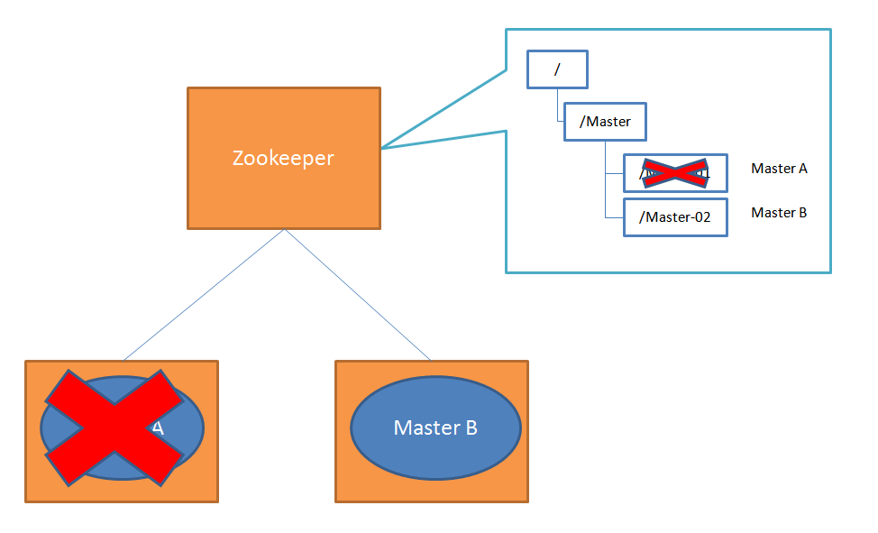

# ZooKeeper介绍

原文：https://www.toutiao.com/i6960978393353552415/?group_id=6960978393353552415

​        Zookeeper （简称ZK）是一个分布式协调服务，可用于服务发现，分布式锁，分布式领导选举，配置管理等。ZK 提供了一个类似于文件系统的树形数据结构，可以存放少量信息，同时提供了对于节点的监控与通知机制。

## ZK的协调方式

​        为了防止分布式系统中的单点故障问题，通常集群中除了服务主节点外，还有一个备用节点，形成一主一备。备用节点定期给当前主节点发送PING包，主节点收到后向备用节点回复ACK，备用节点收到回复的时候就认为当前主节点还活着。

​        如果主节点在回复时突然断网，但是并没有挂，这样备用节点收不到回复，就认为主节点挂了，然后启动了服务实例。这样集群中就有了两个服务实例，出现双master，出现了脑裂的症状。为了防止这种情况引起服务混乱，引入了Zookeeper之后，可以保证在集群中只有一个master在工作。

​        假如集群中同时启动两个服务器Master A和Master B，都在ZooKeeper进行了注册。Master A注册的节点是“Master-01”，Master B注册的节点是Master-02。注册之后进行选举，编号最小的节点将在选举中获胜，Master A获得锁成为主节点，Master B成为备用节点。

如果Master A挂掉，那么Zookeeper会删掉Master-01，并选择Master B成为主节点。

​        假如过了一段时间，Master A又恢复了，那么会在Zookeeper注册一个新的节点“Master-03”，此时Master B的编号更小，仍然为主节点，Master A则成为备用节点。这样Zookeeper就保证了只有一个Master是活跃的。

​        但ZooKeeper服务器要是挂了怎么办呢？这也有发生单点故障的风险的，因此一般也是使用ZooKeeper集群。

## ZK的集群

​        采用集群的好处很多：

- 容错：一个节点出错，不致于让整个系统停止工作，别的节点可以接管它的工作；
- 提高系统的扩展能力：把负载分布到多个节点上，或者增加节点来提高系统的负载能力；
- 提高性能：让客户端本地访问就近的节点，提高用户访问速度。

​        **Zookeeper相当于一个带有通知机制的文件系统**。单点维护一个文件系统没有什么难度，可是如果是一个集群维护一个文件系统，保持数据的一致性就非常困难。

​        对于分布式系统来说，CAP三个条件无法同时满足，ZooKeeper是基于CP原则的系统。Zookeeper作为一个集群需要对外提供一致的数据服务。

​        客户端可能会从ZK集群中的多台主机上来获取数据，要求无论从哪一台主机上获取的数据应当是一致的。这就需要在所有主机间做数据复制，保持数据同步。

​        Zookeeper的核心是**原子广播**，这个机制保证各个主机之间的数据同步，实现这个机制的协议叫做**Zab协议**。

​        **Zab协议**有两个模式，它们分别是**恢复模式**和**广播模式**。当服务启动后，Zab协议就进入了恢复模式，选举出ZK集群的领导者（Leader），等过半数的主机完成和Leader的状态同步以后，恢复模式就结束了，Zab协议就开始进广播模式。如果领导者挂了，Zab协议又会进入恢复模式，选举新的领导者。

​        一句话总结Zab协议就是：**原子广播保同步，恢复模式选领导**。关于Zab协议的详细介绍，参考[这里](./Broadcast_Protocol.md)。