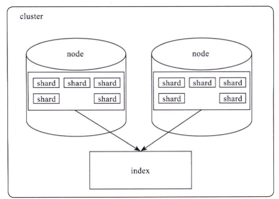
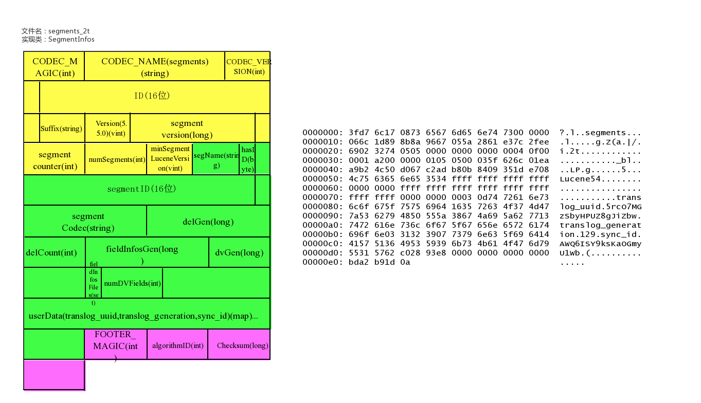
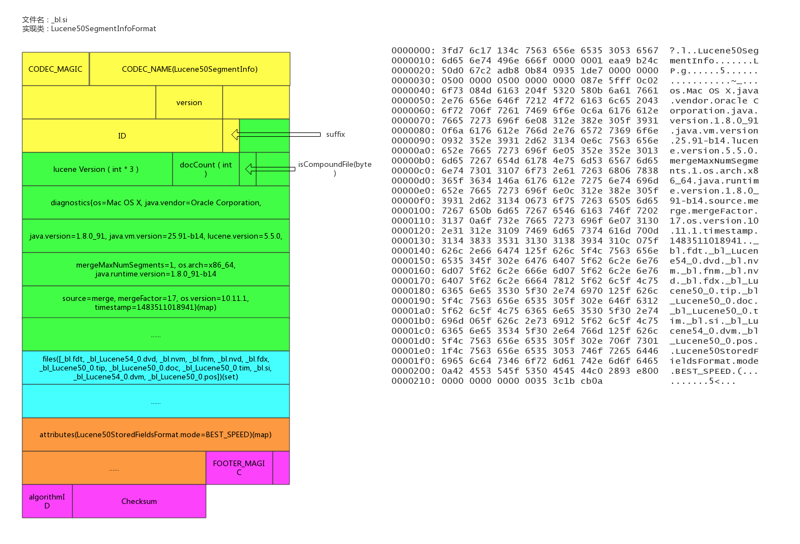
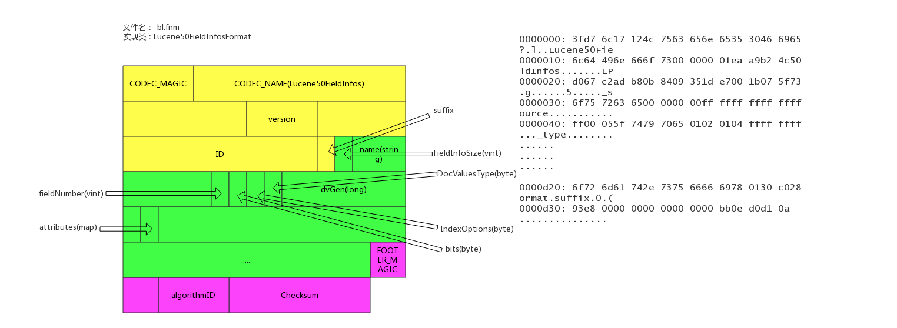
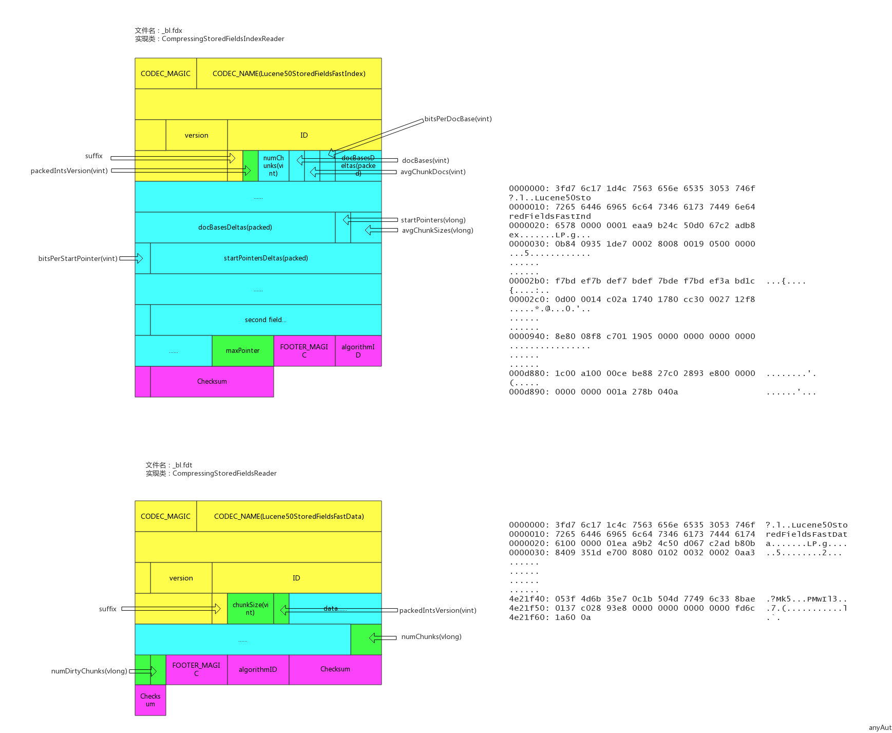
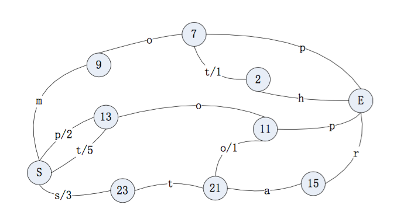
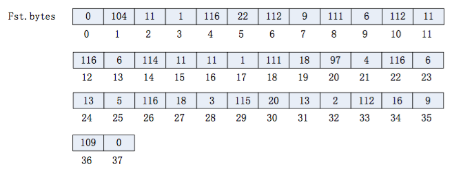
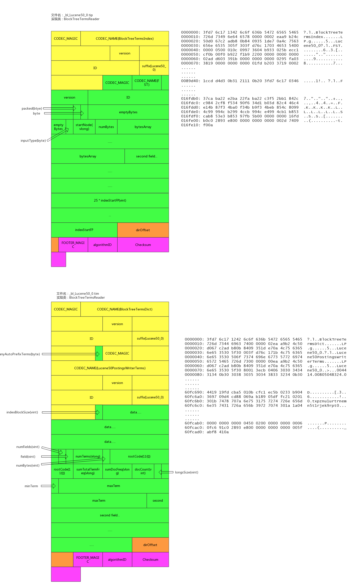
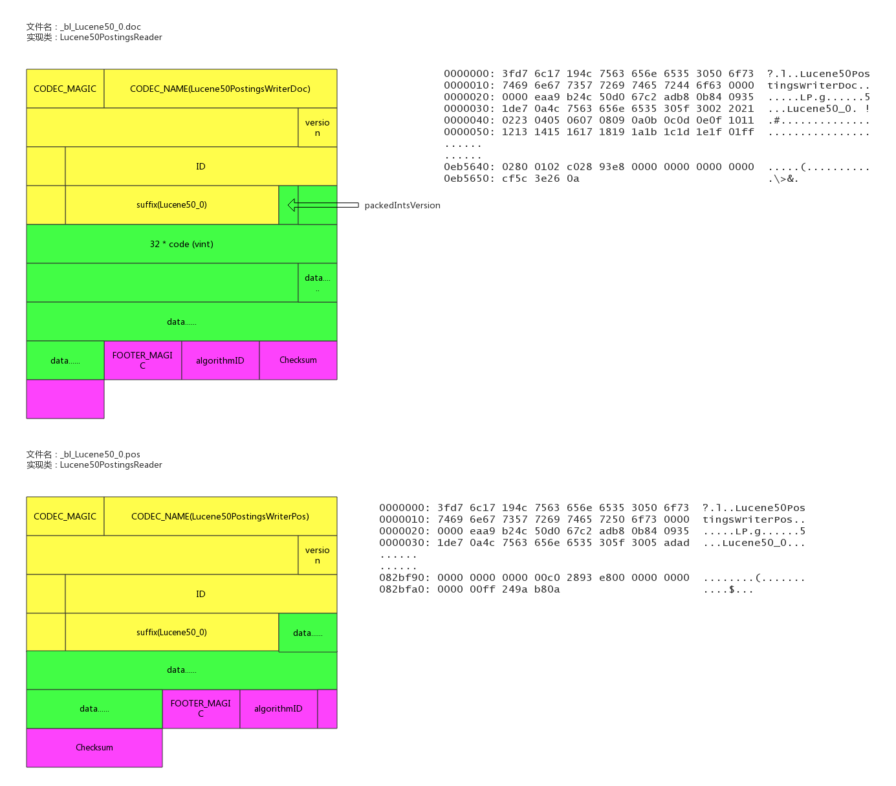
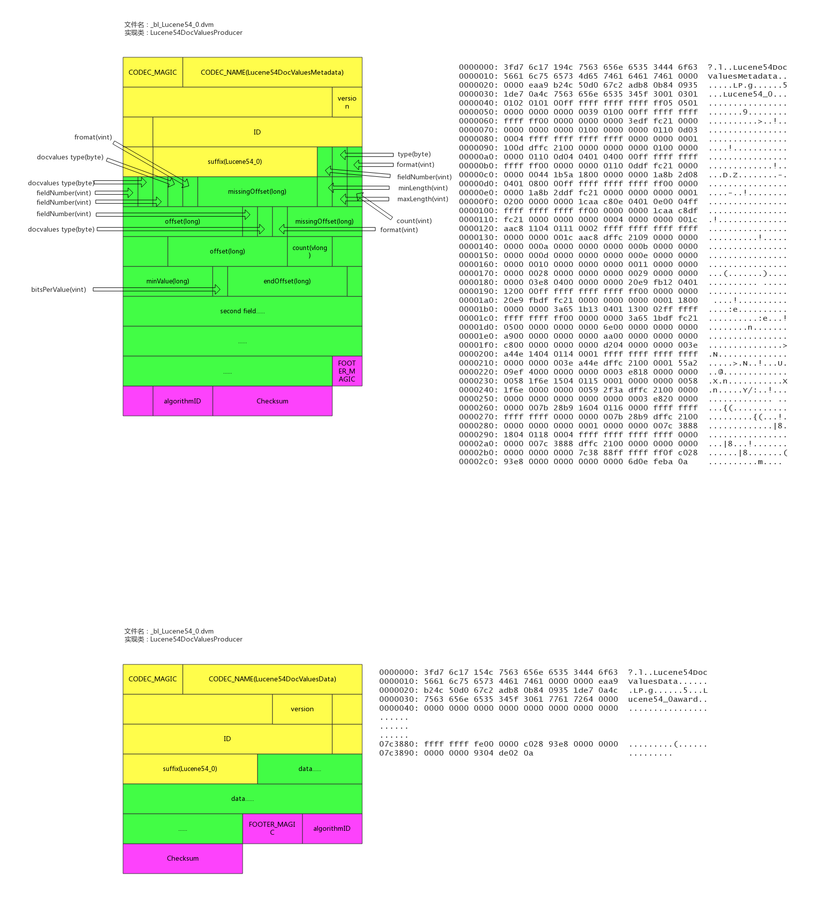

# Elasticsearch中数据是如何存储的

原文：https://blog.csdn.net/weixin_34236869/article/details/92512925


## 前言

使用 ES 时会有这样的疑问：xxTB 的数据存入到 ES 会使用多少存储空间？这个问题其实很难直接回答，只有数据写入 ES 后，才能观察到实际的存储空间。比如同样是 1TB 的数据，写入 ES 的存储空间可能会差距非常大，可能小到只有300-400GB，也可能多到 6-7TB。为什么会造成这么大的差距呢？究其原因，来探究一下ES 中的数据时如何存储的。

此文以 ES 2.3 版本为例，对应的 Lucene 是 5.5，ES 现在已经到了7.x 版本了，数字类型、列存储等存储结构有了变化，但基本概念变化不多，本文依然有参考价值。


## ElasticSearch 索引结构

ES 对外提供的是 index 概念，可以类比 DB，用户查询是在 index 上完成的。每个 index 由若干个 shard 组成，以此来达到分布式可扩展的能力。下图是一个由 10 个shared 组成的index：



Shard 是 ES 数据存储的最小单位，index 的存储容量为所有 shard 的存储容量之和。ES 集群的存储容量则为所有 index 存储容量之和。

一个 shard 就对应一个 Lucene 的 libray。对于一个 shard，ES增加了 translog 的功能，类似于 HBase WAL（write ahead log），是数据写入过程中的中间数据，其余的数据都在lucene 库中管理。

所以 ES 索引使用的存储内容主要取决于 Lucene 中的数据存储。


## Lucene 数据存储

下面来看看 Lucene 的文件内容。在了解 Lucene 文件内容前，先来了解 Lucene 的概念。

### Lucene基本概念

* **segment**：Lucene 内部的数据由一个个 segment 组成。写入 Lucene 的数据并不直接落盘，而是先写入内存中，经过了 refresh 间隔，Lucene 才会将该时间段写入的全部数据 refresh 成一个 segment。segment 多了之后会进行 merge ，整合成更大的 segment。Lucene 查询时会遍历每个 segment 完成。由于 Lucene 写入的数据是在内存中完成，所以写入效率非常高。但是也存在丢失数据的风险，所以 ES 基于此现象实现了 translog，只有在 segment 数据落盘后，ES 才会删除对应的 translog
* **doc**：表示 Lucene 的一条记录
* **field**：表示记录中的字段概念，一个 doc 由若干个 field 组成
* **term**：term 是 Lucene 中索引的最小单位，某个 field 对应的内容如果是全文检索类型，会将内容进行分词，分词的结果就是由 term 组成。如果是不分词的字段，那么该字段的内容就是一个 term
* **倒排索引**：Lucene 索引的通用叫法，即实现了 term 到 doc list 的映射
* **正排数据**：搜索引擎的通用叫法，即原始数据，可以理解为一个 doc list
* **docvalues**：ES 中的烈士存储的名称，ES 除了存储原始存储、倒排索引，还存储了一份 docvodes，用来分析和排序


### Lucene 文件内容

Lucene 包的文件是由很多segment文件组成的，segments_xxx文件记录了 Lucene 包下面的segment 文件数量。每个 segment 会包含如下的文件：

| Name                | Extension        | Brief Description                                            |
| ------------------- | ---------------- | ------------------------------------------------------------ |
| Segment Info        | .si              | segment的元数据文件                                          |
| Compound File       | .cfs, .cfe       | 一个segment包含了如下表的各个文件，为减少打开文件的数量，在segment小的时候，segment的所有文件内容都保存在cfs文件中，cfe文件保存了lucene各文件在cfs文件的位置信息 |
| Fields              | .fnm             | 保存了fields的相关信息                                       |
| Field Index         | .fdx             | 正排存储文件的元数据信息                                     |
| Field Data          | .fdt             | 存储了正排存储数据，写入的原文存储在这                       |
| Term Dictionary     | .tim             | 倒排索引的元数据信息                                         |
| Term Index          | .tip             | 倒排索引文件，存储了所有的倒排索引数据                       |
| Frequencies         | .doc             | 保存了每个term的doc id列表和term在doc中的词频                |
| Positions           | .pos             | Stores position information about where a term occurs in the index 全文索引的字段，会有该文件，保存了term在doc中的位置 |
| Payloads            | .pay             | Stores additional per-position metadata information such as character offsets and user payloads 全文索引的字段，使用了一些像payloads的高级特性会有该文件，保存了term在doc中的一些高级特性 |
| Norms               | .nvd, .nvm       | 文件保存索引字段加权数据                                     |
| Per-Document Values | .dvd, .dvm       | lucene的docvalues文件，即数据的列式存储，用作聚合和排序      |
| Term Vector Data    | .tvx, .tvd, .tvf | Stores offset into the document data file 保存索引字段的矢量信息，用在对term进行高亮，计算文本相关性中使用 |
| Live Documents      | .liv             | 记录了segment中删除的doc                                     |


## Lucene 各文件具体内容和实现

### Lucene 数据元信息文件

#### Segment_xxx

该文件为 Lucene 数据文件的元信息文件，记录所有 segment 的元数据信息。

该文件主要记录了目前有多少 Segment，每个 Segment 有一些基本信息，更新这些信息定位到每个 Segment 的元信息文件。

Lucene 元信息文件还支持记录 userData，Elasticsearch可以在此记录 translog 的一些相关信息。

##### 文件示例



##### 具体实现类

```java
public final class SegmentInfos implements Cloneable, Iterable<SegmentCommitInfo> {
  // generation是segment的版本的概念，从文件名中提取出来，实例中为：2t/101
  private long generation;     // generation of the "segments_N" for the next commit

  private long lastGeneration; // generation of the "segments_N" file 
                               // we last successfully read
                               // or wrote; this is normally 
                               // the same as generation except if
                               // there was an IOException 
                               // that had interrupted a commit

  /** Id for this commit; only written starting with Lucene 5.0 */
  private byte[] id;
    
  /** Which Lucene version wrote this commit, or null if this commit is pre-5.3. */
  private Version luceneVersion;

  /** Counts how often the index has been changed.  */
  private long version;

  /** Used to name new segments. */
  // TODO: should this be a long ...?
  private int counter;

  /** Version of the oldest segment in the index, or null if there are no segments. */
  private Version minSegmentLuceneVersion;

  private List<SegmentCommitInfo> segments = new ArrayList<>();

  /** Opaque Map&lt;String, String&gt; 
   *  that user can specify during IndexWriter.commit 
   */
  public Map<String,String> userData = Collections.emptyMap();

/** Embeds a [read-only] SegmentInfo and adds per-commit fields.
 *  @lucene.experimental 
 */
public class SegmentCommitInfo {

  /** The {@link SegmentInfo} that we wrap. */
  public final SegmentInfo info;

  // How many deleted docs in the segment:
  private int delCount;

  // Generation number of the live docs file (-1 if there
  // are no deletes yet):
  private long delGen;

  // Normally 1+delGen, unless an exception was hit on last
  // attempt to write:
  private long nextWriteDelGen;

  // Generation number of the FieldInfos (-1 if there are no updates)
  private long fieldInfosGen;

  // Normally 1+fieldInfosGen, unless an exception was hit on last attempt to
  // write
  private long nextWriteFieldInfosGen; //fieldInfosGen == -1 ? 1 : fieldInfosGen + 1;

  // Generation number of the DocValues (-1 if there are no updates)
  private long docValuesGen;

  // Normally 1+dvGen, unless an exception was hit on last attempt to
  // write
  private long nextWriteDocValuesGen; //docValuesGen == -1 ? 1 : docValuesGen + 1;

  // TODO should we add .files() to FieldInfosFormat, like we have on
  // LiveDocsFormat ?
  // track the fieldInfos update files
  private final Set<String> fieldInfosFiles = new HashSet<>();

  // Track the per-field DocValues update files
  private final Map<Integer,Set<String>> dvUpdatesFiles = new HashMap<>();

  // Track the per-generation updates files
  @Deprecated
  private final Map<Long,Set<String>> genUpdatesFiles = new HashMap<>();

  private volatile long sizeInBytes = -1;
```

#### Segment的元信息文件

文件后缀： .si

每一个 segment 都有一个 .si 文件，记录了该 segment 的元信息。

Segment 元信息文件中记录了 segment 的文件数量，segment 对应的文件列表等信息。

文件示例：



##### 具体实现类

```java
/**
 * Information about a segment such as its name, directory, and files related
 * to the segment.
 *
 * @lucene.experimental
 */
public final class SegmentInfo {

  // _bl
  public final String name;

  /** Where this segment resides. */
  public final Directory dir;

  /** Id that uniquely identifies this segment. */
  private final byte[] id;
    
  private Codec codec;

  // Tracks the Lucene version this segment was created with, since 3.1. Null
  // indicates an older than 3.0 index, and it's used to detect a too old index.
  // The format expected is "x.y" - "2.x" for pre-3.0 indexes (or null), and
  // specific versions afterwards ("3.0.0", "3.1.0" etc.).
  // see o.a.l.util.Version.
  private Version version;

  private int maxDoc;         // number of docs in seg
  private boolean isCompoundFile;
  private Map<String,String> diagnostics;
  private Set<String> setFiles;
  private final Map<String,String> attributes;
```

#### fields 信息文件

文件后缀：.fnm

该文件存储了 fields 的基本信息

fields 信息中包括 field 的数量、field的类型，以及 IndexOpetions，包括是否存储、是否索引、是否分词、是否需要列存储等等。

##### 文件示例



##### 具体实现

```java
/**
 *  Access to the Field Info file that describes document fields and whether or
 *  not they are indexed. Each segment has a separate Field Info file. Objects
 *  of this class are thread-safe for multiple readers, but only one thread can
 *  be adding documents at a time, with no other reader or writer threads
 *  accessing this object.
 */
public final class FieldInfo {
  /** Field's name */
  public final String name;

  /** Internal field number */
  // field 在内部的编号
  public final int number;

  // field docvalues 的类型
  private DocValuesType docValuesType = DocValuesType.NONE;

  // True if any document indexed term vectors
  private boolean storeTermVector;

  private boolean omitNorms; // omit norms associated with indexed fields 

  // index 的配置项
  private IndexOptions indexOptions = IndexOptions.NONE;

  // whether this field stores payloads together with term positions 
  private boolean storePayloads; 

  private final Map<String,String> attributes;

  private long dvGen;  // docvalues的generation
}
```

#### 数据存储文件

文件后缀： .fdx, .fdt

索引文件是 .fdx， 数据文件是 .fdt。数据存储文件功能为根据自动的文档id，得到文档的内容，搜索引擎的术语习惯称之为“正排数据”，即 doc_id -> content， es 的 _source 数据就存在这里。

索引文件记录了快速定位文档数据的索引信息，数据文件记录了所欲文档id 的具体内容。

##### 文件示例



##### 具体实现类

```java
/**
 * Random-access reader for {@link CompressingStoredFieldsIndexWriter}.
 * @lucene.internal
 */
public final class CompressingStoredFieldsIndexReader implements Cloneable, Accountable {

  private static final long BASE_RAM_BYTES_USED = RamUsageEstimator.shallowSizeOfInstance(CompressingStoredFieldsIndexReader.class);

  final int maxDoc;
    
  //docid索引，快速定位某个docid的数组坐标
  final int[] docBases;
    
  //快速定位某个docid所在的文件offset的startPointer
  final long[] startPointers;
    
  // 平均 一个 chunk 的文档数
  final int[] avgChunkDocs;

  // 平均一个 chunk 的size
  final long[] avgChunkSizes;

  final PackedInts.Reader[] docBasesDeltas; // delta from the avg

  final PackedInts.Reader[] startPointersDeltas; // delta from the avg
}

/**
 * {@link StoredFieldsReader} impl for {@link CompressingStoredFieldsFormat}.
 * @lucene.experimental
 */
public final class CompressingStoredFieldsReader extends StoredFieldsReader {

  // 从 fdt 正排索引文件中获得
  private final int version;

  // field 的基本信息
  private final FieldInfos fieldInfos;

  // fdt 正排索引文件 reader
  private final CompressingStoredFieldsIndexReader indexReader;

  //从fdt正排索引文件中获得，用于指向fdx数据文件的末端，指向numChunks地址4
  private final long maxPointer;

  // fdx 正排索引文件句柄
  private final IndexInput fieldsStream;

  // 块大小
  private final int chunkSize;

  private final int packedIntsVersion;

  // 压缩类型
  private final CompressionMode compressionMode;

  // 解压缩处理对象
  private final Decompressor decompressor;

  // 文档数量，从 segment 元数据中获得
  private final int numDocs;

  // 是否正在 merge，默认是 false
  private final boolean merging;

  //初始化时new了一个BlockState，BlockState记录下当前正排文件读取的状态信息
  private final BlockState state;
  // chunk 的数量
  private final long numChunks; // number of compressed blocks written
  // dirty chunk 的数量
  private final long numDirtyChunks; // number of incomplete compressed blocks written
  // 是否 close，默认是 false
  private boolean closed;
}
```

#### 倒排索引文件

文件后缀： .tip， .tim

倒排索引也包含索引文件和数据文件， .tip 为索引文件， .tim 为数据文件，索引文件包含了每个字段的索引元信息，数据文件有具体的索引内容。

5.5.0 版本的倒排索引实现是 FST tree，FST tree 的最大优势就是内存空间占用非常低，具体可以参考这篇文章：http://www.cnblogs.com/bonelee/p/6226185.html

http://examples.mikemccandless.com/fst.py?terms=&cmd=Build+it 为FST图实例，可以根据输入的数据构造出FST图：

```java
String inputValues[] = {"mop","moth","pop","star","stop","top"};

long outputValues[] = {0,1,2,3,4,5};
```

生成的 FST 图为：





##### 文件示例



##### 具体实现

```java
public final class BlockTreeTermsReader extends FieldsProducer {

  // Open input to the main terms dict file (_X.tib)
  final IndexInput termsIn;

  // Reads the terms dict entries, to gather state to
  // produce DocsEnum on demand
  final PostingsReaderBase postingsReader;
  private final TreeMap<String,FieldReader> fields = new TreeMap<>();

  /** File offset where the directory starts in the terms file. */
  //索引数据文件tim的数据的尾部的元数据的地址
  private long dirOffset;

  /** File offset where the directory starts in the index file. */
  // 索引文件 tip 的数据的尾部的元数据的地址
  private long indexDirOffset;
    
  // segment 的名称
  final String segment;
   
  // 版本号
  final int version;

  // 5.3.x index, we record up front if we may have written 
  // any auto-prefix terms，示例中记录的是false
  final boolean anyAutoPrefixTerms;
}

/**
 * BlockTree's implementation of {@link Terms}.
 * @lucene.internal
 */
public final class FieldReader extends Terms implements Accountable {
  
  // term 的数量 
  final long numTerms;
  // field 信息
  final FieldInfo fieldInfo;
  final long sumTotalTermFreq;
  // 总的文档频率
  final long sumDocFreq;
  // 文档数量
  final int docCount;
  // 字段在索引文件 tip 中的起始位置
  final long indexStartFP;
  final long rootBlockFP;
  final BytesRef rootCode;
  final BytesRef minTerm;
  final BytesRef maxTerm;
  //longs：metadata buffer, holding monotonic values
  final int longsSize;
  final BlockTreeTermsReader parent;
  final FST<BytesRef> index;
}
```

#### 倒排链文件

文件后缀： .doc， .pos， .pay

.doc 保存了每个 term 的 doc id  列表 和 term 在 doc 中的词频。

全文索引的字段，会有 .pos 文件， 保存了 term 在 doc 中的位置。

全文索引的字段，使用了一些像 payloads 的高级特性才会有 .pay 文件，保存了 term 在 doc 中的一些高级特性。

##### 文件示例



##### 具体实现

```java
/**
 * Concrete class that reads docId(maybe frq,pos,offset,payloads) list
 * with postings format.
 * @lucene.experimental
 */
public final class Lucene50PostingsReader extends PostingsReaderBase {

  private static final long BASE_RAM_BYTES_USED = RamUsageEstimator.shallowSizeOfInstance(Lucene50PostingsReader.class);
  private final IndexInput docIn;
  private final IndexInput posIn;
  private final IndexInput payIn;
  final ForUtil forUtil;
  private int version;

  // 不分词的字段使用的是该对象，基于skiplist实现了倒排链
  final class BlockDocsEnum extends PostingsEnum {}
  // 全文检索字段使用的是该对象
  final class BlockPostingsEnum extends PostingsEnum {}
  // 包含高级特性的字段使用的是该对象
  final class EverythingEnum extends PostingsEnum {}
}
```

#### 列存文件 (docvalues)

文件后缀： .dvm， .dvd

索引文件为 .dvm，数据文件为 .dvd

Lucene 实现的 docvalues 有如下类型：

1. NONE 不开启 docvalue 时的状态
2. NUMERIC 单个数值类型的 docvalue 主要包括（int，long，float，double）
3. BINARY 二进制类型值对应不同的 codes，最大值可能超过 32766 字节
4. SORTED 有序增量字节存储，仅仅存储不同部分的值和偏移量指针，值必须小于等于 32766 字节
5. SORTED_NUMERIC 存储数值类型的有序数组列表
6. SORTED_SET 可以存储多值域的 docvalue 值，但返回时，仅仅只能返回多值域的第一个 docvalue
7. 对应 not_anaylized 的 string 字段，使用的是 SORTED_SET 类型，number 的类型是 SORTED_NUMERIC 类型

其中 SORTED_SET 的 SORTED_SINGLE_VALUED 类型包括了两类数据：binary + numeric， binary 是按 ord 排序的 term 的列表，numeric 是 doc 到 ord 的映射。

##### 文件示例



##### 具体实现类

```java
/** reader for {@link Lucene54DocValuesFormat} */
final class Lucene54DocValuesProducer extends DocValuesProducer implements Closeable {
  // number 类型的 field 的列存列表
  private final Map<String,NumericEntry> numerics = new HashMap<>();
  // 字符串类型的 field 的列存列表
  private final Map<String,BinaryEntry> binaries = new HashMap<>();
  // 有序字符串类型的 field 的列存列表
  private final Map<String,SortedSetEntry> sortedSets = new HashMap<>();
  //有序number类型的field的列存列表
  private final Map<String,SortedSetEntry> sortedNumerics = new HashMap<>();
  // 字符串类型的 field 的 ords 列表
  private final Map<String,NumericEntry> ords = new HashMap<>();

  //docId -> address -> ord 中field的ords列表
  private final Map<String,NumericEntry> ordIndexes = new HashMap<>();

  // field 的数量
  private final int numFields;
  // 内存使用量
  private final AtomicLong ramBytesUsed;
  // 数据源的文件句柄
  private final IndexInput data;
  // 文档数
  private final int maxDoc;
  // memory-resident structures
  private final Map<String,MonotonicBlockPackedReader> addressInstances 
      = new HashMap<>();
  private final Map<String,ReverseTermsIndex> reverseIndexInstances 
      = new HashMap<>();
  private final Map<String,DirectMonotonicReader.Meta> directAddressesMeta 
      = new HashMap<>();
  // 是否正在 merge
  private final boolean merging;
}

/** metadata entry for a numeric docvalues field */
  static class NumericEntry {
    private NumericEntry() {}

    /** offset to the bitset representing docsWithField, or -1 if no documents have missing values */
    long missingOffset;
      
    /** offset to the actual numeric values */
    // field 在数据文件中的起始地址
    public long offset;
      
    /** end offset to the actual numeric values */
    // field 在数据文件中的结尾地址
    public long endOffset;

    /** bits per value used to pack the numeric values */
    public int bitsPerValue;
      
    // format 类型
    int format;
      
    /** count of values written */
	public long count;
    /** monotonic meta */
    public DirectMonotonicReader.Meta monotonicMeta;

    // 最小的value
    long minValue;
    //Compressed by computing the GCD
    long gcd;
      
    //Compressed by giving IDs to unique values.
    long table[];
      
    /** for sparse compression */
    long numDocsWithValue;
    NumericEntry nonMissingValues;
    NumberType numberType;
  }
  
  /** metadata entry for a binary docvalues field */
  static class BinaryEntry {

    private BinaryEntry() {}

    /** offset to the bitset representing docsWithField, 
     * or -1 if no documents have missing values 
     */
    long missingOffset;
    /** offset to the actual binary values */
    // field 在数据文件中的起始地址
    long offset;
    int format;
    /** count of values written */
    public long count;
    // 最短、最长 字符串的长度      
    int minLength;
    int maxLength;
    /** offset to the addressing data that maps a value to 
      * its slice of the byte[] 
      */
    public long addressesOffset, addressesEndOffset;

    /** meta data for addresses */
    public DirectMonotonicReader.Meta addressesMeta;

    /** offset to the reverse index */
    public long reverseIndexOffset;

    /** packed ints version used to encode addressing information */
    public int packedIntsVersion;

    /** packed ints blocksize */
    public int blockSize;
  }
```

