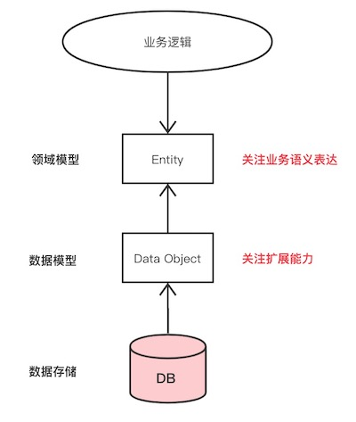
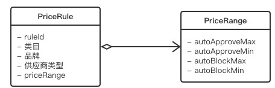
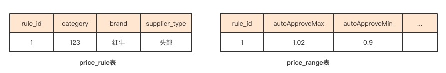
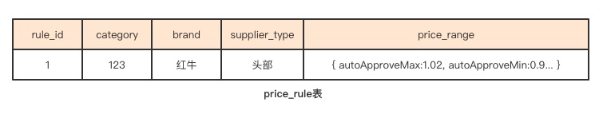
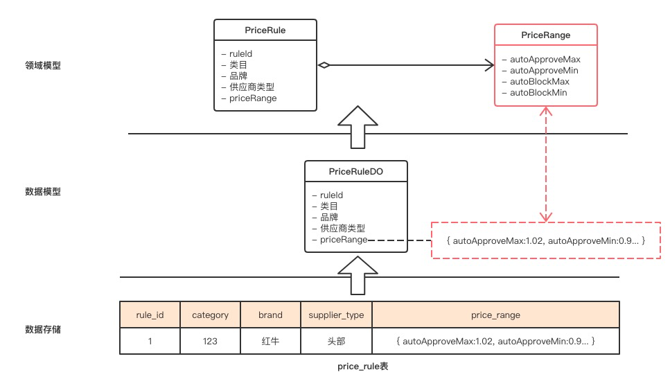
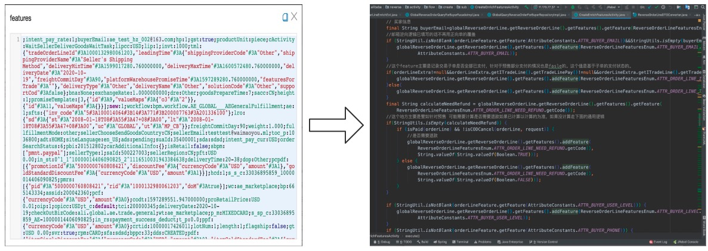
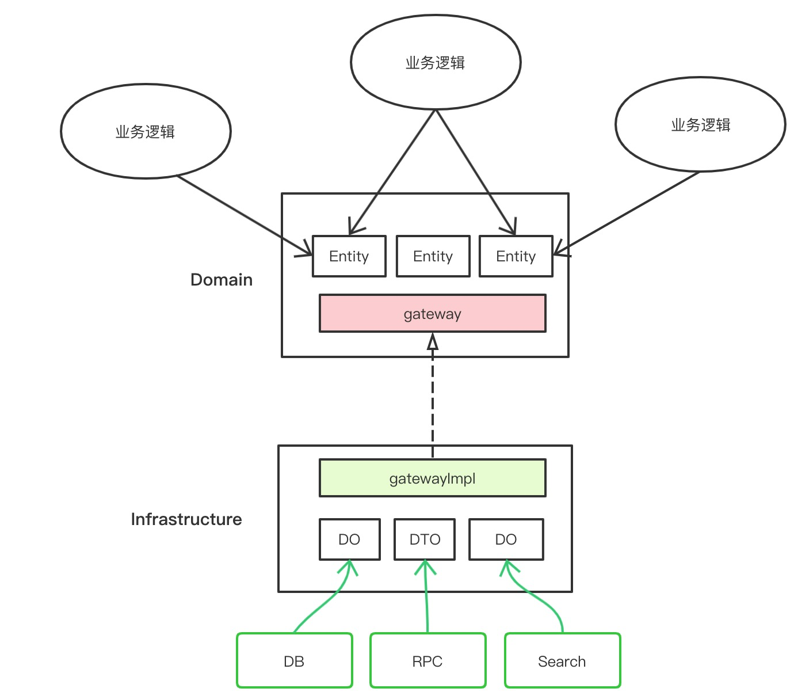
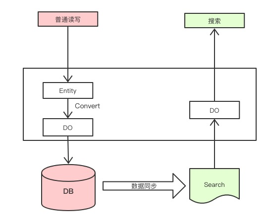
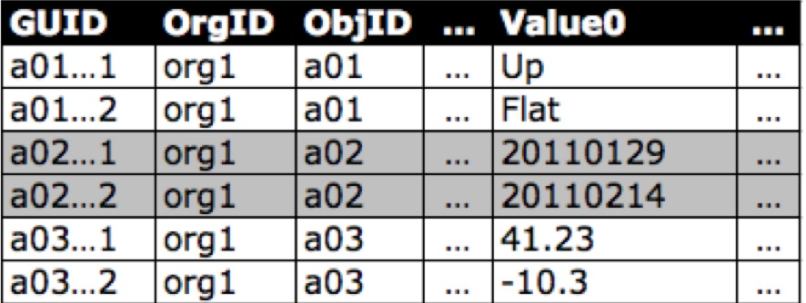

# 认清领域模型与数据模型

https://www.toutiao.com/i6917190658507768333/

现在做软件开发，常常听完需求，有了大致的设计思路后，就开始设计数据库的表结构了。然后再根据设计好的数据库表，通过一些ORM工具，直接生成对应的Java Class。这个过程应该是绝大多数的开发人员的定式了。

在上个10年（2010年以前），大家的做法通常是反过来：用UML工具，先设计一些对象（Class Diagram），然后再去设计数据库的ER图。从Class Diagram到DataBase的ER图，这个过程中会发现，Class Diagram里的对象不能与Database的ER的对象做到一一映射，而是需要做一些对象的转换。

其实，这里就涉及到了2个重要的概念：**领域模型**与**数据模型**。

在Java平台上，因为Spring框架大行其道，导致2010年后，开发思维的变化，人们已经分不清什么是领域模型，什么是数据模型了。现在就来探讨一下这两个模型的区别。希望能够让大家重新回到真正的软件设计上来。

阅读本文的前提：读过领域驱动设计，并了解一些概念。

## 定义

### 领域模型

领域模型，关注的是领域知识，是业务领域的核心实体，体现了问题域里的关键概念，以及概念之间的联系。领域模型建模的关键，是**模型是否能显性化、清晰的表达业务语义** ，扩展性是其次。可以**通过OO的特性增强代码的业务表征能力**。

### 数据模型

数据模型，关注的是数据存储，所有业务都离不开数据，都离不开对数据的CRUD。数据模型的决策因素，主要是扩展性、性能等**非业务功能属性** ，无需过分考虑业务语义的表达能力。

### 两者关系

领域模型是**核心** ， 数据模型是**技术细节** 。实际的开发过程中，二者都非常重要。这两者都强调**实体（Entity）** ，都强调**关系（Relationship）** 。所以，这两者很像，甚至会趋同。但是，二者也有明显的不同。它们的定义已经表明其不同点。下图展示的二者的关系：

​                                                            Domain Object 与 Data Object的关系

## 错误的使用

现实情况是，我们很多的业务系统设计，并没有很好的区分二者的关系。经常会犯两个错误： **一个是把领域模型当数据模型，另一个是把数据模型当领域模型**。

### 错把领域模型当数据模型

举个例子，一个报价规则的需求：对于不同的商品（通过类目、品牌、供应商类型等维度区分），给出不同的价格区间，然后来判断商家的报价是否应该被自动审核通过，还是被自动拦截。

针对这个需求（规则），领域模型不复杂，提供价格管控需要的配置数据，Class Diagram如下所示：

如果按照这个领域模型去设计数据存储的话，自然就需要2张表：Pricerule和Pricerange。一张用来存价格规则，一张存储价格区间：

如果这样设计数据模型，就犯了“ 把领域模型当数据模型”的错误。这里，更合适的做法是：一张表就足够了。把Pricerange作为一个字段在PriceRule中用一个字段存储，如下图所示，里面的多个价格区间信息用一个JSON字段来存储即可：

这样做的好处很明显：

* 首先，数据的扩展性好。比如，来个新需求，要求增加一个建议价格（suggest price）区间。如果按照2张表设计，需要在priceRange中加2个新字段；如果是现在的设计，使用JSON存储，数据模型保持不变
* 其次，维护一张表数据库肯定比两张表成本小

在业务代码里，只需要把JSON的数据对象，转换成业务语义的领域对象。这样，既可以享受数据模型扩展性带来的便利性，又不失领域模型对业务语义显性化带来的代码可读性。

上述过程的示意图如下：

### 错把数据模型当领域模型

的确，数据模型最好尽量可扩展，毕竟，改动数据库可是个大工程，不管是加字段、减字段，还是加表、删表，都涉及到不少的工作量。

说到数据模型的扩展设计经典之作，非阿里的业务中台莫属，核心的商品、订单、支付、物流4张表，得益于良好的扩展性设计，就支撑了阿里几十个业务的成千上万的业务场景。

拿商品中台来说，它用一张auction_extend垂直表，就解决了所有业务商品数据存储扩展性的需求。理论上来说，这种数据模型可以满足无限的业务扩展。

JSON字段也好，垂直表也好，虽然可以很好的解决数据存储扩展的问题。但是，最好**不要把这些扩展（features）当成领域对象来处理** 。如果这样做了，代码就不是面向对象（OO）编程，而是面向扩展（features）编程，从而犯了把数据模型当领域模型的错误。更好的做法是，应该是把数据对象（Data Object）转换成领域对象来处理。

如下所示，这种代码里面到处是getFeature、addFeature的写法，**是一种典型的把数据模型当领域模型的错误示范**。

上面展示的代码，是一个在某中台上写业务代码的同学。

## 领域模型和数据模型各司其职

上面展示了因为混淆领域模型和数据模型，带来的问题。正确的做法应该是把领域模型、数据模型区别开来，让他们各司其职，从而更合理的架构应用系统。

其中，**领域模型是面向领域对象的，要尽量具体，尽量语义明确，显性化的表达业务语义是其首要任务，扩展性是其次。而数据模型是面向数据存储的，要尽量可扩展。**

在具体落地的时候，我们可以采用COLA的架构思想，使用gateway作为数据对象（Data Object）和领域对象（Entity）之间的转义网关，其中，gateway除了转义的作用，还起到了防腐解耦的作用，解除了业务代码对底层数据（DO、DTO等）的直接依赖，从而提升系统的可维护性。

此外，教科书上教导我们在做关系数据库设计的时候，要满足3NF（三范式），然而，在实际工作中，我们经常会因为性能、扩展性的原因故意打破这个原则，比如我们会通过数据冗余提升访问性能，我们会通过元数据、垂直表、扩展字段提升表的扩展性。

业务场景不一样，对数据扩展的诉求也不一样，像price*rule这种简单的配置数据扩展，json就能胜任。复杂一点的，像auction*extend这种垂直表也是不错的选择。

问题又来了：数据是可扩展了，可是数据查询怎么解决呢？总不能用join表，或者用like把？实际上，对一些配置类的数据，或者数据量不大的数据，完全可以用like。然而，对于像阿里电商，交易这样的海量数据，是不能用like的，可以通过读写分离，构建search的办法解决。

## 关于扩展的更多思考

前面提到的数据扩展，都是领域内的有限扩展。但是，如果还不知道业务领域是什么，能不能做数据扩展呢？

答案是肯定的：可以。Salesforce的force.com就是这么做的。其底层数据存储完全是元数据驱动（metadata-driven），它用一张有500个匿名字段的表，去支撑所有的SaaS业务，每个字段的实际表意是通过元数据去描述的。如下图所示，value0到value500都是预留的业务字段，具体代表什么意思，由metadata定义。

只是，我不清楚从元数据到领域对象的映射，salesforce具体是怎么做的，是通过他们的语法糖apex？如果没有领域对象，他们的业务代码要怎么写呢？反正据在salesforce里面做vendor的同学说，他们所谓的low code，里面还是有很多用apex写的代码，而且可维护性一般。

anyway，我们绝大部分的应用都是面向确定问题域的，不需要像Salesforce那样提供“无边际”的扩展能力。在这种情况下，我认为，**领域对象是最好的连接数据模型和业务逻辑的桥梁**。