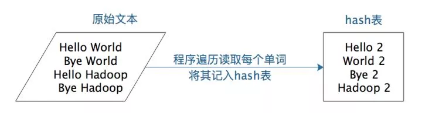
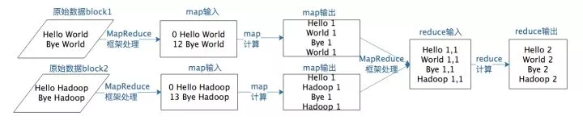
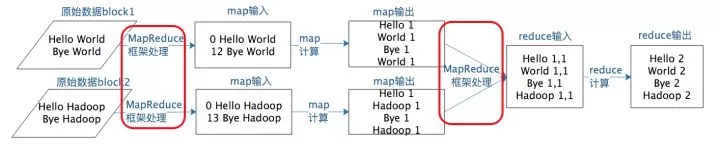
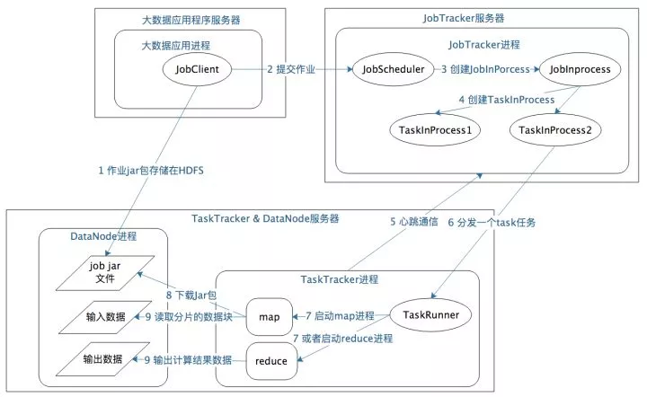

# MapReduce 编程模型和计算框架架构原理

原文：https://mp.weixin.qq.com/s?__biz=MzU3MzgwNTU2Mg==&mid=2247484490&idx=1&sn=73aebd970f877a865eaf3d8d5844414e&chksm=fd3d42dfca4acbc95a38de4d9cf4d8618a04597f0a140639a05411862ab5a233e79f13cb07ff&scene=21#wechat_redirect


Hadoop 解决大规模数据分布式计算的方案是 MapReduce。MapReduce 既是一个编程模型，又是一个计算框架。也就是说，开发人员必须基于 MapReduce 编程模型进行编程开发，然后将程序通过 MapReduce 计算框架分发到 Hadoop 集群中运行。

先来了解一下编程模型 MapReduce。

### 1. MapReduce 编程模型

MapReduce 是一种非常简单又非常强大的编程模型。

简单在于其编程模型只包含 map 和 reduce 两个过程。map 的主要输入是一对 <key, value> 值，经过 map 计算后，输出一对 <key, value> 值；然后将相同 key 合并，形成 <key, value集合> ；再将这个 <key, value集合> 作为 reduce 的输入，经过计算，输出**零个**或者**多个** <key，value> 对。

但是 MapReduce 同时又是非常强大的，不管是关系代数运算（SQL计算），还是矩阵运算（图计算），大数据领域几乎所有的计算需求都可以通过 MapReduce 编程来实现。

以 WordCount 程序为例，WordCount 主要解决文本处理中的词频统计问题，就是统计文本中每一个单词出现的次数。如果只是统计一篇文章的词频，几十K到几M的数据，那么写一个程序，将数据读入内存，建立一个Hash表记录每个词出现的次数就可以了。如下图所示：



但是，如果想统计全世界互联网所有网页（数万亿计）的词频数（这正是google这样的搜索引擎典型需求），不可能写一个程序把全世界的网页读入内存，这个时候就需要用 MepReduce 编程来解决。

WordCount的MapReduce的程序如下：

```java
public class WordCount {

    public static class TokenizerMapper extends Mapper<Object, Text, Text, IntWritable>{

      private final static IntWritable one = new IntWritable(1);
      private Text word = new Text();

      public void map(Object key, Text value, Context context) 
        throws IOException, InterruptedException {
          StringTokenizer itr = new StringTokenizer(value.toString());
          while (itr.hasMoreTokens()) {
            word.set(itr.nextToken());
            context.write(word, one);
          }
      }
    } // end of class TokenizerMapper

    public static class IntSumReducer extends Reducer<Text,IntWritable,Text,IntWritable> {
      private IntWritable result = new IntWritable();

      public void reduce(Text key, Iterable<IntWritable> values, Context context ) 
        throws IOException, InterruptedException {
          int sum = 0;
          for (IntWritable val : values) {
            sum += val.get();
          }
          result.set(sum);
          context.write(key, result);
        }
    } // end of class IntSumReducer
} // end of WordCount
```

其核心是一个 map 函数，一个 reduce 函数。

map 函数的输入主要是一个 <key, value> 对，在这个例子里， value是要统计的所有文本中的一行数据， key 在这里不重要，可以忽略。

```java
public void map(Object key, Text value, Context context)
```

map 函数的计算过程就是，将这行文本中的单词提取出来，针对每个单词输出一个<word, 1> 这样的 <key, value> 对。

MapReduce 计算框架会将这些 <word, 1> 收集起来，将相同的word 放在一起，形成 <word, <1,1,1,...1,...>> 这样的 <key, value集合>数据，然后将其输入给 reduce 函数。

```java
public void reduce(Text key, Iterable<IntWritable> values,Context context)
```

这里的 Reduce 函数的输入参数 values 就是由很多个 1 组成的集合，而 key 就是具体的单词word。

reduce 函数的计算过程就是，将这个集合里的 1 求和，再将单词（word）和这个和（sum）组成一个 <key, value> (<word, sum>) 输出。每一个输出就是一个单词和它的词频统计总和。

假设有两个 block 的文本数据需要进行词频统计， MapReduce 计算过程如下：



一个 map 函数可以针对一部分数据进行运算，这样就可以将一个大数据切分成很多块（这也正是HDFS所做的），MapReduce 计算框架为每个块分配一个 map 函数去计算，从而实现大数据的分布式计算。

上面提到的 MapReduce 编程模型将大数据计算过程切分为 map 和 reduce 两个阶段，在 map 阶段为每个数据块分配一个 map 计算任务，然后将所有 map 输出的 key 进行合并，相同的 key 及其对应的 value 发送给同一个 reduce 任务去处理。

这个过程有两个关键问题要处理：

* 如何为每个数据块分配一个map计算任务？代码是如何发送数据块所在的服务器的？发送过去是如何启动的？启动以后又如何知道自己需要计算的数据在文件什么位置（数据块 id 是什么）？
* 处于不同服务器的map输出的 <key, value>，如何把相同的 key 聚合在一起发送给 reduce 任务？

​        这两个关键问题正好是 “MapReduce” 计算过程图中两处“MapReduce框架处理”：



接下来看看MapReduce是如何启动处理一个大数据计算应用作业的。

#### 1.1 MapReduce作业启动和运行机制

以Hadoop V1 为例子，MapReduce运行过程涉及以下几类关键进程：

* **大数据应用进程**：启动用户 MapReduce 程序的主入口，主要指定 Map 和 Reduce 类、输入输出文件路径等，并提交作业给 Hadoop集群
* **JobTracker进程**：根据要处理的输入数据量启动相应数量的map和reduce进程任务，并管理整个作业生命周期的任务调度和监控。JobTracker 进程在整个Hadoop集群全局唯一
* **TaskTracker进程**：负责启动和管理map进程以及reduce进程。因为需要每个数据块都有对应的map函数，TaskTracker进程通常和HDFS的DataNode 进程启动在同一个服务器，也就是说，Hadoop 集群中绝大多数服务器同时运行DataNode进程和TaskTacker进程

如下图所示：



具体作业启动和计算过程如下：

* 应用程序将用户作业 jar 包存储在HDFS中，将来这些jar包会分发给Hadoop集群中的服务器执行MapReduce计算
* 应用程序提交 Job 作业给 JobTracker
* JobTacker 根据作业调度策略创建 JobInProcess 树，每个作业都会有一个自己的 JobInProcess树
* JobInProcess根据输入数据分片数据（通常情况就是数据块的数目）和设置的Reduce数目创建相应数量的TaskInProcess
* TaskTracker 进程和 JobTracker 进程进行定时通信
* 如果 TaskTracker 有空闲的计算资源（空闲CPU核），JobTracker就会给他分配任务。分配任务的时候会根据 TaskTracker 的服务器名字匹配在同一个台机器上的数据块计算任务给它，**使启动的计算任务正好处理本机上的数据**
* TaskRunner 收到任务后根据任务类型（map还是reduce），任务参数（作业jar包路径，输入数据文件路径，要处理的数据在文件中的起始位置和偏移量，数据块多个备份的DataNode主机名等）启动相应的map或者reduce进程
* map 或者 reduce 程序启动后，检查本地是否有要执行任务的 jar 包文件，如果没有，就去 HDFS 上下载，然后加载 map 或者 reduce 代码开始执行
* 如果是 map 进程， 从HDFS读取数据（通常要读取的数据块正好存储在本机）。如果是 reduce 进程，将结果数据写出到 HDFS

通过以上过程，MapReduce 可以将大数据作业计算任务分布在整个Hadoop 集群中进行，每个map计算任务要处理的数据通常能从本地磁盘上读取到。而用户要做的仅仅是编写一个map函数和一个reduce函数就可以了，根本不用关心这两个函数是如何被分布启动到集群上的，数据块又是如何分配给计算任务的。这一切都是有MapReduce计算框架完成。

#### 1.2 MapReduce数据合并与连接机制

在WordCount例子中，要统计相同单词的所有输入数据中出现的次数，而一个map智能处理一部分数据，一个热门单词几乎会出现在所有的map中，这些单词必须要合并到一起，进行统计才能得到正确的结果。

事实上，几乎所有的大数据计算场景都需要处理数据关联的问题，简单如 WordCount 只要对 key 进行合并就可以了，复杂如数据库的join操作，需要对两种类型（或者更多类型）的数据根据 Key 进行连接。

**MapReduce 计算框架<font color='red'>处理数据合并与连接</font>的操作就在map输出与reduce输入之间**，这个过程有一个专门的词汇来描述，叫做shuffle。

#### 1.3 MapReduce shuffle 过程

每个 map 任务的计算结果都会写入到本地文件系统，等map任务快要计算完成的时候，MapReduce计算框架会启动shuffle过程，在map端调用一个 Partitioner 接口，对map产生的每个 <key, value> 进行 reduce 分区选择，然后通过 http 通信发送给对应的 reduce 进程。这样不管map位于哪个服务器节点，相同的 key 一定会被发送给相同的 reduce 进程。Reduce 端对收到的<key, value>进行排序和合并，相同的ekey放在一起，组成一个<key, value集合> 传递给 reduce 执行。

MapReduce 框架缺省的 Partitioner 用 Key 的哈希值对 reduce 任务数量取模，相同的 key 一定会落在相同的reduce任务id上，实现上，这样的Partitioner代码只需要一行，如下所示：

```java
/** Use {@link Object#hashCode()} to partition. */ 
public int getPartition(K2 key, V2 value, int numReduceTasks) { 
    return (key.hashCode() & Integer.MAX_VALUE) % numReduceTasks; 
}
```

**shuffle 是大数据计算过程中发生奇迹的地方**，不管是MapReuce还是Spark，只要是大数据批处理计算，一定会有shuffle 过程，让数据关联起来，数据的内在关系和价值才会呈现出来。不理解shuffle，就会在map和reduce编程中产生困惑，不知道该如何正确设计map的输出和reduce的输入。shuffle也是整个MapReduce过程中最消耗性能的地方，在MapReduce早期代码中，一般代码都是关于shuffle处理的。