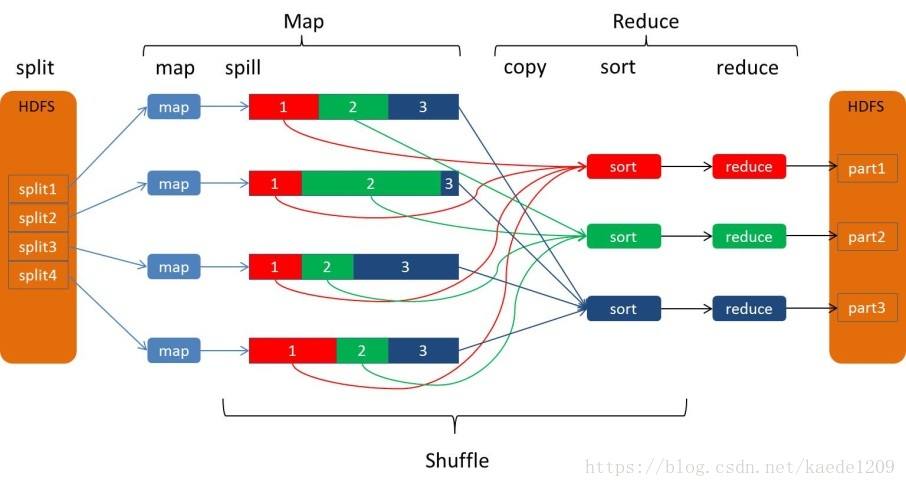
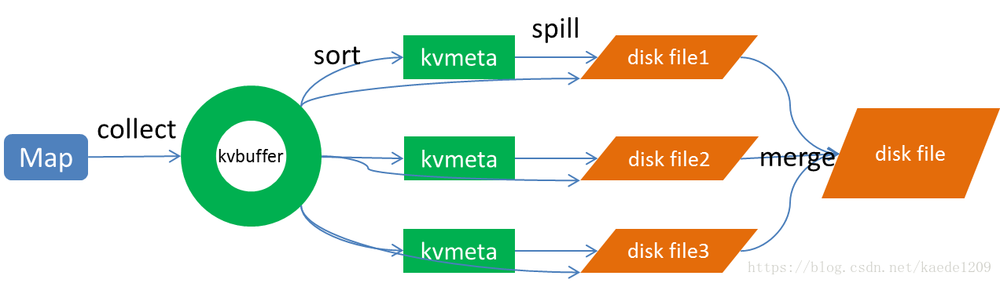
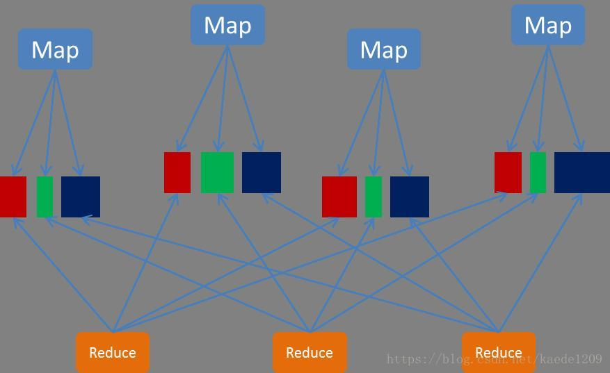
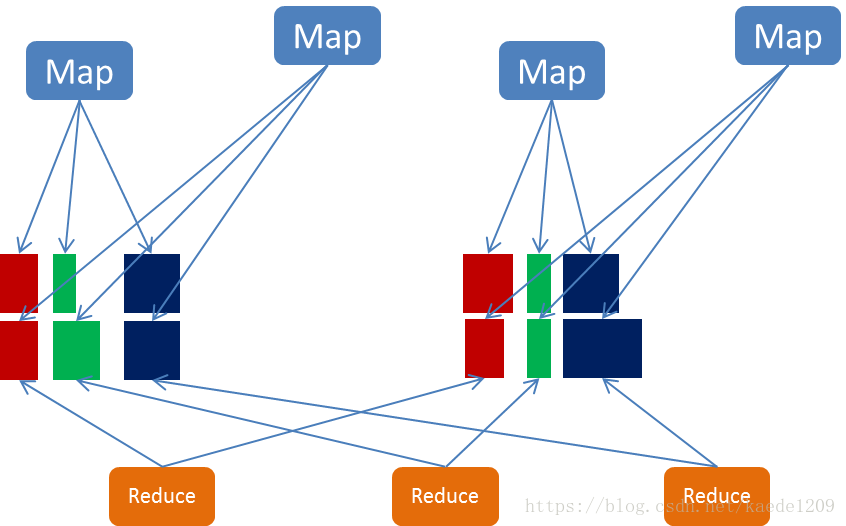

# MapReduce的Shuffle过程

原文：https://blog.csdn.net/kaede1209/article/details/81953262

### 1. MapReduce Shuffle

Map是映射，负责数据的过滤分发；Reduce 是规约，负责数据的计算归并。Reduce 的数据来源于Map，Map的输出即是Reduce的输入，Reduce需要通过Shuffle来获取数据。

从Map输出到Reduce输入的整个过程可以广义地称为 Shuffle。 Shuffle 横跨Map端和Reduce端，在Map端包括Spill 过程，在Reduce端包括Copy和Sort过程。如下图所示：

#### 1.1 Map的Shuffle过程

Spill 过程包括输出、排序、溢写、合并等步骤，如下图所示：

##### 1.1.1 Collect

每个Map任务不断地以对的形式把数据输出到在内存中构造的一个环形数据结构中。使用环形数据结构是为了更有效地使用内存空间，在内存中放置尽可能多地数据。这个数据结构其实就是个字节数组，叫做 KV-Buffer。

#### 1.1.2 Sort

先把KV-Buffer中的数据按照 partition值和Key两个关键字升序排序，移动的只是索引数据。排序结果是 KV-Meta中数据按照Partition为单位聚集在一起，同一个Partition内的数据按照Key有序排列。

##### 1.1.3 Spill

Spill 线程为这次Spill过程创建一个磁盘文件：从所有的本地目录中轮询查找能存储这么大空间的目录，找到之后在其中创建一个类似于“spill2.out”的文件。Spill线程根据排过序的KV-Meta挨个Partition的把数据吐到这个文件中，一个Partition对应的数据吐完之后顺序地吐下一个Partition，直到把所有的Partition遍历完。一个Partition在文件中对应的数据也叫做段（Segment）。

内存缓冲区是有大小限制的，默认是100MB。当Map Task的输出结果很多时，就可能会撑爆内存，所以需要在一定条件下将缓冲区中的数据临时写入磁盘，然后重新利用这块缓冲区。**这个从内存往磁盘写数据的过程称为Spill，中文译为“溢写”。**比例默认是0.8，也就是当缓冲区的数据已经达到阈值（buffer size * spill percent = 100MB * 0.8 = 80MB），溢写线程启动，锁定这80MB的内存，执行溢写过程。Map Task 的输出结果还可以往剩下的20MB的内存中写，互不影响。

##### 1.1.4 Merge

Map任务如果输出数据量很大，可能会进行好几次spill，out文件和Index文件会产生很多，分布在不同的磁盘上。最后把这些文件进行合并的merge过程闪亮登场。如前面的例子，“aaa”从某个map task读取过来时值是5，从另一个map读取时值是8，因为它们有相同的key，所以得merge成group。什么是group？对于“aaa”就像是这样：{"aaa", [5,8,2...]}

#### 1.2 Reduce 的Shuffle过程

##### 1.2.1 Copy

Reduce的任务通过HTTP向各个Map任务拖取它需要的数据。每个节点都会启动一个常驻的HTTP Server，其中一项服务就是响应Reduce拖取Map数据。当有MapOutput的HTTP请求过来时，HTTP Server 就读取相应的Map输出文件中对应这个Reduce部分的数据通过网络流输出给Reduce。

##### 1.2.2 Merge SORT

这里使用的Merge 和Map端使用的Merge过程一样。Map的输出数据已经是有序的，Merge进行一次合并排序，所谓Reduce端的SORT过程就是这个合并的过程。一般Reduce是一边Copy一边Sort，即Copy和Sort两个阶段是重叠而不是完全分开的。

当Reduce的输入文件已定，整个Shuffle才最终结束。

### 2. Spark的Shuffle过程

#### 2.1 Shffle Writer

Spark 丰富了任务类型，有些任务之间数据流转不需要通过Shuffle，但是有些任务之间还是需要通过Shuffle来传递数据，比如 wide dependency 的 group by key。

Spark中需要shuffle输出的Map任务会为每个 Reduce 创建对应的bucket，Map产生的结果会根据设置的Partitioner得到对应的bucketId，然后填充到响应的bucket中去。每个Map 输出的结果可能包含所有的Reduce所需要的数据，所以每个Map会创建R个bucket（R是Reduce的个数），M个Map总共会创建M * R 个bucket。

Map 创建的bucket 其实对应磁盘上的一个文件，Map 的结果写到每个bucket中其实就是写到那个磁盘文件中，这个文件也被称为blockFile。每个Map要在节点上创建R个磁盘文件用于结果输出，Map的结果是直接输出到磁盘文件上的，100KB的内存缓冲是用来创建Fast Buffered OutputStream输出流。这种方式一个问题就是Shuffer文件过多。

针对上述Shuffle过程产生的文件过多问题，Spark有另一种改进的Shuffle过程：consolidation shuffle，以期显著减少shuffle文件的数量。在consolidation shuffle中每个bucket并非对应一个文件，而是对应文件中的一个 segment 部分。Job的Map在某个节点上第一次执行，为每个reduce创建Bucket对应的输出文件，把这些文件组织成ShuffleFileGroup，当这次map执行完成之后，这个ShuffleFileGroup可以释放为下次循环利用；当又有map在这个节点上执行时，不需要创建新的bucket文件，而是在上次的 ShuffleFileGroup 中取得已经创建的文件继续追加写一个Segment；当前次map还未执行完，ShuffleFileGroup还没有释放，这时如果有新的Map在这个节点上执行，无法循环利用这个ShuffleFileGroup，而是智能创建新的Bucket文件组成新的ShuffleFileGroup来写输出。

#### 2.2 Shffle Fetcher

Reduce去拖Map的输出数据，Spark提供了两套不同的拉取数据框架：通过socket连接去取数据；使用netty框架去取数据。Spark Map 输出的数据没有经过排序，Spark Shuffle 过来的数据也不会进行排序，Spark 认为 shuffle 过程中的排序不是必须的，并不是所有类型的Reduce需要的数据都需要排序，强制地执行排序只会增加 shuffle的负担。 Reduce 拖过来的数据会放在一个 HashMap 中，HashMap中存储的也是“对”，Key是Map输出的Key，Map输出对应的这个Key的所有Value组成HashMap的Value。Spark将Shuffle取过来的每一个对插入或者更新到HashMap中，来一个处理一个。HashMap全部放在内存中。

### 3. MapReduce Shuffle后续优化方向

* 压缩：对数据进行压缩，减少写读数据量
* 减少不必要的排序：并不是所有类型的Reduce需要的数据都需要排序的，排序这个NB的过程如果不需要最好还是不要的好
* 内存化：Shuffle 的数据不放在磁盘而是尽可能的在内存中。除非逼不得已往磁盘上放；当然了如果有性能和内存相当的第三方存储系统，那放在第三方存储系统上也是很好的
* 网络框架：netty的性能不错

### 4. Spark Shuffle 后续优化方向

Spark 作为MapReduce的进阶框架，对于Shuffle过程已经是优化了的，特别是对于那些具有争议的步骤已经做了优化，但是Spark的shuffle还是有优化的地方。

* 压缩：对数据进行压缩，减少读写数据量
* 内存化：Spark 历史版本中是这样设计的：Map写数据先把数据全部写到内存中，写完之后再把数据刷新到磁盘上；考虑内存是紧缺资源，后来修改成把数据直接写入到磁盘了；对于具有较大内存的集群来讲，还是尽量地往内存上写，内存放不下了再放磁盘
