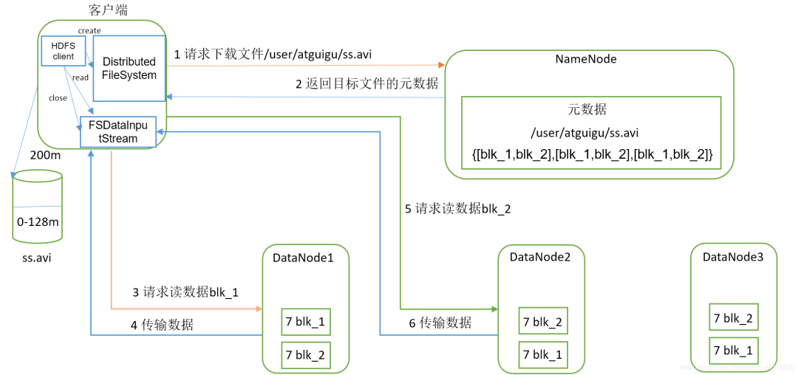
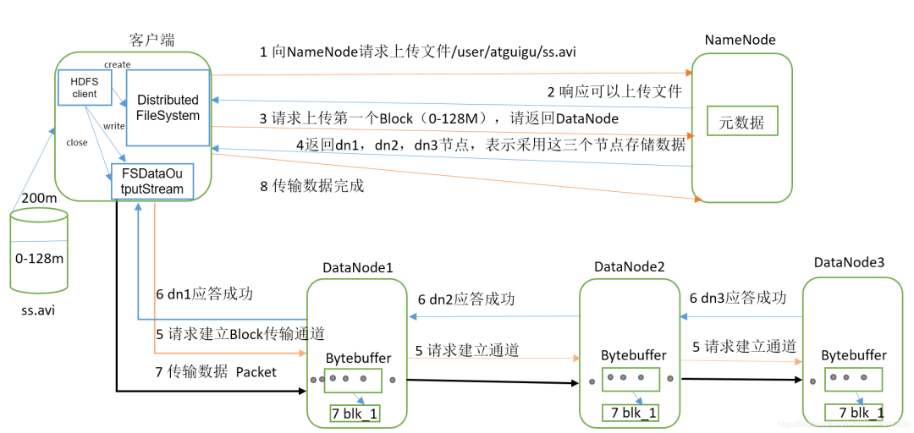
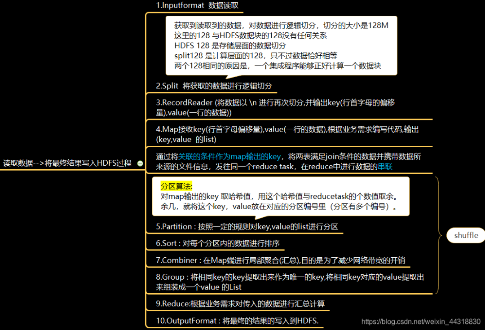
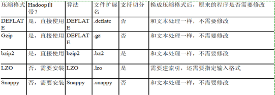
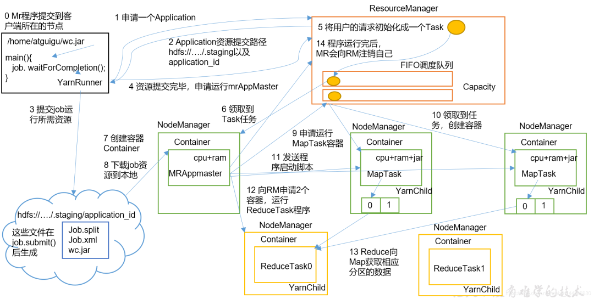
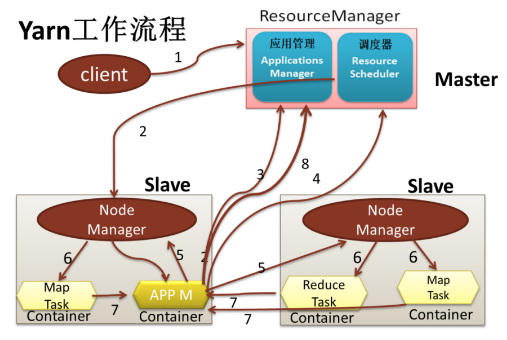

# Hadoop高频面试题

原文：https://blog.csdn.net/a934079371/article/details/109233998


### 1. Hadoop与Spark的差异

|              | Hadoop                                      | Spark                                       |
| :----------- | :------------------------------------------ | ------------------------------------------- |
| 类型         | 基础平台，包含计算，存储，调度              | 分布式计算工具                              |
| 场景         | 大规模数据集上的批处理                      | 迭代计算，交互式计算，流计算                |
| 价格         | 对机器要求低，便宜                          | 对内存有要求，相对较贵                      |
| 编程范式     | MapReduce，API 较为底层，算法适应性差       | RDD组成DAG有向无环图，API较为顶层，方便使用 |
| 数据存储结构 | MapReduce中间计算结果存在HDFS磁盘上，延迟大 | RDD中间运算结果存在内存中，延迟小           |
| 运行方式     | Task以进程方式维护，任务启动慢              | Task以线程方式维护，任务启动快              |


### 2. Hadoop的版本选择

目前市面上，主流的是以下几个版本：

#### 2.1 Apache 社区版

Apache社区版完全免费，开源，非商业版本。Apache社区的Hadoop版本分支较多，而且部分Hadoop存在Bug。在选择Hadoop、Hbase、Hive等时，需要考虑兼容性。同时，这个版本的Hadoop的部署对Hadoop开发人员或运维人员的技术要求比较高。

#### 2.2 Cloudera版本

Cloudera 版本 开源，免费，有商业版和非商业版本，是在Apache社区版本的Hadoop基础上，选择相对稳定版本的Hadoop，进行开发和维护的Hadoop版本。由于此版本的Hadoop在开发过程中对其他的框架的集成进行了大量的兼容性测试，因此使用者不必考虑Hadoop、Hbase、Hive等在使用过程中版本的兼容性问题，大大节省了使用者在调试兼容性方面的时间成本。

#### 2.3 Hortonworks版本

Hortonworks 版本 的 Hadoop 开源、免费，有商业和非商业版本，其在 Apache 的基础上修改，对相关的组件或功能进行了二次开发，其中商业版本的功能是最强大，最齐全的。

#### 2.4 结论

基于以上特点进行选择，一般刚接触大数据用的就是CDH，在工作中大概率用 Apache 或者 Hortonworks。


### 3 Hadoop 1.0， 2.0， 3.0 区别

#### 3.1 Hadoop 1.0

Hadoop1.0由分布式存储系统HDFS和分布式计算框架MapReduce组成，其中HDFS由一个NameNode和多个DateNode组成，MapReduce由一个JobTracker和多个TaskTracker组成。在Hadoop1.0中容易导致单点故障，拓展性差，性能低，支持编程模型单一的问题。

#### 3.2 Hadoop 2.0

Hadoop2.0即为克服Hadoop1.0中的不足，提出了以下关键特性：

* **Yarn**：它是Hadoop2.0引入的一个全新的通用资源管理系统，完全代替了Hadoop1.0中的JobTracker。在MRv1 中的 JobTracker 资源管理和作业跟踪的功能被抽象为 ResourceManager 和 AppMaster 两个组件。Yarn 还支持多种应用程序和框架，提供统一的资源调度和管理功能
* **NameNode单点故障解决方式**：Hadoop2.2.0 同时解决了 NameNode 单点故障问题和内存受限问题，并提供 NFS，QJM 和 Zookeeper 三种可选的共享存储系统
* **HDFS快照**：指 HDFS（或子系统）在某一时刻的只读镜像，该只读镜像对于防止数据误删、丢失等是非常重要的。例如，管理员可定时为重要文件或目录做快照，当发生了数据误删或者丢失的现象时，管理员可以将这个数据快照作为恢复数据的依据
* **支持Windows**：Hadoop 2.2.0 版本的一个重大改进就是开始支持 Windows 操作系统
* **Append**：引入了对文件的追加操作

​        同时，新版本的Hadoop对于HDFS做了两个非常重要的**「增强」**，分别是支持异构的存储层次和通过数据节点为存储在HDFS中的数据提供内存缓冲功能

#### 3.3 Hadoop 3.0

​        相比于Hadoop2.0，Hadoop3.0 是直接基于 JDK1.8 发布的一个新版本，同时，Hadoop3.0引入了一些重要的功能和特性：

- HDFS可擦除编码：这项技术使HDFS在不降低可靠性的前提下节省了很大一部分存储空间
- 多NameNode支持：在Hadoop3.0中，新增了对多NameNode的支持。当然，处于Active状态的NameNode实例必须只有一个。也就是说，从3.0开始，在同一个集群中，支持一个ActiveNameNode和多个StandbyNameNode的部署方式
- NR Native Task优化
- Yarn基于cgroup的内存和磁盘 I/O 隔离
- Yarn Container resizing

### 4 Hadoop常用端口

Hadoop常用的端口号总共就那么几个，大家选择好记的几个就OK了

```properties
dfs.namenode.http-address:50070
dfs.datanode.http-address:50075
dfs.datanode.address:50010
yarn.resourcemanager.webapp.address:8088
```


### 5 介绍一下搭建Hadoop集群的流程

在正式搭建之前，需要以下6步的**准备工作**：

1. 关闭防火墙
2. 关闭SELinux
3. 修改主机名
4. SSH无密码拷贝数据
5. 设置主机名和IP对应
6. 安装JDK 8

开始**正式搭建**：

* 下载并解压Hadoop
* 配置Hadoop的核心配置文件
* 格式化NameNode
* 启动……


### 6 HDFS读写流程

这个问题非常基础，同时出现的频率也是异常的高，但是大家也不要被HDFS的读写流程吓到。相信看到这里的朋友，应该不是第一次背HDFS读写繁多的步骤了，做到心中有图，万般皆易。

* HDFS读数据流程

  

* HDFS写数据流程

  


### 7. MapReduce的Shuffle过程



其中最重要，也是最不好讲的就是 shuffle 阶段，当面试官着重要求你介绍 Shuffle 阶段时，可就不能像上边图上写的那样简单去介绍了。可以这么说：

1. Map方法之后，Reduce方法之前，这段处理过程叫做 “**Shuffle**”
2. Map方法之后，数据首先会进入到**分区方法**，把数据标记好分区，然后把数据发送到环形缓冲区；环形缓冲区默认大小是 100m，环形缓冲区达到 80% 时，进行溢写；溢写前对数据进行排序，排序按照 Key 的索引进行字典顺序排序，排序的手段是“**快排**”；溢写产生大量溢写文件，需要对溢写文件进行“**归并排序**”；对溢写的文件也可以进行**Combiner**操作，前提是汇总操作，求平均值不行。最后将文件按照分区存储到磁盘，等待Reduce端拉取
3. 每个Reduce拉取Map端**对应分区**的数据。拉取数据后先存储到内存中，内存不够了，再存储到磁盘。拉取完所有数据后，采用归并排序将内存和磁盘中的数据都进行排序。在进入Reduce方法前，可以对数据进行分组操作。


### 8 基于MapReduce，如何做Hadoop的优化？

#### 8.1 HDFS小文件的影响

* 影响NameNode的寿命，因为文件元数据存储在NameNode的内存中
* 影响计算引擎的任务数量，比如每个小的文件都会产生一个Map任务

#### 8.2 数据输入小文件处理

* 合并小文件：对小文件进行归档（Har）、自定义Inputformat将小文件存储成SequenceFile文件
* 采用 ConbinFileInputFormat 来作为输入，解决输入端大量小文件场景
* 对于大量小文件Job，可以开启JVM重用

#### 8.3 Map阶段

* 增大环形缓冲区大小。由100m扩大到200m
* 增大环形缓冲区溢写的比例。由80%扩大到90%
* 减少对溢写文件的merge次数。（10个文件，一次20个merge）
* 不影响业务的前提下，采用Combiner提前合并，减少I/O

#### 8.4 Reduce阶段

* 合理设置Map和Reduce数：两个都不能设置太少，也不能设置太多。太少，会导致Task等待，延长处理时间；太多，会导致Map、Reduce任务间竞争资源，造成处理超时等错误
* 设置Map、Reduce共存：调整 *slowstart.completedmaps* 参数，使Map运行到一定程度后，Reduce也开始运行，减少Reduce等待时间
* 规避使用Reduce，因为Reduce在用于连续数据集的时候会产生大量的网络消耗
* 增加每个Reduce去Map中拿数据的并行数
* 集群性能可以的前提下，增大Reduce端存储数据内存的大小

#### 8.5 IO传输

* 采用数据压缩的方式，减少网络 IO 的时间
* 使用SequenceFile二进制文件

#### 8.6 整体

* MapTask默认内存大小是1G，可以增加MapTask内存大小为4G
* ReduceTask默认内存大小是1G，可以增加ReduceTask的内存大小为4-5G
* 可以增加MapTask的CPU核数，增加ReduceTask的CPU核数
* 增加每个Container的CPU的核数和内存大小
* 调整每个MapTask和ReduceTask最大重试次数

#### 8.7 压缩

从压缩可以参考下表：



提示：一般采用Snappy压缩方式，因为速度快，但缺点是无法切分（可以这么回答：在链式MR中，Reduce端输出使用bzip2压缩，以便后续的map任务对数据进行split）


### 9 YARN提交Job的过程

提供两个版本：详细版、简略版。一般按照简略版回答即可。

* 详细版

  

* 简略版
  

​        简略版本对应的步骤如下：

1. Client向ResourceManager提交应用程序，其中包含启动该应用的ApplicationMaster的必须信息，例如ApplicationMaster程序、启动ApplicationMaster的命令、用户程序等
2. ResourceManager启动一个container用于运行ApplicationMaster
3. **启动中**的ApplicationMaster向ResourceManager注册自己，启动成功后与RM保持心跳
4. ApplicationMaster向ResourceManager发送请求，申请相应数目的container
5. 申请成功的container，由ApplicationMaster进行初始化。Container的启动信息初始化后，AM与对应的NodeManager通信，要求NM启动container
6. NM启动container
7. container运行期间，ApplicationMaster对container进行监控。container通过RPC协议向对应的AM汇报自己的进度和状态等信息
8. 应用运行结束后，ApplicationMaster向ResourceManager注销自己，并允许属于它的Container被回收


### 10. YARN默认调度器，调度器分类，以及它们之间的区别

​        Hadoop调度器主要分为三类：

- **FIFO Scheduler**：先进先出调度器：优先提交的，优先执行，后面提交的等待【生产环境不会使用】
- **Capacity Scheduler**：容量调度器：允许看创建多个任务对列，多个任务对列可以同时执行。但是一个队列内部还是先进先出。【Hadoop2.7.2默认的调度器】
- **Fair Scheduler**：公平调度器：第一个程序在启动时可以占用其他队列的资源（100%占用），当其他队列有任务提交时，占用资源的队列需要将资源还给该任务。还资源的时候，效率比较慢。【CDH版本的yarn调度器默认】


### 11. Hadoop的参数优化

前面提到了Hadoop基于压缩、小文件、IO的集群优化，现在又要回答参数优化，因为这方面很重要。

常用的**Hadoop参数调优**有以下几种：

* 在hdfs-site.xml文件中配置多目录，最好提前配置好，否则更改目录需要重启集群

* NameNode有一个工作线程池，用来处理不同DataNode的并发心跳以及客户端并发的元数据操作。这个参数的公式是：dfs.namenode.handler.count=20 * log2(Cluster Size)

  比如集群规模为10台时，此参数设置为60

* 编辑日志存储路径 dfs.namenode.edits.dir 设置与镜像文件存储路径 dfs.namenode.name.dir 尽量分开，达到最低写入延迟

* 服务器节点上YARN可使用的物理内存总量，默认是8192M（8G），注意，如果节点内存资源不够8G，则需要减小这个值，而YARN不会智能的探测节点的物理内存总量

* 单个任务可申请的最多物理内存量，默认是8192M（8G）


### 12. Hadoop的基准测试

这个需要Case By Case。一般的，需要对HDFS读写性能和MR计算能力测试。测试jar包在hadoop的share文件夹下。


### 13. 如何处理Hadoop的宕机问题

如果MR造成宕机，此时需要控制YARN同时运行的任务数量，和每个任务申请的最大内存。调整参数： yarn.scheduler.maximum-allocation-mb （每个任务可申请的最多物理内存量，默认是8192M-8G）

如果写入文件过量造成NameNode宕机，那么调高Kafka的存储大小，控制从Kafka到HDFS的写入速度。高峰期的时候用Kafka进行缓存，高峰期过去数据同步会自动跟上。


### 14. 如何解决数据倾斜的问题？

“**性能优化**”和“**数据倾斜**”，必问问题。下面是一种比较靠谱的回答：

* 提前在map进行combine，减少传输的数据量

  在Mapper加上combine，相当于提前进行reduce，即把一个Mapper中的相同Key进行聚合，减少shuffle过程中传输的数据量，以及Reducer端的计算量

  *如果导致数据倾斜的key大量分布在不同的mapper的时候，这种方式就不是很有效了。*

* 数据倾斜的Key大量分布在不同的mapper

  这种情况又有下面几种方法可以尝试：

  * **局部聚合+全局聚合**

    第一次在map阶段对那些导致了数据倾斜的key加上一个 1-n的随机数前缀，这样本来相同的key就会被分到多个Reduce中进行局部聚合，数量就会大大降低

    第二次mapreduce，去掉key前面的前缀，进行全局聚合

  * **增加Reducer，提升并行度**
    JobConf.setNumReduceTasks(int)

  * **实现自定义分区**

    根据数据分布情况，自定义散列函数，将key均匀分配到不同的reducer