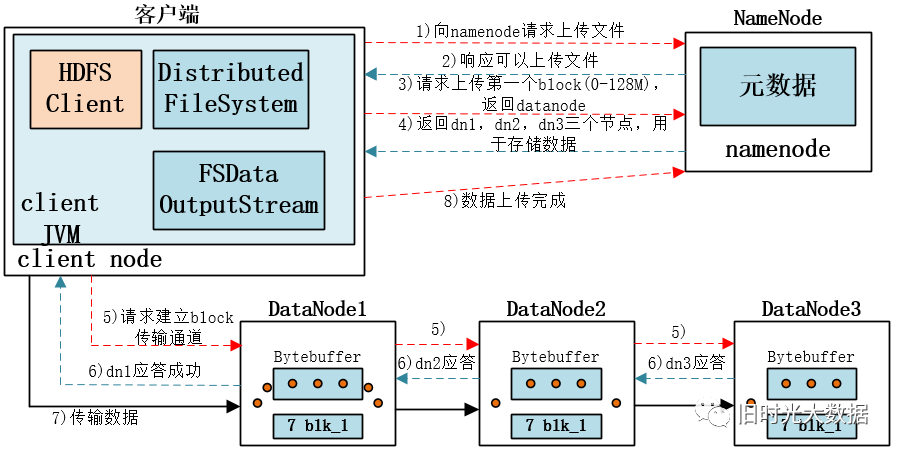
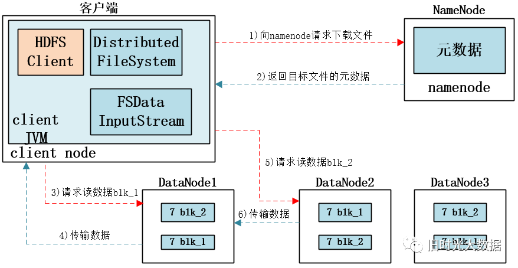
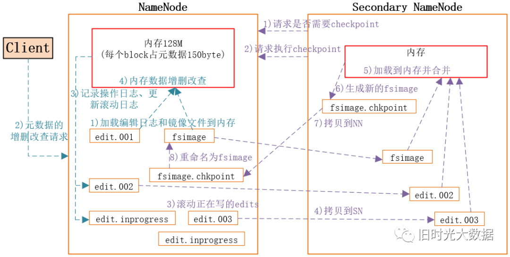
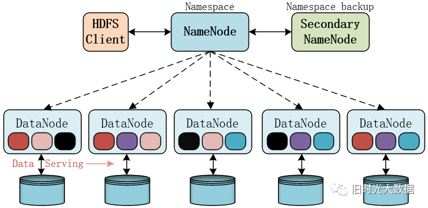
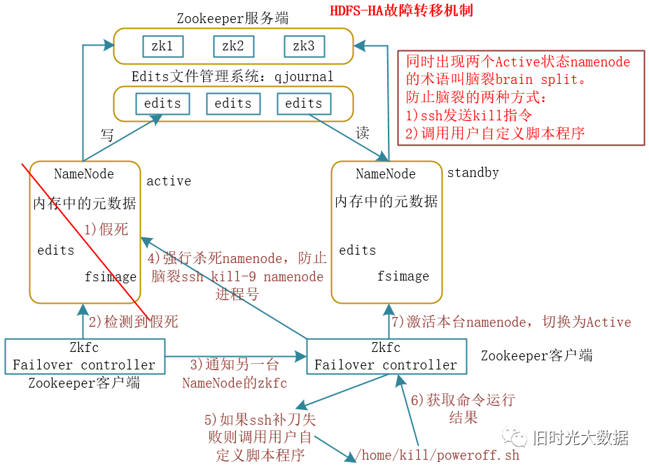

# Hadoop 面试题一

原文：https://www.cnblogs.com/bigband/articles/13518921.html

### 1. 集群的最主要瓶颈是什么？- 磁盘I/O

面对大数据，读取数据需要经过 I/O，这里可以把 I/O 理解为水的管道。管道越大越强，对于T级的数据读取就越快。所以，I/O的好坏，直接影响了集群对于数据的处理。

那么，什么是 I/O 呢？

> #### 读/写 I/O 
>
> 磁盘控制器向磁盘发出一次读/写指令，给出开始扇区的地址和向后连续读/写的扇区的个数。**读/写IO是一次IO，操作的扇区编号必须是连续的**。如果上层文件系统的IO请求是多个不连续的扇区，将会被磁盘控制器拆分成多个读/写IO来执行。（层次模型是理解一个系统最重要的思想，层次模型从底层到高层是一个化繁为简的过程，低层模块把复杂封装，向上层提供简易的使用接口；从高层到底层是一个逐层细分，逐层细化的过程。各层之间逻辑内聚，通过协议通讯降低耦合。文件系统层的一次IO会被磁盘存储层拆分成多次IO执行，不同层次之间的一次IO概念是不同的。） 
>
> ### 大/小块I/O 
>
> * **小块IO**：指一次读/写IO操作的连续扇区数目较小； 
>
> * **大块IO**： 指一次读/写IO操作的连续扇区数目较大； 
>
> 大块和小块并没有明确区分。 
>
> ### 连续随机I/O 
>
> * **连续IO**：指两次不同的读/写IO，前一次的结束地址与后一次的起始地址相差不大； 
>
> * **随机IO**： 指两次不同的读/写IO，前一次的结束地址与后一次的起始地址相差很大； 
>
> ### 顺序/并发IO 
>
> * **顺序IO**：指磁盘控制器必须在一次IO指令完成后才能进行下一个IO指令，指令的执行是顺序的，同步的。对于单磁盘的存储系统，所用的IO都是顺序IO； 
>
> * **并发IO**：并发IO是针对多磁盘的存储系统而言的， 指磁盘控制器在发出一次IO指令后，检查下一个IO指令，如果不是操作的磁盘不是正在进行的磁盘，就可以进行下一个IO指令，指令的执行是顺序的，异步的。 
>
> ### 持续/间断IO 
>
> ### 稳定/突发IO 
>
> ### 实/虚IO 
>
> * **实IO**：IO请求中包含对应实际数据的地址，读/写了扇区的数据； 
>
> * **虚IO**：非实体数据的IO请求，只是请求一些状态信息，元数据等；
>
> ### IO并发几率 
>
> 书上的描述：单盘，IO并发几率为0，因为一块磁盘同时只可以进行一次IO。对于raid0，2块盘情况下，条带深度比较大的时候（条带太小不能并发IO，下面会讲到），并发2个IO的几率为1/2。其他情况请自行运算。 
>
> 个人理解：磁盘的IO并发是指磁盘控制器处理IO请求时是否能并发的执行，而不需要等待上一个IO请求执行结束再执行下一个IO请求。单盘的存储系统肯定是不能并发处理IO的，多盘存储系统在IO请求只占用了部分磁盘的时候能并发的处理IO请求。至于并发几率是怎么算的还没搞明白。 
>
> ### IOPS 
>
> 设t=磁盘控制器完成一次IO所需要的时间。则t=寻道时间+旋转延迟+数据传输时间；IOPS=IO并发系数/t. (IO并发系数暂时还没有找到解释，用the concurrent coefficient of IO去google也没找到…） 
>
> ### 每秒IO吞吐量 
>
> 每秒处理IO的大小，等于IOPS*平均IOSIZE。而IOSIZE的大小与磁头的读写速度有关。

### 2. Hadoop的运行模式有哪些？

* **单机版**：无需任何守护进程，所有的程序都运行在同一个JVM上执行。在独立模式下调试MR程序非常高效方便。所以*一般该模式主要是在学习或者开发阶段调试使用*
* **伪分布式模式**：Hadoop守护进程运行在本地机器上，模拟一个小规模的集群，换句话说，可以配置一台机器的Hadoop集群，伪分布式是完全分布式的一个特例
* **完全分布式模式**：Hadoop守护进程运行在一个集群上

### 3. Hadoop生态圈的组件有哪些？

1. **Zookeeper**：是一个开源的分布式应用程序协调服务,基于zookeeper可以实现同步服务，配置维护，命名服务。
2. **Flume**：一个高可用的，高可靠的，分布式的海量日志采集、聚合和传输的系统。
3. **Hbase**：是一个分布式的、面向列的开源数据库, 利用**Hadoop HDFS作为其存储系统**。
4. **Hive**：基于Hadoop的一个数据仓库工具，可以将结构化的数据档映射为一张数据库表，并提供简单的sql 查询功能，可以将sql语句转换为MapReduce任务进行运行。
5. **Sqoop**：将一个关系型数据库中的数据导进到Hadoop的 HDFS中，也可以将HDFS的数据导进到关系型数据库中。

### 4. 正常工作的集群中，Hadoop都分别需要启动哪些进程，它们的作用分别是什么？

1. **NameNode**：它是hadoop中的主服务器，管理文件系统名称空间和对集群中存储的文件的访问，保存有metadate。
2. **SecondaryNameNode**：它**不是** NameNode 的冗余守护进程，而是**提供周期检查点和清理任务**。帮助NameNode合并editslog，减少NameNode启动时间。
3. **DataNode**：它负责管理连接到节点的存储（一个集群中可以有多个节点）。每个存储数据的节点运行一个datanode守护进程。
4. **ResourceManager**（JobTracker）：JobTracker负责调度DataNode上的工作。**每个DataNode有一个TaskTracker**，它们执行实际工作。
5. **NodeManager**：（TaskTracker）执行任务
6. **DFSZKFailoverController**：高可用时它负责监控 NameNode 的状态，并及时的把状态信息写入ZK。它通过一个独立线程周期性的调用 NameNode 上的一个特定接口来获取NameNode 的健康状态。FC也有选择谁作为 Active NameNode 的权利，因为最多只有两个节点，目前选择策略还比较简单（先到先得，轮换）。
7. **JournalNode**：高可用情况下存放NameNode的editlog文件

### 5. HDFS中的Block默认保存几份？

​        默认是 3 份

### 6. HDFS 默认 BlockSize 是多大？

​        从 Hadoop 2.x开始，默认是128M （老版本是64M）。

#### 6.1 为什么 BlockSize 不能太大，也不能太小？

#### 6.1.1 设置过大

1. 从磁盘传输数据的时间会明显大于寻址时间，导致程序在处理数据块时变得非常慢。

2. MapReduce 中的 map 任务通常一次只处理一个块的数据，如果块过大，运行速度会变得很慢。

#### 6.1.2 设置过小

1. 块设置下了，就会出现大量的小文件，这些小文件会占用 NameNode 中大量的内存来存储元数据，而 NameNode 的内存是有限的
2. 块笑了，就会增加寻址时间，导致程序一直在找 Block 的开始位置。因此，Block适当设置大一些，可以减少寻址时间，传输一个由多个 Block 组成的文件的时间就主要取决于磁盘的传输速率。

### 6.2 HDFS中 Block 的大小为什么设置为 128M？

1. HDFS 中平均寻址时间大概是 ***10ms***

2. 经过大量的测试发现，***寻址时间为传输时间的 1% 时是最佳状态***。所以最佳传输时间就是: 10ms/0.01=1000ms=1s

3. 目前磁盘的传输速率普遍为 100MB/s，可以计算得出：

   最佳 Block 大小 = 100 Mb/时* 1s = 100Mb，因此把 Block 大小设置为 128 Mb

4. 实际在工业生产中，磁盘传输速率为 200Mb/s 时，一般设置 Block 大小为 256Mb；同理，如果磁盘传输速率是 400MB/s 时，Block 一般设置为 512Mb

### 7. 负责 HDFS 数据存储的是哪一部分？

DataNode 负责数据存储

### 8. SecondaryNameNode 的目的是什么？ 

它的目的是帮助 NameNode 合并编辑日志，减少 NameNode 启动时间

### 9. 文件大小设置，增大有什么影响？

HDFS 中的文件在物理上是分块存储（block），块的大小可以通过配置参数（ dfs.blocksize）来设置，默认大小在hadoop2.x版本中是 128M，老版本是 64M。

那么，为什么Block的大小不能太大，也不能太小呢？

**HDFS 的块比磁盘的块大，其目的是为了最小化寻址开销**。如果块设置得足够大，从磁盘传输数据的时间会明显大于定位这个块开始位置所需要的时间。所以，传输一个由多个块组成的文件的时间，取决于磁盘传输速率。

如果寻址时间约为10ms，而传输速率为100M/s，为了使寻址时间仅占传输时间的 1%，要将块大小设置约为100M。默认的块大小是 128M。

### 10. HDFS 的存储机制

HDFS 存储机制，包括 HDFS 的**写入数据**过程和**读取数据**过程两个部分。

### 10.1 HDFS 写入数据过程

整个过程如下图：

1. 客户端通过Distributed FileSystem模块向NameNode请求上传文件，NameNode检查目标文件是否已存在，父目录是否存在。

2. NameNode返回是否可以上传。

3. 客户端请求第一个 block上传到哪几个datanode服务器上。

4. NameNode返回3个datanode节点，分别为dn1、dn2、dn3。

5. 客户端通过FSDataOutputStream模块请求dn1上传数据，dn1收到请求会继续调用dn2，然后dn2调用dn3，将这个通信管道建立完成。

6. dn1、dn2、dn3逐级应答客户端。

7. 客户端开始往dn1上传第一个block（先从磁盘读取数据放到一个本地内存缓存），以packet为单位，dn1收到一个packet就会传给dn2，dn2传给dn3；dn1每传一个packet会放入一个应答队列等待应答。

8. 当一个block传输完成之后，客户端再次请求NameNode上传第二个block的服务器。（重复执行3-7步）。

   

### 10.2 HDFS读取数据过程

1. 客户端通过Distributed FileSystem向NameNode请求下载文件，NameNode通过查询元数据，找到文件块所在的DataNode地址。

2. 挑选一台DataNode（就近原则，然后随机）服务器，请求读取数据。

3. 向返回的 DataNode 节点请求第一个 Block 数据

4. DataNode开始传输数据给客户端（从磁盘里面读取数据输入流，以packet为单位来做校验）。客户端以packet为单位接收，先在本地缓存，然后写入目标文件

5. 客户端根据 DataNode 信息请求后续 Block 的数据，然后重复第 4 步的操作

   

### 11. Secondary NameNode 工作机制

#### 11.1 第一阶段：NameNode启动

1. 第一次启动NameNode格式化后，创建fsimage和edits文件。如果不是第一次启动，直接加载编辑日志和镜像文件到内存。

2. 客户端对元数据进行增删改的请求。

3. NameNode记录操作日志，更新滚动日志。
4. NameNode在内存中对数据进行增删改查。

#### 11.2 第二阶段：Secondary NameNode工作

1. Secondary NameNode询问NameNode是否需要checkpoint。直接带回NameNode是否检查结果。
2. 请求执行checkpoint。
3. NameNode滚动正在写的edits日志。
4. 先将滚动前的编辑日志和镜像文件拷贝到Secondary NameNode。
5. Secondary NameNode加载编辑日志和镜像文件到内存，并合并。
6. 生成新的镜像文件fsimage.chkpoint。
7. 拷贝fsimage.chkpoint到NameNode。
8. NameNode将fsimage.chkpoint重新命名成fsimage。

### 12 NameNode 与 Second NameNode 的区别和联系

* **区别**：
  * NameNode负责管理整个文件系统的元数据，以及每一个路径（文件）所对应的数据块信息。
  * SecondaryNameNode**主要用于定期合并命名空间镜像和命名空间镜像的编辑日志**。- 不是备份
* **联系**：
  * SecondaryNameNode中保存了一份和namenode一致的镜像文件（fsimage）和编辑日志（edits）
  * 在主namenode发生故障时（假设没有及时备份数据），可以从SecondaryNameNode恢复数据。

### 13 HDFS 的组成架构

架构主要由四个部分组成，分别为HDFS Client、NameNode、DataNode和Secondary NameNode。下面我们分别介绍这四个组成部分。

#### 13.1 Client：

就是客户端

1. 文件切分。文件上传HDFS的时候，Client将文件切分成一个一个的Block，然后进行存储；
2. 与NameNode交互，获取文件的位置信息；
3. 与DataNode交互，读取或者写入数据；
4. Client提供一些命令来管理HDFS，比如启动或者关闭HDFS；
5. Client可以通过一些命令来访问HDFS；

#### 13.2 NameNode：

就是Master，它是一个主管、管理者。

1. 管理HDFS的名称空间；
2. 管理数据块（Block）映射信息；
3. 配置副本策略；
4. 处理客户端读写请求。

#### 13.3 DataNode：

就是Slave。NameNode下达命令，DataNode执行实际的操作。

1. 存储实际的数据块；
2. 执行数据块的读/写操作。

### 13.4 Secondary NameNode：

并非NameNode的热备。当NameNode挂掉的时候，它并不能马上替换NameNode并提供服务。

1. 辅助NameNode，分担其工作量；
2. 定期合并Fsimage和Edits，并推送给NameNode；
3. 在紧急情况下，可辅助恢复NameNode。

### 14 HANameNode如何工作？

ZKFailoverController主要职责

1. **健康监测**：周期性的向它监控的 NameNode 发送健康探测命令，从而来确定某个 NameNode 是否处于健康状态，如果机器宕机，心跳失败，那么 zkfc 就会标记它处于一个不健康的状态。
2. **会话管理**：如果 NameNode 是健康的，zkfc 就会在 zookeeper 中保持一个打开的会话，如果 NameNode 同时还是  **Active** 状态的，那么 zkfc 还会在 Zookeeper 中占有一个类型为短暂类型的 znode，当这个 NameNode 挂掉时，这个 znode 将会被删除，然后备用的 NameNode，将会得到这把锁，升级为主 NameNode，同时标记状态为Active。
3. 当宕机的 NameNode 重新启动时，它会再次注册 zookeper，发现已经有 znode 锁了，便会自动变为 **Standby** 状态，如此往复循环，保证高可靠，需要注意，目前仅仅支持最多配置 ***2个*** NameNode。
4. **master选举**：如上所述，通过在 zookeeper 中维持一个**短暂类型**的 znode，来实现抢占式的锁机制，从而判断那个NameNode为 Active 状态