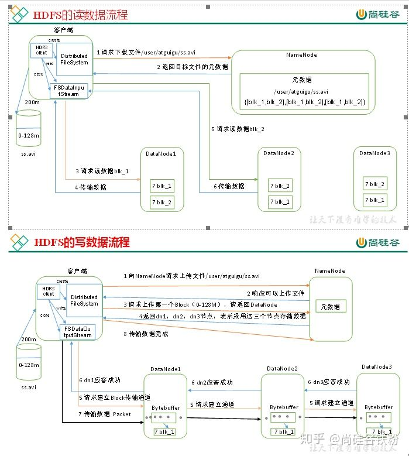
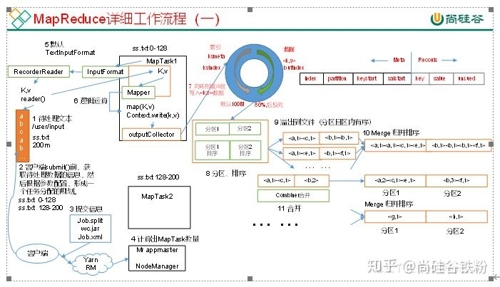
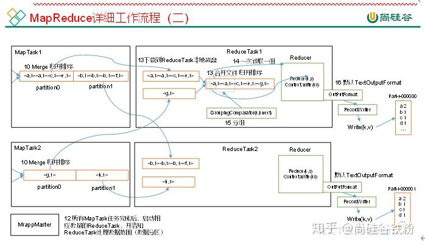
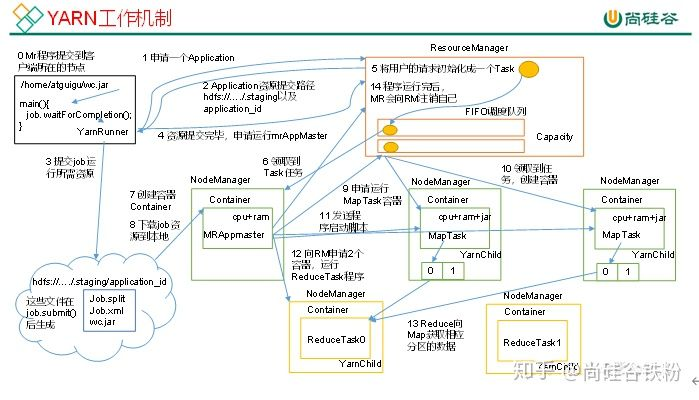

# Hadoop 面试题二

原文：https://www.toutiao.com/a6836923553401537028/?channel=&source=search_tab


## 1. Hadoop基础

### 1.1 Hadoop常用端口

|                    | Hadoop2.x | Hadoop 3.x |
| ------------------ | --------- | ---------- |
| 访问HDFS端口       | 50070     | 9870       |
| 访问MR执行情况端口 | 8088      | 8088       |
| 历史服务器         | 19888     | 19888      |
| 客户端访问集群端口 | 9000      | 8020       |

### 1.2 Hadoop配置文件以及简单的集群搭建

#### 1 配置文件

| 版本       | 配置文件                                                     |
| ---------- | ------------------------------------------------------------ |
| hadoop 2.x | core-site.xml, hfs-site.xml, mapped-site.xml, yarn-site.xml, slaves |
| hadoop 3.x | core-site.xml, hfs-site.xml, mapped-site.xml, yarn-site.xml, workers |

#### 2 简单的集群搭建过程

* JDK 安装
* 配置SSH免密登陆
* 配置hadoop核心文件
* 格式化NameNode

### 1.3 HDFS读流程和写流程



### 1.4 HDFS小文件处理

#### 1.4.1 小文件会有什么影响

每个文件块，都会把元数据注册到NameNode，而且不管文件大小，这些元数据都需要一定格式的信息，换句话说，不论文件大小，都会占据NameNode相同大小的内存。如果文件小，那么数量就会很大，进而占据大量NameNode的内存空间。

举例说明：**一个文件块，会占用NameNode大约150字节的内存**，那么1亿个小文，就会占用 $150 * 10^{9} bytes \thickapprox 150 * 10^6 Mb \thickapprox 150 * 10^3 Gb$。一般的服务器都没有这么多的内存。而目前 Hadoop 的 NameNode 也没有 Cluster 模式。

#### 1.4.2 如何解决影响

* 采用tar归档方式，将小文件归档
* 采用CombineTextInputFormat
* **在小文件场景开启JVM重用**；如果没有小文件，不要开启JVM重用，因为会一直占用使用到的task卡槽，直到任务完成才释放

JVM重用可以使得JVM实例在同一个job中重新使用N次，N的值可以在Hadoop的mapred-site.xml文件中进行配置。通常在10-20之间：

```xml
<property>
    <name>mapreduce.job.jvm.numtasks</name>
    <value>10</value>
    <description>
        How many tasks to run per jvm,if set to -1 ,there is no limit
    </description>
</property>
```

### 1.5 Shuffle及其优化

#### 1.5.1 shuffle过程



1. 需要处理的文本文件是 /user/input/ss.txt，约 200M 大小

2. 客户端 submit 前，获取等待处理数据的信息，然后根据参数配置，形成一个任务分配规划，如：分成两个数据包

   ss.txt 0-127M

   ss.txt 128-200M

3. 提交信息

4. 根据配置信息（Yarn RM、Job.xml、Job.split）等计算出 MapTask数量

5. 





## 2. Hadoop优化

### 2.1 Map阶段

* 增大环形缓冲区大小。由100M扩大到200M
* 增大环形缓冲区溢写的比例。由80%扩大到90%
* 减少对溢写文件的merge次数。（10个文件，一次20个merge）
* 不影响实际业务的前提下，采用Combiner提前合并，减少 I/O

### 2.2 Reduce阶段

* **合理设置Map和Reduce数**：两个都不能设置太少，也不能设置太多。太少，会导致Task等待，延长处理时间；太多，会导致Map、Reduce任务间竞争资源，造成处理超时等错误
* **设置Map、Reduce共存**：调整 slowstat.completedmaps 参数，使Map运行到一定程度后，Reduce也开始运行，减少 Reduce 等待时间
* **规避使用Reduce**：因为Reduce在用于连接数据集的时候将会产生大量的网络消耗
* 增加每个Reduce去Map中拿数据的并行数
* 集群性能可以的前提下，增大Reduce端存储数据内存的大小

### 2.3 I/O传输

采用数据压缩的方式，减少网络I/O的时间。安装Snappy和LZOP压缩编码器。

* map输入端主要考虑数据量大小和切片，支持切片的由BZip2、LZO。注意：LZO要想支持切片必须创建索引
* map输出端主要考虑速度，速度快的snappy、LZO
* reduce输出端主要看具体需求。例如作为下一个MR输入需要考虑切片，永久保存要考虑压缩比，比如用压缩比大的gzip

### 2.4 整体

* yarn.nodemanager.resource.memory-mb：NodeManager 默认内存是8G，需要根据服务器实际配置灵活设置。例如：128G内存，配置为100G内存左右 
* yarn.scheduler.maximum-allocation-mb：单任务默认内存8G，需要根据该任务的数据量灵活调整。例如：128M数据，配置1G内存
* mapreduce.map.memory.mb：控制分配给MapTask内存上限，如果超过会kill掉进程（报：Container is running beyond physical memory limits. Current usage: 565MB of 512MB physical memory used; Killing Container）。默认内存大小为1G；如果数据量是128M，正常不需要调整内存；如果数据量大于128M，可以增加MapTask内存，最大可以增加到4-5G
* Mapreduce.reduce.memory.mb：控制分配给ReductTask内存上限。默认内存大小为1G。如果数据量是128M，正常不需要调整内存；如果数据量大于128M，可以增加ReduceTask内存大小为4-5G
* mapreduce.map.java.opts：控制MapTask堆内存大小（如果内存不够，报java.lang.OutOfMemoryError）
* mapreduce.reduce.java.opts：控制ReduceTask堆内存大小（如果内存不够，报java.lang.OutOfMemoryError）
* 可以增加MapTask的CPU核数，增加ReduceTask的CPU核数
* 增加每个Container的CPU核数和内存大小
* 在hdfs-site.xml文件中配置多目录
* NameNode有一个工作线程池，用来处理不同DataNode的并发心跳以及客户端并发的元数据操作。 dfs.namenode.handler.count=20*log2(Cluster Size)，比如集群规模为10台时，此参数设置为60

## 3 Yarn工作机制


## 4 Hadoop宕机

1. 如果MR造成系统宕机，此时要控制Yarn同时运行的任务数，和每个任务申请的最大内存。调整参数：yarn.scheduler.maximum-allocation-mb （单个任务可申请的最多物理内存量，默认时8192M）
2. 如果写入文件过快造成NameNode宕机，那么调高Kafka的存储大小，控制从Kafka到HDFS的写入速度。例如：可以调整Flume每批次拉取数据量的大小参数batchsize……


## 5. Hadoop解决数据倾斜方法

### 5.1 提前在map进行combine，减少传输的数据量

在Mapper加上 combiner 相当于提前进行reduce，即把一个mapper中相同的key进行了聚合，减少shuffle过程中传输的数据量，以及reducer端的计算量

如果导致数据倾斜的key大量分布在不同的mapper的时候，这种方法就不是很有效了。

### 5.2 导致数据倾斜的key大量分布在不同的mapper

* 局部聚合 + 全局聚合

  第一次，在map阶段，对那些导致了数据倾斜的 key 加上 1 到 n 的随机前缀，这样本来相同的key也会被分到多个reducer中进行局部聚合，数量就会大大降低

  第二次mapreduce，去掉key的随机前缀，进行全局聚合

  思路：两次mr，第一次将key随机散列到不同的reducer进行处理，达到负载均衡的目的；第二次在根据去掉key的随机前缀，按原key进行reduce处理。

  这个方法进行两次map-reduce，性能稍差。

* 增加Reducer，提升并行度JobConf.setNumReduceTasks(int)

* 实现自定义分区

​        根据数据分布情况，自定义散列函数，将key均匀分配到不同的reducer

## 6 集群资源分配参数

集群中有30台机器，跑MR任务的时候发现5个map任务全部都分配到了同一台机器上，这个可能是由于什么原因导致的呢？

解决方法：yarn.scheduler.fair.assignmultiple 这个参数默认是开着的，需要关闭。