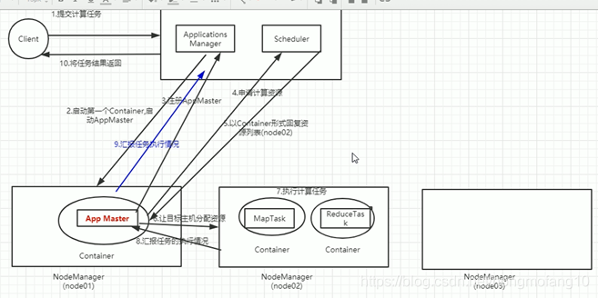

# yarn 介绍

原文：https://blog.csdn.net/hongmofang10/article/details/114450888

## 1. yarn主要作用

​        yarn的基本设计思想是，将MapReduce V1 中的 JobTracker 拆分成两个独立的服务：ResourceManager 和 ApplicationMaster。ResourceMaster 负责整个系统的资源管理和分配，ApplicationMaster 负责单个应用程序的管理。

​        yarn解决的问题：

* yarn最主要的功能就是解决运行的用户程序与yarn框架完全解耦
* yarn上可以运行各种类型的分布式运算程序（mapreduce只是其中一种），比如：mapreduce、storm程序、spark程序……

## 2. yarn结构

​        yarn 总体上是 master/slave 结构，主要有 ResourceManager、NodeManager、ApplicationMaster 和 Container 等几个组件组成。

### 2.1 RM

​        RM 是一个全局的资源管理器，负责整个系统的资源管理和分配，它主要由两个部分组成：调度器（Scheduler）和应用程序管理器（Application Manager）。

​        调度器根据容器、队列等限制条件，将系统中的资源分配给正在运行的应用程序，在保证容量、公平性和服务等级的前提下，优先集群资源利用率，让所有的资源都被充分利用。

​        应用程序管理器负责管理整个系统中的所有的应用程序，包括应用程序的提交、与调度器协商资源以启动ApplicationMaster、监控ApplicationMaster运行状态并在失败时重启它。

### 2.2 AppMaster

​        用户提交的一个应用程序会对应于一个ApplicationMaster，它的主要功能有：

* 与RM调度器协商以获得资源，资源以Container表示
* 将得到的任务进一步分配给内部的任务
* 与NameNode通信以启动/停止任务
* 监控所有的内部任务状态，并在任务运行失败的时候重新为任务申请资源以重启任务

### 2.3 NodeManager

​         NodeManager 是每个节点上的资源和任务管理器。一方面，它会定期地向RM汇报本节点上的资源使用情况和各个Container的运行状态；另一方面，它接收并处理来自AM的Container启动和停止请求。

### 2.4 Container

​        yarn 中的资源抽象，它封装了某个节点上的多维度资源，如内存、CPU、磁盘、网络等。AppMaster向NodeManager申请资源的时候，资源是以Container的形式表示的。一个应用程序会分配一个Container，这个应用程序只能使用这个Container中描述的资源。不同于MapReduce V1 中槽位slot的资源封装，Container是一个动态资源的划分单位，更能充分利用资源。

## 3. yarn的工作流程

## 4. yarn调度器

### 4.1 FIFO Scheduler （队列调度器）

​        按任务提交的顺序排成一个队列，这是一个先进先出队列。在进行资源分配的时候，先给队列中最头上的任务分配资源，然后再分配给下一个。这是最简单也是最容易理解的调度器，但是它不适用与共享集群，大的任务会占用所有的集群资源，这就导致其它任务被阻塞。

### 4.2 Capacity Scheduler（容器调度器）

​        Capacity调度器允许多个组织共享整个集群，每个组织可以获得集群的一部分计算能力。通过为每个组织分配专门的队列，然后再为每个队列分配一定的集群资源，这样整个集群就可以通过设置多个队列的方式为多个组织提供服务了。除此之外，队列内部又可以垂直划分，这样一个组织内部的多个成员就可以共享这个队列资源。而在一个队列的内部，资源的调度采用的是先进先出策略。

### 4.3 Fair Scheduler（公平调度器）

​        Fair调度器的设计目的是为所有的应用分配公平的资源（对公平的定义可以通过参数来设置）。公平调度也可以在多个队列间工作。

​        举个例子，假设有两个用户A和B，它们分别拥有一个队列。当A启动一个job而B没有任务时，A会获得全部集群资源；当B启动一个job后，A的job会继续运行，不过一会儿之后两个任务会各自获得一半的集群资源。如果此时B在启动第二个job并且其它job还在运行，则它将会和B的第一个job共享B这个队列的资源，也就是B的两个job会用于四分之一的集群资源，而A的job仍然用于集群一半的资源，结果就是资源最终在两个用户之间平等的共享。

## 5. yarn高可用

​        YARN ResourceManager的高可用与HDFS NameNode 的高可用类似，但是 ResourceManager不像 NameNode，没有那么多的元数据信息需要维护，所以它的状态信息可以直接写到Zookeeeper上，并依赖Zookeeper来进行主备选举。

