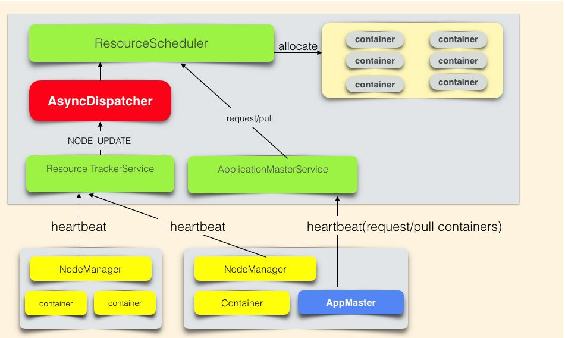

# Hadoop YARN：调度性能优化实践

原文：https://mp.weixin.qq.com/s?__biz=MzU3MzgwNTU2Mg==&mid=2247486174&idx=2&sn=f2272f4733cd3793aa64f312c44c40e8&chksm=fd3d4c4bca4ac55d297749c24e296af14da8e7fa491b4bad726f9925a55529d8c6c3605c3f74&scene=21#wechat_redirect


## 背景介绍

​        YARN 是 Hadoop 的资源管理系统，负责Hadoop集群上计算资源的管理和作业调度。

​        美团的YARN以社区2.7.1版本为基础构建分支，支撑离线业务、实时业务以及机器学习业务。

* 离线业务主要运行的是 Hive on MapReduce，Spark SQL为主的数据仓库作业
* 实时业务主要运行Spark Streaming，Flink为主的实时流计算作业
* 机器学习业务主要运行TensorFlow， MXNet，MLX等计算作业

​          YARN面临高可用、可扩展、稳定性的问题很多。其中扩展性上遇到最严重的是集群和业务规模增长带来的调度器性能问题。从业务角度看，假设集群1000台节点，每个节点提供100个CPU的计算能力。每个任务使用1个CPU，平均执行时间1分钟。集群在高峰期始终有超过10万CPU的资源需求。集群的调度器平均每分钟只能调度5万的任务。从分钟级别观察，集群资源使用率是50000/(100*1000)=0.5，那么集群就有50%的计算资源因为调度能力的问题而无法使用。

​        随着集群规模扩大以及业务量的增长，集群调度能力会随着压力增加而逐渐下降。假设调度能力依然保持不变，每分钟调度5万个任务，按照5000台节点的规模计算，如果不做任何优化改进，那么集群资源使用率为：50000/(100*5000) = 0.1，剩余90%的机器资源便无法被利用起来。

​        这个问题解决后，集群在有空余资源的情况下，作业资源需求可以快速得到满足，集群的计算资源得到充分利用。

​        下面逐步将Hadoop YARN调度系统的核心模块展开说明，揭开上述性能问题的根本原因，提出系统化的解决方案，最终Hadoop YARN达到支撑单集群万级别节点，支持并发运行数万作业的调度能力。

## 整体架构

### YARN架构

​        YARN负责作业资源调度，在集群中找到满足业务的资源，帮助作业启动任务，管理作业的生命周期。

​        YARN详细的架构设计请参考Hadoop官方文档。 - 回头补充到这里

### 资源抽象

​        YARN在CPU、Memory这两个资源维度对集群资源做了抽象。

```java
class Resource{
  int cpu;       //cpu核心个数
  int memory-mb; //内存的MB数
}
```

​        作业向YARN申请资源的请求是：List<ResourceRequest>

```java
class ResourceRequest{
  int numContainers;  //需要的container个数
  Resource capability;//每个container的资源
}
```

​        YARN对作业响应是：List<Container>

```java
class Container{
  ContainerId containerId; //YARN全局唯一的container标示
  Resource capability;     //该container的资源信息
  String nodeHttpAddress;  //该container可以启动的NodeManager的hostname
}
```

### YARN调度框架



​        **名词解释：**

* ResouceScheduler是YARN的调度器，负责Container的分配
* AsyncDispatcher是单线程的事件分发器，负责向调度器发送调度事件
* ResourceTrackerService是资源跟踪服务，主要负责接收处理NodeManager的心跳信息
* ApplicationMasterService是作业的RPC服务，主要负责接收处理作业的心跳信息
* AppMaster是作业的程序控制器，负责跟YARN交互获取/释放资源

​        **调度流程：**

1. 作业资源申请过程，AppMaster通过心跳告知YARN资源需求（List<ResourceRequest>），并取回上次心跳之后，调度器已经分配好的资源（List<Container>）
2. 调度器分配资源流程是：NodeManager心跳触发调度器为该NodeManager分配Contianer

​        资源申请和分配是异步进行的。ResourceScheduler是抽象类，需要自行实现。社区实现了公平调度器（FairScheduler）和容量调度器（CapacityScheduler）。美团采用公平调度器。

### 公平调度器

#### 作业的组织方式

​        在公平调度器中，作业（App）是挂载如下图的树形队列的叶子：


#### 核心调度流程


1. 调度器锁住FairScheduler对象，避免核心数据结构冲突
2. 调度器选取集群的一个节点（Node），从树形队列的跟节点ROOT开始出发，每层队列都会按照公平策略选择一个子队列，最后在叶子队列按照公平策略选择一个App，为这个App在Node上找一块适配的资源。

​        对于每层队列进行如下路程：

1. 队列预先检查：检查队列的资源使用量是否已经超过了队列的Quota
2. 排序子队列/App：按照公平调度策略，对子队列/App进行排序
3. 递归调度子队列/App

​        例如：某次调度的路径是ROOT -> ParentQueueA -> LeafQueueA1 -> App11，这次调度会从Node上给App 11 分配Container。

#### 伪代码

```java
class FairScheduler{
  /* input：NodeId
   * output：Resource 表示分配出来的某个app的一个container的资源量
   * root 是树形队列Queue的根
   */
  synchronized Resource attemptScheduling(NodeId node){
    root.assignContainer(NodeId); 
  }
}

class Queue{
  Resource assignContainer(NodeId node){
    if(! preCheck(node) ) return;  //预先检查
      sort(this.children);  //排序
    if(this.isParent){
      for(Queue q: this.children)
        q.assignContainer(node);  //递归调用
    }else{
      for(App app: this.runnableApps)
        app.assignContainer(node); 
    }
  }
}

class App{
  Resource assignContainer(NodeId node){
    ......
  }
}
```

#### 公平调度器架构

​        公平调度器是一个多线程异步协作的架构，而为了保证调度过程中数据的一致性，在主要的流程中加入了FairScheduler对象锁。其中**核心调度流程是单线程执行的**。这意味着Container分配是串行的，这**是调度器存在性能瓶颈的核心原因**。


* Scheduler Lock：FairScheduler对象锁
* AllocationFileLoaderService：负责公平策略配置文件的热加载，更新队列数据结构
* Continuous Scheduling Thread：核心调度线程，不停地执行上节的核心调度流程
* Update Thread：更新队列资源需求，执行Container抢占流程等
* Scheduler Event Dispatcher Thread：调度器事件的处理器，处理App新增，App结束，Node新增，Node移除等事件

### 性能评估

​        YARN的公平调度器的架构，在大规模的业务压力下，这个系统存在性能问题。从应用层的表现看，作业资源需求得不到满足。从系统模块看，多个模块协同工作，每个模块多多少少都存在性能问题。如何评估系统性能已经可以满足线上业务的需求呢？如何评估系统的业务承载能力呢？需要找到一个系统的性能目标。因此，在谈性能优化方案之前，需要先说一说调度系统性能评估的方法。

​        一般来说，在线业务的性能是用该系统能够承载的QPS和响应的TP99延迟时间来评估，而调度系统与在线业务系统不同的是：调度系统的性能**不能**用RPC（ResoucreManager接收NodeManager和AppMaster的RPC请求）的相应延迟来评估。原因是：这些RPC调用过程跟调度系统的调度过程是异步的，因此不论调度性能多么差，RPC响应几乎不受影响。同理，不论RPC相应多么差，调度性能也几乎不受影响。

### 业务指标：有效调度

​        首先从满足业务需求角度分析调度系统的业务指标。调度系统的业务目标是满足业务资源需求。指标是：有效调度（validSchedule）。在生产环境，只要validSchedule达标，就可以认为目前调度器是满足线上业务需求的。
