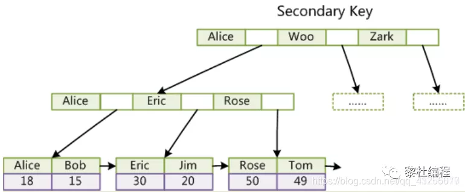
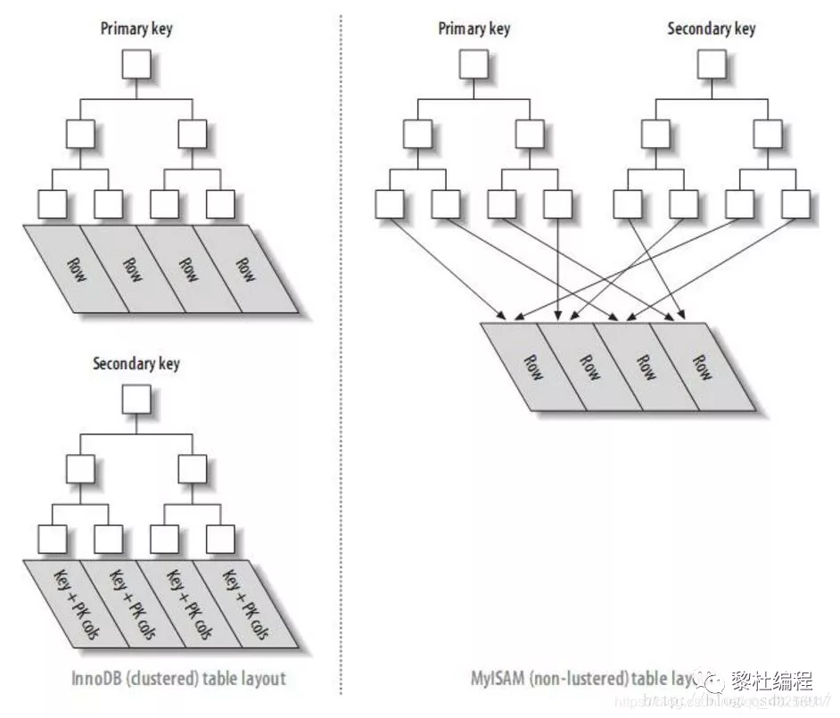

# 20道面试题，熟练掌握MySQL基本知识

原文：https://www.toutiao.com/a7009496922700694029/?channel=&source=search_tab

### 1. 什么是MySQL的事务？事务的四大特性？事务带来了什么问题？

​        MySQL 中，事务的隔离级别分为四大等级：**读未提交**（READ UNCOMMITTED）、**读提交**（READ COMMITTED）、**可重复度**（REPEATABLE READ）、**串行化**（SERIALIZABLE）。

​        在 MySQL 中，事务的四大特性主要包含：**原子性**（Atomicity）、**一致性**（Consistent）、**隔离性**（Isolation）、**持久性**（Durable），简称ACID。

* **原子性**：事务的原子性操作，对数据的修改要么全部执行，要么全部失败，实现事务的原子性，是**基于日志的 redo/undo 机制**
* **一致性**：执行事务前后的状态要一致，可以理解为数据的一致性
* **隔离性**：侧重指事物之间相互隔离，不受影响，这个与事务设置的隔离级别有密切的关系
* **持久性**：一个事务提交后，这个事务的状态会被持久化到数据库中，也就是事务提交，对数据的新增、更新都将会持久化到数据库中

​        大部分的公司一般选择Mysql默认的隔离级别：**可重复读**。

​        隔离级别从：**读未提交-读提交-可重复读-串行化**，**级别越来越高，隔离也就越来越严实，到最后的串行化，当出现读写锁冲突的时候，后面的事务只能等前面的事务完成后才能继续访问**。

1. 读未提交：读取到别的事务还没有提交的数据，从而产生了**脏读**
2. 读提交：读取到别的事务已经提交的数据，从而产生了不可重复度
3. 可重复读：事务开启过程中看到的数据和事务刚开始看到的数据是一样的，从而产生了**幻读**。在 MySQL 中通过MVCC多版本控制的一致性视图解决了不可重复读问题以及通过间隙锁解决了幻读问题
4. 串行化：对于同一行记录，若是读写锁发生冲突，后面访问的事务只能等前面的事务执行完成才能继续访问

​        举个例子，假设有一个 User 表，里面有两个字段 id 和 age，里面有一条测试数据：（1，24），现在要执行 *age + 1* ，同时有两个事务执行：

| 事务1                      | 事务2              |
| -------------------------- | ------------------ |
| 启动事务，接着查询 age(a1) |                    |
|                            | 启动事务           |
|                            | 查询 age(a2)       |
|                            | 执行 age = age + 1 |
| 查询 age( a3 )             |                    |
|                            | 提交事务           |
| 查询 age( a4 )             |                    |
| 提交事务                   |                    |
| 查询 age( a5 )             |                    |

​        经过上面的执行，在四种隔离级别下，a1、 a2、 a3、 a4、 a5 的值分别是多少呢？现在来认真的分析一下：

1. 读未提交：a1 和 a2 因为读的初始值，所以是24，隔离级别为“读未提交”，事务2 执行了 age = age +1，不管事务2 是否提交，那么 a3、a4 和 a5 的值都是25
2. 读提交：a1 和 a2 因为读的是初始值，所以是24，隔离级别为“读提交”，所以 a3 还是24，a4 和 a5 因为事务2 已经提交了，所以得到的值是 25
3. 可重复度：a1 和 a2 因为读的是初始值，所以是24，隔离级别为“可重复度”，所以 a3 和 a4 读取的值和事务开始的结果一样，所以还是24，a5 前一步因为已经提交了事务，所以 a5 的值是 25
4. 串行化：a1 和 a2 因为读的是初始值，所以是24，隔离级别为“串行化”，当前事务2 修改数据的时候，获取了写锁，事务1 读取 age 的值会被锁定，所以在事务1 的角度下，a3 和 a4 读取的值都是24，a5的值为25

### 2. 详细了解过 MVCC吗？它是如何工作的？

​        MVCC 叫做**多版本控制**，实现 MVCC 时用到了**一致性视图**，用于支持**读提交**和**可重复读**的实现。

​        对于一行数据，若是想实现可重复度，或者能够读取数据的另一个事务未提交前的原始值，那么必须对原始数据进行保存或者对更新操作进行保存，这样才能够查询到原始值。

​        在 MySQL 的 MVCC 中规定，**每一行数据都有多个不同的版本，一个事务更新操作完成后就生成一个新的版本**，并不是对全部数据的全量备份，因为全量备份的代价太大了：


​        如途中所示，加入三个事务更细了同一行数据，那么就会有对应的 v1、v2、v3 三个数据版本，每一个事务在开始的时候都获得一个唯一的事务 id（Transaction Id），并且是顺序递增的，并且这个事务 id 最后会赋值给 row trx_id，这样就形成了一个唯一的一行数据版本。

​        实际上，版本1、版本2 并非实际物理存在的，而途中的 U1 和 U2 实际就是 undo log 日志（回滚日志），这 v1、v2 版本时根据当前 v3 的 undo log 计算出来的。

​        InnoDB 引擎就是利用每行数据有多个版本的特性，实现了秒级创建“快照”，并不需要花费大量的时间。

### 3. MySQL的 InnoDB 和 MyISAM 有什么区别？

* **InnoDB** 和 **MyISAM** 都是 MySQL 的存储引擎，现在 MyISAM 也逐渐被 InnoDB 给替代了，**主要是因为 InnoDB 支持事务和行级锁，而 MyISAM不支持，MyISAM 最小锁单位是表级**。因为 MyISAM 不支持行级锁，所以在并发处理能力上 InnoDB会比 MyISAM 好。

* **数据的存储上**：

  * MyISAM 的索引也是由 **B+树构成**，但是树的叶子节点存的是**行数据的地址**，查找时需要找到叶子节点的地址，再根据叶子节点地址查找数据。

    

  * InnoDB 的主键索引的叶子节点直接就是存储行数据，查找主键索引树就能获得数据

    

    若是根据非主键索引查找，非主键索引的叶子节点存储的就是，当前索引值以及对应的主键的值，若是联合索引存储的就是联合索引值和对应的主键值。

    

* **数据文件构成**：MyISAM 有三种存储文件，分别是扩展名为 ***.frm*** （文件存储表定义）、***.MYD***（MyData数据文件）、***.MYI***（MYIndex索引文件）。而 InnoDB 的表只受限于操作系统文件的大小，一般是 2GB

* **查询区别**：对于读多写少的业务场景，MyISAM 会更加合适，对于 updagte 和 insert 比较多的场景，InnoDB 会比较合适

* **count(*)区别**：select count(*) from table, MyISAM 引擎会查询已经保存好的行数，这是不加 where条件下；而 InnoDB 需要全表扫描一遍，InnoDB 并没有保存表的具体行数

* **其他区别**：InnoDB 支持外键，但是不支持全文索引；而 MyISAM 不支持外键，支持全文索引，InnoDB 的主键范围比 MyISAM的大

### 4. 一条查询语句的执行流程

​        当 MySQL 执行一条查询的SQL时，大概发生了以下的步骤：

1. 客户端发送查询语句到服务器
2. 服务器首先进行用户名、密码的验证以及权限的校验
3. 然后会检查缓存中是否存在该查询。若存在，返回缓存中存在的结果，若是不存在就进行下一步。*注意：MySQL 8 就把缓存这块给砍掉了*
4. 接着，进行语法和词法的分析，对 SQL 的解析、语法检测和预处理，再由优化器生成对应的执行计划
5. MySQL 的执行器根据优化器生成的执行计划执行，调用存储引擎的接口进行查询。服务器查询的结果返回给客户端

​        MySQL 中语句的执行都是**分层执行**，每一层执行的任务都不同，直到最后拿到结果返回。这里的分层，**主要分为 Service 层和引擎层**。

​        在 Servcie层中，包含：连接器、分析器、优化器、执行器；引擎层以插件的形式可以兼容各种不同的存储引擎，主要包含的有 InnoDB 和 MyISAM 两种存储引擎。具体的执行流程如下图所示：


### 5. redo log 和 binlog 了解吗？

#### 5.1 redo log

​        redo log 日志也叫做 **WAL技术（Write-Ahead Logging），它是一种先写日志，并更新内存，最后再更新磁盘的技术**。就是为了减少 SQL 执行期间的数据库 IO 操作，并且更新磁盘往往是在 MySQL 比较闲的时候，这样就大大减轻了 MySQL 的压力。

​        **redo log 是固定大小的，是物理日志**，属于 InnoDB 引擎的，并且写 redo log 是环状写日志的形式：


​        如上图所示：若是四组的 redo log 文件，一组为 1G 的大小，那么四组就是 4G 的大小，其中 **write pos 是记录当前的位置**，有数据写入当前位置，那么 write pos 就会边写入边往后移。

​        **check point 记录擦除的位置**，因为 redo log 是固定大小，所以当 redo log 满的时候，也就是 write pos 追上 check point 的时候，需要清除 redo log 的部分数据，清除的数据会被持久化到磁盘中，然后将 check point 向前移动。

​        redo log 日志实现了即使在数据库出现异常宕机的时候，重启后，之前的记录也不会丢失，这就是 crash-safe 能力。

#### 5.2 bin log 

​        **bin log 成为归档日志，是逻辑上的日志**，它属于 MySQL 的 Server 层面的日志，记录着 SQL 的原始逻辑，主要有两种模式：一个是 statement 格式记录的原始的SQL，而 row 格式则是记录行的内容。

#### 5.3 小结

​        redo log 和 bin log 记录的形式、内容不同，这两者日志都能通过自己记录的内容恢复数据。之所以这两个日志同时存在，是因为刚开始 MySQL 自带的引擎 MyISAM 就没有 crash-safe 功能，并且在此之前 MySQL 还没有 InnoDB 引擎，MySQL 自动的 bin log 日志只是用来归档的，所以 InnoDB 引擎也就通过自己的 redo log 日志来实现 crash-safe 功能。

### 6. 线上要给热点数据表添加字段该如何操作？

​        **首先**，给表加一个字段，**会导致扫描全表数据，并且会加 *MDL* 写锁**，所以在线上操作一定要谨慎再谨慎，有可能还没操作完就导致数据库崩了。

​        **其次**，可以通过 ***alter table*** 后设定等待的时间，若是获取不到锁，后面再进行尝试，并且可以选择访问量比较小的时间段进行获取。

​        若是能获取到锁最好，当然即使获得了锁，也要不阻塞后面的业务语句，一切都是以业务优先为原则。

### 7. MySQL 的索引底层如何实现？为什么不用有序数组、hash或者二叉树实现索引？

​        MySQL 的索引是一种加快查询速度的数据结构，索引就好比书的目录，能够快速的定位要查找的位置。

​        MySQL 的索引底层是使用 **B+树**的数据结构实现的，结构如下：


​        索引的一个数据页的大小是 ***16kb***，从磁盘加载到内存中是**以数据页的大小为单位进行加载**，然后为查询操作服务，若是查询的数据不在内存中，才会从磁盘再次加载到内存中。

​        索引的实现有很多，比如 Hash。Hash 是以 key-value 的形式进行存储，适用于等值查询的场景，查询的时间复杂度为$O(1)$，因为 **hash存储并不是有序的，所以对于范围查询就可能要遍历所有数据进行查询**，而且**不同值的计算还会出现 hash 冲突**，所以 hash 并不适合做 MySQL 索引。

​        **有序数组**在等值查询和范围查询性能都是非常好的，那么为什么也不用有序数组作为索引呢？因为**对于数组而言，作为索引更新的成本太高，新增数据要把后面的数据都往后移一位**，所以也不采用有序数组作为索引的底层实现。

​        最后是**二叉树**，主要**是因为二叉树只有二叉，一个节点存储的数据量非常有限，需要频繁的随机 IO 读写磁盘**，若是数据量大的情况下，二叉的树高太高，严重影响性能，所以不能采用二叉树实现。

​        而 **B+树**是多叉树，一个数据页的大小是16kb，在 1-3 的树高就能存储 10 亿级以上的数据，也就是只要访问磁盘 1-3 次就足够了，并且 **B+树的叶子节点上一个叶子节点有指针指向下一个叶子节点，便于范围查询**：


### 8. 怎么查看索引是否生效？什么情况下索引会失效？

​        查看索引是否起作用，可以使用 ***explain*** 关键字，查看后的语句中的 key 字段，若是使用了索引，该字段会展示索引的名字。如下图所示：


​        索引失效的几种可能：

* where 条件查询中使用了 ***or*** 关键字，有可能使用了索引进行查询也会导致索引失效，若是使用 ***or*** 关键字，又不想索引失效，只能在 ***or*** 的所有列上都建立索引

  

* 条件查询中使用 ***like*** 关键字，**并且不符合**最左前缀原则，会导致索引失效

  

* 条件查询的字段是**字符串**，而错误的使用 where column = 123 数字类型，也会导致索引失效

  

* 对于**联合索引查询不符合最左前缀原则**，也会导致索引失效，如：

  ```sql
  // name左边的列,age 右边的列
  alter table user add index union_index(name, age);
  // 会用到索引
  select * from user where name = 'lidu';
  // 不会用到索引
  select * from user where age = 18
  ```

* 在 **where条件查询的后面对字段进行 null 值判断**，会导致索引失效。解决的办法就是可以把 null 改成 0 或者 -1 这些特殊的值替代：

  ```sql
  select id from table where num is null;
  ```

* 在 **where 子句中使用 !=, <> 这样的符号**，也会导致索引失效

  ```sql
  select id from table where num != 0;
  ```

* where 条件子句中 ***=*** 的**左边**使用**表达式操作**或者**函数操作**，也会导致索引失效

  ```sql
  select id from user where age / 2 = 1;
  select id from user where substring(name, 1,2) = 'lidu';
  ```

  

### 9. 有哪些种类的索引？

​        索引从**数据结构**角度进行划分为：B+树索引、hash索引、R-Tree索引、FullText索引

​        索引从**物理存储**角度划分为：聚簇索引、非聚簇索引

​        索引从**逻辑**的角度划分为：主键索引、普通索引、唯一索引、联合索引以及空间索引

### 10. 平时如何优化SQL？

​        SQL的优化**主要是对字段添加索引**，主要包含有四种索引（**主键索引/唯一索引/全文索引/普通索引**），以及结合具体的业务场景分析具体使用什么索引最合理。

​        ***explain*** 可以在不真正执行某个SQL的情况下，就分析MySQL如何执行当前SQL的：


1. id：查询的序列号
2. select_type：查询类型
3. table：查询表名
4. type：扫描方式，all 表示全表扫描
5. possible_keys：可能使用到的索引
6. key：实际使用到的索引
7. rows：该 sql 扫描了多少行
8. Extra：sql 语句额外的信息，比如排序方式

#### 10.1 SQL 优化方法

1. 对于条件查询，首先考虑在条件 where 和 order by 后的字段建立索引
2. 避免索引失效，避免 where 条件后进行 null 值的判断
3. 避免 where 后使用 **!=** 或者 **<>** 操作符
4. 避免在 where 后面使用函数
5. 避免 where 条件后使用 or 关键字连接

#### 10.2 索引种类

​        另一方面，考虑建立哪种索引比较合适，这里以普通索引和唯一索引进行举例说明。

​        假如业务场景是**读多写少**的情况，那么 SQL 查询请求过来，并假设数据已经在缓存中，获取到数据后就直接返回；假设数据不在缓存中，就会加载磁盘到内存中再返回，对于这种场景可能对于普通索引和唯一索引的选择，性能上并没有明显的区别。但是，一般建议选择普通索引。

​        在**写多读少**的场景下，这两者索引的选择对性能的影响就比较大了。对于普通索引的写，不管数据是否存在于内存中，都会先写入内存中的一小块叫做 **change buffer** 内存中，然后通过后台刷盘，一般会选择 MySQL 比较闲的时候进行刷盘。

​        而唯一索引就不同了，因为它要确保索引的唯一性，索引写数据的时候，假设数据不在内存中，要先从磁盘中加载数据到内存，然后比较是否唯一，所以唯一索引就不能使用 change buffer 的优化机制，会频繁的进行随机的磁盘 IO。

### 11. 什么是聚簇索引和非聚簇索引？

​        **聚簇索引**和**非聚簇索引**的主要区别是：聚簇索引的叶子节点是数据节点，而非聚簇索引的叶子节点存储仍然是索引节点，只不过有指向对应数据块的指针。

​        这两者的区别就是来对比 InnoDB 和 MyISAM 的数据结构的。假设有一个表，原始数据如下表所示：

| Row number | col1 | Col2 |
| ---------- | ---- | ---- |
| 0          | 99   | 8    |
| 1          | 12   | 56   |
| 2          | 3000 | 62   |
| ……         | ……   | ……   |
| 9997       | 18   | 8    |
| 9998       | 4700 | 13   |
| 9999       | 3    | 93   |

​        那么，在 MyISAM 的索引中数据的存储结构如下图所示：


​        MyISAM 以叶子节点存储的 Row Number 来找到对应的行数据，也就是**叶子节点存储的是行指针**，这也可以发现 MyISAM 引擎中数据文件( .MYI ) 和索引文件( .MYD ) 是分开的，索引 MyISAM 的查询索引树后，需要根据行指针二次的进行定位。

​        而在 InnoDB 的主键索引存储的结构是如下图所示：


​        InnoDB 的主键索引中，叶子节点并不是存储行指针，而是**存储行数据**，二级索引中 MyISAM 也是一样的存储方式，InnoDB 的二级索引的叶子节点则是存储当前索引值以及对应的主键索引值。

​        InnoDB 的二级索引带来的好处就是，**减少了由于数据移动或者数据页分列导致行数据的地址变了而带来的维护二级索引的性能开销**，因为 InnoDB 的二级索引不需要更新行指针：



### 12. 什么是回表？回表是怎么产生的？

​        InnoDB 引擎的主键索引存储的是行数据，二级索引的叶子节点存储的是索引数据以及对应的主键，所以**回表就是根据索引进行条件查询，回到主键索引树进行搜索的过程**：


​        因为查询还要回表一次，再次查询主键索引树，所以实际中应该尽量避免回表的产生。

### 13. 如何解决回表问题？

​        **解决回表问题可以建立联合索引进行索引覆盖**，如图所示，根据 name 字段查询用户的 name 和 sex 属性，出现了回表问题：


​        那么可以建立下面的联合索引来解决：

```sql
creat table user {
  id int primary key,
  name varchar(20),
  sex varchar(5),
  index(name, sex)
} engine = innodb;
```

建立了上面的联合索引 - *index(name, sex)*，在二级索引的叶子节点的位置就会同时出现 sex 字段的值，因为能够获取到要查询的所有字段，也就不用再回表查询一次了。

### 14. 什么是最左前缀原则?

​        **最左前缀原则，可以是联合索引的最左N个字段，也可以是字符串索引的最左的M个字符**。举个例子，假设现在有一个表的原始数据如下图所示：


并根据 col3、col2 的顺序建立联合索引，此时联合索引树结构如下图所示：


叶子节点中，首先会根据 col3 的字段进行排序，若是 col3 相等，在 col3 相等的值里面再对 col2 进行排序。假设要查询 *where col3 like 'Eri%'*，就可以快速地定位查询到 Eric。

​        若查询条件是 *where col3 like '%se'*，前面的字符不确定，表示任意字符都可以，这样就会导致全表扫描进行字符的比较，就会使索引失效。

### 15. 什么是索引下推？

​        MySQL 5.6 之前，是没有索引下推这个功能的，后面为了提高性能，避免不必要的回表，5.6之后就有了索引下推优化的功能。

​        假设有一个用户表，并且使用用户的 name、age 两个字段建立联合索引，name 在没有索引下推的功能，执行下面的SQL，执行的流程如下图所示：

```sql
select * from tuser where name like '张%' and age=10 and ismale=1;
```


​        当比较第一个索引字段 *name like ''张%'*  就会摔选出四行数据，后面它不会再比较 age 值是否符合要求，直接获取到主键值，然后再回表查询，回表后再对比 age 、ismale 是否符合条件。

​        从上面的数据看来，其实 name 、 age 两个字段建立的联合索引，两个字段的值会存储在联合索引树中，可以直接对比 age 字段是否符合查询条件 age=10， 那么索引下推就是做了这些事情：


​        索引下推，会再次根据你的 age 进行比较，发现有两条记录不符合条件直接过滤掉，符合条件的才会进行回表查询，这样就减少了不必要的回表查询。


### 16. 主键使用自增 ID 还是 UUID？说明原因

​        自增 ID 和 UUID 作为主键的考虑主要有两方面：一是性能，另一个就是存储空间。**一般没有特定的业务要求，都不推荐使用UUID作为主键**。

​        因为使用 **UUID 作为主键插入并不能保证插入是有序的，可能会涉及数据的挪动，也有可能触发数据页的分裂**。因为一个数据页的大小就是 16 KB，这样插入数据的成本就会比较高。

​        而**自增 ID 作为主键的话，插入数据都是追加操作，不会有数据的移动以及数据页的分裂**，性能比较好。

​        另一方面就是存储空间。自增主键一般整形只有4个字节，长整形才占 8 个字节；而使用 UUID 作为主键存储空间需要 16 字节的大小，会占用更多的磁盘，在二级索引中也会存在一份主键索引，这样多占用消耗的空间就是两倍，性能低，所以不推荐。

### 17. MySQL是如何控制并发的访问资源？

​        MySQL 内部通过锁机制来实现对资源的并发访问控制，保证数据的一致性。锁机制的类型和引擎的种类有关，**MyISAM 中默认支持的表级锁机制有两种：共享读锁和独占写锁**。表级锁在 MyISAM 和 InnoDB的存储引擎中都支持，但是 **InnoDB默认是支持行级锁**。

#### 17.1 MyISAM锁机制

​        MySQL 中可以通过以下 SQL 来显示在事务中显式的进行加锁和解锁操作：

```sql
// 显式的添加表级读锁
LOCK TABLE 表名 READ
// 显式添加表级写锁
LOCK TABLE 表名 WRITE
// 显式的解锁（当一个事务commit的时候也会自动解锁）
unlock tables;
```

* **MyISAM 表级写锁**：当一个线程获取到表级写锁后，只能由该线程对表进行读写操作。别的线程必须等待该线程释放锁后才能操作
* **MyISAM表级共享读锁**：当一个线程获取到表级读锁后，该线程只能读取数据，不能修改数据，其他线程也只能加读锁，不能加写锁

#### 17.2 InnoDB锁机制

​        InnoDB 与 MyISAM 不同的是，InnoDB 支持行锁和事物，InnoDB 中除了有表级锁和行级锁的概念，还有 Gap Lock（间隙锁）、Next-key Lock锁，间隙锁主要用于范围查询的时候，锁住查询的范围，并且间隙锁也是解决幻读的方案。

​        InnoDB 中的行级锁是对索引假的锁，在不通过索引查询数据的时候，InnoDB就会使用表锁。

​        但是通过索引查询的时候是否使用索引，还要看 MySQL 的执行计划，MySQL的优化器会判断是一条 SQL 执行的最佳策略。

​        若是 MySQL 觉得执行索引查询还不如全表扫描速度快，那么 MySQL 就会使用全表扫描来查询，这是即使 SQL 语句中使用了索引，最后还是执行全表扫描，加的就是表锁。

### 18. MySQL的死锁是怎么发生的？如何解决？

​        死锁，在 InnoDB 中才会出现，MyISAM 中是不会出现死锁的。因为 MyISAM 支持的是表锁，一次性获取了所有的锁，其他的线程只能排队等待。

​        而 InnoDB 默认支持行锁，**获取锁是分步的**，并不是一次性获取所有的锁。因此，在锁竞争的时候会出现死锁的情况。

​        虽然 InnoDB 会出现死锁，但是并不影响 InnoDB 成为最受欢迎的存储引擎；而 MyISAM 可以理解为串行化操作，读写有序，因此支持的并发性能低下。

#### 18.1 死锁案例一

​        举个例子，现在数据库表 employee 中有这样六条数据，如下所示：


​        其中，name = ldc 的有两条数据，并且 name 字段为**普通索引**，分别是 id = 2 和 id = 3的数据行，现在假设有两个事务分别执行下面的两条 SQL ：

```sql
// session1 执行
update employee set num = 2 where name = 'ldc';
// session2 执行
select * from employee where id = 2 or id = 3;
```

​         其中，session1 执行的 SQL 获取的数据行是两条数据，假设先获取第一个 id = 2 的数据行，然后 cpu 的时间分配给了另一个事务 session2，session2 执行查询操作获取了第二行数据，也就是 id = 3 的数据行。

​        当 session2 继续执行的时候，获取到 id = 3 是数据行，锁定了 id = 3 的数据行，此时 cpu 又将时间分配给了第一个事务 session1，session1 执行准备获取第二行数据的锁，发现已经被其他事务 session2 获取了，它就处于等待的状态。

​        当 cpu 把时间又分配给了第二个事务 session2，session2 准备获取第一行数据的时候，发现已经被 session1 获取了锁，这样就成了死锁，两个事务彼此之间相互等待。

#### 18.2 死锁案例二

​        第二种死锁情况就是，当一个事务开始并且 udpate 一条 ID = 1 的数据行时，成功获得写锁，此时另一个事务也执行 update 另一条 ID = 2 的数据行时，也成功或获取到写锁（ ID 为主键）。

​        此时，cpu 将时间分配给了事务一，事务一接着也是 update ID = 2 的数据行，因为事务二已经获取了 ID = 2 数据行的锁，所以事务已处于等待状态。

​        事务二又获取到了 cpu 时间，像执行 update ID = 1 的数据行，但是此时 ID = 1 的锁被事务一获取到了，事务二也处于等待的状态，因此形成了死锁。

| session 1                                       | session 2                                |
| ----------------------------------------------- | ---------------------------------------- |
| begin; update t set name = '测试' where id = 1; | begin                                    |
|                                                 | update t set name = '测试' where id = 2; |
| update t set name = '测试' where id = 2;        |                                          |
| 等待……                                          | update t set name = '测试' where id = 1; |
| 等待……                                          | 等待……                                   |

#### 18.3 死锁的解决方案

​        首先，要解决死锁的问题，在程序的设计上。当发现程序有高并发的访问某一个表时，尽量对该表的执行操作串行化，或者锁升级，一次性获取所有的锁资源。

​        然后，也可以设置参数 ***innodb_lock_wait_timeout***，超时时间，并且将参数 ***innodb_deadlock_detect*** 打开，当发现死锁的时候，自动回滚其中某一个事务。


### 19. MySQL 的主从复制

#### 19.1 读写分离

​        实现 MySQL 读写分离的前提是，已经将 MySQL 主从复制配置完毕，读写分类实现方式：

* 配置多数据源
* 使用 MySQL 的 Proxy  中间件代理工具

#### 19.2 主从复制的原理

​        主从复制和读写分离两者有着紧密的联系。首先要部署主从复制，只有主从复制完成了，才能在此基础上进行数据的读写分离。


#### 19.3 读写分离的原理

​        读写分离就是只在主服务器上写、从服务器上读。基本原理是让主数据库处理事物性查询，而从服务器处理select查询。数据库复制被用来把事物性查询导致的变更同步到从服务器上。

### 20. 分库分表，如何分？

​        先来说说，分库分表是为了什么：

1. 如果一个表的**每条记录的内容很大**，那么就需要更多的 I/O 操作。如果字段值比较大，而使用频率相对比较低，可以将大字段移到另一张表中，当查询不需要大字段的信息时，就可以减少 I/O 操作
2. 如果表的**数据量非常大**，那么查询就变得比较慢。也就是表的数据量影响查询的性能
3. 表中的数据本来就有独立性，例如分别记录各个地区的数据或者不同时期的数据，特别是有些数据常用，而另一些数据不常用
4. 分表技术有：垂直拆分、水平拆分

#### 20.1 垂直分割

​        垂直分割，**是指数据表列的拆分**，即：一张表拥有很多列，那么把这张表拆成多张表。**垂直分割一般用于拆分大字段和访问频率低的字段，分离冷热数据**。

​        **垂直分割比较常见**。例如，博客系统中的文章表，比如文章 tbl_articles (id, title, summary, content, user_id, create_time)，因为文章中的内容 content 会比较长，放在 tbl_articles 中会严重影响表的查询速度，所以将内容放到 tbl_articles_detail(article_id, content) ，像文章列表只需要查询 tbl_articles 中的字段即可。

​        **垂直拆分的优点**：可以使得行数据变小，在查询时减少读取的 block 数，减少 I/O 次数。此外，垂直拆分可以简化表的结构，易于维护。

​        **垂直拆分的缺点**：主键会出现冗余，需要管理冗余，并会引起 Join 操作，可以通过在应用层进行 join 来解决。此外，垂直拆分会让事务变得更加复杂。

#### 20.2 水平分割

​        水平分割是指数据表行数据的拆分，表的行数超过 500万行或者单表容量超过10GB时，查询会变得很慢。这时可以把一张表的数据拆成多张表来存放。水平分表尽可能使每张表的数据量相当，比较均匀。

​        水平拆分会给应用增加复杂度，它通常在查询时需要多个表名，查询所有数据需要 union 操作。在许多数据库应用中，这种复杂性会超过它带来的优点。

​        因为只要索引关键字不大，则在索引用户查询时，表中增加 2 - 3 倍数据量，查询时也就增加度一个索引层的磁盘次数，所以**水平拆分要考虑数据量的增长速度**，根据实际情况决定是否需要对表进行水平拆分。

​        水平拆分最重要的是找到分割的标准，不同的表应该根据业务找出不同的标准：

1. 用户表可以根据用户的手机号段进行分割，如 user183、user150、user153、user189等，每个号段就是一张表
2. 用户表也可以根据用户的 id 进行分割，加入分 3 张表 user0、user1、user2，如果用户的 id%3 = 0，就查询 user0 表，以此类推
3. 对于订单表，可以按照订单时间进行分表

#### 20.3 分库分表技术

​        现在市面上主要的分表技术有 mycat 和 sharing-jdbc。