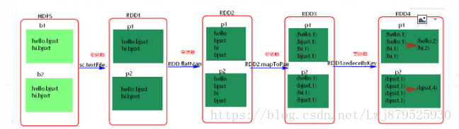
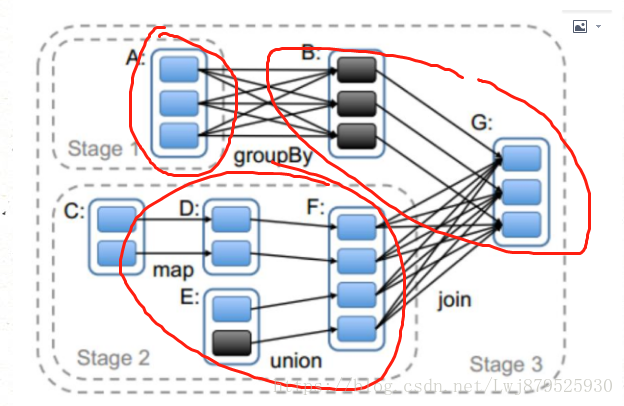
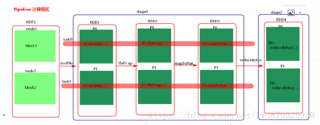

# Spark面试题一

原文：https://www.cnblogs.com/think90/p/11461367.html


## 1. Spark中的RDD是什么，有何特性？

​        RDD（Resilient Distributed Dataset）叫做**分布式数据集**，是Spark中最基本的数据抽象，它代表一个**不可变，可分区**，里面**元素可以并行计算**的集合。

​        Dataset：一个集合，用于存放数据

​        Distributed：分布式，可以并行在集群计算

​        Resilient：表示弹性的。这里的“**弹性**”表示：

* RDD中的数据可以存储在内存或者磁盘中
* RDD中的分区是可以改变的

​        RDD具有5大特性：

1. A list of partitions: 一个分区列表，RDD中的数据都存储在一个分区列表中
2. A function for computing each split: 作用在每一个分区中的函数
3. A list of dependencies on other RDDs: 一个RDD依赖于其他多个RDD，这点很重要，RDD的容错机制就是依据这个特性而来的
4. Optionally, a Partitioner for key-value RDDs (eg: to say that the RDD is hash-partitioned)：可选的，针对于K-V 类型的RDD才有这个特性，作用时决定了数据的来源以及数据处理后的去向
5. 可选项，数据本地性，数据位置最优

## 2. Spark 中常用的算子区别

​        主要是涉及这几个：map， mapPartitions，foreach， foreachPatition

* map：用于遍历RDD，将函数应用于每一个元素，返回新的RDD（transformation算子）
* mapPartitions：用于遍历操作RDD中的每一个分区，返回生成一个新的RDD（transformation算子）
* foreach：用于遍历RDD，将函数应用于每一个元素，无返回值（action算子）
* foreachPatition：用于遍历操作RDD中的每一个分区，无返回值（action算子）

​        总结：一般使用mapPartitions和foreachPatition算子比map和foreach更加高效，推荐使用。

## 3. 谈谈Spark中的宽窄依赖

​        RDD和它的父RDD的关系，存在两种类型：**窄依赖** 和 **宽依赖**

### 3.1 窄依赖

​        每一个父RDD的Partition最多被子RDD的一个Partition使用，是**一对一**的关系，也就是父RDD的一分区去到了子RDD的一个分区中，这个过程没有shuffle产生。

* 输入输出一对一的算子，且结果RDD的分区结构不变，主要是map/flatmap

* 输入输出一对一的算子，但结果RDD的分区结构发生了变化，如union/coalesce

​        从输入中选择部分元素的算子，如filter，distinc，substrack，sample

### 3.2 宽依赖

​        多个子RDD的Partition会依赖同一个父RDD的Partition，关系是**一对多**，父RDD的一个分区的数据去到了RDD的不同分区里，会有shuffle的产生。

* 对单个RDD基于Key进行重组和Reduce，如groupByKey，reduceByKey
* 对两个RDD基于Key进行join和重组，如join

​        经过大量shuffle生成的RDD，建议进行缓存，这样避免失败后重新计算带来的开销。

*注：reduce是一个action，和reduceByKey完全不同*


​        区分的标准就是看父RDD的一个分区的数据的流向，要是流向一个Partition的话，就是窄依赖；否则就是宽依赖。如下图所示：



## 4. Spark如何划分stage

​        先说说概念，Spark任务会根据RDD之间的依赖关系，形成一个DAG有向无环图，DAG会提交给DAGScheduler，DAGScheduler会把DAG划分相互依赖的多个stage，划分依据就是宽窄依赖。**遇到宽依赖就划分stage**，每个stage包含一个或多个task，然后将这些task以taskSet的形式提交给TaskScheduler运行，stage是由一组并行的task组成。

1. Spark程序中可以因为不同的action触发众多的job，一个程序中可以有很多的job，每个job是由一个或者多个stage构成，后面的stage依赖于前面的stage。也就是说，只有前面依赖的stage计算完毕后，后面的stage才会运行

2. stage的划分标准就是宽窄依赖：何时产生宽窄依赖就会产生一个新的stage。例如：reuduceByKey，groupByKey，join的算子，会导致宽依赖的产生

3. 切割规则：从后往前，遇到宽依赖就切割stage

4. 图解

   

5. 计算格式：pipeline管道计算模式，pipeline只是一种计算思想，一种模式。如图：

   

6. Spark的Pipeline管道计算模式相当于执行了一个高阶函数，也就是说，来一条数据，然后计算一条数据，会把所有的逻辑走完，然后落地；而MapReduce是1+1=2，2+1=3这样的计算模式，也就是计算完落地，然后再计算，然后在落地到磁盘或者内存，最后数据是落在计算节点上，按reduce的hash分区落地。*（类Pipeline似于RMDB的批量提交；而MR则是执行一条就立即提交）*

   管道计算模式完全计划于内存的计算，所以比MapReduce 快

7. 管道中的RDD何时落地呢？shuffle write的时候；或者对RDD进行持久化的时候

8. stage的task的并行度是有stage的最后一个RDD的分区数来决定的。一般的说，一个partition对应一个task，但最后reduce的时候可以手动改变reduce的个数，也就是改变最后一个RDD的分区数，也就是改变了并行度。例如：reduceByKey(\_+_,3)

9. 优化：提高stage的并行度： reduceByKey(\_+_, partiton的个数)，join(\_+_, patition的个数)

## 5. DAGScheduler分析

​        DAGScheduler是一个面向Stage的调度器，主要入参有：

```java
dagScheduler.runJob(rdd, cleanedFunc, partitions, callSite, allowLocal, resultHandler, localProperties.git)
```

