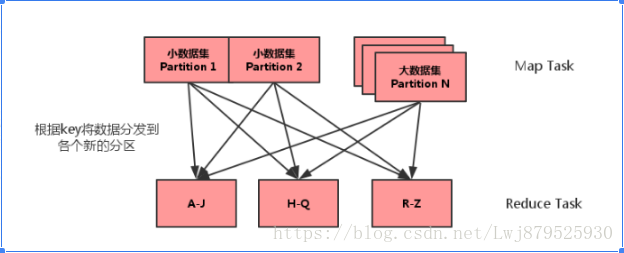
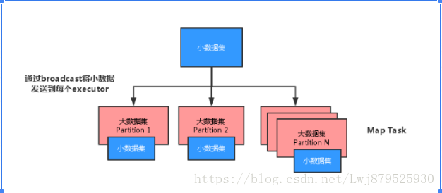

# Spark面试题一

原文：https://www.cnblogs.com/think90/p/11461367.html


## 1. Spark中的RDD是什么，有何特性？

​        RDD（Resilient Distributed Dataset）叫做**分布式数据集**，是Spark中最基本的数据抽象，它代表一个**不可变，可分区**，里面**元素可以并行计算**的集合。

​        Dataset：一个集合，用于存放数据

​        Distributed：分布式，可以并行在集群计算

​        Resilient：表示弹性的。这里的“**弹性**”表示：

* RDD中的数据可以存储在内存或者磁盘中
* RDD中的分区是可以改变的

​        RDD具有5大特性：

1. A list of partitions: 一个分区列表，RDD中的数据都存储在一个分区列表中
2. A function for computing each split: 作用在每一个分区中的函数
3. A list of dependencies on other RDDs: 一个RDD依赖于其他多个RDD，这点很重要，RDD的容错机制就是依据这个特性而来的
4. Optionally, a Partitioner for key-value RDDs (eg: to say that the RDD is hash-partitioned)：可选的，针对于K-V 类型的RDD才有这个特性，作用时决定了数据的来源以及数据处理后的去向
5. 可选项，数据本地性，数据位置最优

## 2. Spark 中常用的算子区别

​        主要是涉及这几个：map， mapPartitions，foreach， foreachPatition

* map：用于遍历RDD，将函数应用于每一个元素，返回新的RDD（transformation算子）
* mapPartitions：用于遍历操作RDD中的每一个分区，返回生成一个新的RDD（transformation算子）
* foreach：用于遍历RDD，将函数应用于每一个元素，无返回值（action算子）
* foreachPatition：用于遍历操作RDD中的每一个分区，无返回值（action算子）

​        总结：一般使用mapPartitions和foreachPatition算子比map和foreach更加高效，推荐使用。

## 3. 谈谈Spark中的宽窄依赖

​        RDD和它的父RDD的关系，存在两种类型：**窄依赖** 和 **宽依赖**

### 3.1 窄依赖

​        每一个父RDD的Partition最多被子RDD的一个Partition使用，是**一对一**的关系，也就是父RDD的一分区去到了子RDD的一个分区中，这个过程没有shuffle产生。

* 输入输出一对一的算子，且结果RDD的分区结构不变，主要是map/flatmap

* 输入输出一对一的算子，但结果RDD的分区结构发生了变化，如union/coalesce

​        从输入中选择部分元素的算子，如filter，distinc，substrack，sample

### 3.2 宽依赖

​        多个子RDD的Partition会依赖同一个父RDD的Partition，关系是**一对多**，父RDD的一个分区的数据去到了RDD的不同分区里，会有shuffle的产生。

* 对单个RDD基于Key进行重组和Reduce，如groupByKey，reduceByKey
* 对两个RDD基于Key进行join和重组，如join

​        经过大量shuffle生成的RDD，建议进行缓存，这样避免失败后重新计算带来的开销。

*注：reduce是一个action，和reduceByKey完全不同*


​        区分的标准就是看父RDD的一个分区的数据的流向，要是流向一个Partition的话，就是窄依赖；否则就是宽依赖。如下图所示：


## 4. Spark如何划分stage

​        先说说概念，Spark任务会根据RDD之间的依赖关系，形成一个DAG有向无环图，DAG会提交给DAGScheduler，DAGScheduler会把DAG划分相互依赖的多个stage，划分依据就是宽窄依赖。**遇到宽依赖就划分stage**，每个stage包含一个或多个task，然后将这些task以taskSet的形式提交给TaskScheduler运行，stage是由一组并行的task组成。

1. Spark程序中可以因为不同的action触发众多的job，一个程序中可以有很多的job，每个job是由一个或者多个stage构成，后面的stage依赖于前面的stage。也就是说，只有前面依赖的stage计算完毕后，后面的stage才会运行

2. stage的划分标准就是宽窄依赖：何时产生宽窄依赖就会产生一个新的stage。例如：reuduceByKey，groupByKey，join的算子，会导致宽依赖的产生

3. 切割规则：从后往前，遇到宽依赖就切割stage

4. 图解

   

5. 计算格式：pipeline管道计算模式，pipeline只是一种计算思想，一种模式。如图：

   

6. Spark的Pipeline管道计算模式相当于执行了一个高阶函数，也就是说，来一条数据，然后计算一条数据，会把所有的逻辑走完，然后落地；而MapReduce是1+1=2，2+1=3这样的计算模式，也就是计算完落地，然后再计算，然后在落地到磁盘或者内存，最后数据是落在计算节点上，按reduce的hash分区落地。*（类Pipeline似于RMDB的批量提交；而MR则是执行一条就立即提交）*

   管道计算模式完全计划于内存的计算，所以比MapReduce 快

7. 管道中的RDD何时落地呢？shuffle write的时候；或者对RDD进行持久化的时候

8. stage的task的并行度是有stage的最后一个RDD的分区数来决定的。一般的说，一个partition对应一个task，但最后reduce的时候可以手动改变reduce的个数，也就是改变最后一个RDD的分区数，也就是改变了并行度。例如：reduceByKey(\_+_,3)

9. 优化：提高stage的并行度： reduceByKey(\_+_, partiton的个数)，join(\_+_, patition的个数)

## 5. DAGScheduler分析

​        DAGScheduler是一个**面向Stage的调度器**，主要入参有：

```java
dagScheduler.runJob(rdd, cleanedFunc, partitions, callSite, allowLocal, resultHandler, localProperties.git)
```

其中：

* rdd：final RDD
* cleanedFunc：计算每个分区的函数
* resultHander：结果侦听器

主要功能：

1. 接受用户提交的Job
2. 将Job根据类型划分为不同的Stage，记录那些RDD，Stage被物化，并在每一个Stage内产生一系列的task，并封装成taskset
3. 决定每个task的最佳位置，任务在数据所在节点上运行，并结合当前的缓存情况，将taskset提交给TaskScheduler
4. 重新提交Suffle输出丢失的stage给taskScheduler

注：一个 Stage 内部的错误不是由 shuffle 输出丢失造成的，DAGScheduler是不管的，由TaskScheduler负责尝试重新提交task执行。

## 6. Job的生成

​        一旦 driver 程序中出现action，就会生成一个job，比如count等，向 DAGScheduler 提交job，如果 driver 程序后面还有 action，那么其他 action 也会对应生成响应的 job，所以，driver 端有多少action，就会提交多少 job，这可能就是为什么 spark 将 driver 程序称为 application 而不是 job 的原因。

​        每一个job 可能会包含一个或者多个 stage，最后一个stage生成result，在提交job的过程中，DAGScheduler 会首先从后往前划分stage，划分的标准就是宽依赖，一旦遇到宽依赖就划分，然后提交没有父阶段的stage们，并在提交过程中，计算该stage的task数目以及类型，并提交具体的task，这些无父阶段的stage提交完成之后，依赖该Stage的stage才会提交。

## 7. 有向无环图

​        DAG，有向无环图，简单的说，就是一个由顶点和有方向性的便构成的图中，从任意一个顶点出发，没有任意一条路径会将其带回到出发点的顶点位置。

​        为每个spark job 计算具有依赖关系的多个stage任务阶段，通常根据shuffle来划分stage，如reduceByKey，groupByKey等涉及到shuffle的transformation就会产生新的stage，然后将每个stage划分为具体的一组任务，以TaskSets的形式提交给底层的任务调度模块来执行，其中不同stage之前的RDD为宽依赖关系，TaskScheduler任务调度模块负责具体启动任务，监控和汇报任务运行情况。

## 8. RDD的操作

​        RDD支持两大类的操作：

* **转换**（Transformation）：现有的RDD通关转换生成一个新的RDD，转换是延时执行的
* **动作**（Actions）：在RDD上运行计算后，返回结果给驱动程序或写入文件系统

​        例如，map就是一种transformation，它将数据集每一个元素都传递给函数，并返回一个新的分布数据集表示结果；reduce则是一种action，通过一些函数将所有的元素叠加起来，并将最终结果返回给Driver程序。

### 8.1 Transformation

1. **map(func)**：

   Return a new distributed dataset formed by passing each element of the source through a function *func*

   返回一个新分布式数据集，由每一个输入元素经过func函数转换后组成

2. **filter(func)**：

   Return a new dataset formed by selecting those elements of the source on which func returns true.

   返回一个新的数据集，由经过func函数计算后返回值为true的输入元素组成

3. **flatMap( func )**：

   Similar to map, but each input item can be mapped to 0 or  more output items ( so func should return a Seq rather than a single item)

   类似于map，但是每一个输入元素可以被映射为0个或者多个输出元素（因此，func函数应该返回一个序列，而不是单一元素）

4. **mapPartitions( func )**：

   Similarto map, but runs separately on each petition (block) of the RDD, so func must be of type Iterator<T> => Iterator<U> when running on an RDD of Type T.

   类似于map，但独立地在RDD的每一个分块上运行，因此在类型为T的RDD上运行时，func的函数类型必须是Iterator<T> => Iterator<U>，mapPartitions将会被每一个数据集分区调用一次，各个数据集分区的全部内容将作为顺序的数据流川入函数func的参数中，func必须返回另一个Iterator<T>。被合并的结果自动转换成为新的RDD。

5. **groupByKey( [numTasks] )**：

   When called on a dataset of (K,V) pairs, returns a dataset of (K, Iterable)  pairs.

   Note: If you are grouping in order to perform an aggregation (such as a sum or average) over each key, using reduceByKey or combineByKy will yield much better performance.

   Note: By default, the level of parallelism in the output depends on the number of partitions of the parent RDD. You can pass an optional numTasks argument to set a different number of tasks.

   在一个（K，V）对的数据集上调用，返回一个（K，Seq[V]）对的数据集

   注意：默认情况下，只有8个并行任务来做操作，但是可以传入一个可选的numTasks参数来改变它。如果分组时用来计算聚合操作（如sum或者average），那么应该使用reduceByKey或者combineByKey来提供更好的性能。

6. **reduceByKey( func, [numTasks] )**：

   When called on a dataset of (K, V) pairs, returns a dataset of (K,V) pairs where the values for each key are aggregated using the given reduce function func, which must be of type (V,V) => V. Like ingroupByKey, the number of reduce tasks is configurable through an optional second argument.

   在一个（K，V）对的数据集上调用时，返回一个（K，V）对的数据集，使用指定的reduce函数，将相同Key的值聚合到一起，类似groupByKey，reduce任务个数是可以通过第二个可选参数来配置的。

7. **sortByKey( [ascending], [numTasks] )**

   When called on a dataset of (K,V) pairs where K implements Ordered, returns a dataset of (K,V) pairs sorted by keys in ascending or descending order, as specified in the boolean ascending argument.

   在一个（K，V）对的数据集上调用，K必须实现Ordered接口，返回一个按照Key进行排序的（K，V）对数据集，圣墟或者降序由ascending布尔参数决定

8. **join( otherDataset, [numTasks] )**

   When called on dataset of type (K, V) and (K, W), returns a dataset of (K, (V, W)) pairs with all pairs of elements for each key. Outer joins are also supported through leftOuterJoin and rightOuterJoin.

   类行为（K，V）和（K，W）类型的数据集上调用时，返回一个相同Key对应的所有元素对在一起的（K， （V，W））数据集

9. **collect()**

   Return all the elements of the dataset as an array at the driver program. This is usually useful after a filter or other operation that returns a sufficiently small subset of the data.

   在驱动（应用）程序中，以数组的形式，返回数据集的所有元素。这通常会在使用filter或者其他操作并返回一个足够小的数据子集后再使用会比较有用。

10. **count()**

    Return the number of elements in the dataset.

    返回数据集的元素的个数。

11. **foreach( func )**

    Run a function func on each element of the dataset. This is usually done for side elffects such as updating an accumulator variable (see below) or interacting with external storage systems.

    在数据集的每一个元素上，运行函数func进行更新，这通常用于边缘效果。例如更新一个累加器，或者和外部存储系统进行交互，如HBase

12. **saveAsTextFile( path )**
    Write the elements of the dataset as a text file (or set of text files) in a given directory in the local filesystem, HDFS or any other Hadoop-supporte file system. Spark will call toString on each element to convert it to a line of text in the file.

    将数据集的元素，以textfile的形式，保存到本地文件系统，HDFS或者任务其他Hadoop支持的文件系统，对于每个元素，Spark将会调用toString方法，将它转换为文件中的文本行。

## 9 RDD缓存

​        Spark 可以使用 persist 和 cache 方法将任务RDD缓存到内存、磁盘文件系统中。缓存是容错的，如果一个RDD分片丢失，可以通过构建它的 transformation 自动重构。被缓存的 RDD 被使用时，存取速度会被大大加速。一般的，executor内存60%做cache，剩下40%做task。

​        Spark中，RDD 类可以使用 cache() 和 persist() 方法来缓存。 cache() 是 persist() 的特例。将该 RDD 缓存到内存中。而 persist() 可以指定一个 StorageLevel。 StorageLevel的列表可以再StorageLevel 伴生单例对象中找到。

​       Spark的不同StorageLevel，目的满足内存使用和CPU效率权衡上的不同需求。建议通过一下步骤来进行选择：

* 如果RDDs可以很好的与默认的存储级别（MEMORY_ONLY）契合，就不需要做任何修改了。这已经是CPU使用率最高的选贤，它使得RDDs的操作尽可能的块
* 如果不行，试着使用 MEMORY_ONLY_SER 并且选择一个快速序列化的库，使得对象在有比较高的空间使用率的情况下，依然可以较快被访问
* 尽可能不要存储到硬盘上，除非计算数据集的函数，计算量特别大，或者它们过滤了大量的数据。否则，重新计算一个分区的速度，和与从硬盘中读取基本差不多快
* 如果想有快速故障恢复能力，使用复制存储级别（例如：用Spark来响应web应用的请求）。所有的存储级别都有通过重新计算丢失数据恢复错误的容错机制，但是复制存储级别可以在RDD上持续的运行任务，而不需要等待丢失的分区被重新计算
* 如果想要自定义存储级别（比如复制因子为3而不是2），可以使用 StorageLevel 单例对象的 apply() 方法。

在不使用 cached RDD的时候，及时使用unpersist方法来释放它。

## 10 Spark中的cache和persist的区别

* **cache**：缓存数据，默认是缓存在内存中，其本质还是调用persist
* **persist**：缓存数据，有丰富的数据缓存策略。数据可以保存在内存，也可以保存在磁盘中，使用的时候指定对应的缓存级别就可以了。

## 11 RDD共享变量

​        在应用开发中，一个函数被传递给Spark操作（例如map或者reduce），在一个远程集群上运行，它实际上操作的是这个函数用到的所有变量的独立拷贝。这些变量会被拷贝到每一台机器。通常看来，在任务之间中，读写共享变量显然不够高效。然而，Spark还是为了两种常见的使用模式，提供了两种有限的共享变量：**广播变量**和**累加器**。

### 11.1 广播变量 (Broadcast Variables)

* 广播变量缓存到各个节点的**内存中**，而不是每个task
* 广播变量被创建后，能被在集群中运行的**任何函数调用**
* 广播变量是**只读**的，不能在被广播后修改
* 对于大数据集的广播，Spark尝试使用高效的广播算法来降低通信成本
  * val broadcastVar = sc.broadcast(Array(1,2,3)) # 方法参数中是要广播的变量

### 11.2 累加器

​        累加器只支持加法操作，可以高效地并行，用于实现计数器和变量求和。Spark 原生支持数值型和标准可变集合的计数器，但用户可以添加新的类型。**只有驱动程序才能获取累加器的值**。


## 12 Spark-submit的时候，如何引入外部jar

​        在通过spark-submit提交任务时，可以通过添加配置参数来指定：

* -driver-class-path 外部jar包
* -jars 外部jar包

## 13 Spark如何防止内存溢出

* driver端的内存溢出

  * 可以增大driver的内存参数：spark.driver.memory (default 1G)
  * 这个参数用来设置 Driver 的内存。在Spark程序中，SparkContext、DAGScheduler 都是运行在Driver端的。对应 RDD 的Stage 切分也是在 Driver 端运行。如果用户自己写的程序有过多的步骤，切分出过多的Stage，这部分信息消耗的是Driver的内存，这个时候需要调大Driver的内存

* map过程产生大量对象导致内存溢出

  * 这种溢出的原因是：在单个map中产生了大量的对象导致。例如：

    ```scala
    rdd.map(x => for (i < -1 to 10000) yield i.toString)
    ```

    这个操作在RDD中，每个对象都产生了10000个对象，这肯定很容易产生内存溢出的问题。针对这种问题，在不增加内存的情况下，可以通过减少每个Task的大小，以便达到每个Task即使产生大量的对象，Executor的内存也能够装得下。

    具体的做法，可以在会产生大量对象的map操作之间调用 repartition 方法，分区成更小的快传入map。例如：

    ```scala
    rdd.repartition(10000).map(x => for (i < -1 to 10000) yield i.toString)
    ```

    面对这种问题，注意，**不能**使用 rdd.coalesce 方法，这个方法智能减少分区，不能增加分区，不会有shuffle过程。

* 数据不平衡导致内存溢出

  * 数据不平衡除了有可能导致内存溢出外，也有可能导致性能问题。解决方法和上面说的类似，就是调用repartition重新分区。

* shuffle后内存溢出

  * **shuffle内存溢出的情况可以说都是shuffle后，单个文件过大导致的**。在Spark中，***join，reduceByKey*** 这一类型的过程，都会有 shuffle 的过程。在shuffle的使用，需要传入一个partitioner，大部分Spark中的shuffle操作，**默认的partitioner都是HashPatitioner，默认值是父RDD中最大的分区数**，这个参数通过 ***spark.default.parallelism*** 控制（在spark-sql 中用 *spark.sql.shuffle.partitions*），spark.default.parallelism 参数只对HashPartitioner有效，所以如果是别的Partitioner或者自己实现的Partitioner，就不能使用 spark.default.parallelism 参数来控制shuffle的并发数量了。

    如果是别的 partitioner 导致的 shuffle 内存溢出，就需要从 partitioner 的代码增加 partitions的数量。

* standalone模式下资源分配不均匀导致内存溢出

  * 在Standalone 的模式下，如果配置了 *-total-executor-cores* 和 *-executor-memory* 这两个参数，但是没有配置 *-executor-cores* 这个参数的话，就有可能导致：每个 Executor 的 memory 是一样的，但是 cores 的数量不同，那么在 cores 数量多的 Executor 中，由于能够同时执行多个Task，就容易导致内存溢出的情况。

    这种情况的解决方式就是：同时配置 *-executor-cores* **或者** *spark.executor.cores* 参数，确保 Executor 资源分配均匀。

* 使用rdd.persist(StorageLevel.MEMORY_AND_DISK_SER)代替rdd.cache()

## 14 Spark中map-side-join关联优化

​        将多份数据进行关联是数据处理过程中非常普遍的用法。不过在分布式计算系统中，这个问题往往会变得非常麻烦，因为框架提供的 join 操作一般会将所有数据根据 key 发送到所有的 reduce 分区中去，也就是 shuffle 的过程。造成大量的网络以及磁盘IO消耗，运行效率极其低下，这个过程一般被称为 reduce-side-join。

​        如果其中有张表比较小的话，则可以自己实现在 map 端实现数据关联，跳过大量数据进行 shuffle 的过程，运行时间得到大量缩短，根据不同数据可能会有几倍到数十倍的性能提升。

​        何时使用：在海量数据中匹配少量特定数据

​        原理：reduce-side-join 的缺陷在于，会将 Key 相同的数据发送到同一个 partition中进行运算，大数据集的传输需要长时间的IO，同时任务并发度受到限制，还可能造成数据倾斜。

​        reduce-side-join的运行图：



​        map-side-join 运行图：



​        将少量的数据转化为map进行广播，广播会将此map发送到每个节点中，如果不进行广播，每个task执行时都会去获取该map数据，造成了性能浪费。对大数据进行遍历，使用 *mapPartition* 而不是 *map*，因为 *mapPartition* 是在每个 partition 中进行操作，因此可以减少遍历时新建 broadCastMap.value 对象的空间消耗，同时匹配不到的数据也不会返回。

## 15 Spark整合Spark Streaming

​         kafka 0.10 版本之前有两种方式与SparkSteaming整合：一种是基于receiver，另一种是direct。

### 15.1 Receiver

​        receiver 采用了 kafka 高级api，利用 receiver 接收器来接收 kafka topic 中的数据，从kafka接收来的数据会存储在spark的executor中，之后 spark streaming 提交的job会处理这些数据，kafka中topic的偏移量是保存在zookeeper中。

* 基本使用

  ```scala
  // Streaming 支持读取kafka的多个主题
  val topics = Array("helloTopic", "topic2")
  val stream: InputStream[ConsumerRecord[(String, String)]] = KafkaUtils.createDirectStream[String, String](
      ssc,
      // Kafka的broker和executors在同一台机器上，采用这个：
      // LocationStrategies.PreferBrokers
      // 资源会平均分配
      LocationStrategies.PerferConsistent,
      // 消费者订阅哪些主题
      Subscribt[String, String](topics, kafkaParams)
  )
  stream.foreachRDD(rdd => {
      // rdd中的数据类型是ConsumerRecord[String, String]，拿到这里的value
      val result : RDD[(String, Int)] = rdd.map(_ value()).map((_, 1)).reduceByKey(_ + _)
      result.foreach(print)
  })
  ```

  

* 几点注意

  * 在 Receiver 的方式中，Spark中的 partition 和 Kafka 中的 partition 并不是相关的，所以如果加大每个topic 的partition 数量，仅仅是增加线程来处理由单一 receiver 消费的主题。但是这并没有增加 spark 在处理数据上的并行度
  * 对于不同的 Group 和 topic ，可以使用多个 Receiver 创建不同的 DStream 来并行接收数据，之后可以利用 union 来统一成一个 Dstream
  * 在默认配置下，这种方式可能会因为底层的失败而丢失数据。因为 receiver 一直在接收数据，在其已经通知zookeeper**数据接收完成但是还没有处理的时候**， executor 突然挂掉（或者driver挂掉通知executor关闭），缓存在其中的数据就会丢失。如果希望做到高可靠，让数据零丢失，如果启用了 Write ahead logs（spark.streaming.receiver.writeAheadLog.enable=true）该机制会同步地将接收到的Kafka数据写入分布式文件系统（比如HDFS）上的预写日志中。所以，即使底层节点出现了失败，也可以使用预写日志中的数据进行恢复。复制到文件系统如HDFS，那么 storage level需要设置成StorageLevel.MEMORY_AND_DISK_SER，也就是 KafkaUtils.createStream(..., StorageLevel.MEMORY_AND_DISK_SER)

### 15.2 Direct

​        中Spark 1.3 之后，引入了 Direct 方式。不同于 Receiver 的方式，Direct方式没有Receiver这一层，其会周期性的获取Kafka中每个topic的每个partition中的最新offsets，之后根据设定的maxRatePerPartition来处理每个batch。（设置spark.streaming.kafka.maxRatePerPartition = 10000，限制每秒钟从topic的每个parttion最多消费的消息条数）

### 15.3 两种方式的优缺点

* 采用Receiver方式：这种方式可以保证数据不丢失，但是无法保证数据只被处理一次。WAL实现的是 ***At-Least-Once*** 语义（至少被处理一次），如果在写入到外部存储的数据还没有将offset更新到zookeeper就挂掉，这些数据将会被反复消费。同时，降低了程序的吞吐量
* 采用Direct方式：相比Receiver模式，这种方式能确保 **WAL** 机制更加健壮。区别于使用Receiver来被动接收数据，Direct模式会周期性地主动查询Kafka，来获得每个 topic + partition 的最新offset，从而定义每个batch的offset的范围。当处理数据的job启动时，就会使用kafka的简单consumer api来获取kafka指定offse范围的数据。

* **优点**

  * **简化并行读取**

    如果要读取多个partition，不需要创建多个输入DStream然后对它们进行union操作。Spark会创建跟 Kafka partition 一样多的RDD partition，并且会并行从 Kafka 中读取数据。所以，在Kafka partition 和 RDD partition 之间，有一个一对一的映射关系

  * **高性能**

    如果要保证零数据丢失，在基于 receiver 的方式中，需要开启WAL机制。但是这种方式其实效率低下，因为数据实际上被复制了两份，Kafka自己本身就有高可靠的机制，会对数据复制一份，而这里又会复制一份到WAL中。而基于Direct的方式，不依赖Receiver，不需要开启WAL机制，只要Kafka中做了数据的复制，那么就可以通过kafka的副本进行恢复

  * **一次且仅一次的事务机制** 

    基于receiver的方式，是使用Kafka的高阶API来在ZooKeeper中保存消费过的offset的。这是消费Kafka数据的传统方式。这种方式配合着WAL机制可以保证数据零丢失的高可靠性，但是无法保证数据被处理一次且仅一次（可能会被处理2次或更多次）。因为Spark和ZooKeeper之间可能是不同步的。基于Direct的方式，使用Kafka的简单 API， Spark Streaming 自己就负责追踪消费的offset，并保存在checkpoint中。 Spark自己一定是同步的，因此可以保证数据是消费一次且仅消费一次。不过需要自己完成将offset写入zk的过程。

* 代码示例：

  ```scala
  messages.foreachRDD(rdd => {
      val message = rdd.map(_._2) // 对数据进行一些操作
      message.map(method) // 更新zk上的offset（自己实现）
      updateZKOffsets(rdd)
  })
  ```

  sparkStreaming 程序自己消费完成后，自己主动去更新zk上面的offset。也可以将zk中的偏移量保存在mysql或者redis数据库中，下次重启时，直接读取mysql或者redis中的offset，获取上次消费的偏移量（offset），接着读取数据。

## 16 Spakr master在使用Zookeeper进行HA时，有哪些元数据保存在Zookeeper

​        Spark通过这个参数 ***spark.deploy.zookeeper.dir*** 指定 master 元数据在 zookeeper 中保存的位置，包括 ***worker, master, application, executors***。 Standby 节点要从ZK中获得元数据信息，恢复集群运行状态，才能对外继续提供服务，作业提交资源申请等，在恢复前是不能接受请求的。

​        另外，master切换需要注意两点：

1. 在master切换的过程中，所有的已经在运行的程序皆正常运行，因为spark application 在运行前就已经通过cluster manager 获得了计算资源，所以在运行时 job 本身的调度和处理，与master是没有任何关系的
2. 在master切换过程中**唯一的影响是不能提交新的Job**。一方面不能提交新的应用程序给集群，因为只有Active Master 才能接受新的程序的提交请求。另一方面，已经运行的程序也不能action操作触发新的job提交请求


## 17 Spark Master HA主从切换过程不会影响集群已有的作业运行，为啥？

​        因为程序在运行之前，已经向集群申请过资源，这些资源已经提交给Driver了。也就是说，已经分配了资源了。这是粗粒度分配，一次性分配好资源后，不需要再关注资源分配，在运行时让Driver和Executor自动交互。

​        弊端是，如果资源分配太多，任务运行完不会很快释放，造成资源浪费，这里不适用细粒度分配的原因，也是因为任务提交太慢。

## 18 什么是粗粒度、细粒度，各自有有什么优缺点？

* **粗粒度**

  启动时就分配好资源，程序启动，后续具体使用就使用分配好的资源，不需要再分配资源。

  * **优点**：作业特别多时，资源复用率较高。
  * **缺点**：容易资源浪费。如果一个job有1000个task，完成了999个，还有一个没有完成，此时那999个资源就闲置在那儿，会造成资源大量浪费

* **细粒度**

  用资源的时候分配，用完了就立即回收资源，启动会麻烦一些，启动一次分配一次。

## 19 Driver的功能是什么？

​        一个Spark作业运行时包括一个Driver进程，也就是作业的主进程，具有main函数，并且有sparkContext的实例，是程序的入口。

​        Driver从功能上说，主要负责向集群申请资源，向master注册信息，负责了作业的调度，负责了作业的解析，生成stage并调度task到executor上，包括DAGScheduler，TaskScheduler。

## 20 Spark技术栈有哪些组件，每个组件有什么功能？适合什么场景？

1. **Spark Core**

   是其他组件的基础，spark的内核。主要包含：

   * 有向循环图
   * RDD
   * Lingage
   * Cache
   * Broadcast

   并封装了底层通讯框架。

2. **SparkStreaming**

   是一个对实时数据流进行高通量、容错处理的流式处理系统。可以对多种数据源（如：Kafka、Flume、Twitter、Zero和TCP Socket）进行类似Map、Reduce和Join等复杂操作，将流式计算分解成一些列短小的批处理作业

3. **Spark SQL**

   Spark是Spark SQL的前身，Spark SQL的一个重要特点是能够统一处理关系表和RDD，使得开发人员可以轻松地使用SQL命令进行外部查询，同时进行更复杂的数据分析。

4. **BlinkDB**

   是一个用于在海量数据上运行交互SQL查询的大规模并行查询引擎，它允许用户通过权衡数据精度来提升查询响应时间，其数据的精度被控制在允许的误差范围内。

5. **MLBase**

   是Spark生态圈的一部分，专注于机器学习，让机器学习的门槛更低，让一些可能并不了解机器学习的用户也能方便地使用MLBase。MLBase分为四部分：

   * MLlib
   * MLI
   * ML Optimizer
   * MLRuntime

6. **GraphX**

   用户图形和图形并行计算

## 21 Spark中Worker的主要工作是什么？

​        woker的主要功能，是管理当前节点内存、CPU的使用情况，接受master发送过来的资源指令，通过 ***executorRunner*** 启动程序分配任务，worker就类似于包工头，管理分配新进程，做计算的服务，相当于process服务，需要注意的是：

1. worker会不会汇报当前信息给master？worker发**心跳**给master主要**只有workid**，不会以心跳的方式发送资源信息给master，这样master就知道worker是否存活。**只有故障的时候才会发送资源信息**
2. worker不会运行代码，具体运行代码的是 executor。Executor可以运行具体application节点的业务逻辑代码；操作代码的节点，不会去运行代码。

