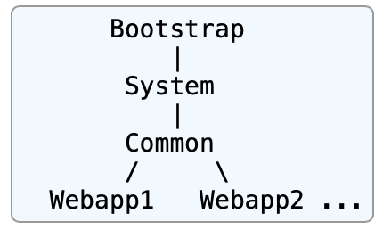
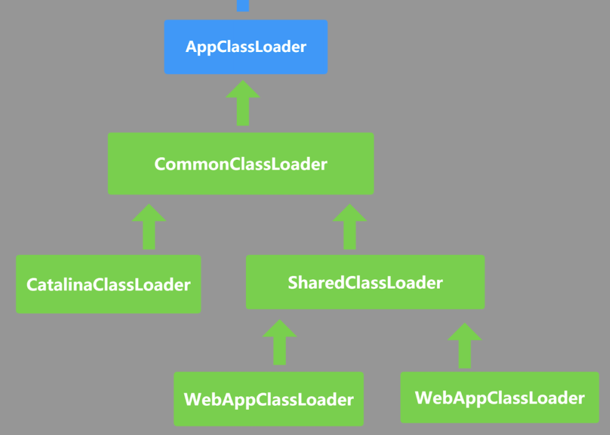

# 美团面试全过程

https://www.toutiao.com/i7046999380121108996/?tt_from=weixin&utm_campaign=client_share&wxshare_count=1&timestamp=1640860811&app=news_article&utm_source=weixin&utm_medium=toutiao_ios&use_new_style=1&req_id=2021123018401001013113517213ABC5BC&share_token=A767AF21-4D3A-44E0-86DE-6F7833D27B98&group_id=7046999380121108996


## 一面

- #### redis集群，为什么是16384？哨兵模式，选举过程，会有脑裂问题么？raft算法，优缺点

  答：https://blog.csdn.net/Ccww_/article/details/112983088

  1. Redis集群，为什么是16384？

     16384 $ = 2^{14}$。Redis节点发送心跳包时，需要把所有的槽放到这个心跳包里，以便让节点知道当前集群信息，16384 = **16k**，在发送心跳包时使用 char 进行 bitmap 压缩后就是 **2k** (2 * 8bit * 1024 = 16k )，也就是说，使用 2k 的空间创建了 16k 的操数。

     虽然使用 CRC16 算法最多可以分配 65535（ $2^{16} - 1$)个槽位，65535 = 65开，压缩后就是 8k (8 * 8bit * 1024 = 65k)，也就是说需要 8k 的心跳包，Redis的作者认为不太值。而且一般情况下，一个 Redis 集群不会有超过 1000 个master 节点，所以 16k 的槽位是一个比较合适的选择。

  2. 哨兵模式，选举过程，会有脑裂问题么？

     哨兵机制是实现主从库自动切换的关键机制，主要分为三个阶段：

     * **监控**：哨兵进程会周期性地给所有的主从库发送PING，检测它们是否仍然在线运行
     * **选主**：主库挂了后，哨兵基于一定的规则评分选举出一个从库实例为新的主库
     * **通知**：哨兵会将新主的信息发送给其他从库，让它们和新主建立连接，并进行数据复制。同时，哨兵会把新主库的信息广播通知给客户端，让它们把请求操作发到新主库上

  3. 判断主库是否处于下线状态

     哨兵对主库的下限判断分为两类：

     * **主观下线**：哨兵进程会使用 PING 命令检测它自己和主、从库的网络连接状态。如果单哨兵发现主库或者从库对 PING 命令的响应超时了，那哨兵就会先把它标记为“主观下线”
     * **客观下线**：在哨兵集群中，基于**少数服从多数**，多数实例都判断主库已经“主观下线”，则认为主库“客观下线”了

     **为什么设计这两种下线状态呢？**

     由于单机哨兵很容易产生误判，误判后主从切换会产生一些列的额外开销，为了减少误判，避免这些不必要的开销，采用哨兵集群，引入多个哨兵实例一起来判断，就可以避免当个哨兵因为自身网络状况不好，而误判主库下线的情况。

     基于少数服从多数的原则，当有 N 个哨兵实例时，最好要有 $ \frac{N}{2} + 1$ 个实例判断主库为“主观下线“，才能最终判定主库为“客观下线”（可以自定义设置阈值）

     

  4. 哨兵之间如何相互通信的呢？

     哨兵集群中，哨兵实例之间可以相互发现，基于 Redis 提供的 **发布-订阅** 机制。

     哨兵可以在主库中发布/订阅消息，在主库哈桑有一个名为 “\_sentinel\_:hello” 的频道，不同哨兵就是通过它来相互发现，实现互相通讯的。而且只有订阅了同一个频道的应用，才能通过发布的消息进行信息交换

     

  5. Redis的脑裂

     主-从复制，会导致数据丢失。因为Master将数据复制给 Slave 是异步的，在复制过程中，可能存在master有部分数据还没有复制到slave，master就宕机了。

     而当一个集群中的master恰好网络故障，导致与sentinel 通信不上了，sentinel 会认为 master 下线了，且 sentinel 选举出了一个 slave 作为新的 master，此时就会存在两个 master 了。这就是脑裂。

     而对于客户端来说，可能有的Client 还没有来得及切换到新的 master，还继续写向旧的 master。当master 再次恢复的时候，会被作为一个 salve 挂到新的 master 上，自己的数据就会被清空，重新从新的master复制数据，这样就导致了数据缺失。

     

  6. 因脑裂导致数据不一致的解决方案

     数据丢失可以通过合理配置参数 min-slaves-to-write 和 min-slaves-max-lag 解决，比如：

     ```yaml
     min-slaves-to-write 1
     min-slaves-max-lag 10
     ```

     如上面两个配置：要求至少有一个 salve，数据复制和同步的延迟不能超过 10 秒，如果超过 1 个 slave，数据复制和同步的延迟都超过了 10 秒，那么这时master就不会再接收任何请求了。

     

- #### JVM类加载器，自定义类加载器，双亲委派机制，优缺点，tomcat类加载机制

  这里就介绍Tomcat的类加载机制。

  1. Tomcat 类加载机制的特定

     * **隔离性**：Web应用类库相互隔离，避免依赖库或者应用包相互影响。设想一下，如果有两个Web应用，一个釆用了Spring 2.5, 一个采用了Spring 4.0,而应用服务器使用一个 类加载器加载,那么Web应用将会由于Jar包覆盖而导致无法启动成功
     * **灵活性**：既然 Web 应用之间的类加载器相互独立，那么就能只针对一个Web应用进行重新部署。此时该Web应用的类加载器会重新创建，而且不会影响到其他的Web应用。如果釆用一个类加载器，显然无法实现，因为只有一个类加载器的时候，类之间的依赖是杂乱无章的，无法完整地移除某个Web应用的类
     * **性能**：由于每个 Web 应用都有一个类加载器，因此 Web 应用在加载类时，不会搜索其他web应用包含的 jar ，性能自然高于应用服务器只有一个类加载器的情况

  2. Tomcat 的类加载方案

     

     

     * **引导类加载器**和**扩展类加载器**的作用不变 - 这里都归到“Bootstrap”里；
     * **系统类加载器**正常情况下加载的是 CLASSPATH 下的类，但是 Tomcat 的启动脚本并未使用该变量，而是加载 tomcat 启动的类。比如 bootstrap.jar ，通常在 catalina.bat/catalina.sh 中指定。位于 CATALINA_HOME/bin下，分别是这几个：
       * *$CATALINA_HOME/bin/bootstrap.jar*
       * *$CATALINA_BASE/bin/tomcat-juli.jar* or *$CATALINA_HOME/bin/tomcat-juli.jar* 
       * *$CATALINA_HOME/bin/commons-daemon.jar*
     * **Common 通用类加载器**加载 Tomcat 使用以及应用通用的一些类，位于 CATALINA_HOME\lib 下，比如 servlet-api.jar
     * CatalinaClassLoader 用于加载服务器内部的可见类，这些类，应用程序不能访问
     * SharedClassLoader，用于加载应用程序共享类，这些类服务器不会依赖
     * WebappClassLoader，每个应用程序都会有一个独一无二的 WebappClassLoader，它用来加载本地应用程序 /WEB-INF/classes 和 /WEB-INF/lib 下的类

     Tomcat 8.5 默认改变了严格的双亲委派机制：

     * ⾸先从 Bootstrap Classloader加载指定的类
     * 如果未加载到，则从 /WEB-INF/classes加载
     * 如果未加载到，则从 /WEB-INF/lib/*.jar 加载
     * 如果未加载到，则依次从 System、Common、Shared 加载（在这最后⼀步，遵从双亲委派机制）
       

  3. 分析应用类加载器的加载过程

     应用类加载器为 WebappClassLoader，它的 loadClass 在它的父类WebappClassLoaderBase中：

     ```java
     public Class<?> loadClass(String name, boolean resolve) 
                                        throws ClassNotFoundException {
           synchronized (getClassLoadingLock(name)) {
               if (log.isDebugEnabled())
                   log.debug("loadClass(" + name + ", " + resolve + ")");
               Class<?> clazz = null;
               checkStateForClassLoading(name);   
               clazz = findLoadedClass0(name);
               if (clazz != null) {
                   if (log.isDebugEnabled())
                       log.debug("  Returning class from cache");
                   if (resolve)
                       resolveClass(clazz);
                   return clazz;
               }
               clazz = findLoadedClass(name);
               if (clazz != null) {
                   if (log.isDebugEnabled())
                       log.debug("  Returning class from cache");
                   if (resolve)
                       resolveClass(clazz);
                   return clazz;
               }
               String resourceName = binaryNameToPath(name, false);
               ClassLoader javaseLoader = getJavaseClassLoader();
               boolean tryLoadingFromJavaseLoader;
               try {
                 .....
               if (tryLoadingFromJavaseLoader) {
                   try {
                       clazz = javaseLoader.loadClass(name);
                       if (clazz != null) {
                           if (resolve)
                               resolveClass(clazz);
                           return clazz;
                       }
                   } catch (ClassNotFoundException e) {
                   }
               }
               if (securityManager != null) {
                   int i = name.lastIndexOf('.');
                   if (i >= 0) {
                       try {
                           securityManager.checkPackageAccess(name.substring(0,i));
                       } catch (SecurityException se) {
                           String error = "Security Violation, attempt to use " +
                               "Restricted Class: " + name;
                           log.info(error, se);
                           throw new ClassNotFoundException(error, se);
                       }
                   }
               }
               boolean delegateLoad = delegate || filter(name, true);
               if (delegateLoad) {
                   if (log.isDebugEnabled())
                       log.debug("  Delegating to parent classloader1 " + parent);
                   try {
                       clazz = Class.forName(name, false, parent);
                       if (clazz != null) {
                           if (log.isDebugEnabled())
                               log.debug("  Loading class from parent");
                           if (resolve)
                               resolveClass(clazz);
                           return clazz;
                       }
                   } catch (ClassNotFoundException e) {
                   }
               }
               if (log.isDebugEnabled())
                   log.debug("  Searching local repositories");
               try {
                   clazz = findClass(name);
                   if (clazz != null) {
                       if (log.isDebugEnabled())
                           log.debug("  Loading class from local repository");
                       if (resolve)
                           resolveClass(clazz);
                       return clazz;
                   }
               } catch (ClassNotFoundException e) {
               }
               if (!delegateLoad) {
                       if (log.isDebugEnabled())
                       log.debug("  Delegating to parent classloader at end: " + parent);
                   try {
                       clazz = Class.forName(name, false, parent);
                       if (clazz != null) {
                           if (log.isDebugEnabled())
                               log.debug("  Loading class from parent");
                           if (resolve)
                               resolveClass(clazz);
                           return clazz;
                       }
                   } catch (ClassNotFoundException e) {
                   }
               }
           }
           throw new ClassNotFoundException(name);
       }
     ```

     注：在37行英文注释中标注获取的是系统类加载器，但我们debug的时候会发现他是扩展类加载器，实际中我们可以推断出他应该是扩展类加载器，因为如果我们加载的类在扩展类加载器路径下已经存在的话，那我们直接调用系统类加载器是就是错误的了，下图为debug后获取的类加载器的验证。

     tomcat打破了双亲委派的原则，**实际是在应用类加载器中打破了双亲委派，其他类加载器还是遵循双亲委派的**。

- #### Tomcat热部署，热加载了解吗？怎么做到的？

  https://blog.csdn.net/weixin_43133353/article/details/95502316

  通常情况下，在开发时都会使用到**热加载**。因为热加载的实现方式在Web容器中启动一个后台线程，定期检测相关文件的变化。如果有变化就重新加载类，这个过程不会清空 session。而在生产环境，一般使用的的是**热部署**，热部署也是在Web应用后台线程定期检测，发现有变化就会重新加载整个Web应用，这种方式更加彻底，会清空session

  1. **热加载**

     Tomcat默认情况下，热加载是不开启的。如果需要开启，需要在 Tomcat 路径下的Context.xml 中配置 reloadable 参数：

     ```xml
     <Context reloadable = "true" />
     ```

     增加了该配之后，Tomcat 就要监听 class 文件是否变化，所以需要新启动一个线程来观测内存中class的变化。可以看到，在Context 启动方法中，调用了 threadStart()的方法：

     ```java
     protected void threadStart() {
         backgroundProcessorFuture = Container.getService(this)
             .getServer().getUtilityExecutor()
             .scheduleWithFixedDelay(
                  // 要执行的Runnable
                  new ContainerBackgroudProcessor(),
                  backgroundProcessorDelay, // 第一次执行延迟多久
                  backgroundProcessorDelay, // 之后每隔多久执行一次
                  TimeUnit.SECONDS // 时间单位 - 秒
              );
     }
     ```

     其中，在后台开启周期性的任务，使用了Java提供的ScheduledThreadPoolExecutor。除了能周期性执行任务以外，还有线程池的功能。上面代码中调用了`scheduleWithFixedDelay`方法，第一个传入的参数就是要执行的任务。接下来看任务类`ContainerBackgroundProcessor`是如何实现的：

     ```java
     protected class ContainerBackgroundProcessor implements Runnable {
         @Override
         public void run() {
             // 请注意这里传入的参数是 " 宿主类 " 的实例
             processChildren(ContainerBase.this);
         }
     
         protected void processChildren(Container container) {
             try {
                 //1. 调用当前容器的 backgroundProcess 方法。
                 container.backgroundProcess();
                 
                 //2. 遍历所有的子容器，递归调用 processChildren，
                 // 这样当前容器的子孙都会被处理            
                 Container[] children = container.findChildren();
                 for (int i = 0; i < children.length; i++) {
                 // 这里会判断子容器如果已经启动了后台线程，那么这里就不会启动了
                     if (children[i].getBackgroundProcessorDelay() <= 0) {
                         processChildren(children[i]);
                     }
                 }
             } catch (Throwable t) { ... }
           }
         }
     ```

     上面代码中可以知道具体的后台监听代码是在`backgroundProcess`方法中实现的。那么看`Context`容器的`backgroundProcess`方法是如何实现的：

     ```java
     public void backgroundProcess() {
         //WebappLoader 周期性的检查 WEB-INF/classes 和 WEB-INF/lib 目录下的类文件
         Loader loader = getLoader();
         if (loader != null) {
             loader.backgroundProcess();        
         }
         ............省略
     }
     ```

     进去`loader.backgroundProcess();`中，可以看到：

     ```java
     public void backgroundProcess() {
         //此处判断热加载开关是否开启和监控的文件夹中文件是否有修改
         if (reloadable && modified()) {
             try {
                 Thread.currentThread().setContextClassLoader
                     (WebappLoader.class.getClassLoader());
                 if (context != null) {
                     //Context重启
                     context.reload();
                 }
             } finally {
                 if (context != null && context.getLoader() != null) {
                     Thread.currentThread().setContextClassLoader
                         (context.getLoader().getClassLoader());
                 }
             }
         }
     }
     
     ```

     可以发现Tomcat热加载的步骤：

     1. 如果发现有文件发生变化，热加载开关开启
     2. 关闭Context容器
     3. 重启Context容器

     在这个过程中，最重要的部分其实就是类加载器了。因为**一个Context容器对应一个类加载器**。所以在销毁Context容器的时候也连带着将其类加载器一并销毁了。Context在重启的过程中也会创建新的类加载器来加载我们新建的文件。

  2. **热部署**

     Tomcat在启动的时候会将其目录下webapp中war包解压后然后封装为一个Context供外部访问。那么热部署就是在程序运行时，如果修改了War包中的东西，那么Tomcat就会删除之前的War包解压的文件夹，重新解压新的War包。

     **热部署和热加载的区别**：热部署是将文件夹删除然后重新解压包。那么热加载是由Context容器负责的。那么热部署又是由哪个容器负责呢？因为一个文件夹对应一个Context。既然文件夹都删除了，那么肯定不是由Context容器负责了。那么应该就是Context的父容器Host来负责。

     `Host`容器并没有实现自己的`backgroundProcess`方法。那么它是如何监听的呢？既然它没有实现方法，肯定是调用了父类的`backgroundProcess`方法。我们可以看到在父类的`backgroundProcess`中：

     ```java
         @Override
         public void backgroundProcess() {
     			...........省略
             fireLifecycleEvent(Lifecycle.PERIODIC_EVENT, null);
         }
     ```

     可以看到周期事件的监听器。而`Host`的事件监听器是`HostConfig`类的`lifecycleEvent`方法：

     ```java
         @Override
         public void lifecycleEvent(LifecycleEvent event) {
             if (event.getType().equals(Lifecycle.PERIODIC_EVENT)) {// 周期事件
                 check();
             } else if (event.getType().equals(Lifecycle.BEFORE_START_EVENT)) {// 开始之前事件
                 beforeStart();
             } else if (event.getType().equals(Lifecycle.START_EVENT)) { // 开始事件
                 start();
             } else if (event.getType().equals(Lifecycle.STOP_EVENT)) { // 结束事件
                 stop();
             }
         }
     ```

     可以看`check`方法：

     ```java
     protected void check() {
     
         if (host.getAutoDeploy()) {
             // 检查Host下所有已经部署的web应用
             DeployedApplication[] apps =
                 deployed.values().toArray(new DeployedApplication[0]);
             for (int i = 0; i < apps.length; i++) {
                 if (!isServiced(apps[i].name))
                     checkResources(apps[i], false);
             }
     
             // 检查Web应用是否有变化
             if (host.getUndeployOldVersions()) {
                 checkUndeploy();
             }
     
             // 执行部署
             deployApps();
         }
     }
     ```

     热部署的步骤其实也可以简化为三步骤：

     1. 检查Host管理下的所有web应用

     2. 如果原来的Web应用被删除，就将相应Context容器删除

     3. 如果有新War包放进来，就部署相应的War包

        

- #### cms收集器过程，g1收集器原理，怎么实现可预测停顿的？region的大小，结构

  

- #### 内存溢出，内存泄漏遇到过吗？什么场景产生的？怎么解决的？

  

- #### 锁升级过程，轻量锁可以变成偏向锁么？偏向锁可以变成无锁么？自旋锁，对象头结构，锁状态变化的过程

  

- #### kafka重平衡，重启服务怎么保证kafka不发生重平衡？有什么方案？

  https://zhuanlan.zhihu.com/p/127349064

  **重平衡（Rebalance）**

  重平衡其实就是一个协议，它规定了如何让消费者组下的所有消费者来分配 topic 中的每一个分区。比如，有一个 topic 有 100 个分区，一个消费者组内有 20 个消费者，在协调者的控制下让组内每一个消费者分配到 5 个分区，这个分配过程就是重平衡。

  

  重平衡的触发条件有三个：

  * **消费者组内成员发生变更**，这个变更包括了增加、减少消费者。注意，这里的减少有很大的可能性是被动的，就是某个消费者崩溃退出了
  * **主题的分区数发生变更**。Kafka 目前只支持增加分区，当增加的时候会出发
  * **订阅的主题发生变化**。当消费者组使用正则表达式订阅主题，而恰好又新建了对应的主题，就会触发

  在平衡过程中，消费者无法从 Kafka broker 那进行消息的消费，这对 Kafka 的TPS 影响很大，而如果 Kafka 集群内的节点很多，比如数百个，那么重平衡可能会耗时很多。数分钟到数小时都有可能，这段时间，Kafka就处于不可用的状态。所以实际生产中要尽可能的避免产生在平衡。

  

  **三种在平衡策略**

  * **Range**

    具体实现位于 org.apache.kafka.clients.consumer.RangeAssignor

    这种分配是基于**每个主题的分区**分配。如果主题的分区不能平均分配给组内每隔消费者，那么对该主题，某些消费者会被分配到额外的分区。来看个具体例子：

    目前有两个消费者C0和C1，两个主题T0和T1，每个主题有3个分区，分别是 T0P0，T0P1，T0P2；T1P0， T1P1，T1P2

    分配情况可能是：

    * C0: T0P0，T0P1，T1P0， T1P1
    * C1: T0P2，T1P2

    Range这种模式下，消费者被分配的单位是基于主题的，上面的例子，是主题 T0 的三个分区分配个 2 个消费者，T1 三个分区分配2个消费者。于是便会出现消费者 C0 分配到主题 T0 的两个分区，以及 T1 两个分区的情况（一个主题有三个分区，三个分区无法匹配两个消费者，势必有一个消费者分到两个分区），而非每个消费者分配两个主题各三个分区。出现了不平均现象。

  * **RoundRobin**

    具体实现 org.apache.kafka.clients.consumer.RoundRobinAssignor

    RoundRobin是基于**全部主题的分区**来进行分配的，同时这种分配也是kafka默认的rebalance分区策略。还是用刚刚的例子来看，于是可能有如下分配：

    * C0: T0P0，T0P1， T1P1
    * C1: T1P0，T0P2，T1P2

    因为是基于全部主题的分区来平均分配给消费者，所以这种分配策略能更加均衡得分配分区给每一个消费者。

    上面说的都是同一消费者组内消费组都订阅相同主题的情况。更复杂的情况是，同一组内的消费者订阅不同的主题，那么仍然可能会导致分区不均衡的情况。

    还是举例说明，有三个消费者C0，C1，C2 。三个主题t0，t1，t2，分别有1，2，3个分区 t0p0，t1p0，t1p1，t2p0，t2p1，t2p2。

    其中，C0订阅t0，C1订阅t0，t1。C2订阅t0，t1，t2。最终订阅情况如下：

    - C0：t0p0
    - C1：t1p0
    - C2：t1p1，t2p0，t2p1，t2p2

    这个结果乍一看有点迷，其实可以这样理解，按照序号顺序进行循环分配，t0只有一个分区，先碰到C0就分配给它了。t1有两个分区，被C1和C2订阅，那么会循环将两个分区分配出去，最后到t2，有三个分区，却只有C2订阅，那么就将三个分区分配给C2。

  * **Sticky** （黏性的）

    Sticky分配策略是最新的也是最复杂的策略，其具体实现位于 org.apache.kafka.clients.consumer.StickyAssignor

    **这种分配策略是在0.11.0才被提出来的，主要是为了一定程度解决上面提到的重平衡非要重新分配全部分区的问题。称为粘性分配策略**。

    听名字就知道，主要是为了让目前的分配尽可能保持不变，只挪动尽可能少的分区来实现重平衡。

    还是举例说明，有三个消费者C0，C1，C2 。四个主题t0，t1，t2，t3。每个主题各有两个分区， t0p0，t0p1，t1p0，t1p1，t2p0，t2p1，t3p0，t3p1。

    现在订阅情况如下：

    - C0：t0p0，t1p1，t3p0
    - C1：t0p1，t2p0，t3p1
    - C2：t1p0，t2p1

    假设现在C1挂掉了，如果是RoundRobin分配策略，那么会变成下面这样：

    - C0：t0p0，t1p0，t2p0，t3p0
    - C2：t0p1，t1p1，t2p1，t3p1

    就是说它会全部重新打乱，再分配，而如何使用Sticky分配策略，会变成这样：

    - C0：t0p0，t1p1，t3p0，t2p0
    - C2：t1p0，t2p1，t0p1，t3p1

    也就是说，尽可能保留了原来的分区情况，不去改变它，在这个基础上进行均衡分配，不过这个策略目前似乎还有些bug，所以实际使用也不多。

    

  **避免重平衡**

  要说完全避免重平衡，那是不可能滴，因为你无法完全保证消费者不会故障。而消费者故障其实也是最常见的引发重平衡的地方，所以这里主要介绍如何尽力避免消费者故障。

  而其他几种触发重平衡的方式，增加分区，或是增加订阅的主题，抑或是增加消费者，更多的是主动控制，这里也不多讨论。

  首先要知道，如果消费者真正挂掉了，那是没有什么办法的。但实际中，会有一些情况，会让kafka错误地认为一个正常的消费者已经挂掉了，就是避免这样的情况出现。

  当然要避免，那首先要知道哪些情况会出现错误判断挂掉的情况。在分布式系统中，通常是通过心跳来维持分布式系统的，kafka也不例外。这里要说的是，在分布式系统中，由于网络问题你不清楚没接收到心跳，是因为对方真正挂了还是只是因为负载过重没来得及发生心跳或是网络堵塞。所以一般会约定一个时间，超时即判定对方挂了。**而在kafka消费者场景中，session.timout.ms参数就是规定这个超时时间是多少**。

  还有一个参数，**heartbeat.interval.ms，这个参数控制发送心跳的频率**，频率越高越不容易被误判，但也会消耗更多资源。

  此外，还有最后一个参数，**max.poll.interval.ms**。消费者poll数据后，需要一些处理，再进行拉取。如果两次拉取时间间隔超过这个参数设置的值，那么消费者就会被踢出消费者组。也就是说，拉取，然后处理，这个处理的时间不能超过max.poll.interval.ms这个参数的值。这个参数的默认值是5分钟，而如果消费者接收到数据后会执行耗时的操作，则应该将其设置得大一些。

  **小结一下**，其实主要就是三个参数，session.timout.ms控制心跳超时时间，heartbeat.interval.ms控制心跳发送频率，以及max.poll.interval.ms控制poll的间隔。这里给出一个相对较为合理的配置，如下：

  - session.timout.ms：设置为6s

  - heartbeat.interval.ms：设置2s

  - max.poll.interval.ms：推荐为消费者处理消息最长耗时再加1分钟

    

- 怎么理解分布式和微服务？为什么要拆分服务？会产生什么问题？怎么解决这些问题？

  

- kafka，为什么用kafka？高吞吐量，怎么保证高吞吐量的？设计模型，零拷贝

  

- 算法1：给定一个长度为N的整形数组arr，其中有N个互不相等的自然数1-N，请实现arr的排序，但是不要把下标0∼N−1位置上的数通过直接赋值的方式替换成1∼N

- 算法2：判断一个树是否是平衡二叉树

## 二面

- Innodb的结构了解么？磁盘页和缓存区是怎么配合，以及怎么查找的？缓冲区和磁盘数据不一致怎么办？mysql突然宕机了会出现数据丢失么？

- redis字符串实现，sds和c区别，空间预分配

- redis有序集合怎么实现的？跳表是什么？往跳表添加一个元素的过程，添加和获取元素，获取分数的时间复杂度，为什么不用红黑树？红黑树有什么特点？左旋右旋操作

  

  **Redis 有序集合的实现**

  https://www.jianshu.com/p/e5a516831ac2

  1. **编码**

     Redis的有序集合是zset，zset提供了两种编码：ziplist（压缩链表） 和 skiplist（跳表），即底层采用这两个实现了zset。

     什么时候使用ziplist？必须同时满足这两个条件：

     * 保存的元素少于128个
     * 所有元素大小都要小于 64 字节

     否则，就会采用 skiplist 来实现 zset

  2. **实现**

     

  

- IO多路复用，selete，poll，epoll，epoll的结构，怎么注册事件，et和lt模式

  **IO多路复用**

  IO多路复用是一种同步IO模型，实现一个线程可以监视多个文件句柄。一旦某个文件句柄就绪，就能够通知应用程序进行相应的读写操作；没有文件句柄就绪时，就会阻塞应用程序，交出CPU。

  多路复用，**多路**指的是网络连接；**复用**值得时同一个线程

  

  **IO多路复用的三种实现方式**

  * **select**

    这种方式的缺点如下：

    * 单个进程所打开的FD是有限的，通过 FD_SETSIZE 设置，默认1024
    * 每次调用 select，都需要把 fd  集合从用户态拷贝到内核态，这个开销在fd很多时会很大
    * 对socket 扫描时是线性扫描，采用轮询的方法，效率较低（高并发时）

  * **poll**
    这种方式的缺点（*和select比，也就是没有了大小的限制*）：

    * 每次调用poll，都需要把 fd 集合从用户态拷贝到内核态，这个开销在fd很多时会很大
    * 对 socket 扫描时是线性扫描，采用轮询的方法，效率较低（高并发时）

  * **epoll**

    只能工作在Linux系统下

  三者的区别：

  |            | select             | poll             | epoll                                             |
  | ---------- | ------------------ | ---------------- | ------------------------------------------------- |
  | 数据结构   | bitmap             | 数组             | 红黑树                                            |
  | 最大连接数 | 1024               | 无上限           | 无上限                                            |
  | fd拷贝     | 每次调用select拷贝 | 每次调用poll拷贝 | fd首次调用epoll_ctl拷贝，每次调用epoll_wait不拷贝 |
  | 工作效率   | 轮询：O(n)         | 轮询：O(n)       | 回调：O(1)                                        |

  

  **epoll 的 LT 和 ET 模式的区别**

  * epoll的两种模式：LT和ET，LT是默认的模式，ET是“高速”模式
  * LT：只要这个 fd 还有数据刻度，每次 epoll_wait 都会返回它的事件，提醒用户程序去操作
  * ET：他只会提示一次，直到下次再有数据流入之前，都不会再提示了。无论fd中是否还有数据可读。所以在ET模式下，read一个fd的时候一定要把它的buffer读完，或者遇到EAGAIN错误

  

- 怎么理解高可用？如何保证高可用？有什么弊端，熔断机制，怎么实现？

- 对于高并发怎么看，怎么算高并发？如果有会产生什么问题，怎么解决

  **什么是并发**

  并发，在OS中，是指一个时间段内，有几个程序都处于已启动运行到运行完毕之间，且这几个程序都是在同一个处理机上运行，但在任一个时刻点**只有一个**程序在处理机上运行。

  

  **什么是高并发**

  高并发是使用技术手段使系统可以并行处理很多请求。

  

  **高并发指标**

  * 相应时间 Response Time
  * 吞吐量 Throughput
  * 每秒查询率 QPS - Query Per Second
  * 每秒事务处理量 TPS - Transaction Pe Second
  * 同时在线用户量

  

  **在互联网领域，引申指标**

  * 活跃用户数
  * 点击量
  * 访问站点的用户数UV
  * 独立IP数
  * 日单量：就是每日的订单数量

  

  **多大才算高并发**

  算不算高并发，这个问题的答案需要加对比和前提。

  高并发的本质不是「多大算高并发」的一个数字，而是从架构上、设计上、编码上怎么来保证或者解决由并发引起的问题。当别人问你：“做过高并发吗？”回答者完全可以描述自己系统的各项指标，然后开始叙述自己对系统中对预防、解决并发问题作出的思考和行动。

  

## 三面

- 线上有遇到大流量的情况么，产生了什么问题，为什么数据库2000qps就撑不住了，有想过原因么，你们当时怎么处理的？
- 限流怎么做，如果让你设计一个限流系统，怎么实现？
- 算法：求一个float数的立方根，牛顿迭代法
- 什么时候能入职，你对岗位的期望是什么？
- 你还在面试其他公司么，目前是一个什么流程？