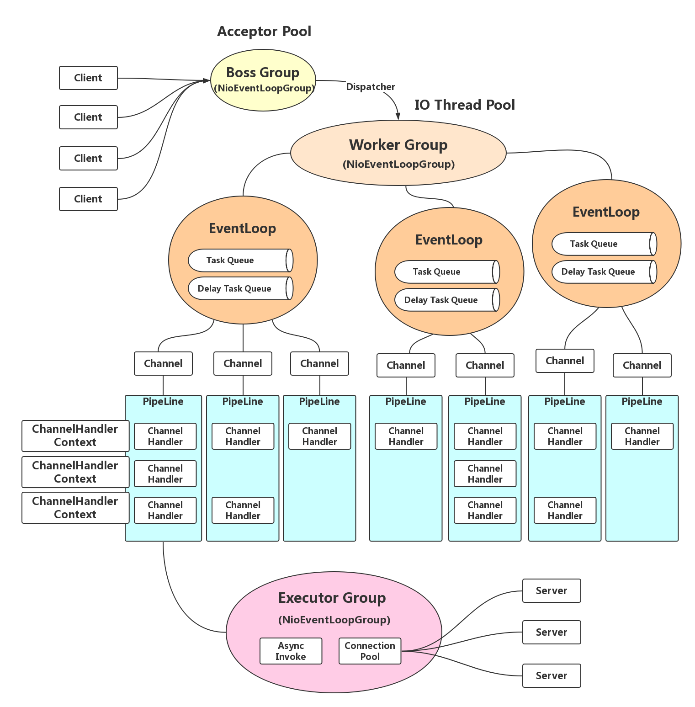
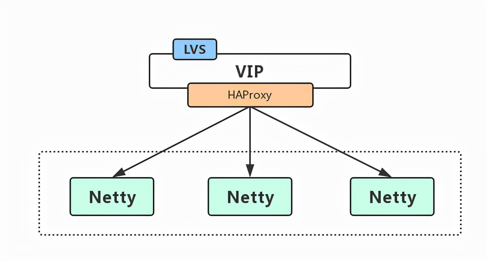
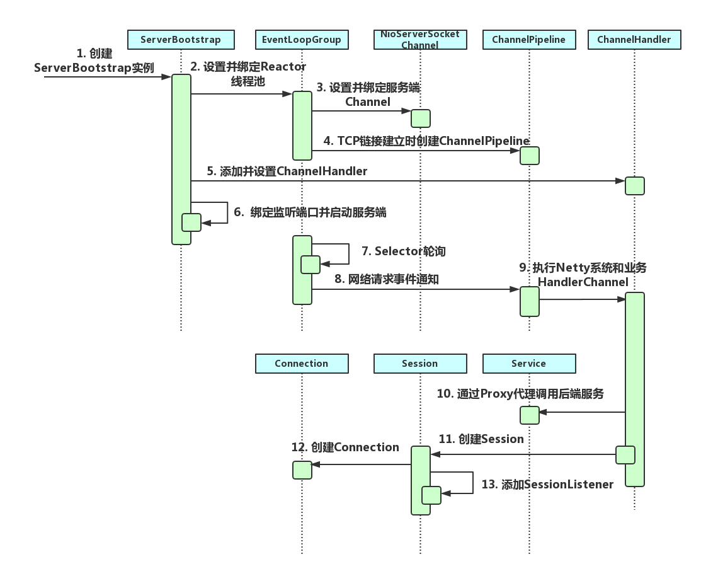
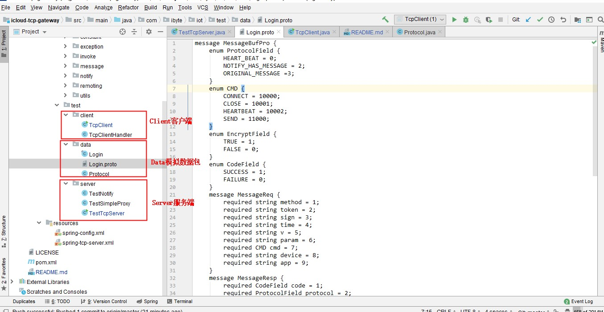

# 物联网设备网关技术架构设计 TCP Gateway

原文：https://www.toutiao.com/i7042635869093872159/?tt_from=weixin&utm_campaign=client_share&wxshare_count=1&timestamp=1639790775&app=news_article&utm_source=weixin&utm_medium=toutiao_ios&use_new_style=1&req_id=2021121809261501013105713623621A33&share_token=055B9E42-04B1-42F6-827E-E0DADD229889&group_id=7042635869093872159

## 介绍

物联网设备网关技术架构设计（Session 管理、心跳管理、数据上行、数据下行）

### 说明

NioEventLoop 是 Netty 的 Reactor 线程，其角色：

* **Boss Group**：作为服务端 Accepter 线程，用于 accept 客户端链接，并转发给 Worker Group 中的线程
* **Worker Group**：作为 IO 线程，负责 IO 的读写，从 SocketChannel 中读取报文或向 SocketChannel 写入报文
* **Task Queue / Delay Task Queue**：作为定时任务线程，执行定时任务，例如链路空闲检测和发送心跳消息等

## 概要说明

* **TcpServer**：提供 TCP 连接服务
* **TcpSessionManager**：可以添加监听事件，用于监听 TCP 会话创建、销毁等
* **LogSessionListener**：一个日志监听器，它和 TcpSessionManager 关联，监听器必须事先 SessionListener
* **TcpSender**：TCP 发送者，用户向客户端发送消息通知、实现下行逻辑
* **ServerConfig**：TCP 的配置管理类
* **TcpConnector**：TCP 容器，用于管理服务和客户端的连接
* **NotifyProxy**：发送通知到代理类

## TCP 网关的网络结构

基于 Netty 构建 TCP 网关的长链路容器，作为网关接入层提供服务 API 请求调用。

客户端通过 “**域名 + 端口**” 访问网关，域名不同的运营商对应不同的 VIP，VIP 发布在 LVS 上，LVS 将请求转发给后端的 HAProxy，再由 HAProxy 把请求转发给后端的 Netty 的 IP + Port。

LVS 转发给后端的 HAProxy，请求经过 LVS，但是响应的是 HAProxy 直接反馈给客户端的，这也就是 LVS 的 DR 模式。

TCP 网关执行时序图：

其中**步骤一**到**步骤九**是指 Netty 服务端的创建时序，**步骤十**到**步骤十三**是 TCP 网关容器创建的时序。

* **步骤一**：创建 ServerBootstrap 实例，ServerBootstrap 是 Netty 服务端的启动辅助类
* **步骤二**：设置并绑定 Reactor 线程池，EventLoopGroup 是 Netty 的 Reactor 线程池，EventLoop 负责所有注册到本线程的 Channel
* **步骤三**：设置并绑定服务器 Channel，Netty Server 需要创建 NioServerSocketChannel 对象
* **步骤四**：TCP 链接建立时创建 ChannelPipeline， ChannelPipeline 本质上是一个负责任的执行 ChannelHandler 的职责链
* **步骤五**：添加并设置 ChannelHandler，ChannelHandler 串行的加入 ChannelPipeline 中
* **步骤六**：绑定监听端口并启动服务端，将 NioServerSocketChannel 注册到 Selector 上
* **步骤七**：Selector 轮询，由 EventLoop 负责调度和执行 Selector 轮询操作
* **步骤八**：执行网络请求事件通知，轮询准备就绪的 Channel，由 EventLoop 执行 ChannelPipeline
* **步骤九**：执行 Netty 系统和业务 ChannelHandler，依次调度并执行 ChannelPipeline 的 ChannelHandler
* **步骤十**：通过 Proxy 代理调用后端服务，ChannelRead 事件过后，通过发射调用后端 Service
* **步骤十一**：创建 Session，Session 与 Connection 是相互依赖的关系
* **步骤十二**：创建 Connection， Connection 保存 ChannelHanlderContext
* **步骤十三**：添加 SessionListener，SessionListener 监听 SessionCreate 和 SessionDestroy事件

## 程序运行案例步骤

1. **配置本地Host**

   在hosts文件中添加：

   127.0.0.1 iot-open.icloud.com

2. **启动 Server**

   位置: com.ibyte.iot.test.server.TestTcpServer

3. **启动client**

   位置: com.ibyte.iot.test.client.TcpClient

附录：

https://gitee.com/ibyte/icloud-tcp-gateway