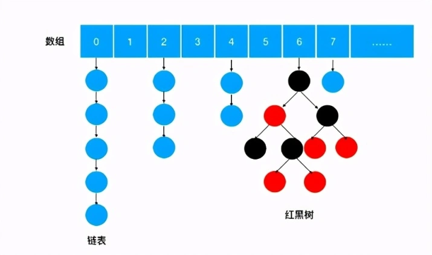
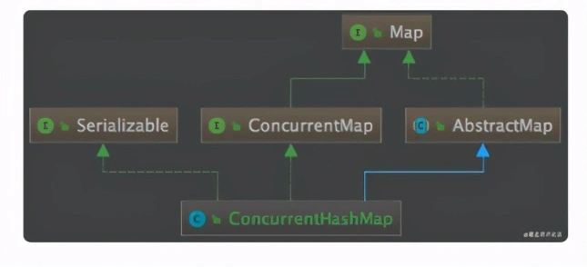
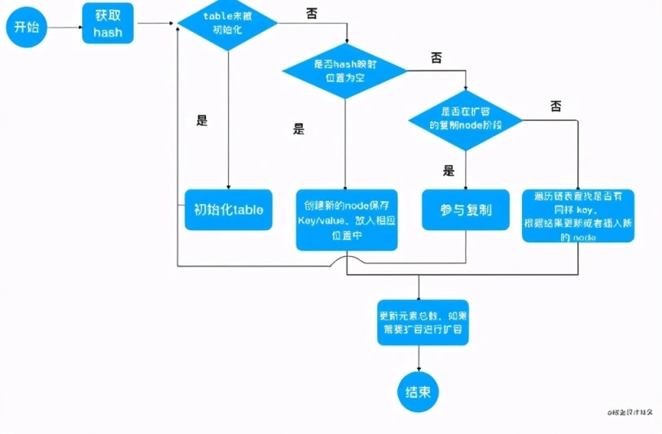

# ConcurrentHashMap核心原理

原文：https://xie.infoq.cn/article/901e4fa89353a6dfb63490c3d


谈到 ConcurrentHashMap，就一定会想到 HashMap。HashMap 在代码中使用频率更高，不需要考虑线程安全的地方，一般都会使用 HashMap。HashMap 的实现非常经典，如果大家读过 HashMap 的源代码，那么对 ConcurrentHashMap 源代码的理解会相对轻松，因为两者采用的数据结构是类似的。

## 一. 基本结构

ConcurrentHashMap 是一个存储 Kev/Value 对的容器，并且是线程安全的。先来看看ConcurrentHashMap 的存储结构，如下图：



虽然 ConcurrentHashMap 的底层数据结构、方法的实现细节，与 HashMap 大体一致，但两者在**类结构**没有任何关联。下面是 ConcurrentHashMap 的类关系图：



看 ConcurrentHashMap 的源码，会发现很多方法和代码与 HashMap 很**相似**，所以有人问：为啥不继承 HashMap 呢？

继承虽然办法好，但 ConcurrentHashMap 都是在<font color='red'>**方法中间**</font>进行一些枷锁操作，即，加锁操作会切割原来的方法，继承基本上无法解决这个问题了。

### 1.1 ConcurrentHashMap 与 HashMap 的异同

#### 1.1.1 相同

* 数组、链表结构几乎相同，所以底层对数据结构的操作思路是相通的（只是思路相同，底层实现不同）
* 都实现了 Map 接口，继承了 AbstractMap 抽象类，所以大多数的方法也都是相同的，HashMap 有的方法，ConcurrentHashMap 也几乎都有，所以，如果从 HashMap 切换到 ConcurrentHashMap，无需关心两者之间的兼容问题

#### 1.1.2 不同

* 红黑树结构略有不同。HashMap 的红黑树中的节点叫做 ***TreeNode***，TreeNode 不仅仅有属性，还维护着红黑树的结构，比如查找、新增等等；**ConcurrentHashMap 中红黑树被拆分成两块，**TreeNode 仅仅维护着属性和查找功能，新增了 TreeBin，来维护红黑树结构，并负责根节点的加锁和解锁
* ConcurrentHashMap 新增 ForwardingNode （转移）节点，扩容的时候会使用到，通过使用该节点，来保证扩容时的线程安全

## 二. 基本构成

### 2.1 重要属性

​        首先来看看 ConcurrentHashMap 的几个重要属性：

```java
//这个Node数组就是ConcurrentHashMap用来存储数据的哈希表。
transient volatile Node[] table
//这是默认的初始化哈希表数组大小
private static final int DEFAULT_CAPACITY = 16;
//转化为红黑树的链表长度阈值
static final int TREEIFY_THRESHOLD = 8
//这个标识位用于识别扩容时正在转移数据
static final int MOVED = -1
//计算哈希值时用到的参数，用来去除符号位
static final int HASH_BITS = 0x7fffffff;
//数据转移时，新的哈希表数组
private transient volatile Node[] nextTable;
```

### 2.2 重要组成元素

#### 2.2.1 Node

链表中的元素为 Node 对象，它是链表上的一个节点，内部存储了 Key 、Value 值，以及它的下一个节点的引用。这样一系列的 Node 就串成一串，组成一个链表。

#### 2.2.2 ForwardingNode

当进行扩容时，要把链表迁移到新的哈希表，在做这个操作时，会再把数组中的头节点替换为 ForwardingNode 对象，ForwardingNode 中不保存 Key 和 Value，只保存了扩容后哈希表（nextTable）的引用。此时查找相应 node 时，需要去 nextTable 中查找。

#### 2.2.3 TreeBin

当链表转为红黑树后，数组中保存的引用为 TreeBin，TreeBin 内部不保存 Key / Value，它保存了 TreeNode 的 list 以及红黑树 root。

#### 2.2.4 TreeNode

红黑树的节点。

## 三. Put方法

```java
public V put(K key, V value) {
  return putVal(key, value, false);
}
```

```java
    final V putVal(K key, V value, boolean onlyIfAbsent) {
        if (key == null || value == null) throw new NullPointerException();
        int hash = spread(key.hashCode());
        int binCount = 0;
        for (Node<K,V>[] tab = table;;) {
            Node<K,V> f; int n, i, fh; K fk; V fv;
            // 这里就是上面构造方法没有进行初始化，在这里进行判断，
            // 为null就调用initTable进行初始化，属于懒汉模式初始化
            if (tab == null || (n = tab.length) == 0)
                tab = initTable();
            else if ((f = tabAt(tab, i = (n - 1) & hash)) == null) {
                if (casTabAt(tab, i, null, new Node<K,V>(hash, key, value)))
                    break;                   // no lock when adding to empty bin
            }
            else if ((fh = f.hash) == MOVED) //如果在进行扩容，则先进行扩容操作 
                tab = helpTransfer(tab, f);
            else if (onlyIfAbsent // check first node without acquiring lock
                     && fh == hash
                     && ((fk = f.key) == key || (fk != null && key.equals(fk)))
                     && (fv = f.val) != null)
                return fv;
            else {
                V oldVal = null;
                // 如果以上条件都不满足，那就要进行加锁操作，也就是存在hash冲突，
                // 锁住链表或者红黑树的头结点 
                synchronized (f) {
                    if (tabAt(tab, i) == f) {
                        if (fh >= 0) { //表示该节点是链表结构
                            binCount = 1;
                            for (Node<K,V> e = f;; ++binCount) {
                                K ek;
                                // 这里涉及到相同的key进行put就会覆盖原先的value 
                                if (e.hash == hash &&
                                    ((ek = e.key) == key ||
                                     (ek != null && key.equals(ek)))) {
                                    oldVal = e.val;
                                    if (!onlyIfAbsent)
                                        e.val = value;
                                    break;
                                }
                                Node<K,V> pred = e;
                                if ((e = e.next) == null) { // 插入链表尾部
                                    pred.next = new Node<K,V>(hash, key, value);
                                    break;
                                }
                            }
                        }
                        else if (f instanceof TreeBin) { // 红黑树结构 
                            Node<K,V> p;
                            binCount = 2;
                            // 红黑树结构旋转插入  
                            if ((p = ((TreeBin<K,V>)f).putTreeVal(hash, key,
                                                           value)) != null) {
                                oldVal = p.val;
                                if (!onlyIfAbsent)
                                    p.val = value;
                            }
                        }
                        else if (f instanceof ReservationNode)
                            throw new IllegalStateException("Recursive update");
                    }
                }
                if (binCount != 0) { // 如果链表的长度大于8时就会进行红黑树的转换
                    if (binCount >= TREEIFY_THRESHOLD)
                        treeifyBin(tab, i);
                    if (oldVal != null)
                        return oldVal;
                    break;
                }
            }
        }
        addCount(1L, binCount); // 统计size，并且检查是否需要扩容
        return null;
    }
```

ConcurrentHashMap 在 put 方法上的整体思路和 HashMap 相同，但在线程安全方面写了很多保障的代码。整体思路如下：

1. 如果数组为空，初始化，初始化完成之后，进入第二步
2. 计算当前槽点有没有值。没有值的话，通过CAS 创建，如果创建失败，则继续自旋（for 死循环），直到成功为止；如果槽点有值，进入第三步
3. 如果槽点是转移节点（正在扩容），就会一直自旋等待扩容完成之后再新增；如果不是转移点，进入第四步
4. 槽点有值，先锁定当前槽点，保证其余线程不能操作；如果是链表，新增值到链表的尾部；如果是红黑树，使用红黑树新增的方法新增
5. 新增完成之后，check是否需要扩容。如果需要，则进行扩容



### 3.1 Put过程中如何保证线程安全

#### 3.1.1 数组初始化时的线程安全

数组初始化时，首先**通过自旋来保证一定可以初始化成功**，然后通过 CAS 设置 ***SIZECTL*** 变量的值，来保证同一时刻只能有一个线程对数组进行初始化，CAS 成功后，还会再次判断当前数组是否已经初始化完成。如果已经初始化完成，就不会再次初始化，通过 “***自旋 + CAS + 双重 check*** ”等手段保证了数组初始化时的线程安全。

看看初始化的代码 ***initTable*** 方法：

```java
   /**
     * Initializes table, using the size recorded in sizeCtl.
     */
    private final Node<K,V>[] initTable() {
        Node<K,V>[] tab; int sc;
        while ((tab = table) == null || tab.length == 0) { //空的table才能进入初始化操作
            if ((sc = sizeCtl) < 0) // sizeCtl<0 表示其他线程已经在初始化了或者扩容了，挂起当前线程
                Thread.yield(); // lost initialization race; just spin
            else if (U.compareAndSetInt(this, SIZECTL, sc, -1)) { // CAS 操作 SIZECTL为-1，表示初始化状态
                try {
                    if ((tab = table) == null || tab.length == 0) {
                        int n = (sc > 0) ? sc : DEFAULT_CAPACITY;
                        @SuppressWarnings("unchecked")
                        Node<K,V>[] nt = (Node<K,V>[])new Node<?,?>[n]; // 初始化
                        table = tab = nt;
                        sc = n - (n >>> 2); // 记录下次扩容的大小
                    }
                } finally {
                    sizeCtl = sc;
                }
                break;
            }
        }
        return tab;
    }
```

这里有一个关键的值 sizeCtl，这个值有多个含义：

1. -1 代表有线程正在创建 table
2. -N 代表有 N - 1 个线程正在复制 table
3. 在 table 被初始化前，代表根据构造函数传入的值计算出的应被初始化的大小
4. 在 table 被初始化后，则被设置为 table 大小的 75%，代表 table 的容量（数组容量）

#### 3.1.2 新增槽点值时的线程安全

此时，为了保证线程安全，做了四处优化：

1. 通过自旋死循环保证一定可以新增成功

   在新增之前，通过 *for (Node<K,V>[] tab = table; ; )* 这样的死循环来保证新增一定可以成功。一旦新增成功，就可以退出当前死循环；新增失败的话，会重复新增的步骤，直到新增成功为止

2. 当前槽点为空时，通过 CAS 新增

   Java 里的写法非常严谨，没有在判断槽点为空的情况下直接赋值，因为在判断槽点为空和赋值的瞬间，很可能槽点已经被其他线程复制了，所以采用 CAS 算法，能够保证槽点为空的情况下赋值成功。如果恰好槽点已经被其他线程赋值，当前 CAS 操作失败，会再次执行 for 自旋，再走槽点有值的 put 流程。这里就是 自旋 + CAS 的结合

3. 当前槽点有值，锁住当前槽点

   put 时，如果当前槽点有值，就是 key 的 hash 冲突的情况，此时槽点上可能是链表或者是红黑树。通过锁住槽点，来保证同一时刻只会有一个线程能对槽点进行修改

   ```java
   V oldValue = null;
   // 锁定当前槽点，其余线程不能操作，保证了安全
   synchronized (f) {
     // todo....
   }
   ```

4. 红黑树旋转时，锁住红黑树的根节点，保证同一时刻，当前红黑树只能被一个线程旋转

## 四. Hash算法

### 4.1 spread 方法源码分析

hash 算法的逻辑，决定 ConcurrentHashMap 保存和读取速度。

```java
static final int spread(int h) {
  return (h ^ (h >>> 16)) & HASH_BITS;
}
```

传入的参数 *h* 为 key 对象的 hashCode，spread 方法对 hashCode 进行加工，重新计算出 hash。

hash 值是用来映射该 key 值在哈希表中的位置。取出哈希表中该 hash 值对应位置的代码如下：

```java
tabAt(tab, i = (n -1) & hash);
```

这行代码的逻辑，第一个擦数为哈希表，第二个参数是哈希表中的数组下标。通过 *(n - 1) & hash*  计算下标。n 为数组长度，以默认大小 16 为例，那么 n - 1 = 15，可以假设 hash 值为 100

```shell
n的值15转为二进制：
0000 0000 0000 0000 0000 0000 0000 1111
hash的值100转为二进制：
0000 0000 0000 0000 0000 0000 0110 0100。
计算结果：
0000 0000 0000 0000 0000 0000 0000 0100
对应的十进制值为 4
```

15 的二进制高位都是 0，低位都是 1。那么经过& 计算后，hash值 100 的高位全部被清零，低位则保持不变，并且一定小于 *( n - 1)* 的。也就是说经过如此计算，通过 hash 值得到的数组下标绝对不会越界。

### 4.2 一些问题

1. 数组大小可以为 17，或者  18 吗？

   **答**：数组大小必须为 2 的 n 次方，也就是 16，32，64，…… 不能是其他值。因为如果不是 2 的 n 次方，那么经过计算的数组下标会增大碰撞的几率。

   如果 hash 值的二进制是 10000 （十进制 16）、10010 （十进制 18）、10001（十进制 17），和 10100 做 & 计算后，都是 10000，也即是都被映射到数组 16 这个下标上。这三个值以链表的形式存储在数组 16 下标的位置。这显然不是想要的结果。

   但是，如果数组长度 n 是 2 的 n 次方，二进制的数值为 10、100、1000、10000，……，*n - 1* 后对应的二进制数为 1、11、111、1111、……，这样和 hash 值低位 & 计算后，会保留原来 hash 值的低位数值，那么只要 hash 值的低位不一样，就不会发生碰撞。

2. 如果为了保证不越界，为什么不直接用 % 来计算取余数？

   **答**：*(n - 1) & hash*  等价于 *hash % n*，那么为什么不直接用 hash % n 呢？因为按位操作效率更高。

3. 为什么不直接用 key 的 hashCode，而是使用经 *spread()* 加工后的 hash 值？

   **答**：其实说到底，还是为了减少碰撞的概率。先来看看 *spread()* 方法做了啥事儿：<font color='red'>*h ^ (h >>> 16)* </font> 。这个方法就是把 *h* 的二进制数值向右移动 16 位。JVM中，整型（Integer/int）为32位，那么右移 16 位后，就是把高位的16位移到了低16位，而高16位清0了。

   ^是异或操作，二进制按位比较，如果相同则为 0，不同则为 1。这行代码的意思就是把高低16位做异或。如果两个 hashCode 值的低 16 位相同，但是高位不同，经过如此计算，低 16 位会变得不一样了。

   为什么要把低位变得不一样呢？

   这是由于哈希表数组长度 n 会是偏小的数值，那么进行 *(n - 1 ) & hash* 运算时，一直使用的是 hash 较低位的值。那么即使 hash 值不同，但如果低位相当，也会发生碰撞。而进行 *h ^ (h >>> 16)* 加工后的 hash 值，让 hashCode 高位的值也参与了哈希运算，从而减少了碰撞的概率。

   <font color='red'> *(h ^ (h >>> 16)) & HASH_BITS* </font> ，那么为何高位移到低位，和原来低位做**异或**操作后，还需要和 *HASH_BITS* 这个常量再做 **&** 计算呢？HASH_BITS 这个常量的值是 *0x7fffffff*，转化为二进制为 *0111 1111 1111 1111 1111 1111 1111 1111* 。这个操作后，会把最高位转化为 0，其实就是消除了符号位，得到的都是正数。这是因为负的 hashCode 在 ConcurrentHashMap 中有特殊的含义，因此需要得到一个正的 hashCode。

## 五. 扩容源码分析

在了解了 ConcurrentHashMap 的存储结构后，思考一个问题：当数组中保存的链表越来越多，那么再存储进来的元素大概率会插入到现有的链表中，而不是使用数组中剩下的空位。这样会造成数组中保存的链表越来越长，由此导致哈希表查找速度下降，从 $O(1)$ 慢慢趋近于链表的时间复杂度 $O(\frac{n}{2})$，这显然违背了哈希表的初衷。

所以，ConcurrentHashMap 会做一个操作，称为扩容。也就是把数组长度变大，增加更多的空位出来，最终目的就是预防链表过长，这样查找的时间复杂度才会趋向于 $O(1)$ 。

扩容的操作并不会在数组没有空位时才进行，因为在空位快满时，新保存元素更大的概率会命中已经使用的位置，那么可能最后几个槽位很难被使用，而链表却越来越长。

另外，ConcurrentHashMap 还会有链表转红黑树的操作，以提高查找的速度，红黑树时间复杂度为 $O(logN)$，而链表是 $O(\frac{n}{2})$ ，因此只在 $O(logN) < O(\frac{n}{2}) $ 时才会进行转换，也就是以 $8$ 作为分界点。

下面来分析 *treeifyBin()* 方法代码，这个代码中会选择是把此时保存数据所在的链表转换为红黑树，还是对整个哈希表扩容：

```java

    /**
     * Replaces all linked nodes in bin at given index unless table is
     * too small, in which case resizes instead.
     */
    private final void treeifyBin(Node<K,V>[] tab, int index) {
        Node<K,V> b; int n;
        if (tab != null) {
            // 如果哈希表长度小于 64，那么选择扩大哈希表的大小，
            // 而不是把链表转为红黑树
            if ((n = tab.length) < MIN_TREEIFY_CAPACITY)
                tryPresize(n << 1);
            // 将哈希表中 index 位置的链表转为红黑树
            else if ((b = tabAt(tab, index)) != null && b.hash >= 0) {
                synchronized (b) {
                    // 下面逻辑将 node 链表转化为 TreeNode 链表
                    if (tabAt(tab, index) == b) {
                        TreeNode<K,V> hd = null, tl = null;
                        for (Node<K,V> e = b; e != null; e = e.next) {
                            TreeNode<K,V> p =
                                new TreeNode<K,V>(e.hash, e.key, e.val,
                                                  null, null);
                            if ((p.prev = tl) == null)
                                hd = p;
                            else
                                tl.next = p;
                            tl = p;
                        }
                        // TreeBin 代表红黑树，将TreeBin保存在哈希表的 index 位置
                        setTabAt(tab, index, new TreeBin<K,V>(hd));
                    }
                }
            }
        }
    }
```

再重点看一下 tryPresize() 方法，此方法中实现了对数组的扩容，传入的参数 size 是原来哈希表大小的一倍。假定原来哈希表大小为 16，那么传入的 size 值就是 32：

```java

    /**
     * Tries to presize table to accommodate the given number of elements.
     *
     * @param size number of elements (doesn't need to be perfectly accurate)
     */
    private final void tryPresize(int size) {
        // 
        int c = (size >= (MAXIMUM_CAPACITY >>> 1)) ? MAXIMUM_CAPACITY :
            tableSizeFor(size + (size >>> 1) + 1);
        int sc;
        while ((sc = sizeCtl) >= 0) {
            Node<K,V>[] tab = table; int n;
            if (tab == null || (n = tab.length) == 0) {
                n = (sc > c) ? sc : c;
                if (U.compareAndSetInt(this, SIZECTL, sc, -1)) {
                    try {
                        if (table == tab) {
                            @SuppressWarnings("unchecked")
                            Node<K,V>[] nt = (Node<K,V>[])new Node<?,?>[n];
                            table = nt;
                            sc = n - (n >>> 2);
                        }
                    } finally {
                        sizeCtl = sc;
                    }
                }
            }
            else if (c <= sc || n >= MAXIMUM_CAPACITY)
                break;
            else if (tab == table) {
                int rs = resizeStamp(n);
                if (U.compareAndSetInt(this, SIZECTL, sc,
                                        (rs << RESIZE_STAMP_SHIFT) + 2))
                    transfer(tab, null);
            }
        }
    }
```

ConcurrentHashMap 的扩容时机和 HashMap 相同，都是在 put 方法的最后一步检查是否需要扩容。如果需要则进行扩容，但是，两者扩容的过程完全不同。ConcurrentHashMap 扩容的方法叫做 transfer，从 put 方法的 addCount 方法进去，就能找到 transfer 方法，该方法的主要思路是：

1. 首先需要把老数组的值全部拷贝到扩容之后的新数组上，先从数组的队尾开始拷贝
2. 拷贝数组的槽点时，先把原数组槽点锁住，保证原数组槽点不能操作，成功拷贝到新数组时，把原数组槽点赋值为转移节点
3. 这时如果有新数据正好需要 put 到此槽点时，发现槽点为转移节点，就会一直等待，所以在扩容完成之前，该槽点对应的数据是不会发生变化的
4. 从数据的尾部拷贝到头部，每拷贝成功一次，就把原数组中的节点设置成转移节点
5. 直到所有数组数据都拷贝到新数组时，直接把新数组整个赋值给数组容器，拷贝完成

扩容方法主要是通过在原数组上设置转移节点，put 时碰到转移节点时会等待扩容成功完成之后在 put。这个策略保证了整个扩容过程中肯定是线程安全的，因为数组的槽点一旦被设置成转移节点，在没有扩容完成之前，是无法进行操作的。

```java

    /**
     * Moves and/or copies the nodes in each bin to new table. See
     * above for explanation.
     */
    private final void transfer(Node<K,V>[] tab, Node<K,V>[] nextTab) {
        int n = tab.length, stride;
        if ((stride = (NCPU > 1) ? (n >>> 3) / NCPU : n) < MIN_TRANSFER_STRIDE)
            stride = MIN_TRANSFER_STRIDE; // subdivide range
        if (nextTab == null) {            // initiating
            try {
                @SuppressWarnings("unchecked")
                Node<K,V>[] nt = (Node<K,V>[])new Node<?,?>[n << 1];
                nextTab = nt;
            } catch (Throwable ex) {      // try to cope with OOME
                sizeCtl = Integer.MAX_VALUE;
                return;
            }
            nextTable = nextTab;
            transferIndex = n;
        }
        int nextn = nextTab.length;
        ForwardingNode<K,V> fwd = new ForwardingNode<K,V>(nextTab);
        boolean advance = true;
        boolean finishing = false; // to ensure sweep before committing nextTab
        for (int i = 0, bound = 0;;) {
            Node<K,V> f; int fh;
            while (advance) {
                int nextIndex, nextBound;
                if (--i >= bound || finishing)
                    advance = false;
                else if ((nextIndex = transferIndex) <= 0) {
                    i = -1;
                    advance = false;
                }
                else if (U.compareAndSetInt
                         (this, TRANSFERINDEX, nextIndex,
                          nextBound = (nextIndex > stride ?
                                       nextIndex - stride : 0))) {
                    bound = nextBound;
                    i = nextIndex - 1;
                    advance = false;
                }
            }
            if (i < 0 || i >= n || i + n >= nextn) {
                int sc;
                if (finishing) {
                    nextTable = null;
                    table = nextTab;
                    sizeCtl = (n << 1) - (n >>> 1);
                    return;
                }
                if (U.compareAndSetInt(this, SIZECTL, sc = sizeCtl, sc - 1)) {
                    if ((sc - 2) != resizeStamp(n) << RESIZE_STAMP_SHIFT)
                        return;
                    finishing = advance = true;
                    i = n; // recheck before commit
                }
            }
            else if ((f = tabAt(tab, i)) == null)
                advance = casTabAt(tab, i, null, fwd);
            else if ((fh = f.hash) == MOVED)
                advance = true; // already processed
            else {
                synchronized (f) {
                    if (tabAt(tab, i) == f) {
                        Node<K,V> ln, hn;
                        if (fh >= 0) {
                            int runBit = fh & n;
                            Node<K,V> lastRun = f;
                            for (Node<K,V> p = f.next; p != null; p = p.next) {
                                int b = p.hash & n;
                                if (b != runBit) {
                                    runBit = b;
                                    lastRun = p;
                                }
                            }
                            if (runBit == 0) {
                                ln = lastRun;
                                hn = null;
                            }
                            else {
                                hn = lastRun;
                                ln = null;
                            }
                            for (Node<K,V> p = f; p != lastRun; p = p.next) {
                                int ph = p.hash; K pk = p.key; V pv = p.val;
                                if ((ph & n) == 0)
                                    ln = new Node<K,V>(ph, pk, pv, ln);
                                else
                                    hn = new Node<K,V>(ph, pk, pv, hn);
                            }
                            setTabAt(nextTab, i, ln);
                            setTabAt(nextTab, i + n, hn);
                            setTabAt(tab, i, fwd);
                            advance = true;
                        }
                        else if (f instanceof TreeBin) {
                            TreeBin<K,V> t = (TreeBin<K,V>)f;
                            TreeNode<K,V> lo = null, loTail = null;
                            TreeNode<K,V> hi = null, hiTail = null;
                            int lc = 0, hc = 0;
                            for (Node<K,V> e = t.first; e != null; e = e.next) {
                                int h = e.hash;
                                TreeNode<K,V> p = new TreeNode<K,V>
                                    (h, e.key, e.val, null, null);
                                if ((h & n) == 0) {
                                    if ((p.prev = loTail) == null)
                                        lo = p;
                                    else
                                        loTail.next = p;
                                    loTail = p;
                                    ++lc;
                                }
                                else {
                                    if ((p.prev = hiTail) == null)
                                        hi = p;
                                    else
                                        hiTail.next = p;
                                    hiTail = p;
                                    ++hc;
                                }
                            }
                            ln = (lc <= UNTREEIFY_THRESHOLD) ? untreeify(lo) :
                                (hc != 0) ? new TreeBin<K,V>(lo) : t;
                            hn = (hc <= UNTREEIFY_THRESHOLD) ? untreeify(hi) :
                                (lc != 0) ? new TreeBin<K,V>(hi) : t;
                            setTabAt(nextTab, i, ln);
                            setTabAt(nextTab, i + n, hn);
                            setTabAt(tab, i, fwd);
                            advance = true;
                        }
                        else if (f instanceof ReservationNode)
                            throw new IllegalStateException("Recursive update");
                    }
                }
            }
        }
    }
```

## 六. Get 方法

ConcurrentHashMap 读，就比较简单了。先获取数据的下标，然后通过判断数组下标的 key 是否和要查找数据的 key 是否相等。相等就直接返回，如果下标的槽点是链表或者红黑树，分别调用相应的查找数据的方法，整体思路和 HashMap 很像。

```java

    /**
     * Returns the value to which the specified key is mapped,
     * or {@code null} if this map contains no mapping for the key.
     *
     * <p>More formally, if this map contains a mapping from a key
     * {@code k} to a value {@code v} such that {@code key.equals(k)},
     * then this method returns {@code v}; otherwise it returns
     * {@code null}.  (There can be at most one such mapping.)
     *
     * @throws NullPointerException if the specified key is null
     */
    public V get(Object key) {
        Node<K,V>[] tab; Node<K,V> e, p; int n, eh; K ek;
        int h = spread(key.hashCode());
        if ((tab = table) != null && (n = tab.length) > 0 &&
            (e = tabAt(tab, (n - 1) & h)) != null) {
            if ((eh = e.hash) == h) {
                if ((ek = e.key) == key || (ek != null && key.equals(ek)))
                    return e.val;
            }
            else if (eh < 0)
                return (p = e.find(h, key)) != null ? p.val : null;
            while ((e = e.next) != null) {
                if (e.hash == h &&
                    ((ek = e.key) == key || (ek != null && key.equals(ek))))
                    return e.val;
            }
        }
        return null;
    }

```

## 七. 构造函数源码

```java

    /**
     * Creates a new, empty map with an initial table size
     * accommodating the specified number of elements without the need
     * to dynamically resize.
     *
     * @param initialCapacity The implementation performs internal
     * sizing to accommodate this many elements.
     * @throws IllegalArgumentException if the initial capacity of
     * elements is negative
     */
    public ConcurrentHashMap(int initialCapacity) {
        this(initialCapacity, LOAD_FACTOR, 1);
    }


    /**
     * Creates a new, empty map with an initial table size based on
     * the given number of elements ({@code initialCapacity}), initial
     * table density ({@code loadFactor}), and number of concurrently
     * updating threads ({@code concurrencyLevel}).
     *
     * @param initialCapacity the initial capacity. The implementation
     * performs internal sizing to accommodate this many elements,
     * given the specified load factor.
     * @param loadFactor the load factor (table density) for
     * establishing the initial table size
     * @param concurrencyLevel the estimated number of concurrently
     * updating threads. The implementation may use this value as
     * a sizing hint.
     * @throws IllegalArgumentException if the initial capacity is
     * negative or the load factor or concurrencyLevel are
     * nonpositive
     */
    public ConcurrentHashMap(int initialCapacity,
                             float loadFactor, int concurrencyLevel) {
        if (!(loadFactor > 0.0f) || initialCapacity < 0 || concurrencyLevel <= 0)
            throw new IllegalArgumentException();
        if (initialCapacity < concurrencyLevel)   // Use at least as many bins
            initialCapacity = concurrencyLevel;   // as estimated threads
        long size = (long)(1.0 + (long)initialCapacity / loadFactor);
        int cap = (size >= (long)MAXIMUM_CAPACITY) ?
            MAXIMUM_CAPACITY : tableSizeFor((int)size);
        this.sizeCtl = cap;
    }


    /**
     * Returns a power of two table size for the given desired capacity.
     * See Hackers Delight, sec 3.2
     */
    private static final int tableSizeFor(int c) {
        int n = -1 >>> Integer.numberOfLeadingZeros(c - 1);
        return (n < 0) ? 1 : (n >= MAXIMUM_CAPACITY) ? MAXIMUM_CAPACITY : n + 1;
    }


    /**
     * Returns the number of zero bits preceding the highest-order
     * ("leftmost") one-bit in the two's complement binary representation
     * of the specified {@code int} value.  Returns 32 if the
     * specified value has no one-bits in its two's complement representation,
     * in other words if it is equal to zero.
     *
     * <p>Note that this method is closely related to the logarithm base 2.
     * For all positive {@code int} values x:
     * <ul>
     * <li>floor(log<sub>2</sub>(x)) = {@code 31 - numberOfLeadingZeros(x)}
     * <li>ceil(log<sub>2</sub>(x)) = {@code 32 - numberOfLeadingZeros(x - 1)}
     * </ul>
     *
     * @param i the value whose number of leading zeros is to be computed
     * @return the number of zero bits preceding the highest-order
     *     ("leftmost") one-bit in the two's complement binary representation
     *     of the specified {@code int} value, or 32 if the value
     *     is equal to zero.
     * @since 1.5
     */
    @IntrinsicCandidate
    public static int numberOfLeadingZeros(int i) {
        // HD, Count leading 0's
        if (i <= 0)
            return i == 0 ? 32 : 0;
        int n = 31;
        if (i >= 1 << 16) { n -= 16; i >>>= 16; }
        if (i >= 1 <<  8) { n -=  8; i >>>=  8; }
        if (i >= 1 <<  4) { n -=  4; i >>>=  4; }
        if (i >= 1 <<  2) { n -=  2; i >>>=  2; }
        return n - (i >>> 1);
    }
```

这里，*loadFactor* 的默认值是 0.75，则 *(long)initialCapacity / loadFactor* 就是 initialCapacity的 $\frac{4}{3}$，

所以，如果初始值没有达到 *MAXIMUM_CAPACITY* (1<< 30) 那么大，那么就通过设置为 *tableSizeFor((int)size)*。

