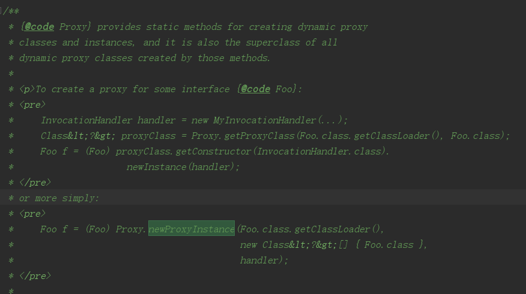

# JDK 动态代理的原理

原文：https://www.toutiao.com/a6739078553247154702/

 

```java
Object proxy = Proxy.newProxyInstance(ClassLoader loader, 
                                      Class<?>[] interfaces, 
                                      InvocationHandler h)
```

​        上面代码会生成一个代理类对象 proxy，通过代理类就可以访问到 realSubject 的行为（method），具体怎么访问，下面继续说明。

​        **Proxy.class**

```java
// InvocationiHandler 是 Proxy 类的属性
protected Proxy(InvocationHandler h) {
    Objects.requireNonNull(h);
    this.h = h;
}

public static Object newProxyInstance(ClassLoader loader,
                                      Class<?>[] interface,
                                      InvocationHandler h)
    throws IllegalArgumentException {
    ...
    /*
     * Look up or generate the designated proxy class.
     */
    Class<?> cl = getProxyClass0(loader, intfs);
    ...
}

/**
 * A factory function that generates, defines and returns the 
 * proxy class given the ClassLoader and array of interfaces.
 */
private static final class ProxyClassFactory 
    implements BiFunction<ClassLoader, Class<?>[], class<?>> {
    // 代理类的名称前缀
    private static final String proxyClassNamePrefix = "$Proxy";
    
    @Override
    public Class<?> apply(ClassLoader loader,
                          Class<?>[] interfaces) {
        ...
        /*
         *
         */
        byte[] proxyClassFile = ProxyGenerator.generateProxyClass(
                proxyName, interfaces, accessFlags);
        return defineClass0(loader, proxyName, 
                           proxyClassFile, 0, proxyClassFile.length);
        ...
        
    }
}
```

​        通过上面的源码，可以看到：

1. InvocationHandler 是 Proxy 的属性
2. 使用 ProxyGenerator.generateProxyClass 可以生成代理类对象

​        接下来通过实例来说明原理：

```java
// 定义一个接口
public interface UserSerivce {
    void query();
}

// 接口实现类
public class UserServiceImpl implements UserService {
    @Override
    public void query() {
        System.out.println("Query user ...");
    }
}

// InvocationHandler 的实现
public class InvocationHandlerImpl implements InvocationHandler {
    private UserService userService;
    
    // 传入真实对象
    public InvocationHandlerImpl(UserService userService) {
        this.userService = userService;
    }
    
    public Object invoke(Object proxy, Method method, Object[] args) 
        throws Throwable {
        System.out.println("before method invoke ...");
        method.invoke(userService, null);
        System.out.println("after method invoke ...");
        return null;
    }
}

// 通过代理类调用方法
public class JdkProxy {
    public static void main(String[] args) {
        UserServiceImpl userService = new UserServiceImpl();
        userService us = (UserService) Proxy.newProxyInstance(
            userService.getClass().getClassLoader(), 
            userService.getClass().getInterfaces(),
            new InvocationHandlerImpl(userService)
        );
        us.query();
    }
}
```

​        上面代码的执行结果：

```shell
before method invoke ...
Query user ...
after method invoke ...
```

​        还有一个问题，就是上面的 Proxy 怎么可以直接转化为 UserService？上面也说过使用 ProxyGenerator.generateProxyClass 可以生成代理类对象，那么不妨看看生成代理类的源码：

```java
byte[] proxyClassFile = ProxyGenerator
    .generateProxyClass("UserServiceProxy",
                       UserServiceImpl.class.getInterfaces());
```

把上面的字节保存到某个地方，生成UserServiceProxy.class 文件，然后反编译这个文件，内容如下：

```java
public final class UserServiceProxy extends Proxy 
    implements UserService {
    private static Method m1;
    private static Method m3;
    private static Method m2;
    private static Method m0;
    
    public UserServiceProxy(InvocationHandler var1) throws {
       super(var1);
    }
    
   public final boolean equals(Object var1) throws {
      try {
          return (Boolean)super
              .h.invoke(this, m1, new Object[]{var1});
      } catch (RuntimeException | Error var3) {
         throw var3;
      } catch (Throwable var4) {
         throw new UndeclaredThrowableException(var4);
      }
   }
    
   public final void query() throws {
      try {
         super.h.invoke(this, m3, (Object[])null);
      } catch (RuntimeException | Error var2) {
         throw var2;
      } catch (Throwable var3) {
         throw new UndeclaredThrowableException(var3);
      }
   }
    
   public final String toString() throws {
      try {
          return (String)super.h.invoke(this, m2, (Object[])null);
      } catch (RuntimeException | Error var2) {
         throw var2;
      } catch (Throwable var3) {
         throw new UndeclaredThrowableException(var3);
      }
   }
    
   public final int hashCode() throws {
      try {
         return (Integer)super.h.invoke(this, m0, (Object[])null);
      } catch (RuntimeException | Error var2) {
         throw var2;
      } catch (Throwable var3) {
         throw new UndeclaredThrowableException(var3);
      }
   }
 
   static {
      try {
         m1 = Class.forName("java.lang.Object")
             .getMethod("equals", 
                        Class.forName("java.lang.Object"));
         m3 = Class.forName("com.proxy.sample.service.UserService")
             .getMethod("query");
         m2 = Class.forName("java.lang.Object").getMethod("toString");
         m0 = Class.forName("java.lang.Object").getMethod("hashCode");
      } catch (NoSuchMethodException var2) {
         throw new NoSuchMethodError(var2.getMessage());
      } catch (ClassNotFoundException var3) {
         throw new NoClassDefFoundError(var3.getMessage());
      }
   }
}
```

通过上面的代码，可以很明了的看到：

* 代理类也实现了 UserService 接口
* 代理类的所有方法调用都是通过 InvocationHandler.invoke 方法实现的

至此，JDK 的动态代理原理很清晰了，其实际的调用链如下：

* Proxy -> InvocationHandler -> RealSubject

而且 Proxy 含有 handler 属性，InvocationHandler 含有 subject 属性。