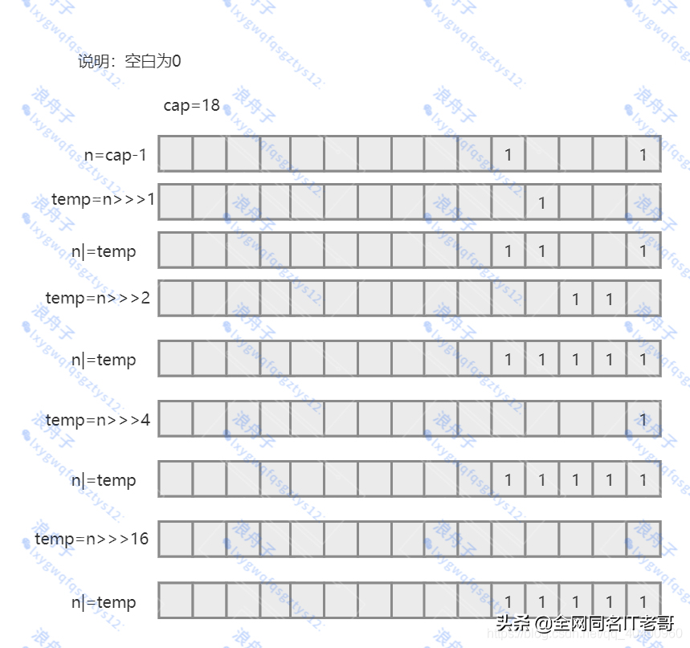
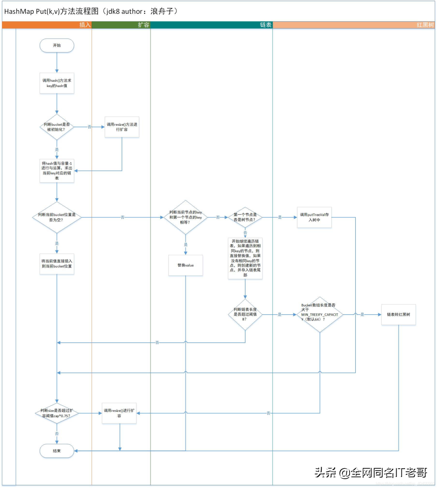
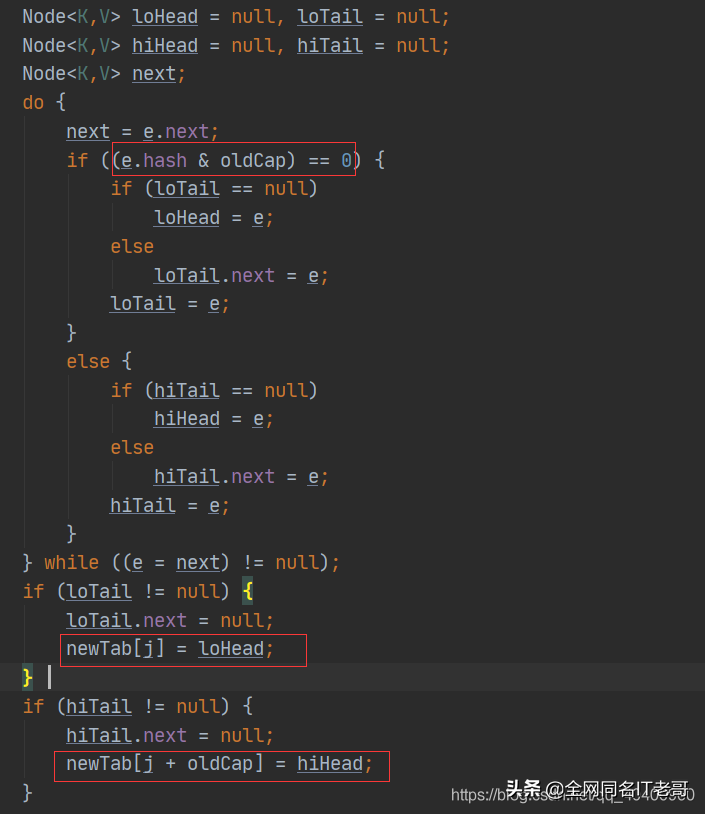
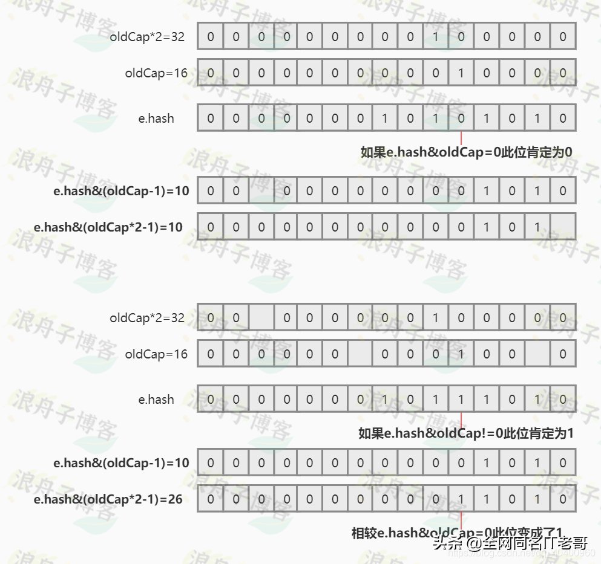

# HashMap的设计

原文：https://www.toutiao.com/a7007230915286123044/


## 一、HashMap构造器

HashMap 总共提供了三个构造器来创建 HashMap 对象。

### 1.1 无参构造器

无参构造函数 *public HashMap() {}* 创建的 HashMap 对象的默认容量为 ***16***，默认的负载因子为 ***0.75***。

### 1.2 有二个参构造器

有两个参数的构造器如下：

```java
public HashMap(int initialCapacity, float loadFactor)
```

这个构造器可以指定 **容量** 和 **负载因子** ，但是在 hashmap 底层，不一定会初始化成传入的容量，而是**会初始化成大于等于传入容量值的最小的 2 的幂次方**。比如传入的是 ***17***，那么 hashmap 的初始化容量是 ***32 $(即：2^5)$*** 。

那么，hashmap 是如何高效计算大于等于一个数的最小 2 的幂次方的呢？其方法如下：

```java
static final int tableSizeFor(int cap) {
  int n = cap -1;
  n |= n >>> 1;
  n |= n >>> 2;
  n |= n >>> 4;
  n |= n >>> 8;
  n |= n >>> 16;
  return (n < 0)?1:(n >= MAXIMUM_CAPACITY) ? MAXIMUM_CAPACITY : n + 1;
}
```

它的设计可以说是非常的巧妙，其基本思想是：如果一个二进制数低位全是 ***1***，那么这个数+1，则肯定是一个 2 的幂次方数。举个例子：



可以看到，它的计算过程如下：首先将制定的那个数 cap 减 1 （减 1 的原因是，如果 cap 正好是一个 2 的幂次方，也可以正确计算），然后对 *cap - 1* 分别无符号右移 1位、2位、4位、8位、16位（加起来正好是 31 位），并且每次移位后都与上一个数进行**按位或运算**，通过这样的运算，会使得最终的结果低位都是 ***1***，那么最终对结果加 ***1***，就会得到一个 2的幂次方数。

### 1.3 只有一个参数构造器

有参构造函数 *public HashMap(int initialCapacity)*，该构造函数和上一个构造函数唯一不同之处就是不能指定负载因子。

## 二、HashMap 插入机制  

### 2.1 插入方法源码

```java
public V put(K key, V value) {
        return putVal(hash(key), key, value, false, true);
}

final V putVal(int hash, K key, V value, boolean onlyIfAbsent, boolean evict) {
    Node<K,V>[] tab; Node<K,V> p; int n, i;
    // 初始化桶数组 table， table 被延迟到插入新数据时再进行初始化
    if ((tab = table) == null || (n = tab.length) == 0)
        n = (tab = resize()).length;
    // 如果桶中不包含键值对节点引用，说明当前数组下标下不存在任何数据，则将新键值对节点的引用存入桶中即可
    if ((p = tab[i = (n - 1) & hash]) == null)
        tab[i] = newNode(hash, key, value, null);
    else {
        Node<K,V> e; K k;
        //如果hash相等，并且equals方法返回true，这说明key相同，此时直接替换value即可，并且返回原值
        if (p.hash == hash && ((k = p.key) == key || (key != null && key.equals(k))))
            e = p;
        //如果第一个节点是树节点，则调用putTreeVal方法，将当前值放入红黑树中
        else if (p instanceof TreeNode)
            e = ((TreeNode<K,V>)p).putTreeVal(this, tab, hash, key, value);
        else {
           //如果第一个节点不是树节点，则说明还是链表节点，则开始遍历链表，将值存储到链表合适的位置
           for (int binCount = 0; ; ++binCount) {
               //如果遍历到了链接末尾，则创建链表节点，将数据存储到链表结尾
               if ((e = p.next) == null) {
                    p.next = newNode(hash, key, value, null);
                    //判断链表中节点树是否超多了阈值8，
                    //如果超过了则将链表转换为红黑树（当然不一定会转换，treeifyBin方法中还有判断）
                    if (binCount >= TREEIFY_THRESHOLD - 1) // -1 for 1st
                        treeifyBin(tab, hash);
                    break;
                }
                //如果在链表中找到，完全相同的key，则直接替换value
                if (e.hash == hash && ((k = e.key) == key || (key != null && key.equals(k))))
                        break;
                p = e;
            }
        }
        // e!=null说明只是遍历到中间就break了，该种情况就是在链表中找到了完全相等的key,
        // 该if块中就是对value的替换操作
        if (e != null) { // existing mapping for key
            V oldValue = e.value;
            if (!onlyIfAbsent || oldValue == null)
                e.value = value;
            afterNodeAccess(e);
            return oldValue;
        }
    }
    ++modCount;
    //加入value之后，更新size，如果超过阈值，则进行扩容
    if (++size > threshold)
        resize();
    afterNodeInsertion(evict);
    return null;
}
```

### 2.2 插入流程



#### 2.2.1 

在 put 一个 *k-v* 时，首先调用 *hash()* 方法来计算 key 的 hashCode，而在 hashmap 中并不是简单的调用 key 的 hashCode 求出一个哈希码，还用到了**扰动函数**来**降低哈希冲突**。源码如下：

```java
static final int hash(Object key) {
  int h;
  return (key == null) ? 0 : (h = key.hashCode())^(h >>> 16);
}
```

从源码中可以看到，最终的哈希值是将**原哈希码和原哈希码右移16位得到的值进行异或运算的结果**。16正好是32的一半，因此 hashmap 是将 hashcode 的高位移动到了低位，再通过异或运算将高位散播到低位，从而降低哈希冲突。

至于为什么要降低冲突呢？可以看看源码中的注释：

> ```java
> Computes key.hashCode() and spreads (XORs) higher bits of hash to lower. 
> Because the table uses power-of-two masking, 
> sets of hashes that vary only in bits above the current mask will always collide.
> (Among known examples are sets of Float keys holding consecutive whole numbers in small tables.) 
> So we apply a transform that spreads the impact of higher bits downward. There is a tradeoff between speed,
> utility, and quality of bit-spreading. 
> Because many common sets of hashes are already reasonably distributed (so don’t benefit from spreading), 
> and because we use trees to handle large sets of collisions in bins, 
> we just XOR some shifted bits in the cheapest possible way to reduce systematic lossage, 
> as well as to incorporate impact of the highest bits that would otherwise never be used in index calculations because of table bounds.
> ```

上面的注释来看，作者进行高位向低位散播的原因是：由于 hashmap 在计算 bucket 下标时，计算方法为 ***hash & n-1*** ，n 是一个 2 的幂次方数，因此 ***hash&n-1*** 正好去除了hash的低位，比如 n 是 16，那么 *hash&n-1* 取出的是hash的低四位，那么如果多个 hash 的低四位正好完全相等，这就导致了 always collide（冲突），即使 hash 不同。因此将高位向低位散播，让高位参与到计算中，从而降低冲突，让数据存储的更加散列。

#### 2.2.2 

在计算出 hash 之后，调用 *putVal* 方法进行 *key-value* 的存储操作。在 putVal 方法中首先需要判断 table 是否被初始化了（因为 hashmap 是延迟初始化的，并不会在创建对象是初始化table），如果 table 还没有初始化，则通过 *resize* 方法进行扩容。

```java
if ((tab = table) == null || (n = tab.length) == 0)
    n = (tab = resize()).length;
```

#### 2.2.3

通过 *(n - 1) & hash* 计算出当前 key 所在的 bucket 下标。如果当前 table 中当前下标中还没有存储数据，则创建一个链表节点直接将当前 k-v 存储在该下标的位置。

```java
if ((p = tab[i = (n -1) & hash]) == null)
  tab[i] = newNode(hash, key, value, null);
```

#### 2.2.4

如果 table 下标处已经存在了数据，则首先判断当前 key 是否和下标出存储的 key 完全相等。如果相等，则直接替换value，并将原有 value 返回；否则继续遍历链表或者存储到红黑树。

```java
if (p.hash == hash && ((k = p.key) == key || (key != null && key.equals(k))))
  e = p;
```

#### 2.2.5

当前下标处的节点是树节点，则直接存储到红黑树中

```java
else if (p instanceof TreeNode)
  e = ((TreeNode<k,V)p).putTreeVal(this, tab, hash, key, value);
```

#### 2.2.6

如果不是红黑树，则遍历链表。如果在遍历链表的过程中，找到相等的key，则替换value，如果没有相等的key，就将节点存储到链表尾部（ JDK8 采用的是尾插法），并检查当前链表中的节点数是否超过了阈值8。如果超过了阈值8，则通过调用 ***treeifyBin*** 方法将链表转化为红黑树。

```java
for (int binCount =0; ; ++binCount) {
  if ((e = p.next) == null) {
    p.next = newNode(hash, key, value, null);
    if (binCount >= TREEIFY_THRESHOLD -1) // -1 for 1st
      treeifyBin(tab, hash);
    break;
  }
  if (e.hash == hash && ((key = e.key) == key || (key != null && key.equals(k))))
    break;
  p = e;
}
```

#### 2.2.7

将数据存储完成后，需要判断当前 hashmap 的大小是否超过扩容阈值 ***Cap * load_fact***，如果大于阈值，则调用 ***resize()*** 进行扩容。

```java
if (++size > threshold)
  resize();
```

HashMap 在扩容的容量为原来的2倍，其基本机制是创建一个 2 倍容量的 table，然后将数据转存到新的散列表中，并返回新的散列表。与JDK 1.7 中则不同的是，JDK1.8 中对转存进行了优化，可以不再需要重新计算 bucket 下标，其实现源码如下：



从源码可以看到，如果一个 key hash 和原容量 oldCap 按位与运算结果为 0，则扩容前的 bucket 下标和扩容后的bucket 下标相等，否则扩容后的 bucket小标是原下标基础上加上 oldCap。

### 2.3 使用的基本原理总结

如果一个数 m 和一个 2 的幂次方数 n 进行**按位与运算不等于 0**，则有：***m & (n \* 2 - 1) = m & (n - 1) + n*** 。理解为：一个 2 的幂次方数 n，在二进制中只有一位为 1 （假设第 k 位是 1），其他位均为 0，那么如果一个数 m 和 n 进行按位与运算结果为 0 的话，则说明 m 的二进制第 k 位肯定是 0，那么 m 的前 n 位和前 n - 1 位所表示的值肯定是相等的。

如果一个数 m 和一个 2 的幂次方数 n 进行**按位与运算等于 0**，则有： ***m & (n \* 2 -1) = m & (n -1)*** 。理解为：一个 2 的幂次方数 n， 在二进制中只有一位为 1（假设第 k 位是 1），其他位均为 0，那么如果一个数 m 和 n 进行按位与运算结果不为 0的话，则说明 m 的二进制第 k 位肯定位 1，那么 m 的前 n 位和前 n-1 位所表示的值的差，恰好是第 k 位上的 1 所表示的数，而这个数正好是 n。

**原理图**：

