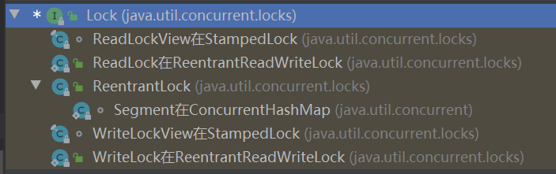

# Java的锁总结

原文：https://www.toutiao.com/a7003962304874234398/


这里总结Java的锁，包含：Synchronized隐式锁、Lock显式锁、Volatile、CAS。这里主要介绍前两者。


## 一、介绍

首先，Java的锁分为两类：

1. 第一类是 **Synchronized** 同步关键字，这个关键字属于隐式的锁， **是 JVM 层面实现**，使用的时候看不见
2. 第二类是在JDK 5 后增加的 **Lock** 接口以及对应的各种实现类。这属于显式的锁，就是能在代码层面看到“**锁**”这个对象，而这些个对象的实现方法，大都是直接依赖 CPU 指令的，**与 JVM 无关的实现**。

## 二、Synchronized

### 2.1 synchronized 的使用

* 如果修饰的是具体对象：锁的是对象（*这里的对象，指的是某个类的具体实例*）
* 如果修饰的是成员方法：锁的是this
* 如果修饰的是静态方法：锁的就是“对象.class”

### 2.2  Java的对象头和Monitor

理解 synchronized 原理之前，需要补充一下 Java 对象的知识。

对象在内存中的布局分为三块区域：**对象头、实例数据** 和 **对齐填充**。

* **对象头**。HotSpot虚拟机对象的对象头部分包括两类信息。第一类，用于存储对象自身的运行时数据，如哈希码（Hash Code）、GC分代年龄、**锁状态标志、线程持有的锁、偏向线程ID、偏向时间戳**等，这部分数据的长度在32位和64位的虚拟机（未开启压缩指针）中分别为32个比特和64个比特，官方称为“Mark Word”。

  

  > 对象需要存储的运行时数据很多，其实已经超出了32、64位 Bitmpa 结构所能记录的最大限度，但对象头里的信息是与对象自身定义的数据无关的额外存储成本，考虑到虚拟机的空间效率，Mark Word 被设计成一个有着动态定义的数据结构，以便在极小的空间内存储尽量多的数据，根据对象的状态复用自己的存储空间。

* **实例数据**。实例数据部分**是对象真正存储的有效信息**，即在程序代码里所定义的各种类型的字段内容，无论是从父类继承下来的，还是在子类中定义的字段，都必须记录起来。

  > 这部分的存储顺序会收到虚拟机分配策略参数（*-XX: Fields Allocation Sytle* 参数）和字段在Java 源码中定义顺序的影响。HotSpot虚拟机默认的分配顺序为 longs/doubles、ints、shorts/chars、bytes/booleans、oops（Ordinary Object Pointers，OOPs），从以上默认的分配策略中可以看到，相同宽度的字段总是被分配到一起存放，在满足这个前提条件的情况下，在父类中定义的变量会出现在子类之前。如果Hotspot虚拟机的 *XX:Compact Fields* 参数值为 ***true***（默认是true），那么子类中较窄的变量也允许插入父类变量的间隙之中，以节省一点点空间。

* **对齐填充**。并不是必然存在的，由于 Hotspot 虚拟机的自动内存管理系统要求对象起始地址必须是 **8 字节**的整数倍，如果对象实例数据部分没有对齐的话，就需要通过对齐填充来补全。


介绍完对象的内容，和锁相关的显然就是对象头里存储的那几个内容：

* 其中的**重量级锁**也就是通常说 synchronized 的对象锁，其中指针指向的是 monitor 对象（也称为**管程** 或 **监视器锁**）的起始地址。每个对象都存在着一个 monitor 与之关联，monitor 是由 **ObjectMonitor** 实现的，C++实现。
* 注意到还有**轻量级锁**，这是在JDK6之后对 synchronized 关键字底层实现的改进

### 2.3 synchronized 原理

已经知道了 **synchronized 和对象头里的指令有关**，也就是之前大概的说法：Java 虚拟机可以支持方法级的同步和方法内部一段指令序列（代码块）的同步，这两种同步结构都是使用**管程**（Monitor，更常见的是直接称它为“锁”）来实现的。

现在来介绍一下原理。

对于 synchronized 修饰方法（包括普通和静态方法）、修饰代码块，这两种方式在实现上略有些不同。

#### 2.3.1 synchronized 修饰方法

先来测试一个同步方法：

```java
public class Tues {
    public static int i;
    public synchronized static void syncTask() {
        i++;
    }
}
```

然后反编译class文件，可以看到：


其中的方法标识：

* ACC_PUBLIC 代表 public修饰
* ACC_STATIC 代表是静态方法
* ACC_SYNCHRONIZED 指明该方法为同步方法

代码中，没有显式指明“**Lock**”，用了 *synchronized* 关键字，这就是**方法级的同步是隐式的**。**无须通过字节码指令来控制**（*只使用了flag*），它实现在方法调用和返回操作之中。虚拟机可以从方法常量池的方法表结构中的 ***ACC_SYNCHRONIZED*** 访问标志得知一个方法是否被声明为同步方法（静态方法也是如此）。

* 当方法调用时，调用指令将会检查方法的 *ACC_SYNCHRONIZED* 访问标志是否被设置，如果设置了，执行线程就要求先成功持有管程（**Monitor**），然后才能执行方法，最后当方法完成（无论是正常完成还是非正常完成）时释放管程
* 在方法执行期间，执行线程有了管程，其他任何线程都无法再获取到同一个管程
* 如果一个同步方法执行期间抛出了异常，并且在方法内部无法处理此异常，那这个同步方法所持有的管程将在异常抛到同步方法边界之外时自动释放

#### 2.3.2 synchronized 修饰代码块

测试一段同步代码块：

```java
public class Tues {
    public int i;
    public void syncTask() {
      synchronized(this) {
        i++;
      }
    }
}
```

然后反编译class文件：


可以看到，在指令方面，多了关于 Monitor 操作的指令，或者和上一种修饰方法的区别来看，是**显式的用指令去操作管程**（monitor）了。

**同步一段指令集序列的情况**：Java虚拟机的指令集中有 ***monitorenter*** 和 ***monitorexit*** 两条指令来支持 synchronized 关键字的语义。（monitorenter 和 monitorexit 两条指令是 C 语言实现）正确实现 synchronized 关键字需要 Javac 编译器与 Java虚拟机两者共同协作支持。**Monitor的实现基本都是 C++ 代码，通过JNI（java native interface）的操作，直接和 CPU 的交互编程。**

### 2.4 早期 synchronized 的问题

关于操作 monitor 的具体实现，持有管程、计数、阻塞等等的思路，和直接在Java 中显式的用Lock是类似的

早期的 synchronized 的实现是基于上面所讲的原理，因为监视器锁（monitor）是**依赖于底层的操作系统的 Mutex Lock 来实现的，而操作系统实现线程之间的切换时需要从用户态转换到内核态**，这个状态之间的转换需要相对比较长的时间，时间成本相对较高，这也是为什么早期 synchronized 效率低的原因。

**JDK 6 之后多处来轻量级的锁，用来改进 synchronized 的实现**。这种改进，是从加锁到最后变成以前的那种重量级锁的过程里，新实现出状态不同的锁，作为过渡。

### 2.5 改进后的各种锁

锁的重量依次递增的顺序：**偏向锁 -> 自旋锁 -> 轻量级锁 -> 重量级锁**

* **偏向锁**：这个锁会偏向于**第一个获得它**的线程。当这个线程再次请求锁的时候，不需要进行任何同步操作，从而提高性能。那么处于偏向锁模式的时候，对象头的 Mark Word 的结构会变为偏向锁结构

  > 研究发现，在大多数情况下，锁不仅不存在多线程竞争，而且总是由同一线程多次获得，因此为了减少同一线程获取锁的代价而引入偏向锁。那么显然，一旦另一个线程尝试获得这个锁，那么偏向模式就会结束。另一方面，如果程序的大多数锁都是多个线程访问，那么偏向锁就是多余的

* **自旋锁**：自旋锁是一个过渡锁，是从轻量级锁到重量级锁的过渡。也就是CAS

  > CAS，全称是 Compare-And-Swap，**是一条CPU的原子指令**，其作用是让CPU比较后原子地更新某个位置的值，实现方式是基于硬件平台的汇编指令，就是说**CAS是靠硬件实现的**，JVM这是封装了汇编调用，那些 **AtomicInteger** 类便是使用了这些封装后的接口

* **轻量级锁**。当偏向锁的条件不满足，亦即的确有多个线程抢同一锁对象时，**但并发数不大时**，优先使用轻量级锁。一般只有两个线程争抢锁标记时，优先使用轻量级锁。此时，对象头的 Mark Word 的结构会变为轻量级锁结构

  > 轻量级锁是和传统的重量级锁相比较的，**传统的锁使用的是操作系统的互斥量**，而轻量级锁是虚拟机基于 CAS 操作进行更新，尝试比较并交换，根据情况决定要不要改变重量级锁。（这个过程也就是自旋锁的过程）

* **重量级锁**。重量级锁就是上面探讨的完整 Monitor 功能的锁。

注：Java中的各种锁对程序员来说是透明的。在创建是，JVM 先创建最轻的锁，若不满足条件则将锁逐次升级。**这四种锁只能升级，不能降级**。

### 2.6 其他锁的分类

上面提到的锁，都是基于 synchronized 关键字的，以及底层涉及到的锁的概念。还有一些别的角度的锁分类。

#### 2.6.1 按照锁的特性分类

* **悲观锁**：这是一个独占锁，会导致其他所有需要锁的线程都挂起，等待持有锁的线程释放锁。就是说它的看法比较悲观，悲观锁认为对于同一个数据的并发操作，一定会发生修改的。因此对于同一个数据的并发操作，悲观锁采取加锁的形式。比如前面介绍的，最传统的 synchronized 修饰的底层实现，或者重量级锁（但是现在synchronized升级之后，已经不是单纯的悲观锁了）
* **乐观锁**：每次不是加锁，而是假设没有冲突而去试探性地完成操作。如果因为冲突失败了就重试，直到成功。比如 CAS 自旋锁的操作，实际上并没有加锁

#### 2.6.2 按照锁的顺序分类

* **公平锁**：是指多个线程**按照申请锁的顺序来获取锁**。Java里可以通过 **ReentrantLock**  这个锁对象，然后指定是否为公平（默认是非公平锁）
* **非公平锁**：是指多个线程获取锁的顺序并**不是按照申请锁的顺序**，有可能后申请的线程必先申请的线程优先获取锁。使用 synchronized 是无法制定公平与否的，它是非公平锁

#### 2.6.3 独占锁（排他锁）/共享锁

* **独占锁（排他锁）**：是指该锁一次只能被一个线程所持有。对 **ReentrantLook** 和 **Synchronized** 而言都是独占锁
* **共享锁**：是指该锁可被多个线程持有。对 **ReentrantReadWriteLook** 而言，其读锁是共享锁，其写锁是独享锁。读锁的共享性可以保证并发读是非常高效的，读写、写读、写写的过程都是互斥的

​        独占锁/共享锁是一种广义的说法，互斥锁/读写锁是Java里的具体实现。

## 三、Lock

Synchronnized 关键字底层的锁，是在JVM层面实现的，而后的JDK5+，在juc包里有了显式的锁。**Lock完全用Java写成，在Java层面是与JVM无关的实现**。虽然 Lock 缺少了（通过Synchronized 块或者方法所提供的）隐式获取释放锁的便捷性，但是却拥有了锁获取与释放的可操作性、可中断的获取锁以及超时获取锁等多种 synchronized 关键字所不具备的同步特性。

Lock 是一个接口，实现类常见的有：

* 重入锁（ReentrantLock）
* 读锁（ReadLock）
* 写锁（WriteLock）

具体的实现，基本都是通过**聚合**一个同步器（AbstractQueuedSynchronizer，缩写为 AQS）的子类来完成线程访问控制。例如：



这里的各个锁实现了 Lock 接口，然后任意打开一个类，可以发现里面的实现，Lock 的操作借助于**内部类 Sync**，而 Sync 是继承了 **AbstractQueuedSynchronizer** 类的，这个类就是很重的一个 AQS 类。


整体看来，这些类的关系还是很复杂的：


关系虽然复杂，但是使用起来还是很简单。比如 new 一个锁，然后在需要的操作**之前、之后**分别加锁和释放锁。例如：

```java
Lock lock = new ReentrantLock();
lock.lock(); // 获取锁的过程不要写在 try 中，因为如果获取锁时发生了异常，异常抛出的同时也会导致释放锁
try {
  ...
} finally {
  lock.unlock(); // finally 块中释放锁，目的是保证取到之后最后一定能释放锁
}
```

Lock 接口里定义的方法有 6 个，分别是：

| 方法名称                                                     | 描述                                                         |
| ------------------------------------------------------------ | ------------------------------------------------------------ |
| void **lock**()                                              | 获取锁，调用该方法，当前线程将会获取锁。当锁获得后，从该方法返回 |
| void **lockInterruptibly**() throws InterruptedException     | 可中断地获取锁，和 lock() 方法不同之处在于，该方法会响应中断，即在锁的获取中可以中断当前线程 |
| boolean **tryLock**()                                        | 尝试非阻塞的获取锁，调用该方法后立刻返回。如果能够获取则返回 true，否则返回 false |
| boolean **tryLock**(long time, TimeUnit unit) throws InterruptedException | 超时的获取锁。当前线程在以下 3 种情况下会返回：<br>1. 当前线程在超时时间内获得了锁<br>2. 当前线程在超时时间内被中断<br>3. 超时时间结束，返回 false |
| void **unlock**()                                            | 释放锁                                                       |
| Condition **newCondition**()                                 | 获取等待通知组件，该组件和当前的锁绑定。当前线程只有获取了锁，才能调用该组件的 wait() 方法，而调用后，当前线程将释放锁 |

下面来看看各个常用的类。

### 3.1 AbstractQueuedSynchronizer

**队列同步器** AbstractQueuedSynchronizer（以下简称AQS），是用来构建锁或者其他同步组件的基础框架，它使用了**一个 int 成员变量表示同步状态，通过内置的 FIFO 队列来完成资源获取线程的排队工作**。

**同步器的主要使用方式是继承**。子类通过继承同步器并实现它的抽象方法来管理同步状态，在抽象方法的实现过程中免不了要对同步状态进行更改，这时就需要使用**同步器提供的 3 个方法进行操作**，因为它们能够保证状态的改变是安全的。这 3 个方法分别是：

```java
// 获取当前同步状态
1. protected final int getState() 
  
// 设置当前同步状态
2. protected final void setState(int newState)
  
// 使用CAS设置当前状态，该方法能够保证状态设置的原子性
3. protected final boolean compareAndSetState(int expect, int update)
```

子类推荐被定义为自定义同步组件的静态内部类，**同步器自身没有实现任何同步接口**，它仅仅是定义了若干同步状态获取和释放的方法来提供自定义同步组件使用，同步器既可以支持独占地获取同步状态，也可以支持共享式地获取同步状态。这样就可以方便实现不同类型的同步组件（*ReentrantLock、 ReentrantReadWriteLock 和 CountDownLatch* 等）。

AQS 定义的三类模版方法：

1. **独占式**同步状态获取与释放
2. **共享式**同步状态获取与释放
3. 同步状态和查询同步队列中的等待线程情况

同步器的内置 FIFO 队列，从源码里可以看到，**Node 就是保存着线程引用和线程状态的容器**。

* 每个线程对同步器的访问，都可以看作是队列中的一个节点（node）

* 节点是构成同步器的基础，同步器拥有首节点（Head）和尾节点（tail）

* **没有成功**获取同步状态的线程将会成为节点加入该队列的**尾部**

* 首节点的线程在释放同步状态时，将会唤醒后续节点，而后续节点将会在获取同步状态成功时将自己设置为首节点

  

### 3.2 重入锁 ReentrantLock

* 重入锁 ReentrantLock，就是支持**重进入的锁，它表示该锁能够支持一个线程对资源的重复加锁**。
* 除此之外，该锁还支持获取锁时的公平和非公平性选择，**默认是非公平锁**

ReentrantLock 支持公平与非公平选择，内部实现机制为：

1. 内部基于 AQS 实现一个公平与非公平公共的父类 Sync（Sync是一个内部类，继承AQS）用于管理同步状态
2. FairSync 继承 Sync ，用于处理公平问题
3. NonfairSync 继承Sync，用于处理非公平问题

### 3.3 读写锁 ReentrantReadWriteLock

独占锁（排他锁）/共享锁，具体实现层面就对应 java 里的**互斥锁/读写锁**。

* ReentrantLock、synchronized 都是排他锁
* ReentrantReadWriteLock 里面维护了一个读锁、一个写锁，其中读锁是共享锁，写锁是排他锁

因为分了读写锁，ReentrantReadWriteLock **没有直接实现 Lock 接口**，它的内部是这样的：

* 基于 AQS 实现了一个公平与非公平公共的父类 Sync，用于管理同步状态
* FairSync 继承Sync ，用于处理公平问题
* NonfairSync 继承Sync，用于处理非公平问题
* ReadLock 实现 Lock 接口，内部聚合 Sync
* WriteLock实现 Lock 接口，内部聚合 Sync

## 四、总结和对比

到这里，知道了 java 的对象都有与之关联的一个锁，这个锁称为监视器锁或者内部锁，通过关键字 **synchronized** 声明来使用，实际是 jvm 层面实现的，向下则用到了 Monitor 类，再向下虚拟机的指令则是和 CPU 打交道，插入内存屏障等等操作。

而 jdk 5 之后引入了显式的锁，以 Lock 接口为核心的各种实现类，他们完全由 java 实现逻辑，那么实现类还要基于 AQS （AbstractQueuedSynchronizer） 这个队列同步器，**AQS 屏蔽了同步状态管理、线程排队与唤醒等底层操作，提供模板方法，聚合到 Lock 的实现类里去实现**。

这里对比一下隐式和显式锁：

1. 隐式锁基本没有灵活性可言，因为 synchronized 控制的代码块无法跨方法，修饰的范围很窄；而显示锁则本身就是一个对象，可以充分发挥面向对象的灵活性，完全可以在一个方法里获得锁，另一个方法里释放。
2. 隐式锁简单易用且不会导致内存泄漏；而显式锁的过程完全要程序员控制，容易导致锁泄露；
3. 隐式锁只是非公平锁；显示锁支持公平/非公平锁；
4. 隐式锁无法限制等待时间、无法对锁的信息进行监控；显示锁提供了足够多的方法来完成灵活的功能；
5. 一般来说，默认情况下使用隐式锁，只在需要显示锁的特性的时候才选用显式锁。

对比完了 synchronized 和 Lock 两个**锁**。对于 java 的线程同步机制，往往还会提到的另外两个内容就是 volatile 关键字和 CAS 操作以及对应的原子类。这里再提一下：

* **volatile**：这个关键字常被称为轻量级的 synchronized（这种说法是不对的），实际上这两个完全不是一个东西。synchronized 通过的是 JVM 层面的**管程**（Monitor）隐式的加了锁。而 volatile 关键字则是另一个角度，JVM 也采用相应的手段来保证被它修饰的**变量的可见性**：线程对变量进行修改后，要立即写回主内存；线程对变量读取的时候，要从主内存读，而不是缓存；**它在修饰变量上的操作禁止指令重排序**

  *总结：保证可见性；针对被修饰变量的操作禁止指令重排*

* **CAS**：**它是一种CPU指令，也不属于加锁**。它通过假设没有冲突而去试探性的完成操作，如果因为冲突失败了就重试，直到成功。实际应用中，很少**直接**使用CAS，但是Java 提供了一些原子变量类，就是 juc 包里的各种 *AtomicXXX* 类。这些类的底层实现直接使用了 CAS 操作来保证使用这些类型的变量的时候，操作都是原子操作，当使用它们作为共享变量的时候，也就 不存在线程安全问题了