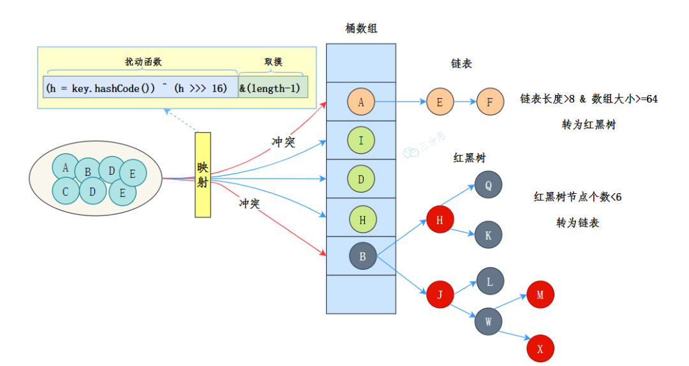
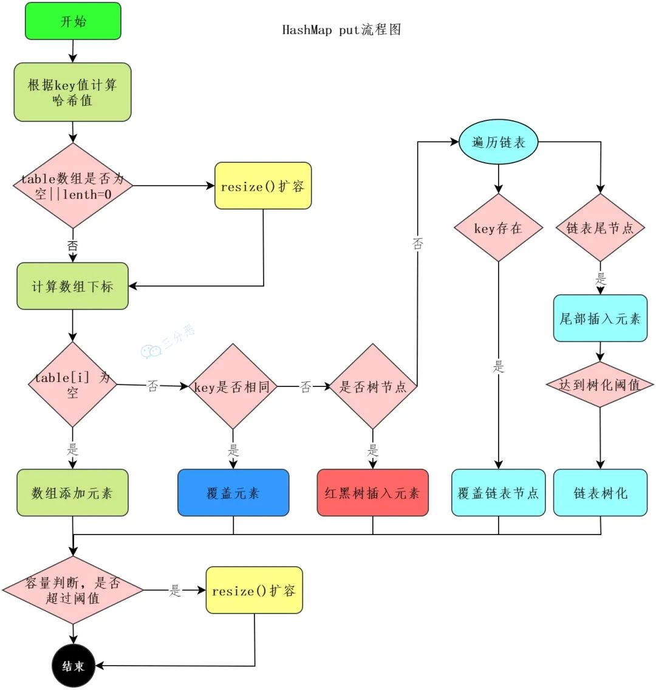
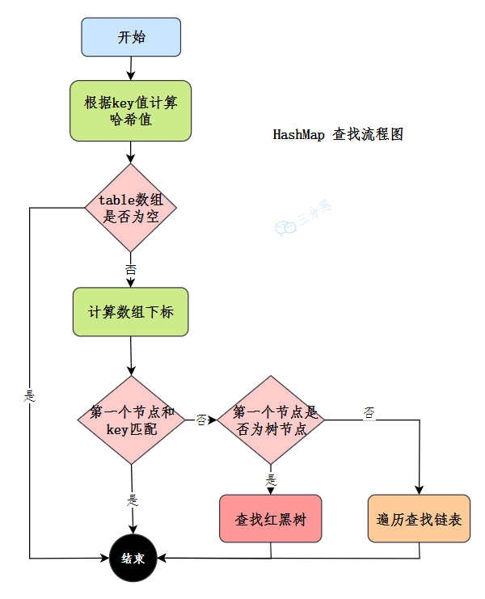

## JDK的Map容器

原文：[面渣逆袭！Java集合夺命连环三十问 - 长文多图全干货，建议收藏-今日头条 (toutiao.com)](https://www.toutiao.com/article/7213171743022776835/?app=news_article&timestamp=1679466476&use_new_style=1&req_id=20230322142755026AFBFEDBCE88B540A5&group_id=7213171743022776835&share_token=1F8B066D-CD51-411F-A65E-41EBB62470C7&tt_from=weixin&utm_source=weixin&utm_medium=toutiao_ios&utm_campaign=client_share&wxshare_count=1&source=m_redirect)

JDK 8 的数据结构是： **数组 + 链表 + 红黑树**

数据结构示意图如下：

其中，桶数组是用来存储数据元素，链表用来解决冲突，红黑树是为了提高查询的效率。

* 数据元素通过映射关系，也就是散列函数，映射到桶数组对应索引的位置
* 如果发生冲突，从冲突的位置拉一个链表，插入冲突的元素
* 如果链表长度 > 8 并且 数据大小 >= 64，链表转为红黑树
* 如果红黑树节点个数 < 6， 转为链表

### 1. HashMap 的 put 流程

先上图：

1. 首先急性哈希值的扰动，获取一个新的哈希值。(key == null) ? 0 : (h = key.hashCode()) ^ (h >>> 16)

2. 判断 tab 是否位空或者长度为 0，如果是则进行扩容操作。

   if ((tab = table) == null || (n = tab.length) == 0) {

   ​    n = (tab = resize()).length;

   }

3. 根据哈希值计算下标，如果对应小标正好没有存放数据，则直接插入即可，否则需要覆盖。

   tab[i = (n - 1) & hash])

4. 判断 tab[i] 是否为树节点，否则向链表中插入数据，是则向树中插入节点

5. 如果链表中插入节点的时候，链表长度大于等于8，则需要把链表转换为 红黑树。 treeifyBin(tab, hash);

6. 最后，所有元素处理完成后，判断是否超过阈值 threshold，超过则扩容。

### 2. HashMap 怎么查找元素

先上图：

1. 使用扰动函数，获取新的哈希值
2. 计算数据下标，获取节点
3. 当前节点核Key匹配，直接返回
4. 否则，当前节点是否为树节点，查找红黑树
5. 否则，遍历链表查找