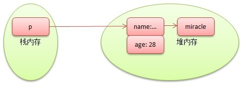
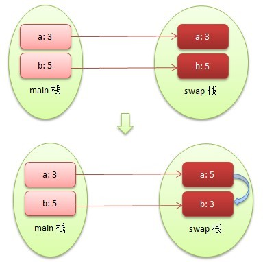
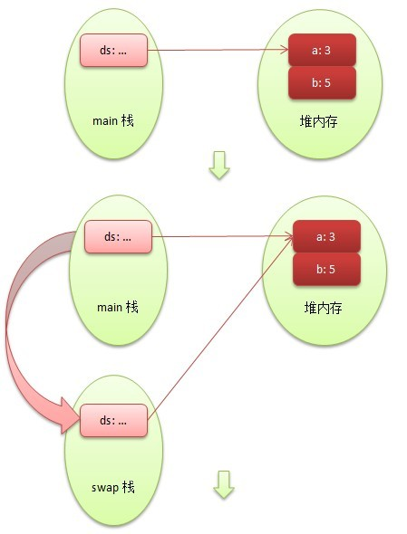
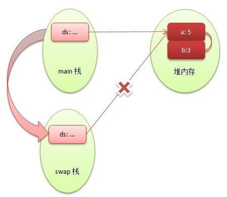
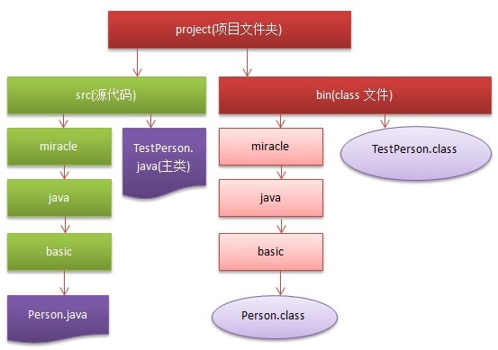

# 基础知识篇：面向对象之封装、继承及多态

原文：https://www.cnblogs.com/hmiinyu/archive/2012/10/25/2734739.html


​        Java是一种面向对象设计的高级语言，支持继承、封装和多态三大基本特征，首先从面向对象两大概念：类和对象(也称为实例)谈起。来看看最基本的类定义语法：

```java
/*命名规则：
 *类名(首字母大写，多个单词组合时每个单词首字母大写，单词之间不加任何连接符号)
 *字段名、方法名(首字母小写，多个单词组合时第一个单词首字母小写，之后每个单词首字母大写，单词之间不加任何连接符号)
 */
[public][final] class 类名 {
    [public|protected|private 类名() {}] //构造器
    [public|protected|private][static|final] 类型 字段名 [=默认值];//字段列表
    [public|protected|private][static|final|abstract] 返回值 方法名(参数) {} //方法列表
}
```

​        从以上的语法中发现几个知识点：

1. 构造器名称为类名相同且没有任何返回值(甚至都不能返回void)
2. 类的修饰符要么为public，要么没有
3. 字段可以添加默认值
4. 方法的修饰符中final和abstract不能同时使用
5. 字段与方法都可以使用static进行修饰。

​        基于这些，先来解释1,3,5，剩下的将在后续的讲解中逐渐涉及到。

​        首先，**为什么构造器没有任何返回值呢？**实质上，在Java中当利用new来调用构造器时是有返回值的，总是返回当前类的实例，因此无须定义返回值类型，但也不能显式使用return来返回，因为构造器的返回值是隐式的。

​        其次，可以在声明字段的同时为之添加默认值，如未添加系统会自动添加默认值。

​        最后，使用static修饰的字段和方法我们称为类字段和类方法，可以使用类和实例来调用，但是在类方法中不能访问任何实例字段和实例方法(即没有static修饰)。

​        利用类的构造器来创建类的实例，如未提供构造器，系统将默认提供一个无参构造器；如果提供构造器，系统则不会提供默认构造器（因此自定义构造器的同时建议添加一个无参构造器）。但请注意：**构造器虽然是创建对象的重要途径，但是不完全负责对象的创建，实际上当调用构造器时，系统会为这个对象分配内存空间并执行默认初始化，即在构造器执行之前这个对象就已经产生了，只是还不能被外界访问，只能在构造器中以this来引用，当构造器执行完毕这个对象作为其返回值返回，可被外界访问或赋值给其他的引用变量。**

```java
class Person {
    public String name;
    public int age;
    
    public Person() {}
    public Person(String n, int a) {
        name = n;
        age = a;
    }
    
    public void display() {
        System.out.println("Name: " + name + ", Age: " + age);
    }
}

public class TestPerson {
    public static void main(String[] args) {
        Person p = new Person();
        p.display();//Name: null, Age: 0
        p.name = "Miracle";
        p.age = 28;
        //p = new Person("Miracle", 28);
        p.display();//Name: Miracle, Age: 28
    }
}
```

​        与上篇提到过的数组一样，类也是引用类型，以上Person类定义的引用变量**p存放在栈内存中**（只是存放实际Person对象的地址，没有任何实际数据，类似于C的指针），而实际的Person**对象存放在堆内存中**，下图显示了Person对象初始化完毕后的内存分布情况。



因此**对于引用类型来说，栈内存仅仅存放引用类型变量，即实际对象的地址，而堆内存则存放实际对象的数据，通过引用变量来引用实际对象，如果将该引用变量赋值为另一个引用变量，仅仅将两个引用变量指向同一个对象而已，而不会发生复制对象数据**。

​        提到引用指针，就不得不提到**this引用了，它代表当前类正在执行的实例**。主要有三种用法：

1. 用于区分方法(含构造器)的形参与类字段同名时

2. 用于同一个类实例方法之间调用时

3. 用于同一个类重载构造器之间调用时。

   来看以下代码：

```java
class Person {
    public String name;
    public int age;
    
    public Person() {}
    //重载构造器之间调用时，需使用this
    public Person(String name) {
        this(name, 0);
    }
    //构造器中形参与字段同名，需使用this
    public Person(String name, int age) {
        this.name = name;
        this.age = age;
    }
    //方法中形参name与字段name同名，需使用this
    public void changeName(String name) {
        this.name = name;
        //方法中还引用实例方法display，此时可使用this，也可不使用
        this.display();
        //display();
    }
    
    public void display() {
        System.out.println("Name: " + name + ", Age: " + age);
    }
}

public class TestPerson {
    public static void main(String[] args) {
        Person p = new Person("Miracle", 28);
        p.display();
        p.changeName("Miracle He");
    }
}
```

　　方法是类或对象行为特征的抽象，跟C语言的函数相似，但也有显著的不同。*方法必须属于类或对象，只能在类中定义；函数则是结构化语言的组成单元。*方法可以采用static进行定义，代表这个方法是属于类或对象，但在static方法中不能调用this或其他非static方法或字段。**Java方法的参数传递方式只有一种：值传递，即将实参的副本传递给方法，参数本身不发生任何变化**。

​        先看看**基本类型参数**的传递示例：

```java
public class TestPassPrimitiveArgs {
    public static void swap(int a, int b) {
        System.out.println("交换前，a = " + a + ", b = " + b);//a = 3,b = 5
        int temp = a;
        a = b;
        b = temp;
        System.out.println("交换后，a = " + a + ", b = " + b);//a = 5,b = 3
    }
    public static void main(String[] args) {
        int a = 3;
        int b = 5;    
        swap(a, b);
        System.out.println("交换结束后，a = " + a + ", b = " + b);//a = 3,b = 5
    }
}
```

​        从运行结果来看，在swap()中交换之前是3和5，交换后变成5和3，而实参在main()中始终变成不变，因此在main()传递给swap()的实参只是a和b的副本，而不是a和b本身。以内存分布来说明执行状况，当在main()中传参给swap()时，实际上就是在main()方法栈区向swap()方法栈区传递一份a和b的副本，如下图：



​        当执行swap()时，swap()方法栈区将a和b副本进行交换，交换完成后进入main()方法栈区，此时仅仅a和b的副本发生改变，其本身没有发生任何变化。

​        接下来我们来看看**引用类型的交换**，前面说了，Java只能通过值传递的方式来传参，可能对有些朋友来说稍显疑惑。

```java
class DataSwap {
    public int a;
    public int b;
}
public class TestPassReferenceArgs {
    public static void swap(DataSwap ds) {
        System.out.println("交换前，ds.a = " + ds.a + ", ds.b = " + ds.b);//ds.a = 3, ds.b = 5
        int temp = ds.a;
        ds.a = ds.b;
        ds.b = temp;
        System.out.println("交换后，ds.a = " + ds.a + ", ds.b = " + ds.b);//ds.a = 5, ds.b = 3
    }
    public static void main(String[] args) {
        DataSwap ds = new DataSwap();
        ds.a = 3;
        ds.b = 5;
        swap(ds);
      System.out.println("交换结束后，ds.a = " + ds.a + ", ds.b = " + ds.b);//ds.a = 5, ds.b = 3
    }
}
```

​        从运行结果来看，确实不仅在swap中交换成功，在main中仍然是交换之后的结果。让人一下觉得：从main中传递给swap**似乎**不是ds对象的副本了，而是ds本身，这与前面谈到的*Java方法传参只能按值传递*相违背了。下面详细说明：

​        此时传递的是引用类型DataSwap，而引用类型的内存方式已经谈过了，在main()方法栈区中实际存放的是ds对象的地址，而实际的数据(a,b)是存放在堆内存中。现在将ds对象引用由main传递给swap，实际上是ds对象的**地址复制一份**到swap方法栈区中，此时main和swap中都已拥有ds对象的地址，且**都指向在堆内存中实际存放的数据**。也就是说**引用类型参数数据传递方式是不折不扣的值传递方式，只不过传递的仅仅是引用变量，而不是引用变量所指向的引用类型数据**。当然这里对main或swap中任何一个ds对象数据的更改都会影响到另一方；同时还可以验证main和swap中的ds是两个不同的引用变量，试着在swap种方法最后添加: ds=null，也就是切断swap中对ds的引用，查看一下main中ds对象的a和b是否受到影响(结果是不会)。



​        

​        接下来，谈一谈可变参数的实现方式(在类型后添加三个点...)，即形参可以输入任意个参数(类似于C#的params)，在看实际例子前，需要说明：**可变参数必须是方法的最后一个参数，且最多只有一个可变参数，相当于传入了一个对应类型的数组(只是长度可变)。**

```java
public class TestVarityArgs {
    public static void readBooks(String name, String... books) {
        if(books.length == 0) {
            System.out.println(name + " has not a book to read");
        } else {
            String result = name + " is reading: ";
            for(String book : books) {
                result += book + " ";
            }
            System.out.println(result);
        }
    }
    public static void main(String[] args) {
        readBooks("Miracle");
        readBooks("Miracle", "Java", ".Net", "J2EE");
        readBooks("Miracle", new String[] { "Java", ".Net", "J2EE" });
    }
}
```

​        谈到了可变参数，似乎跟重载函数非常相似，都是同一个方法有多种调用形式，但是它们有着显著的区别。**重载函数必须满足"两同一不同"：同一个的重载方法名的必须相同，但是形参列表不同(返回值、修饰符不能作为重载的标准)。请注意，尽量别对包含可变参数的方法进行重载**，因为这样可能会引起歧义。

```java
    public void readBooks(String name) {
        //...
    }
    public void readBooks(String name, String book) {
        //...
    }
    public boolean readBooks(String name, String[] books, int count) {
        //...
    }
```

​        那么，**返回值为什么不能作为重载的标准呢？**假设现在有以下两个重载方法：int f(){}、void f() {}，当执行调用时：int r = f()；很明显是调用前者，但是如果没有将函数结果赋值呢？直接调用f()，此时可能就不知道该调用谁了，当然java编译器比人还糊涂，更不知道怎么办了，因此返回值不能作为重载的标准。
　　前面一直提到static这个概念，接下来以下面例子来说明它的应用，可以看出static和非static字段和方法的区别所在。

```java
class Person {
    public String name;
    public int age;
    public static int courses = 2;
    
    public Person() {}
    public Person(String name, int age) {
        this.name = name;
        this.age = age;
    }

    public static void AddCourse(int count) {
        //在static方法中只能访问static字段，不能访问实例字段
        //System.out.println(name + " 's course: ");
        courses += count;
    }
    
    public void display() {
        //在实例方法中可以访问static字段
        System.out.println("Name: " + name + ", Age: " + age + ", Course: " + courses);
    }
}

public class TestPerson {
    public static void main(String[] args) {
        Person p = new Person("Miracle", 28);
        p.display();
        //static方法可通过类调用，也可通过实例调用，调用效果一致，会对该类的所有实例产生影响
        Person.AddCourse(1);//p.AddCourse(1);
        p.display();
        //p1.courses现在也变成3
        Person p1 = new Person("Miracle He", 28);
        p1.display();
    }
}
```

那在实际开发中，怎样例区分static和非static的引用呢?简单的建议是：**如果定义的变量是用来描述<font color='red'>每个对象</font>的固有信息(如每个人都有姓名、年龄)，则应该使用实例变量；相反如果描述的<font color='red'>类的固有信息</font>(如只要是人就只能有两只眼睛)，则应该使用类变量**。

​         不是说面向对象有三大特征吗？封装、继承、多态。那到底是怎么回事呢？首先封装，就是将对象的属性等信息隐藏在类的内部，仅提供给外部一些满足预设条件的方法供调用。拿上面的例子来说明：每个人的年龄只能在0~150之间来进行浮动，现在的情况是我可以随意更改年龄(想多少岁就多少岁)，那肯定就不对了。必须将这些不满足条件的操作及时的过滤掉，Java提供了访问权限控制: private->default->protected->public(权限依次扩大)来封装内部属性和提供外部接口(对字段采用private或protected等修饰符来限制，采用getter和setter来进行有效控制)。


```java
class Person {
    private String name;
    private int age;

    public Person() {}
    public Person(String name, int age) {
        this.name = name;
        this.age = age;
    }

    public String getName() {
        return this.name;
    }
    public void setName(String name) {
        if(name.length() < 2 || name.length() > 20) {
            System.out.println("你设置的名字不合法");
            return;
        } else {
            this.name = name;
        }
    }
    
    public int getAge() {
        return this.age;
    }
    public void setAge(int age) {
        if(age < 0 || age > 100) {
            System.out.println("你设置的年龄不合法");
            return;
        } else {
            this.age = age;
        }
    }
    
    public void display() {
        System.out.println("Name: " + name + ", Age: " + age);
    }
}

public class TestAccessControl {
    public static void main(String[] args) {
        Person p = new Person("Miracle", 28);
        p.display();
        //p.age = 150;//此时age已经是private的，无法访问
        p.setAge(150);//这里已经不合法了，无法修改
        
        p.setName("Miracle He");
        p.setAge(35);
        p.display();
    }
}
```

​        关于访问控制符，有以下建议：**类的绝大部分字段(有些少数的static字段需要public修饰)和辅助方法都采用private来修饰，并提供getter和setter访问器来对其读取和修改；如果值希望同一个包(即将讲到)中其他类访问，则不添加任何修饰符；如果只希望子类也能使用父类的成员而不被外界知晓，则采用protected来修饰；如果可以在任何地方都能访问到，则采用public来修饰**。
​        接下来，将讨论上文中谈到的包。所谓包，就是为不同特征的类隔离起来，即使这些彼此隔离的包中包含同名的类也无所谓(就像在同一个班级中有两个都叫"Miracle"的同学，老师会叫其中一个"Older Miracle",另一个叫"Little Miracle"来区分)。一般一个类中只能包含在一个包中，且该语句只能为非注释语句的第一句。

```java
/*命名规则：
 *包名(全部小写，以公司或项目组织的顺序倒写，中间以.分隔，如: miracle.java.basic)
 *类名(首字母大写，多个单词组合时每个单词首字母大写，单词之间不加任何连接符号)
 *字段名、方法名(首字母小写，多个单词组合时第一个单词首字母小写，之后每个单词首字母大写，单词之间不加任何连接符号)
 */
package 包名;
[public][final] class 类名    [public|protected|private 类名() {}] //构造器
    [public|protected|private][static|final] 类型 字段名 [=默认值];//字段列表
    [public|protected|private][static|final|abstract] 返回值 方法名(参数) {} //方法列表
}
```

位于包中的类，在文件系统中也必须保持与包名相同层次的目录结构。

```java
package miracle.java.basic;
public class Person {
    private String name;
    private int age;
    
    public Person() {}
    public Person(String name, int age) {
        this.name = name;
        this.age = age;
    }
    
    public void display() {
        System.out.println("Name: " + name + ", Age: " + age);
    }
}
```


```java
import miracle.java.basic.Person;
public class TestPerson {
    public static void main(String[] args) {
        Person p = new Person("Miracle", 28);
        p.display();
    }
}
```

建议的项目组织结构如下图：



​        其中实心代表系统真实存在的文件夹和文件，空心代表编译产生的文件夹和文件。根据开篇中讲解的编译指令来编译和运行程序。

```shell
cd E:\project\src
javac -d ..\bin TestPerson.java
java -classpath ..\bin TestPerson
(或: java -cp ..\bin TestPerson)
```

​        运行完毕之后，发现源文件和字节码文件已经彻底分离了，并且在bin文件夹中还生成了跟src文件夹中Person类指定包对应的文件夹目录（细心的朋友可能发现跟IDE的目录结构有点相似了）。在窃喜之余，发现在主类中加入了*import miracle.java.basic.Person*, 这条语句相对于package而言的，正因为建立了包，当需要在其他类中引用包中的类时，则需要使用import引入以方便书写，不然则需要带全名称，这样既繁琐又不具可读性。

```java
miracle.java.basic.Person p = new miracle.java.basic.Person("Miracle", 28);
```

​        不过有时还必须使用全名称来书写。常见的java包：java.lang、java.util、java.net、java.io、java.text、java.sql、java.awt、java.swing等。

```java
import java.sql.*;
import java.util.*;
public class TestPackage {
    public static void main(String[] args) {
        //Date d = new Date();//错误，此时真的不明确到底是sql下的Date还是util下的Date
        //正确写法
        java.sql.Date sd = new java.sql.Date();
        java.util.Date ud = new java.util.Date();
    }
}
```

​        此外，Java还是import static语法用来引入指定包下所有的静态成员。

```java
import static java.lang.System.*;
import static java.lang.Math.*;
public class TestPackage {
    public static void main(String[] args) {
        out.println(PI);
    }
}
```

​        再次扩展java类的定义格式:

```java
/*命名规则：
 *包名(全部小写，以公司或项目组织的顺序倒写，中间以.分隔，如: miracle.java.basic)
 *类名(首字母大写，多个单词组合时每个单词首字母大写，单词之间不加任何连接符号)
 *字段名、方法名(首字母小写，多个单词组合时第一个单词首字母小写，之后每个单词首字母大写，单词之间不加任何连接符号)
 */
package 包名;
import|import static 包名.类名|*;//包名.类名代表仅引入该包指定的类，包名.*代表引入该包所有的类或静态成员
[public][final] class 类名 {
    [public|protected|private 类名() {}] //构造器
    [public|protected|private][static|final] 类型 字段名 [=默认值];//字段列表
    [public|protected|private][static|final|abstract] 返回值 方法名(参数) {} //方法列表
}
```

​        接下来，探讨面向对象的另外两大特征：继承和多态。其实这两者是相互关联的**，继承就是在已有类的基础上扩展新的子类，而<font color='red'>不改变</font>原有父类的数据和行为，即通常所说的父类和子类(遵从"子类 is a 父类"原则)，子类可继承父类的非私有成员(建议将成员修饰符改为protected)，同时也可重写父类相同的成员**(遵从"两同两小一大"原则：即方法名相同，方法形参相同；子类方法返回类型比父类更小或相等，子类方法抛出的异常比父类更小或相等；子类方法的访问权限比父类更大或相等，重写的方法要么都是类方法，要么都是实例方法，如父类有一个实例方法，子类添加一个同名的类方法则不算重写，而是子类的新方法)。

```java
package miracle.java.basic;
public class Person {
    protected String name;
    protected int age;
    
    public Person() {}
    public Person(String name, int age) {
        this.name = name;
        this.age = age;
        System.out.println("调用Person的构造器");
    }
    
    public String getName() {
        return this.name;
    }
    public void setName(String name) {
        if(name.length() < 2 || name.length() > 20) {
            System.out.println("你设置的名字不合法");
            return;
        } else {
            this.name = name;
        }
    }
    
    public int getAge() {
        return this.age;
    }
    public void setAge(int age) {
        if(age < 0 || age > 100) {
            System.out.println("你设置的年龄不合法");
            return;
        } else {
            this.age = age;
        }
    }

    public void display() {
        System.out.println("Name: " + name + ", Age: " + age);
    }
}
```


```java
package miracle.java.basic;
public class Student extends Person {
    private int grade;
    
    public Student() {}
    public Student(String name, int age) {
        super(name, age);
    }
    
    public int getGrade() {
        return this.grade;
    }
    public void setGrade(int grade) {
        if(grade < 0 || grade > 100) {
            System.out.println("你设置的分数不合法");
            return;
        } else {
            this.grade = grade;
        }
    } 
    
    public void display() {
        System.out.println("Name: " + name + ", Age: " + age + ", Grade: " + grade);
    }
    /*
    public static void display() 
    {
       //不能算作重写，只是Student的新方法
    }
    */
}
```


```java
import miracle.java.basic.*;
public class TestInheritance {
    public static void main(String[] args) {
        Student miracle = new Student("Miracle", 28);
        miracle.setGrade(85);
        miracle.display();
    }
}
```

​        如果在子类中先调用已重写的父类方法，该怎么办呢？Java提供了**super引用，指向其直接父类的默认引用。当创建一个对象时，系统会隐式创建其父类的对象(Java所有类都继承自java.lang.Object)，只要该类有子类存在，就一定会产生super引用，指向其对应的直接父类**，当子类方法中使用某个成员变量时，首先会查找当前类中是否存在，如不存在则查找直接父类中是否存在，如不存在会依次追溯到java.lang.Object中是否存在，如仍然不存在将不能通过编译。跟前面的this引用很类似，都不能在类方法中引用，只不过this是指向当前子类的对象而已。除此之外，super还能在子类构造器中调用其父类的构造器，如实例化子类的对象，会依次调用所有上层父类的构造器，最后才调用自身的构造器完成对象的构建。如子类调用父类已重写的类方法，则使用***父类.方法()***来完成。

```java
package miracle.java.basic;
public class Person {
    protected String name;
    protected int age;
    
    public Person() {}
    public Person(String name, int age) {
        this.name = name;
        this.age = age;
        System.out.println("调用Person的构造器");
    }
    
    public String getName() {
        return this.name;
    }
    public void setName(String name) {
        if(name.length() < 2 || name.length() > 20) {
            System.out.println("你设置的名字不合法");
            return;
        } else {
            this.name = name;
        }
    }
    
    public int getAge() {
        return this.age;
    }
    public void setAge(int age) {
        if(age < 0 || age > 100) {
            System.out.println("你设置的年龄不合法");
            return;
        } else {
            this.age = age;
        }
    }

    public void display() {
        System.out.println("Name: " + name + ", Age: " + age);
    }
    
    public static void notice(int age) {
        if(age >= 18) {
            System.out.println("今天看电影");
        } else {
            System.out.println("儿童不宜参加");
        }
    }
}
```


```java
package miracle.java.basic;
public class Student extends Person {
    private int grade;
    
    public Student() {}
    public Student(String name) {
        this(name, 0);
    }
    public Student(String name, int age) {
        super(name, age);//只能为第一句且不能跟this混用
        System.out.println("调用Student的构造器");
    }
    
    public int getGrade() {
        return this.grade;
    }
    public void setGrade(int grade) {
        if(grade < 0 || grade > 100) {
            System.out.println("你设置的分数不合法");
            return;
        } else {
            this.grade = grade;
        }
    } 
    
    public void display() {
        super.display();
        System.out.println("Name: " + name + ", Age: " + age + ", Grade: " + grade);
    }
    
    public static void notice(int age) {
        System.out.print("看电影了：");
        Person.notice(age);
        System.out.println("\n");
    }
}
```


```java
import miracle.java.basic.*;
public class TestInheritance {
    public static void main(String[] args) {
        Student miracle = new Student("Miracle", 28);
        miracle.setGrade(85);
        miracle.display();
        Student.notice(miracle.getAge());
        
        Student miracleHe = new Student("Miracle He", 16); 
        miracleHe.display();
        Student.notice(miracleHe.getAge());
    }
}
```

​        现在将程序做简单的改动：**Person miracle = new Student("Miracle", 28);**

```java
package miracle.java.basic;
public class Person {
    protected String name;
    protected int age;
    public int height = 150;
    
    public Person() {}
    public Person(String name, int age) {
        this.name = name;
        this.age = age;
    }
    
    public String getName() {
        return this.name;
    }
    public void setName(String name) {
        if(name.length() < 2 || name.length() > 20) {
            System.out.println("你设置的名字不合法");
            return;
        } else {
            this.name = name;
        }
    }
    
    public int getAge() {
        return this.age;
    }
    public void setAge(int age) {
        if(age < 0 || age > 100) {
            System.out.println("你设置的年龄不合法");
            return;
        } else {
            this.age = age;
        }
    }

    public void display() {
        System.out.println("Name: " + name + ", Age: " + age);
    }
}
```


Student.java

```java
import miracle.java.basic.*;
public class TestPolymorphic {
    public static void main(String[] args) {
        //miracle编译时为Person,运行时为Student
        Person miracle = new Student("Miracle", 28);
        //miracle.setGrade(85);
        miracle.display();//方法具备多态性
        System.out.println("Height: " + miracle.height);//150，字段不具备多态性
    }
}
```

​        从代码中可以看出：**当引用变量的编译时类型和运行时类型不一致(*父类 t = new 子类();*)时，表现出了对象的多态。而多态仅仅表现在调用重写方法时，将调用子类中的方法，调用非重写方法时，如果该方法在父类中将调用父类，如果在子类中将无法调用，而对象的字段不具多态性，即只能调用父类中对应的字段**。回忆前面几章讲到的数据类型转换，这里将子类转化为父类(向上转型)是成功的；相反向下转型(父类转化为子类)时，则不一定成功，必须强制类型转换，但在转换之前为了防止出现ClassCastException异常，建议使用instanceof运算符(类似于C#的is)判断是否成功，如成功才执行强制转换。

```java
if(miracle instanceof Student) {
    Student stu = (Student)miracle;
    miracle.display();
}
```

​        提到继承，就不得不提到组合这个概念。所谓组合，即将已有类以引用的方式嵌入到另一个类(整体类和部分类之分，遵从"整体类 has a 部分类"原则)，以达到在整体类(类似子类)中复用部分类(类似父类)的功能。从类的关系角度来看，继承是从多个子类中提取共有父类的过程；组合是从多个整体类中提取嵌入类的过程。


```java
package miracle.java.basic;
public class Person {
    protected String name;
    protected int age;
    public int height = 150;
    
    public Person() {}
    public Person(String name, int age) {
        this.name = name;
        this.age = age;
    }
    
    public String getName() {
        return this.name;
    }
    public void setName(String name) {
        if(name.length() < 2 || name.length() > 20) {
            System.out.println("你设置的名字不合法");
            return;
        } else {
            this.name = name;
        }
    }
    
    public int getAge() {
        return this.age;
    }
    public void setAge(int age) {
        if(age < 0 || age > 100) {
            System.out.println("你设置的年龄不合法");
            return;
        } else {
            this.age = age;
        }
    }

    public void display() {
        System.out.println("Name: " + name + ", Age: " + age);
    }
}
```


```java
package miracle.java.basic;
public class Club {
    private Person[] members;
    
    public Club() {
        this.members = new Person[]{};
    }
    public Club(Person[] members) {
        this.members = members;
    }
    
    public void playGame() {
        for(Person p : members) {
            p.display();
            if(p.getAge() >= 18) {
                System.out.println("可以上网");
            } else {
                System.out.println("好好学习");
            }
        }
    }
}
```


```java
import miracle.java.basic.*;
public class TestComposition {
    public static void main(String[] args) {
        Club c = new Club(new Person[] {
            new Person("Miracle", 28),
            new Person("Miracle He", 16)
        });
        c.playGame();
    }
}
```

可看出Club与Person之间没有任何相似的关系，只是Club中由很多Person组成，因此是组合关系。

​        到现在为止，基本讲完了面向对象的三大特性，在结束本篇讲解之前，简单谈一下"初始化块"的应用。**所谓初始化块，就是在构造器执行之前，对整个类(所有对象)的字段进行初始化的过程，通常会将多个构造器中相同的部分放到初始化块中执行，可以把初始化块看成是没有形参的方法，只不过在构造器执行之前执行而已。与构造器执行顺序一致，初始化块也遵循从父类到子类依次执行的过程。与初始化块对应的还有静态初始化块，主要完成类属性的初始化，并且只在类加载时初始化一次**。

```java
package miracle.java.basic;
public class Parent {
    static {
        a = 4;
        System.out.println("Parent的静态初始化块执行");
    }
    {
        b = 4;

        System.out.println("Parent的初始化块执行");
    }

    public static int a = 2;
    public int b = 3;
    
    public Parent() {
        System.out.println("Parent的构造器执行");
    }
}
```


```java
package miracle.java.basic;
public class Child extends Parent {
    static {
        //a = 10;
        System.out.println("Child的静态初始化块执行");
    }
    {
        b = 6;
        System.out.println("Child的初始化块执行");
    }
    
    public Child() {
        System.out.println("Child的构造器执行");
    }
}
```


```java
import miracle.java.basic.*;
public class TestInitBlock {
    public static void main(String[] args) {
        for(int i = 0; i < 2; i++) {
            Child c = new Child();
            System.out.println("a: " + Parent.a + ", b: " + c.b);
        }
    }
}
/* 执行结果：
* Parent的静态初始化块执行
* Child的静态初始化块执行
* Parent的初始化块执行
* Parent的构造器执行
* Child的初始化块执行
* Child的构造器执行
* a: 2, b: 6
* Parent的初始化块执行
* Parent的构造器执行
* Child的初始化块执行
* Child的构造器执行
* a: 2, b: 6
*/
```

​        从运行结果来看：静态初始化块和初始化块都先于构造器执行，并都遵从父类到子类的执行过程，但静态初始化块最先执行且仅执行一次，子类初始化块在父类的初始化块和构造器执行完毕之后，在子类构造器之前执行。最后给出完整版的Java类定义格式:

```java
/*命名规则：
 *包名(全部小写，以公司或项目组织的顺序倒写，中间以.分隔，如: miracle.java.basic)
 *类名(首字母大写，多个单词组合时每个单词首字母大写，单词之间不加任何连接符号)
 *字段名、方法名(首字母小写，多个单词组合时第一个单词首字母小写，之后每个单词首字母大写，单词之间不加任何连接符号)
 */
package 包名;
import|import static 包名.类名|*;//包名.类名代表仅引入该包指定的类，包名.*代表引入该包所有的类或静态成员
[public][final] class 类名 {
    static {
        //静态初始化块
    } 
    {
        //初始化块
    }
    [public|protected|private 类名() {}] //构造器
    [public|protected|private][static|final] 类型 字段名 [=默认值];//字段列表
    [public|protected|private][static|final|abstract] 返回值 方法名(参数) {} //方法列表
}
```

​        OK，到此为止，面向对象(上)：封装、继承、多态就完全讲解完毕，建议读者把文章中代码依次执行，领悟其中的要点。

