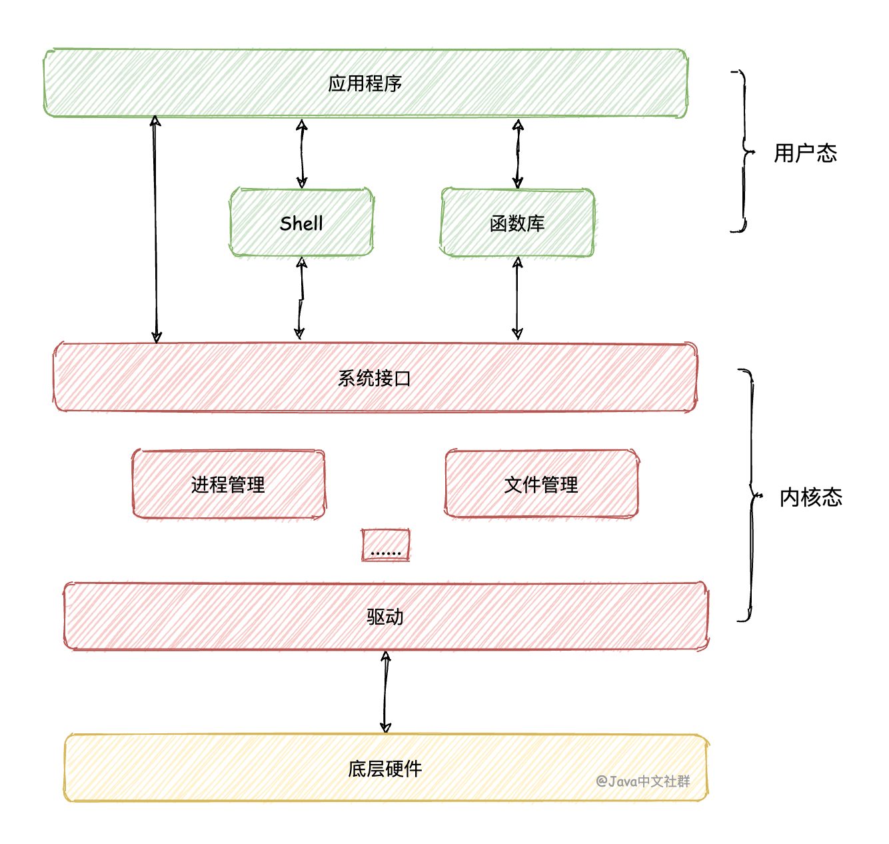
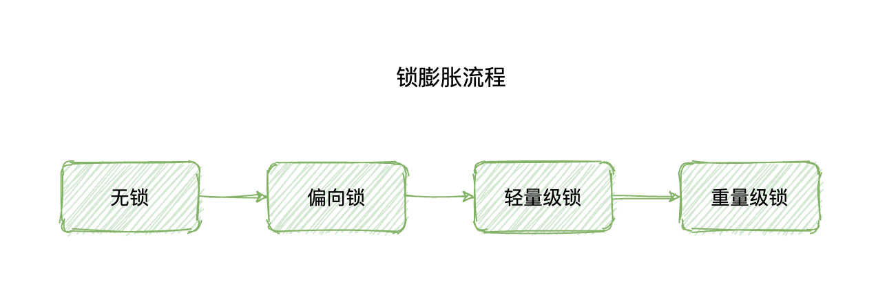
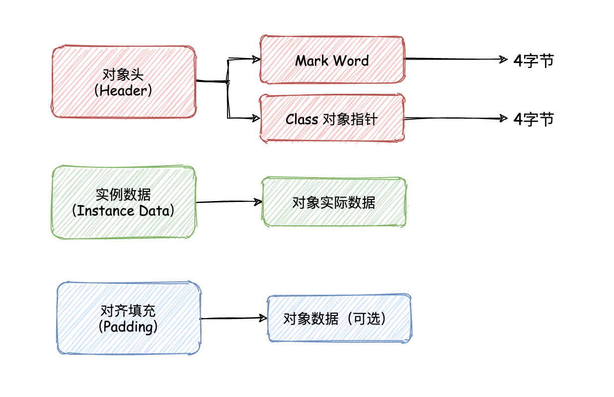
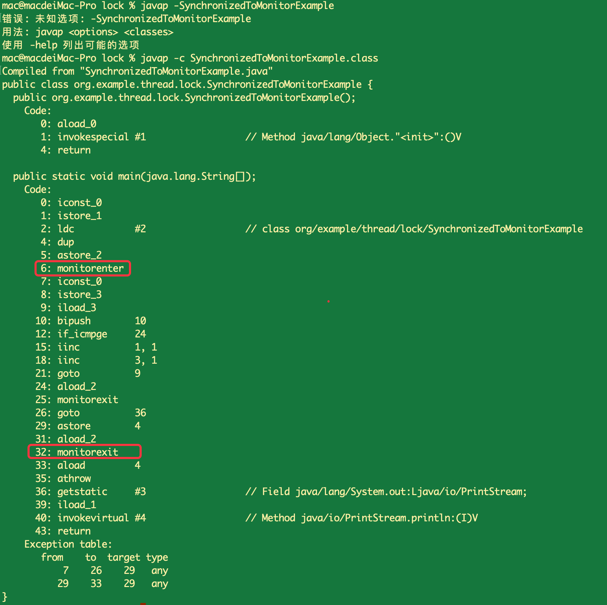

## synchronized 优化手段之锁膨胀机制

原文：https://www.toutiao.com/i6992006792397996574/?group_id=6992006792397996574

Synchronized 在JDK5 之前性能是比较低的，在JDK5 时通常会选择使用 Lock 来替代 sychronized。然而从 JDK6 时发生了改变，JDK6 对 sychronized 进行了各种优化，性能得到了大幅提升。除了性能之外，sychronzied 的使用也非常便利。

在众多优化方案中，**锁膨胀** 机制是提升 sychronized 性能最有利的手段之一。本届来介绍什么是锁膨胀，以及锁膨胀的各种细节。

### 一、介绍

JDK 5 时，sychronized 需要调用监视器锁（Monitor）来实现，**监视器锁本质上又是依赖于底层操作系统的 Mutex Lock（互斥锁）**实现的。<font color='red'>**互斥锁在进行释放和获取时，需要从用户态转换到内核态**</font>，这样就造成了很高的成本，也需要较长的执行时间，这种依赖于操作系统 Mutex Lock 实现的锁，称之为“重量级锁”。

### 二、系统的用户态和内核态

* **用户态**（User Mode）：当进程在执行用户自己的代码时，则称其处于用户运行态
* **内核态**（Kernel Mode）：当一个任务（进程）执行系统调用而陷入内核代码中执行时，就称进程处于内核运行态，此时处理器处于特权级最高的内核代码中执行。



### 三、为什么要分用户态和内核态

假设没有内核态和用户态之分，程序就可以随意读写硬件资源了，比如随意读写和分配内存。这样，如果程序员不小心将不适当的内容写到了不该写的地方，很可能就会导致系统奔溃。

而有了用户态和内核态的区分之后，程序在执行某些操作时会进行一系列的验证和检验以后，确认没有问题之后才可以正常的操作资源，这样就不用当心会把系统搞坏，也就有了内核态和用户态的区分之后可以让程序更加安全的运行，但同时两种形态的切换会导致一定的性能开销。

### 四、锁膨胀

在 JDK 6 时，为了解决获取所和释放锁带来的性能损耗，引入了“**偏向锁**”和“**轻量级锁**”的状态，此时 synchronized 的状态共有一下4中：

* 无锁
* 偏向锁
* 轻量级锁
* 重量级锁

**锁的级别按照上述先后顺序依次升级，把这个升级的过程称为“锁膨胀”。**



到目前为止，锁的<font color='red'>**升级是单向的**</font>，也就是说，**只能**从低到高升级（无锁-> 偏向锁 -> 轻量级锁  -> 重量级锁），不会出现降级的情况。

锁膨胀为什么能优化 synchronized 的性能？当了解了这些锁状态之后自然就会有答案，下面一起来看。

#### 4.1 偏向锁

HotSpt 作者经过研究实践发现，在大多数情况下，锁不存在多线程竞争，总是由**同一线程**多次获得的，为了让线程获得锁的代价更低，于是就引进了偏向锁。

**偏向锁（Biased Locking）** 指的是，**它会偏向于<font color='red'>第一个</font>访问锁的线程**。如果在运行过程中，同步锁只有一个线程访问，不存在多线程争用的情况，则线程是不需要触发同步的，这种情况会给线程加一个偏向锁。

##### 4.1.1 偏向锁执行流程

当一个线程访问同步代码块并获取锁时，会在对象头的 Mark Word 里存储偏向锁的**线程 ID**，在线程进入和退出同步块时，**不再**通过 CAS 操作来加锁和解锁，而是检测 Mark Word 里是否存储着指向当前线程的偏向锁，过程如下：

如果 Mark Word 中的线程 ID 和访问的线程 ID 一致，则可以直接进入同步块去执行代码；如果线程 ID 不同，则使用 CAS 尝试获取锁，如果获取成功则进入同步块执行代码，否则会将锁的状态升级为轻量级锁。

##### 4.1.2 偏向锁的优点

**偏向锁是为了在无多线程竞争的情况下，尽量减少不必要的锁切换而设计的**。因为锁的获取及释放要依赖多次 <font color='red'>**CAS原子指令**</font>，而偏向锁只需要在置换线程 ID 的时候执行一次 CAS 原子指令即可。

##### 4.1.3 Mark Word 扩展知识：内存布局

在 HotSpt 虚拟机中，对象在内存中存储的布局可以分为以下 3 个区域：

* 对象头（Header）
* 实例数据（Instance Data）
* 对齐填充（Padding）

对象头中又包含了：

* **Mark Word**（标记字段）：偏向锁信息就存储在这个区域
* Klass Pointer（Class 对象指针）

对象在内存中的布局如下：



在 JDK 6 中**默认是开启偏向锁**的，可以通过 “-XX:-UseBiasedLocking=false” 参数来禁用偏向锁。

#### 4.2 轻量级锁

**引入轻量级锁的目的，是在没有多线程竞争的前提下，减少传统的重量级锁使用操作系统 Mutex Lock（互斥锁）产生的性能损耗**。如果使用 Mutex Lock 每次获取锁和释放锁的操作都会带来用户态和内核态的切换，这样系统的性能开销是很大的。

当关闭偏向锁或者多个线程竞争偏向锁时就会导致偏向锁升级为轻量级锁，**轻量级锁的获取和释放都通过 CAS 完成的，其中锁获取可能会通过一定次数的自旋来完成**。*[ CAS - Compare And Swap ]*

##### 4.2.1 注意事项

需要强调的一点：**轻量级锁<font color='red'>并不是用来代替</font>重量级锁的**，它的本意是在没有多线程竞争的前提下，减少传统的重量级锁使用产生的性能消耗。**轻量级锁适应的场景是线程交替执行同步块的情况**，如果同一时间多个线程同时访问，就会导致轻量级锁膨胀为重量级锁。

#### 4.3 重量级锁

synchronized 是依赖监视器(管程) Monitor 实现方法同步或代码同步的，代码块同步使用的是 ***monitorenter*** 和 ***monitorexit*** 指令来实现的。monitorenter 指令是在编译后插入到同步代码块的开始位置，而 monitorexit 是插入到方法结束处和异常处的，任何对象都有一个 Monitor 与之关联，当且一个 Monitor 被持有后，它将处于锁定状态。

如以下加锁代码：

```java
public class SynchronizedToMonitorExample {
    public static void main(String[] args) {
        int count = 0;
        synchronized (SynchronizedToMonitorExample.class) {
            for (int i = 0; i < 10; i++) {
                count++;
            }
        }
        System.out.println(count);
    }
}
```

当将上述代码编译成字节码之后，它的内容是这样的：



从字节码可以看出，在main 方法的执行中有多个 monitorenter 和 monitorexit 的指令，由此可知 synchronized 是依赖 Monitor 监视器锁实现的，而监视器锁又是依赖操作系统的互斥锁，**互斥锁在每次获取和释放锁时，都会带来用户态和内核态的切换，增加了性能开销**。

### 总结

synchronized 在 JDK 1.6 时优化了其性能，在一系列优化的手段中，锁膨胀是提升 synchronized 执行效率的关键手段之一，**锁膨胀指的是 synchronized 会从无锁状态、到偏向锁、到轻量级锁，最后到重量级锁的过程**。重量级之前的所有状态在绝大数情况下可以大幅的提升 synchronized 的性能。