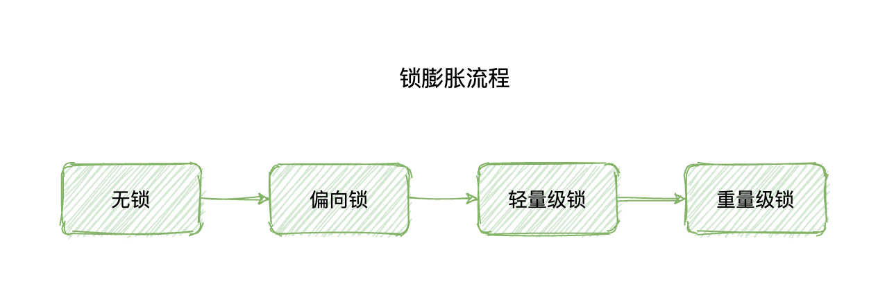
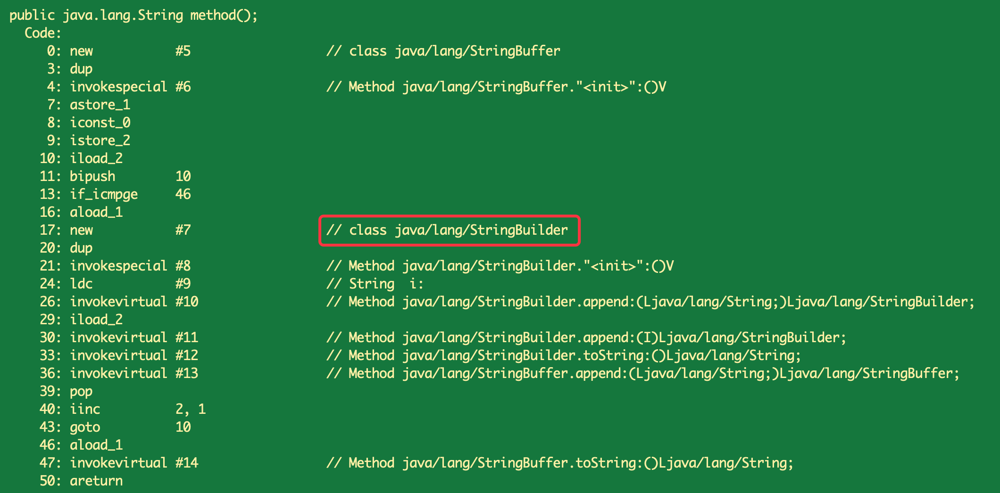

## synchronized优化：锁膨胀、锁消除、锁粗化和自适应自旋锁

原文：https://www.toutiao.com/i6994438061325287944/?group_id=6994438061325287944


synchronized 在 JDK 1.5 时性能是比较低的，然而在后续的版本中经过各种优化迭代，它的性能也得到了前所未有的提升。本文就来盘点一下 synchronized 的核心优化方案。

synchronized 核心优化方案主要包含以下 4 个：

1. 锁膨胀
2. 锁消除
3. 锁粗化
4. 自适应自旋锁

### 1. 锁膨胀

先来回顾一下锁膨胀对 Synchronized 性能的影响。所谓的锁膨胀是指 Synchronized 从无锁升级到偏向锁，再到轻量级锁，最后到重量级锁的过程。它叫做锁膨胀，也叫做锁升级：



JDK1.6 之前，Synchronized 是重量级锁，也就是说 Synchronzied 在释放和获取锁时都会从用户态转换成为内核态，而转换的效率是比较低的。但是有了锁膨胀机制之后，Synchronized 的状态就多了无锁、偏向锁以及轻量级锁了。这个时候在进行并发操作时，大部分的场景都不需要用户态到内核态的转换了。这就大幅的提升了 Sychronized 的性能。

### 2. 锁消除

锁消除，指的是在某些情况下，JVM 如果**检测不到某段代码被共享和竞争的可能性**，就会将这段代码所属的同步锁消除掉，从而达到提高程序性能的目的。

**消除的依据，是逃逸分析的数据支持**。如 StringBuffer 的 append( ) 方法，或者 Vector 的 add( ) 方法，在很多情况下是可以进行锁消除的，比如以下这段代码：

```java
public String method() {
    StringBuffer sb = new StringBuffer();
    for (int i = 0; i < 10; i++) {
        sb.append("i:" + i);
    }
    retrun sb.toString();
}
```

这段代码编译后，字节码如下：



从上述结果看来，之前写的线程安全的枷锁的 StringBuffer 对象，在生成字节码之后就被替换成了不枷锁不安全的 StringBuilder 对象了。原因是 StringBuffer 的变量属于局部变量，且不会从该方法中逃逸出去，所以此时就可以使用锁消除（不枷锁）来加速程序的运行。

### 3. 锁粗化

**锁粗化是指：将多个连续的加锁、解锁操作连接在一起，扩展成一个范围更大的锁**。

通常，锁“细化”可以提高程序的执行效率，也就是将锁的范围尽可能的缩小。这样在锁竞争时，等待获取锁的线程才能更早的获取锁，从而提高程序的运行效率。但锁粗化时如何提高性能的呢？

没错，锁细化的观点在大多数情况下都是成立的。但是一些列连续枷锁和解锁的操作，也会导致不必要的性能开销，从而影响程序的执行效率。比如下面的代码：

```java
public String method() {
    StringBuffer sb = new StringBuffer();
    for (int i = 0; i < 10; i++) {
        // 此处进行枷锁操作
        sb.append("i:" + i);
        // 此处进行解锁操作
    }
    return sb.toString();
}
```

在不考虑编译器优化的情况下，如果在 for 循环中定义锁，那么锁的范围很小，但每次 for 循环都需要进行加锁和释放锁的操作，性能是很低下的。如果直接在 for 循环的外层加一把锁，那么对于同一个对象操作这段代码的性能就会提高很多。如下示例：

```java
public String method() {
    StringBuffer sb = new StringBuffer();
    // 此处进行枷锁操作
    for (int i = 0; i < 10; i++) {
        sb.append("i:" + i);
    }
    // 此处进行解锁操作
    return sb.toString();
}
```

锁粗化的作用：如果监测到同一个对象执行了连续的加锁和解锁的操作，则会将这一系列操作合并成一个更大的锁，从而提升程序的执行效率。

### 4. 自适应自旋锁

自旋锁，就是通过自身循环，尝试获取锁的一种方式，伪代码如下：

```java
// 尝试获取锁
while(!isLock()) {
    //... codes
}
```

自旋锁的优点在于，它避免一些线程的挂起和恢复操作，因为挂起线程和恢复线程都需要从用户态转入内核态，这个过程比较慢，所以通过自旋的方式可以一定程度上避免线程挂起和恢复造成的性能开销。

但是如果长时间自旋还获取不到锁，也会造成一定的资源浪费。所以通常会给自旋设置一个固定的值来避免一直自旋的性能开销。

然而对于Synchonized 来说，它的自旋锁更加的“智能”，Sychronzied 中的自旋锁是自适应的自旋锁。**自适应自旋锁**，就是线程自旋的次数不再是一个固定的值，而是一个动态可变的值，这个值会根据前一次自旋获取锁的状态来决定此次自旋的次数。

**如何调整次数呢？**比如上一次通过自旋成功获取到了锁，那么这次通过自旋也有可能会获取到锁，所以这次自旋的次数就会增多一些，而如果上一次通过自旋没有成功获取到锁，那么这次自旋可能也获取不到锁，所以为了避免资源的浪费，就会少循环或者不循环，以提高程序的执行效率。

简单来说，如果线程自旋成功了，则下次自旋的次数会增多；反之则下次自旋的次数会减少
