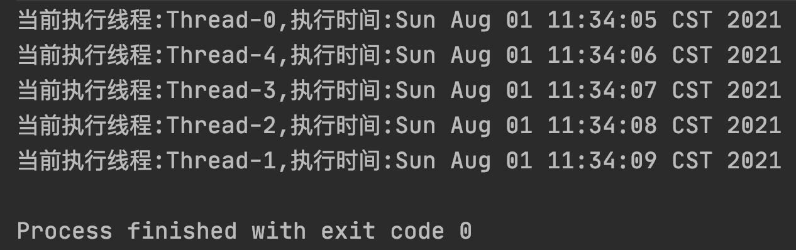
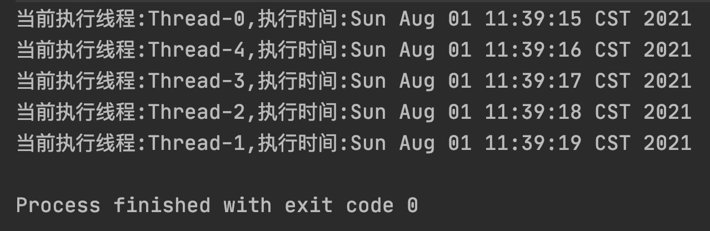
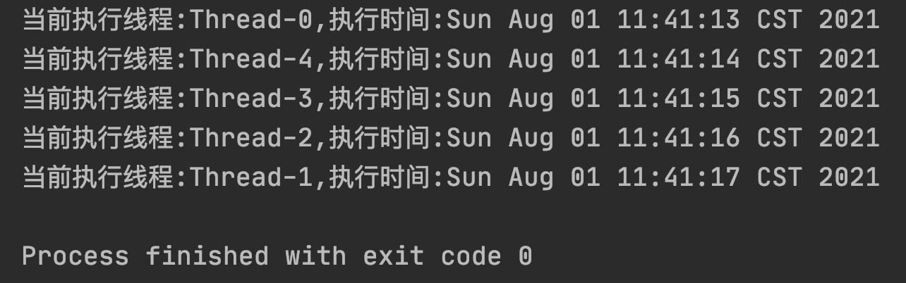
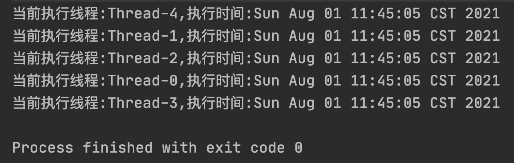

# Synchronized 加锁 this 和 class 的区别

原文：https://www.toutiao.com/i6991699407423160868/?group_id=6991699407423160868


​        Synchronized 是Java 中处理并发问题的一种常用手段，它也被称为“Java 内置锁”，由此可见其地位之重。不过，synchronized 有着多种用法，当它修饰不同对象时，其意义也是不同的。


## 一. Synchronized用法

​         通常 synchronized 可以用来修饰**普通方法、静态方法**和**代码块**。

### 1.1 修饰普通方法

```java
public synchronized void method() { ... }
```

​         当 synchronized 修饰普通方法时，被修饰的方法被称为同步方法，其作用范围时整个方法，**作用的对象是调用这个方法的对象**。

### 1.2 修饰静态方法

```java
public static synchronized void staticMethod() { ... }
```

​        当 synchronized 修饰静态方法时，其作用范围时整个方法，**作用对象是调用这个类的所有对象**。

### 1.3 修饰代码块

​        为了减少锁的粒度，可以选在在一个方法中的某个部分使用 synchronzed 来修饰（一段代码），从而实现对一个方法中的部分代码进行加锁，实现代码如下：

```java
public void classMethod() throws InterruptedException {
    // ... codes
    synchronized(SynchronizedExample.class) {
        // ...
    }
    // ... clodes
}
```

​         上述代码在执行时，被修饰的代码块称为同步语句块，其作用范围是大括号“{ }” 括起来的代码块，作用的对象是调用这个代码块的对象。

​         上面的代码块，除了可以加锁 **class** 之外，还可以加锁 this，具体示例如下：

```java
pubic void classMethod() throws InterruptedException {
    // ... codes
    synchronized(this) {
        // ...
    }
    // ... clodes
}
```

​        所以，问题就在这里了。使用 synchronized 加锁 this 和 class 的区别是什么呢？下面来好好说说。

## 二、加锁 class 共享一个类实例

​       首先，创建 5 个线程，调用**同一个对象实例**下 synchronized 加锁的 class 代码，具体示例如下：

```java
import java.util.Date;
import java.util.concurrent.TimeUnit;

public class SynchronizedExample {
    public static void main(String[] args) {
        final SynchronizedExample example = new SynchronizedExample();
        for (int i=0;i<5;i++){
            new Thread(new Runnable() {
                @Override
                public void run() {
                    try {
                        // 调用 synchronized 修饰的 class 方法
                        example.classMethod();
                    } catch(InterruptedException e) {
                        e.printStackTrace();
                    }
                }
            }).start();
        }
    }
    
    public void classMethod() throws InterruptedException {
        synchronized(SynchronizedExample.class) {
            System.out.println(String.format("当前执行线程:%s,执行时间:%s",
            Thread.currentThread().getName(), new Date()));
            TimeUnit.SECONDS.sleep(1);
        }
    }
}
```

以上代码执行结果如下：


从上述结果可以看出，这 5 个线程共享的是**同一把锁**。

## 三、加锁class 创建多个实例

​        接下来，创建 5 个线程，调用**不同对象实例**下 synchronized 加锁的 class 代码，具体示例如下：

```java
import java.util.Date;
import java.util.concurrent.TimeUnit;

public class SynchronizedExample {
    public static void main(String[] args) {
        
        for (int i=0;i<5;i++){
            new Thread(new Runnable() {
                @Override
                public void run() {
                    try {
                        // 创建类实例
                        SynchronizedExample example = new SynchronizedExample();
                        // 调用 synchronized 修饰的 class 方法
                        example.classMethod();
                    } catch(InterruptedException e) {
                        e.printStackTrace();
                    }
                }
            }).start();
        }
    }
    
    public void classMethod() throws InterruptedException {
        synchronized(SynchronizedExample.class) {
            System.out.println(String.format("当前执行线程:%s,执行时间:%s",
            Thread.currentThread().getName(), new Date()));
            TimeUnit.SECONDS.sleep(1);
        }
    }
}
```

以上程序的执行结果如下：



从上述结果可以看出，虽然是不同的对象，但它们使用的**仍然是同一把锁**。

## 四、加锁 this 共享一个类实例

​        接下来，创建 5 个线程，调用 synchronized 加锁 this 的示例。首先我们这 5 个线程调用**同一个对象实例**的加锁方法，示例代码如下：

```java
import java.util.Date;
import java.util.concurrent.TimeUnit;

public class SynchronizedExample {

    public static void main(String[] args) {
        // 创建当前类实例
        final SynchronizedExample example = new SynchronizedExample();
        // 创建 5 个线程执行任务
        for (int i = 0; i < 5; i++) {
            new Thread(new Runnable() {
                @Override
                public void run() {
                    try {
                        // 调用 synchronized 修饰的 this 方法
                        example.thisMethod();
                    } catch (InterruptedException e) {
                        e.printStackTrace();
                    }
                }
            }).start();
        }
    }
    
    /**
     * synchronized 修饰的 this 方法
     * @throws InterruptedException
     */
    public void thisMethod() throws InterruptedException {
        synchronized (this) {
            System.out.println(String.format("当前执行线程:%s,执行时间:%s",
            Thread.currentThread().getName(), new Date()));
            TimeUnit.SECONDS.sleep(1);
        }
    }
}
```

以上程序的执行结果如下：



从上述结果可以看出，以上线程使用的都是**同一把锁**。

## 五、加锁this创建多个类实例

​        最后一个示例最为特殊，使用 synchronized 加锁 this，让这 5 个线程调用各自创建对象的方法，具体示例如下：

```java
import java.util.Date;
import java.util.concurrent.TimeUnit;

public class SynchronizedExample {

    public static void main(String[] args) {
        // 创建 5 个线程执行任务
        for (int i = 0; i < 5; i++) {
            new Thread(new Runnable() {
                @Override
                public void run() {
                    try {
                        // 创建（多个）类实例
                        SynchronizedExample example = new SynchronizedExample();
                        // 调用 synchronized 修饰的 this 方法
                        example.thisMethod();
                    } catch (InterruptedException e) {
                        e.printStackTrace();
                    }
                }
            }).start();
        }
    }
    
    /**
     * synchronized 修饰的 this 方法
     * @throws InterruptedException
     */
    public void thisMethod() throws InterruptedException {
        synchronized (this) {
            System.out.println(String.format("当前执行线程:%s,执行时间:%s",
            Thread.currentThread().getName(), new Date()));
            TimeUnit.SECONDS.sleep(1);
        }
    }
}
```

以上程序的执行结果如下：



​        从上述结果可以看出，当使用 synchronized 加锁 this 时，如果线程调用的不是同一个对象，那么这些线程之间使用的锁都是自己独立的锁，这个结果就和 synchronized 加锁 class 的结果完全不同了。

## 六、总结

​        通过以上 4 个示例，可以得出结论，当**使用 synchronized 加锁 class 时，无论共享一个对象还是创建多个对象，它们用的都是同一把锁**，而**使用 synchronized 加锁 this 时，只有同一个对象会使用同一把锁，不同对象之间的锁是不同的**。

