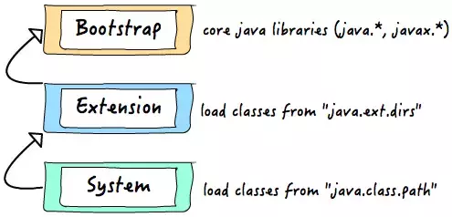
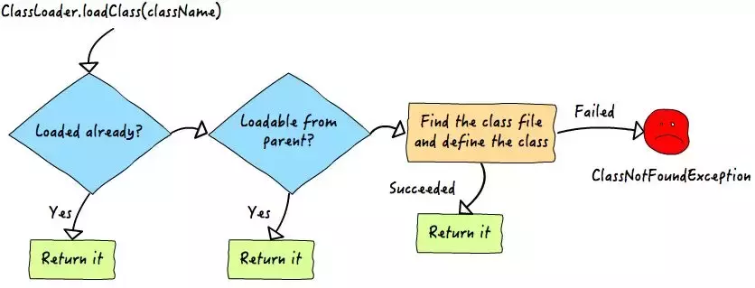

# 深度分析 Java 的 ClassLoader 机制 

原文：https://www.toutiao.com/a6597231439375237646/?channel=&source=search_tab

​        Java中的所有类，必须被装载到 JVM 中才能运行，这个装载工作是由 JVM 中的类装载器完成的，类装载器所做的工作实质上是把类文件从硬盘读取到内存中，JVM 在加载类的时候，都是通过 **ClassLoader** 的 *loadClass()* 方法来加载 class 的，*loadClass()* 使用**双亲委派模式**。

​        为了更好地理解类的加载机制，来深入研究一下 ClassLoader 和它的 *loadClass()* 方法。


## 一.  源码分析

​        先来看看 *public abstract class ClassLoader* 类，它是一个抽象类，Sun公司是这样解释这个类的：

```java
/**
* A class loader is an object that is responsible for loading classes. The class ClassLoader is an abstract class. Given the binary name of a class, a class loader should attempt to locate or generate data that constitutes a definition for the class. A typical strategy is to transform the name into a file name and then read a "class file" of that name from a file system.
*/
```

​        大致意思就是：

> 类加载器（class loader）是一个负责加载 Java 类（class）的对象。ClassLoader 类是一个抽象类，需要给出的二进制名称，class loader 尝试定位或者产生一个 class 的数据，一个典型的策略是把二进制名字转换成文件名，然后到文件系统中找到该文件（这就是为什么Java中类名和文件名需要一样的原因）。

​        下面看看 *loadClass()* 方法的具体实现：

```java
    protected Class<?> loadClass(String name, boolean resolve)
        throws ClassNotFoundException
    {
        synchronized (getClassLoadingLock(name)) {
            // First, check if the class has already been loaded
            Class<?> c = findLoadedClass(name);
            if (c == null) {
                long t0 = System.nanoTime();
                try {
                    if (parent != null) {
                        c = parent.loadClass(name, false);
                    } else {
                        c = findBootstrapClassOrNull(name);
                    }
                } catch (ClassNotFoundException e) {
                    // ClassNotFoundException thrown if class not found
                    // from the non-null parent class loader
                }

                if (c == null) {
                    // If still not found, then invoke findClass in order
                    // to find the class.
                    long t1 = System.nanoTime();
                    c = findClass(name);

                    // this is the defining class loader; record the stats
                    PerfCounter.getParentDelegationTime().addTime(t1 - t0);
                    PerfCounter.getFindClassTime().addElapsedTimeFrom(t1);
                    PerfCounter.getFindClasses().increment();
                }
            }
            if (resolve) {
                resolveClass(c);
            }
            return c;
        }
    }
```

​        这是完整的 *loadClass()* 方法，先不解读。先来看看这个方法的官方注释：

```java
/**
* Loads the class with the specified binary name. The default implementation of this method searches for classes in the following order:
*   1. Invoke findLoadedClass(String) to check if the class has already been loaded.
*   2. Invoke the loadClass method on the parent class loader. If the parent is null the class loader built into the virtual machine is used, instead.
*   3. Invoke the findClass(String) method to find the class.
*
* If the class was found using the above steps, and the resolve flag is true, this method will then invoke the resolveClass(Class) method on the resulting Class object.
* Subclasses of ClassLoader are encouraged to override findClass(String), rather than this method.
* Unless overridden, this method synchronizes on the result of getClassLoadingLock method during the entire class loading process.
*/
```

​        大致内容就是：

* 使用指定的二进制名称来加载类，这个方法的默认实现按照一下顺序查找类：
  * 调用 *findLoadedClass(String)*  方法检查这个类是否被加载过
  * 使用父加载器调用 *loadClass(String)* 方法，如果父加载器为 Null，类加载器装载VM内置的加载器
  * 调用 *findClass(String)*  方法装载类
* 如果按照以上的步骤成功的找到对应的类，并且该方法接收的 *resolve* 参数的值为 *true*，那么就调用 *resolveClass(Class)* 方法类处理类。*ClassLoader* 的**子类最好覆盖 *findClass(String)*** 而不是这个方法 (***loadClass***)。**除非重写，这个方法默认在整个装载过程中都是同步的（线程安全的）**。

​        了解了设计思路，再来看看源码：

1. ***protected Class<?> loadClass(String name, boolean resolve)*** 方法的访问控制符是 **protected**，也就是该方法能被**同package内的类或者派生类**所用。返回值类型 **Class<?>** 使用泛型，因为该方法不知道要加载的类到底是啥类型。String name，显然是要查找的类的名字；*boolean resolve* ，一个标志，为 **true** 时表示将调用 *resolveClass(Class)* 来处理该类
2. ***throws ClassNotFoundException*** 该方法会抛出找不到该类的异常，这是一个**非运行时异常**
3. ***synchronized (getClassLoadingLock(name))*** 看到这行代码，表示接下来是同步块，使用的同步对象是什么呢？下面看看 getClassLoadingLock(name)

​        这是 getClassLoadingLock(String) 的源码：

```java
protected Object getClassLoadingLock(String className) {
    Object lock = this;
    if (parallelLockMap != null) {
        Object newLock = new Object();
        lock = parallelLockMap.putIfAbsent(className, newLock);
        if (lock == null) {
            lock = newLock;
        }
    }
    return lock;
}
```

这个方法里用到了变量 *parallelLockMap* ，这是一个类变量。根据这个变量的值进行不同的操作：如果是Null，则直接返回 *this*，如果不为null，则新建一个对象，然后调用一个 *putIfAbsent(className, newLock)* 方法来给刚刚创建好的对象赋值。那么这个 parallelLockMap 变量是什么呢？请看：

```java
private final ConcurrentHashMap<String, Object> parallelLockMap;
```

​        这个变量的初始化在 ClassLoder 的构造函数中：

```java
    private ClassLoader(Void unused, String name, ClassLoader parent) {
        this.name = name;
        this.parent = parent;
        this.unnamedModule = new Module(this);
        if (ParallelLoaders.isRegistered(this.getClass())) {
            parallelLockMap = new ConcurrentHashMap<>();
            assertionLock = new Object();
        } else {
            // no finer-grained lock; lock on the classloader instance
            parallelLockMap = null;
            assertionLock = this;
        }
        this.package2certs = new ConcurrentHashMap<>();
        this.nameAndId = nameAndId(this);
    }
```

​        构造函数根据一个属性 ***ParallelLoaders*** 的 ***Registered*** 状态的不同来给 *parallelLockMap* 属性赋值。在 ClassLoader 类中包含一个静态内部类 *private static class ParallelLoaders* ，在 ClassLoader 被加载的时候这个静态内部类就被初始化了。关于这个静态内部类，Sun公司如是说：*Encapsulates the set of parallel capable loader types.* 即：封装了并行的可装载的类型的集合。

​        现在来整理一下这些代码：

​        首先，在 ClassLoader 类中有一个静态内部类 ParallelLoaders，它会指定的类的并行能力：如果当前的类加载器被定位为具有并行能力，那么它就给 parallelLockMap 定义，就是 new 一个 ConcurrentHashMap<>()， 这个时候，如果当前的加载器是具有并行能力的，那么 parallelLockMap 就不是 null；如果它是null，说明该加载器没有注册并行能力，没有必要给它一个加锁对象，getClassLoadingLock 方法直接返回 this，就是当前的加载器的和一个实例。

​        假设具有并行加载能力， parallelLoaders 不为 null，就给它新建一个锁对象，然后调用 *putIfAbsent(className, newLock)* 。这个方法的作用是：首先根据传递进来的 className，检查改名字是否已经关联了一个 value，如果已经关联了就直接把关联值返回；如果没有关联过值，就把传入的 Object 对象作为 value，与此 className 关联并返回。然后，无论 putIfAbsent 方法返回值是什么，都把它复制给刚刚生成的那个Object对象。

​        此时，简单说下 *getClassLoadingLock(String className)* 的作用：为类的加载操作返回一个锁对象。为了向后兼容，这个方法是这样实现的：如果当前的 classLoader 对象注册了并行能力，方法返回一个与指定的名字 className 相关联的特定对象；否则直接返回当前的 ClassLoader 对象。

​        接着，代码分析到 ***Class c = findLoadedClass(name)*** 这里。在加载类之前先调用该方法检查该类是否已经被加载过，findLoadedClass 会返回一个 Class 类型的对象。如果该类已经加载过，那么就可以直接返回该对象（在返回之前会根据 resolve 的值来决定是否处理该对象，具体如何处理后面介绍）。如果该类没有被加载过，那么执行下面的加载过程：

```java
try {
    if (parent != null) {
        c = parent.loadClass(name, false);
    } else {
        c = findBootstrapClassOrNull(name);
    }
} catch (ClassNotFoundException e) {
    // ClassNotFoundException thrown if class not found
    // from the non-null parent class loader
}
```

​        如果父加载器不为空，那么调用父加载器的 loadClass 方法加载类；如果父加载器为空，就调用虚拟机的加载器来加载类。

​        如果以上两个步骤都没有成功的加载到类，就执行这个过程：

```java
if (c == null) {
   // If still not found, then invoke findClass in order
   // to find the class.
   long t1 = System.nanoTime();
   c = findClass(name);
   // this is the defining class loader; record the stats                       
   PerfCounter.getParentDelegationTime().addTime(t1 - t0);                        
   PerfCounter.getFindClassTime().addElapsedTimeFrom(t1);
   PerfCounter.getFindClasses().increment();
}
```

**其中，*c = findClass( name)* 表示当前 classLoader 自己来加载类**。

​        这个时候，已经得到了加载之后的类，那么就根据 *resolve* 的值决定是否调用 resolveClass() 方法。这个方法的作用是：

> **链接指定的类**。这个方法给 ClassLoader 用来链接一个类，如果这个类已经被链接过了，那么这个方法只做一个简单的返回；否则，这个类将被按照 Java规范中的 Executio 描述进行连接……

​       至此，ClassLoader类以及 *loadClass()*  方法的源码已经分析完毕。

## 二. 总结

### 2.1 类的分类

​        Java中，类大致分为三种：

* 系统类
* 扩展类
* 应用自定义类 - 通俗的说，就是开发应用而写的 Java 代码

### 2.2 类装载方法

​        有两种类加载方式：

* **隐式装载**

  程序在运行过程中，当碰到通过 **new** 等方式生成对象是，隐式调用类装载器加载对应的类到 JVM 中

* **显式装载**

  通过 class.forname() 等方法，显式加载需要的类

### 2.3 类加载的动态性体现

​        一个应用程序总是由 n 多个类组成，Java 程序启动时，并不是一次把所有的类全部加载后再运行，它总是先把保证程序运行的基础类一次性加载到 JVM 中，其它类等到 JVM 用到的时候再加载。这样的好处是节省了内存的开销，因为 Java 最早就是为了嵌入式系统而设计的，内存宝贵。这是一种可以理解的机制，而用时再加载也是 Java 动态性的一种体现。

### 2.4 Java类装载器

​        Java 中的类装载器实质上也是类，功能是把类载入 JVM 中。值得主要的是，JVM 的类装载器并不是一个，而是三个，层次如下图所示：



​        为什么要有三个类加载器呢？一方面是分工，各自负责各自的区域；另一方面是为了实现委托模型。

### 2.5 类加载器之间如何协调工作

​        前面介绍了Java 中有三个类加载器，问题来了：碰到一个类需要加载时，它们之间如何协调工作的呢？即 Java 是如何区分一个类该由哪个类加载器来完成的呢？

​        如前面代码分析一样，Java 采用了**委托模型机制**来加载类。这个机制简单来说，就是：类装载器有载入类需求时，会先请示其 **parent** 类加载器使用其搜索路径帮忙载入。如果 parent 找不到，那么才由自己依照自己的搜索路径来搜索类。如果还搜索不到，则抛出 ClassNotFoundException。



​        类装载工作由 ClassLoader 和其子类负责。JVM 在运行时会产生三个 ClassLoader：根装载器、ExtClassLoader（扩展类装载器）和 AppClassLoader。其中，

* **根装载器**：它<font color='red'>**不是**</font>**ClassLoader** 的子类，而是由 C++ 编写，因此在 Java 中看不到它，负责装载 JRE 的核心类库，如 java.lang.*
* **ExclassLoader**：它是 ClassLoader的子类，负责装载 **JRE 扩展目录 ext** 下的 jar 包
* **AppClassLOader**：负责装载 **classpath** 路径下的类包

这三个类装载器存在**父子层级关系**，即：根装载器是 ExtClassLoader 的父装载器，ExtClassLoader 是 AppClassLoader 的父装载器。默认情况下，使用 AppClassLoader 装载应用程序的类。

​        下面举个例子说明三者的关系：

```java
public class Test {
	public static void main(String[] args) {
    ClassLoader c = Test.class.getClassLoader();
    System.out.println(c);
    ClassLoader c1 = c.getParent();
    System.out.println(c1);
    ClassLoader c2 = c1.getParent();
    System.out.println(c2);
  }
}
```

运行结果：

```shell
...AppClassLoader...
...ExtClassLoader...
Null
```

​        可以看出 Test 是由 AppClassLoader 加载器加载的，AppClassLoader 的 Parent 加载器是 ExtClassLoader，但是 ExtClassLoader 的 Parent 是 null。之所以 ExtClassLoader 的 Parent 是 null，是因为 Bootstrap Loader 是 C++ 写的，按照 Java 的观点来看，逻辑上并不存在 BootstrapLoader 的类实体，所以在 Java 程序代码里试图打印其内容时，就会出现null。

​        Java 装载类使用“**全盘负责委托机制**”。“**全盘负责**”是指当一个 ClassLoader 装载一个类时，除非显示的使用另一个 ClassLoader，该类所依赖及引用的类也由这个 ClassLoader 载入。“**委托机制**”是指，先委托父类装载器寻找目标类，只有在找不到的情况下才从自己的类路径中寻找并装载目标类。

​        这一点是从安全方面考虑的。试想：如果一个人写了一个恶意的基础类（如 java.lang.String）并加载到 JVM 将会引起严重的后果，但是有了全盘负责制，java.lang.String **永远**是由根装载器来装载，避免以上情况发生，除了 JVM 默认的是那个 ClassLoader 以外，第三方可以编写自己的类装载器，以实现一些特殊需求。

​        类文件被装载解析后，在 JVM 中都有一个对应的 java.lang.Class 对象，提供了类结构信息的描述。数组、枚举及基本数据类型，甚至 void 都拥有对应的 Class 对象。Class 类没有 public 的构造方法，Class对象是在装载类时由 JVM 通过调用类装载器中的 *defineClass()* 方法自动构造的。