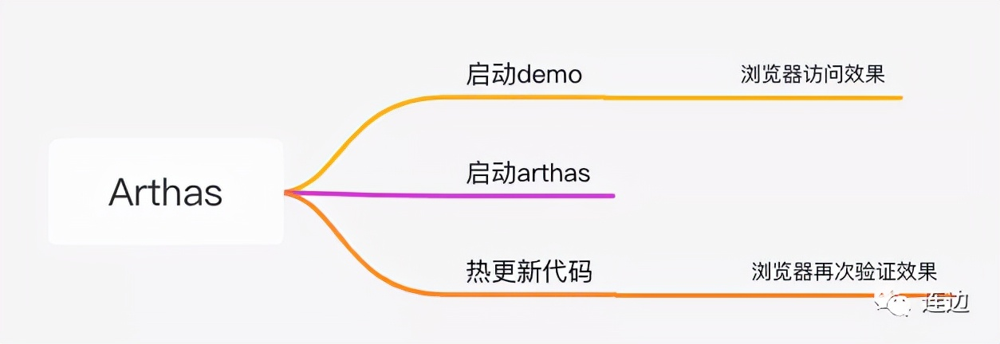
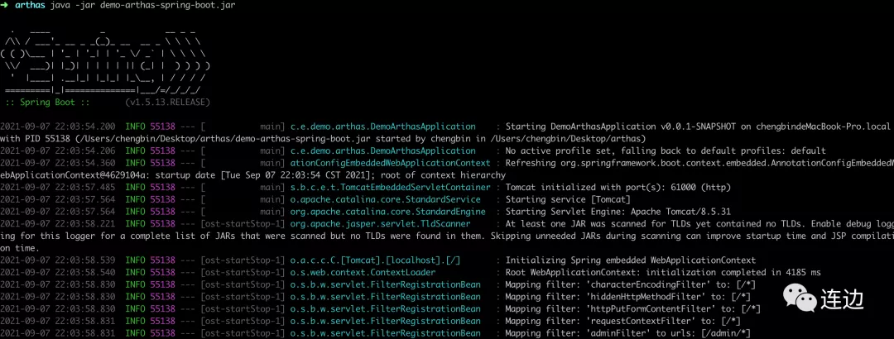
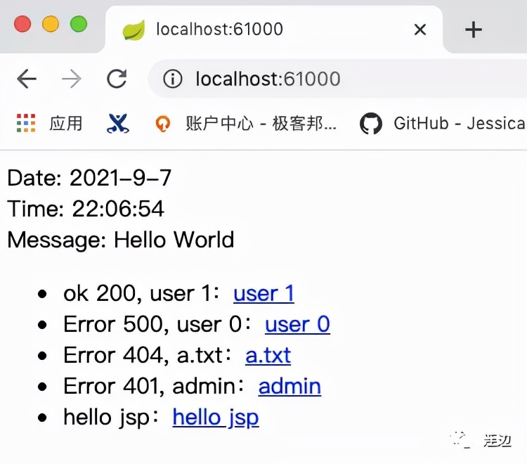
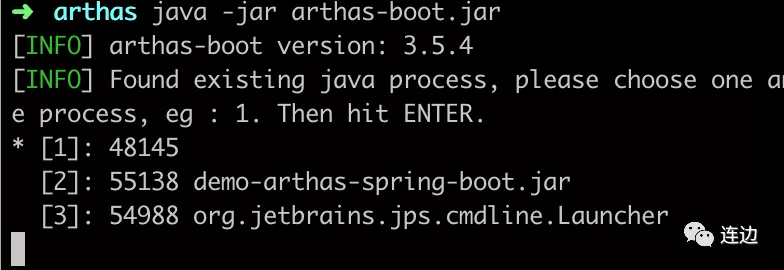
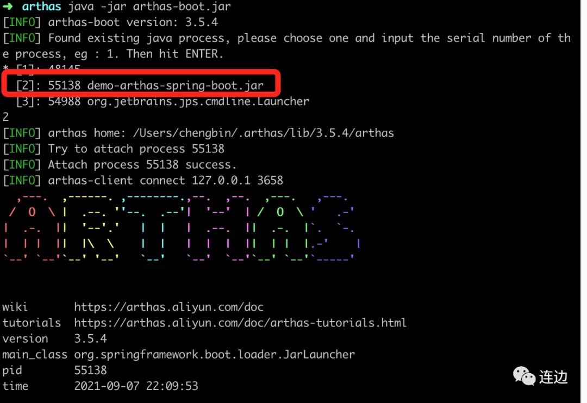
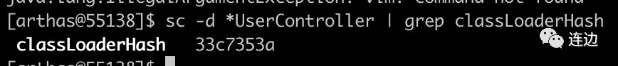
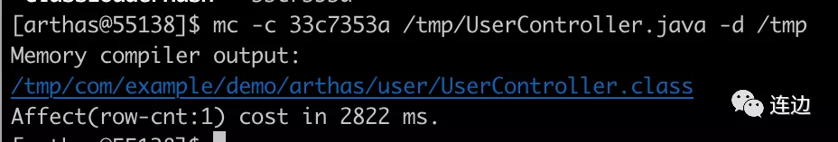
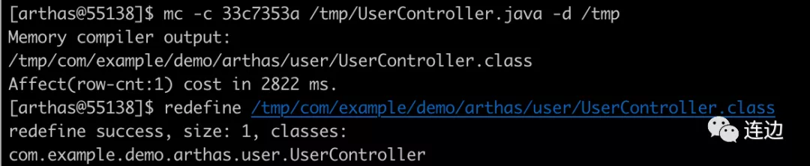
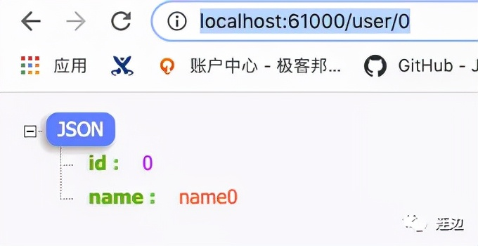

# 不重启JVM替换掉已经加载的类

原文：https://www.toutiao.com/a7015200325841715719/


​        常常会遇到这样的问题：测试环境、预发布环境，应用运行得非常好，但是代码一到线上就会出现莫名其妙的问题。往往这个时候，不能中断对外提供的服务，又要线上调试问题，如何是好呢？

​        其实这个问题的本质就是**要动态改变内存中已经存在的对象的行为**。

​        JVM 中操作的对象是 class 文件，不是源码。所以进一步分析，就是要改变 class 文件，然后让 JVM 重新加载 class 文件，就能达到目的了。

## 1. 实战脑图



## 2. Github 文档

​        Arthas 是 Alibaba 开源的 Java 诊断工具：

​        https://github.com/alibaba/arthas/blob/master/README_CN.md

## 3. Arthas 实战

### 3.1 Start Demo

1. 利用 Spring Boot 在本地启动一个服务，端口：8080

   ```shell
   java -jar demo-arthas-spring-boot.jar
   ```

2. 启动后的截图

   

3. 测试是否成功

   

### 3.2 Start Arthas

​        新开一个终端，启动 arthas：

```shell
java -jar arthas-boot.jar
```



​        输入命令行，这里选择 [2]，因为 [2] 是刚刚启动的进程：



​        选择指定进程。至此，准备工作完成，第二个窗口也进入到 arthas 窗口模式

## 4. 热更新代码

1. 通过浏览器访问： http://localhost:61000/user/0 会抛出500错误

2. 反编译文件到 /tmp/UserController.java ：

   ```shell
   jad --source-only com.exmple.demo.arthas.user.UserController > /tmp/UserController.java
   ```

3. 新建一个终端，用来编辑 /tmp/UserController.java。这里把逻辑改成： 当 user id 小于 1 时，也能正常返回，不抛出异常：

   ```java
   @GetMapping(value={"/user/{id}"})
   public User findUserById(@PathVariable Integer id) {
       logger.info("id: {}", (Object)id);
       if (id != null && id < 1) {
           return new User(id, "name" + id); // 新改的逻辑
           // throw new IllegalArgumentException("id < 1");
       }
       return new User(id.intValue(), "name" + id);
   }
   ```

4. sc 查找加载 UserController 的 classLoaderHash

   ```shell
   sc -d *UserController | grep classLoaderHash
   ```

   结果：

   

5. 通过 mc -c <classLoaderHash> /tmp/UserController.java -d /tmp， 使用 -c 参数指定 ClassLoaderHash：

   ```shell
   mc -c 33c7353a /tmp/UserController.java -d /tmp
   ```

   

6. 再使用 redefine 命令重新加载新编译好的 UserController.class ：

   ```shell
   redefine /tmp/com/example/demo/arthas/user/UserController.class
   ```

   

7. redefine 成功后，再次反问 /user/0, 结果：

   

## 5. 小结

​        Java是静态语言，运行时不允许改变数据结构。然而，Java 5引入Instrument，Java 6引入Attach API之后，事情开始变得不一样了。