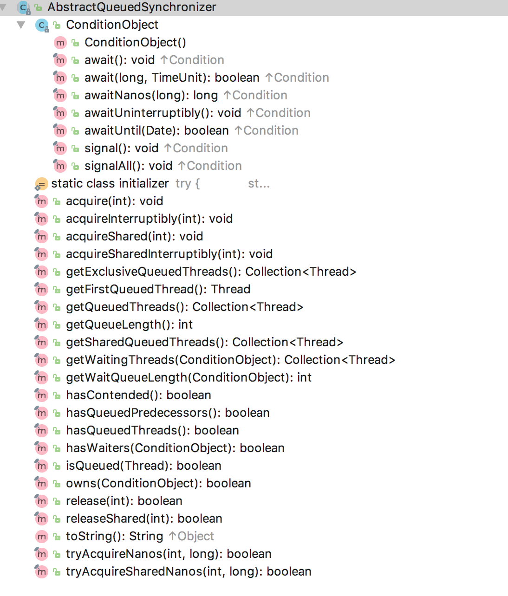

# AbstractQueuedSynchronizer 概述

原文：https://www.jianshu.com/p/853b203a8d93


## 一. AQS 介绍

​        AbstractQueuedSynchronizer（AQS） 是 Java 中非常重要的一个框架类，它实现了最核心的多线程同步语义，只要继承 AbstractQueuedSynchronizer ，就可以非常方便的实现自己的线程同步器。Java 中的 **锁Lock**  就是基于AQS来实现的。

​        下面展示了AQS类提供的一些方法：



​       在类结构上，AQS 继承了 ***AbstractOwnableSynchronizer***，这个AbstractOwnableSynchronizer 仅有的两个方法是提供当前独占模式的线程设置：

```java

    /**
     * The current owner of exclusive mode synchronization.
     */
    private transient Thread exclusiveOwnerThread;

    /**
     * Sets the thread that currently owns exclusive access.
     * A {@code null} argument indicates that no thread owns access.
     * This method does not otherwise impose any synchronization or
     * {@code volatile} field accesses.
     * @param thread the owner thread
     */
    protected final void setExclusiveOwnerThread(Thread thread) {
        exclusiveOwnerThread = thread;
    }

    /**
     * Returns the thread last set by {@code setExclusiveOwnerThread},
     * or {@code null} if never set.  This method does not otherwise
     * impose any synchronization or {@code volatile} field accesses.
     * @return the owner thread
     */
    protected final Thread getExclusiveOwnerThread() {
        return exclusiveOwnerThread;
    }
```

​        ***exclusiveOwnerThread*** 代表的是当程获得同步的线程。因为是独占模式，在 exclusiveOwnerThread 持有同步的过程中其他线程的任何同步获取请求将得不到满足。

​        至此，需要说明的是，AQS 不仅支持独占模式下的同步实现，还支持共享模式下的同步实现。在 Java 的锁的实现上，就有**共享锁**和**独占锁**的区别，而这些实现都是基于AQS对于共享同步和独占同步的支持。从上面展示的 AQS 提供的方法中，可以发现 AQS 的API 大致分为三类：

* 类似 *acquire ( int )* 的一类，是最基本的一类，不可被中断
* 类似 *acquireInterruptibly( int )* 的一类，可以被中断
* 类似 *tryAcquireNanos( int, long )* 的一类，不仅可以被中断，还可以设置阻塞时间

​        上面三种类型的API分为**独占**和**共享**两套，可以根据需要来使用合适的 API 来做线程同步。

​        下面是一个继承 AQS 来实现自己的同步器的示例：

```java
class Mutex implements Lock, java.io.Serializable {
 
    // Our internal helper class
    private static class Sync extends AbstractQueuedSynchronizer {
      // Reports whether in locked state
      protected boolean isHeldExclusively() {
        return getState() == 1;
      }
 
      // Acquires the lock if state is zero
      public boolean tryAcquire(int acquires) {
        assert acquires == 1; // Otherwise unused
        if (compareAndSetState(0, 1)) {
          setExclusiveOwnerThread(Thread.currentThread());
          return true;
        }
        return false;
      }
 
      // Releases the lock by setting state to zero
      protected boolean tryRelease(int releases) {
        assert releases == 1; // Otherwise unused
        if (getState() == 0) throw new IllegalMonitorStateException();
        setExclusiveOwnerThread(null);
        setState(0);
        return true;
      }
 
      // Provides a Condition
      Condition newCondition() { return new ConditionObject(); }
 
      // Deserializes properly
      private void readObject(ObjectInputStream s)
          throws IOException, ClassNotFoundException {
        s.defaultReadObject();
        setState(0); // reset to unlocked state
      }
    }
 
    // The sync object does all the hard work. We just forward to it.
    private final Sync sync = new Sync();
 
    public void lock()                { sync.acquire(1); }
    public boolean tryLock()          { return sync.tryAcquire(1); }
    public void unlock()              { sync.release(1); }
    public Condition newCondition()   { return sync.newCondition(); }
    public boolean isLocked()         { return sync.isHeldExclusively(); }
    public boolean hasQueuedThreads() { return sync.hasQueuedThreads(); }
    public void lockInterruptibly() throws InterruptedException {
      sync.acquireInterruptibly(1);
    }
    public boolean tryLock(long timeout, TimeUnit unit)
        throws InterruptedException {
      return sync.tryAcquireNanos(1, unit.toNanos(timeout));
    }
  }
}
```

​       这个 **Mutex** 实现的功能：使用 0 来代表可以获得同步变量，使用 1 来代表需要等待同步变量被释放再获取。这是一个简单的独占锁实现，任何时刻只会有一个线程获得锁，其他请求获取锁的线程都会阻塞等待，直到锁被释放，等待的线程将在此竞争来获得锁。

​        Mutex 给了很好的范例：要实现自己的同步器，就要继承 AQS 实现其中**三个**抽象方法，然后使用该实现类来做 lock 和 unlock 的操作。可以发现，AQS 框架已经铺平了道路，只需要做一点点改变就可以实现高效安全的线程同步器。下文将分析 AQS 是如何提供如此强大的同步能力的。


## 二. AQS实现细节

### 2.1 独占模式

​        AQS 使用了 **volatile**  修饰一个 int 来作为同步变量，任何想要获得锁的线程都需要来竞争该变量。获得锁的线程可以继续业务流程的执行，而没有获得锁的线程会被放到一个 **FIFO** 的队列中去，等待再次竞争同步变量来获得锁。

​        AQS 为每个没有获得锁的线程封装成一个 **Node** 对象再放到队列中去，下面分析一下 Node 的结构：

```java
static final class Node {
    
    // ....

    /** waitStatus value to indicate thread has cancelled */
    static final int CANCELLED =  1;
    /** waitStatus value to indicate successor's thread needs unparking */
    static final int SIGNAL    = -1;
    /** waitStatus value to indicate thread is waiting on condition */
    static final int CONDITION = -2;
    /**
     * waitStatus value to indicate the next acquireShared should
     * unconditionally propagate
     */
    static final int PROPAGATE = -3;
    
    // ........
}
```

​        上面展示的是 **Node** 的四个状态。需要注意的是，只有一个状态是大于 0 的，也就是 **CANCELED**，也就是“**被取消**”状态。这个状态下的线程，不再需要为此线程协调同步变量的竞争了。其他几个的意义如代码上的注释。

​        AQS 使用下面的两个变量来标识是共享还是独享模式：

```java
    static final class Node {
        /** Marker to indicate a node is waiting in shared mode */
        static final Node SHARED = new Node();
        /** Marker to indicate a node is waiting in exclusive mode */
        static final Node EXCLUSIVE = null;
        
        // ...
    }
```

有趣的是，Node 使用了一个变量 **nextWaiter** 来代表两种含义： 当在独占模式下，nextWaiter 表示下一个等在 **ConditionObject** 上的 Node；在共享模式下就是 SHARED，因为对于任何一个同步器来说，都不可能同时实现共享和独占两种模式的。更稳专业的解释是：

```java
        /**
         * Link to next node waiting on condition, or the special
         * value SHARED.  Because condition queues are accessed only
         * when holding in exclusive mode, we just need a simple
         * linked queue to hold nodes while they are waiting on
         * conditions. They are then transferred to the queue to
         * re-acquire. And because conditions can only be exclusive,
         * we save a field by using special value to indicate shared
         * mode.
         */
        Node nextWaiter;
```

​        AQS 使用 **双向链表** 来管理请求同步的 Node，保存了链表的 head 和 tail，新的 Node 将会被插入到链表的**尾端**，而链表的 head 总是代表着获得锁的线程，链表头的线程释放了锁之后，会通知后面的线程来竞争共享变量。

​        下面来分析 AQS 是如何实现独占模式下的 ***acquired*** 和 ***release*** 的。

#### 2.1.1 acquired

​        使用 acquired( int ) 方法可以竞争同步变量，下面是调用链路：

```java
    public final void acquire(int arg) {
        if (!tryAcquire(arg) &&
            acquireQueued(addWaiter(Node.EXCLUSIVE), arg))
            selfInterrupt();
    }
    
    private Node addWaiter(Node mode) {
        Node node = new Node(Thread.currentThread(), mode);
        // Try the fast path of enq; backup to full enq on failure
        Node pred = tail;
        if (pred != null) {
            node.prev = pred;
            if (compareAndSetTail(pred, node)) {
                pred.next = node;
                return node;
            }
        }
        enq(node);
        return node;
    }
   
    final boolean acquireQueued(final Node node, int arg) {
        boolean failed = true;
        try {
            boolean interrupted = false;
            for (;;) {
                final Node p = node.predecessor();
                if (p == head && tryAcquire(arg)) {
                    setHead(node);
                    p.next = null; // help GC
                    failed = false;
                    return interrupted;
                }
                if (shouldParkAfterFailedAcquire(p, node) &&
                    parkAndCheckInterrupt())
                    interrupted = true;
            }
        } finally {
            if (failed)
                cancelAcquire(node);
        }
    }        
```

​        首先，调用 **tryAcquire** 来尝试获取锁，而 **tryAcquire** 这个方法是需要子类来实现的，子类的实现无非就是通过 ***compareAndSetState、getState、setState*** 三个方法来操作同步变量 state，子类的方法实现需要根据各自的需求场景来实现。

​        如果 **tryAcquire** 返回 ***true***，也就是成功改变了 state 的值了，也就是获得了同步锁了，那么就可以退出了。

​        如果 **tryAcquire** 返回 ***false***，说明有其他的线程获得了锁，这个时候 AQS 会使用 ***addWaiter*** 将当前的线程添加到等待队列的尾部，等待再次竞争。需要注意的是，此时，会将当前线程标记为独占模式。

​        重头戏来了，方法 ***acquireQueued( )*** 使得新添加的 Node 在一个 for 死循环中不断的轮询，也就是自旋， **acquireQueued** 方法退出的条件是：

1. 该节点的前驱节点是头节点，头节点代表的是获得锁的节点，只有它释放了 state ，其他线程才能获得这个变量的所有权
2. 在条件 1 的前提下，方法 **tryAcquire** 返回 **true**，也就是可以获得同步资源 state

满足上面两个条件后，这个 Node 就会获得锁，根据 AQS 的规定，获得锁的 Node **必须**是链表的头节点，所以需要将当前节点设定为头节点。那如果不符合上面两个条件的 Node 会如何呢？看 for 循环里的第二个分支：

​        首先是 ***shouldParkAndFailedAcquired()*** 方法，从名字上说，应该是判断是否应该 park 当前线程，然后是方法 ***parkAndCheckInterrupt( )*** ，这个方法是在 shouldParkAndFailedAcquired() 返回 ***true*** 的前提下才会执行。意思就是首先判断一下是否需要 park 该 Node，如果需要，那就 park 它。关于线程的 park 和 unpark，AQS 使用了底层的技术来实现，不做分析。现在分析一下，在什么情况下，Node 会被 park （block）：

```java
    private static boolean shouldParkAfterFailedAcquire(Node pred, Node node) {
        int ws = pred.waitStatus;
        if (ws == Node.SIGNAL)
            /*
             * This node has already set status asking a release
             * to signal it, so it can safely park.
             */
            return true;
        if (ws > 0) {
            /*
             * Predecessor was cancelled. Skip over predecessors and
             * indicate retry.
             */
            do {
                node.prev = pred = pred.prev;
            } while (pred.waitStatus > 0);
            pred.next = node;
        } else {
            /*
             * waitStatus must be 0 or PROPAGATE.  Indicate that we
             * need a signal, but don't park yet.  Caller will need to
             * retry to make sure it cannot acquire before parking.
             */
            compareAndSetWaitStatus(pred, ws, Node.SIGNAL);
        }
        return false;
    }
```

发现，只有当 Node 的前驱节点的状态为 ***Node.SIGNAL*** 的时候才会返回 ***true***，即只有当前驱节点的状态变为了 Node.SIGNAL，才会去通知当前节点，所以如果前驱节点是 Node.SIGNAL 的，那么当前节点就可以放心的 park 了，前驱节点在完成工作之后在释放资源的时候会 unpark 它的后续节点。下面是 release 的过程：

```java

    public final boolean release(int arg) {
        if (tryRelease(arg)) {
            Node h = head;
            if (h != null && h.waitStatus != 0)
                unparkSuccessor(h);
            return true;
        }
        return false;
    }
    
    private void unparkSuccessor(Node node) {
        /*
         * If status is negative (i.e., possibly needing signal) try
         * to clear in anticipation of signalling.  It is OK if this
         * fails or if status is changed by waiting thread.
         */
        int ws = node.waitStatus;
        if (ws < 0)
            compareAndSetWaitStatus(node, ws, 0);

        /*
         * Thread to unpark is held in successor, which is normally
         * just the next node.  But if cancelled or apparently null,
         * traverse backwards from tail to find the actual
         * non-cancelled successor.
         */
        Node s = node.next;
        if (s == null || s.waitStatus > 0) {
            s = null;
            for (Node t = tail; t != null && t != node; t = t.prev)
                if (t.waitStatus <= 0)
                    s = t;
        }
        if (s != null)
            LockSupport.unpark(s.thread);
    }    

```


### 2.2 共享模式