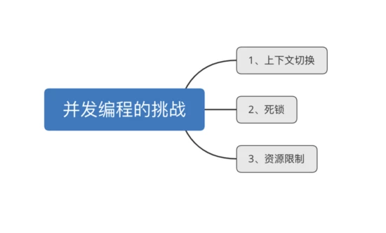

# Java并发编程总结

原文：https://www.cnblogs.com/lfs2640666960/p/11345685.html


## 一. 并发编程有哪些挑战

​        大致来看，并发编程有这3大挑战：

### 1.1 频繁的上下文切换

​        时间片是 CPU 分配给各个线程的时间，因为时间非常短，所以CPU不断通过切换线程，让用户觉得多个线程是同时执行的，时间片一般是几十毫秒。而每次切换时，需要把当前的状态保存起来，以便能够进行恢复先前状态，而这个切换时非常损耗性能，过于频繁反而无法发挥出多线程编程的优势。通过减少上下文切换可以采用无锁并发编程，如 CAS 算法，使用最少的线程和使用协程。

* **无锁并发编程**：可以参照 ConcurrentHashMap 锁分段的思想，不同的线程处理不同段的数据，这样在多线程竞争的条件下，可以减少上下文切换的时间
* **CAS算法**：利用 Atomic 下使用 CAS 算法来更新数据，使用了乐观锁，可以有效的减少一部分不必要的锁竞争带来的上下文切换
* **使用最少线程**：避免创建不需要的线程，比如任务很少，但是创建了很多的线程，这样会造成大量的线程都处于等待状态
* **协程**：在单线程里实现多任务的调度，并在单线程里维持多个任务的切换

​        由于上下文切换也是相对比较耗时的操作，所以在《Java并发编程艺术》一书中有过一个实验，并发累加未必会比串行累加速度快。所以使用 Lmbench3 测量上下文切换的时长 vmstat 测量上下文切换次数。

### 1.2 线程安全-死锁

​        多线程编程中最难把握的就是临界区线程安全问题，稍微不注意就会出现死锁的情况，一旦产生死锁就会造成系统功能不可用。

```java
public class DeadLockDemo {
    private static String resource_a = "A";
    private static String resource_b = "B";

    public static void main(String[] args) {
        deadLock();
    }

    public static void deadLock() {
        Thread threadA = new Thread(new Runnable() {
            @Override
            public void run() {
                synchronized (resource_a) {
                    System.out.println("get resource a");
                    try {
                        Thread.sleep(3000);
                        synchronized (resource_b) {
                            System.out.println("get resource b");
                        }
                    } catch (InterruptedException e) {
                        e.printStackTrace();
                    }
                }
            }
        });
        Thread threadB = new Thread(new Runnable() {
            @Override
            public void run() {
                synchronized (resource_b) {
                    System.out.println("get resource b");
                    synchronized (resource_a) {
                        System.out.println("get resource a");
                    }
                }
            }
        });
        threadA.start();
        threadB.start();

    }
}
```

这段代码中，开启了两个线程 threadA 和 threadB，其中 threadA占用了 resource_a，并等待被 threadB 释放的 resource_b；threadB占用了 resource_b，正等待被 threadA 释放的 resource_a。因此 threadA、threadB 出现了线程安全的问题，形成了死锁。同样，可以通过jps，jstack 证明这种推论：

```shell
"Thread-1":
  waiting to lock monitor 0x000000000b695360 (object 0x00000007d5ff53a8, a java.lang.String),
  which is held by "Thread-0"
"Thread-0":
  waiting to lock monitor 0x000000000b697c10 (object 0x00000007d5ff53d8, a java.lang.String),
  which is held by "Thread-1"

Java stack information for the threads listed above:
===================================================
"Thread-1":
        at learn.DeadLockDemo$2.run(DeadLockDemo.java:34)
        - waiting to lock <0x00000007d5ff53a8(a java.lang.String)
        - locked <0x00000007d5ff53d8(a java.lang.String)
        at java.lang.Thread.run(Thread.java:722)
"Thread-0":
        at learn.DeadLockDemo$1.run(DeadLockDemo.java:20)
        - waiting to lock <0x00000007d5ff53d8(a java.lang.String)
        - locked <0x00000007d5ff53a8(a java.lang.String)
        at java.lang.Thread.run(Thread.java:722)

Found 1 deadlock.
```

如上所述，安全可以看出当前死锁的情况。

那么，通常可以用如下的方式避免死锁的情况：

1. 避免一个线程同时获得多个锁
2. 避免一个线程在锁内部占用多个资源，尽量保证每个锁只占用一个资源
3. 尝试使用定时锁，使用 lock.tryLock(timeOut)，当超时等待时当前线程不会阻塞
4. 对于数据库锁，加锁和解锁必须在一个数据库连接里，否则会出现解锁失败的情况

所以，如何正确的使用多线程编程技术有很大的学问。比如：如何保证线程安全；如何正确理解由于 JMM 内存模型在**原子性、有序性、可见性**带来的问题；比如数据库脏读、DCL等问题。

### 1.3 资源限制的挑战

* **什么是资源限制**

  资源限制是指：在进行并发编程时，程序的执行速度受限于计算机硬件资源或者软件资源

  硬件资源：带宽的上传下载速度、硬盘读写速度 和 CPU 的处理速度等

  软件资源：线程池大小、数据库的连接等等

* **资源限制引发的问题**

  在并发编程中，代码执行速度加快的原则是将代码中的串行部分编程并行执行，但有可能由于资源限制问题，导致程序仍按串行执行，此时程序不仅不会变快，反而变慢，因为增加了上下文切换和资源调度的时间

* **如何解决资源限制的问题**

  对于硬件资源限制：考虑使用集群方式并行执行程序

  对于软件资源限制：考虑使用资源池将资源复用，例如数据库连接池等

* **资源限制情况下进行并发编程**

  根据不同的资源限制调整程序的并发度

## 二. 应该了解的概念

### 2.1 同步和异步

​        同步和异步，通常用来形容一次方法调用。同步方法调用一开始，调用者必须等待被调用的方法结束后，调用者后面的代码才能继续执行；而异步调用，指的是，调用者不用等待被调用方法完成，就继续执行后面的代码，当被调用的方法完成后会通知调用者。

​        比如，在超时购物，如果一件物品没了，你得等仓库人员跟你调货，直到仓库人员跟你把货物送过来，你才能继续去收银台付款，这就类似同步调用。而异步调用了，就像网购，你在网上付款下单后，什么事就不用管了，该干嘛就干嘛去了，当货物到达后你收到通知去取就好。

### 2.2 并发与并行

​        并发和并行是十分容易混淆的概念。

* 并发：是多个任务交替进行
* 并行：真正意义上的“同时进行”

​        实际上，如果系统只有一个 CPU，而使用多线程时，那么真实系统环境不能并行，只能通过切换时间片的方式交替进行，形成并发执行任务。真正的并行，只能出现在拥有多个CPU的系统中。

### 2.3 阻塞和非阻塞

​        阻塞和非阻塞通常用来形容多线程间的相互影响，比如：一个线程占有了临界区资源，那么其他线程需要这个资源就必须进行等待该资源的释放，会导致等待的线程挂起，这种情况就是阻塞；而非阻塞就恰好相反，它强调没有一个线程可以阻塞其他线程，所有的线程都会尝试地往前运行

### 2.4 临界区

​        临界区用来表示一种公共资源或者说是共享数据，可以被多个线程使用。但是每个线程使用时，一旦临界区资源被一个线程占有，那么其他线程必须等待。

## 三. 并发编程的三大特点

​        并发编程的三大特性：**原子性、可见性、有序性**

### 3.1 原子性

​        在一次操作或多次操作中，要么所有的操作都得到执行，要么都不执行

* JMM 只保证了基本读取和赋值的原子性操作
* 多个原子性操作的组合不再是原子性操作
* 可以使用 ***synchronized/lock*** 保证某些代码片段的原子性
* 对于 int 等类型的自增操作，可以通过 java.util.concurrent.atomic.* 保证原子性

### 3.2 可见性

​        是指一个线程对共享变量进行了修改，其他线程可以立即看到修改后的值

### 3.3 有序性

​        是指代码在执行过程中的先后顺序是有序的。Java编译器会对代码进行优化，执行顺序可能与开发者编写的顺序不同，这就是VM的**指令重排**。

### 3.4 保证三大特性的方式

​        并发编程中，要保证三大特征，有以下三种方式：

1. 使用 **volatile** 关键字**修饰变量**
2. 使用 **synchronzied**  关键字修饰方法或者代码块
3. 使用 **JUC** 提供的显式锁 Lock
