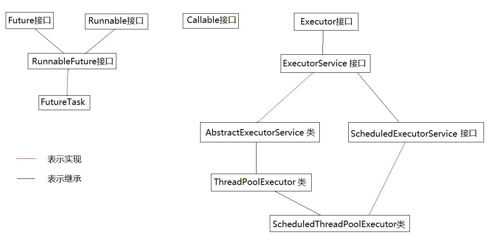
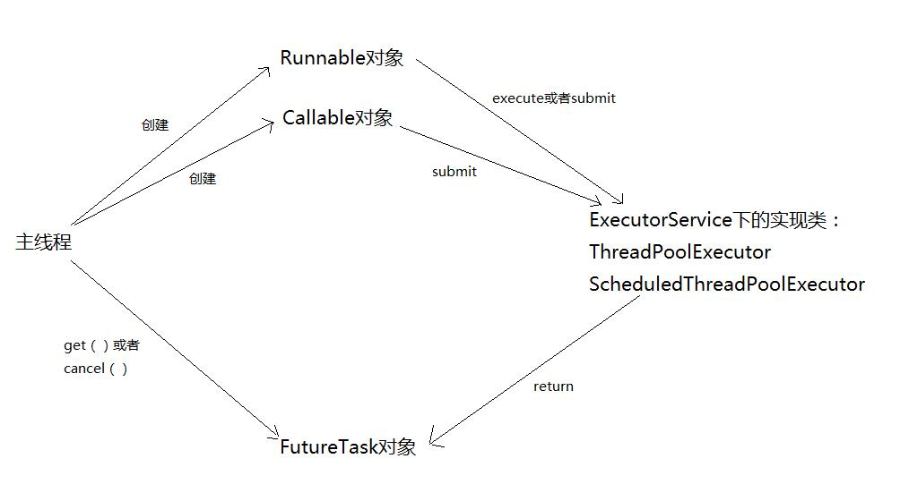
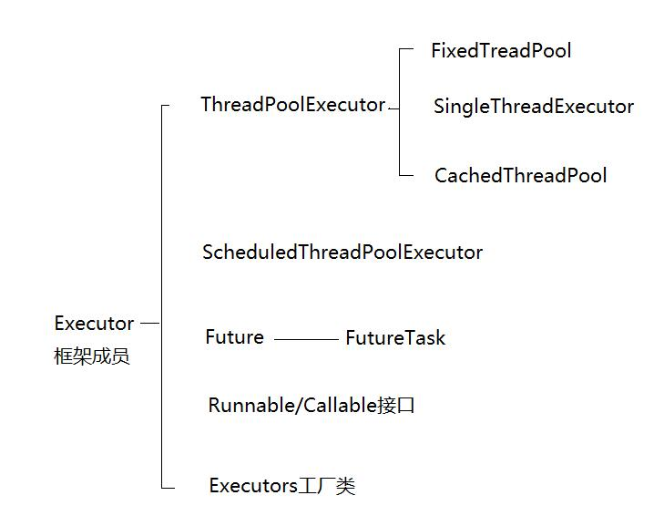

# Java并发-Executor框架

原文：https://blog.csdn.net/tongdanping/article/details/79604637


## 一. 什么是Executor框架？

线程池就是线程的集合，线程池集中管理线程，以实现线程的重用，降低资源消耗，提高响应速度等。线程用于执行异步任务，单个的线程既是工作单元也是执行机制，从JDK1.5开始，为了把工作单元与执行机制分离，Executor框架诞生，它是一个用于统一创建与运行的接口。Executor 框架实现的就是线程池的功能。

## 二. Executor框架结构图解

### 2.1 Executor 框架包含三大部分

1. **任务**。也就是工作单元，包括被执行任务需要实现的接口：Runnable接口或者 Callable接口
2. **任务的执行**。也就是把任务分派给多个线程的执行机制，包括 Executor 接口及继承自 Executor 接口的 ExectorService 接口
3. **异步计算的结果**。包括 Futrue 接口及实现了 Future 接口的 FutureTask 类。

Executor 框架的成员及其关系，可以用以下关系图表示：




### 2.2 Executor 框架的使用示意图



**使用步骤**：

1. 创建 Runnable 并重写 run() 方法或者 Callable 对象并重写 call() 方法：

   ```java
   public class CallableTest implements Callable<String> {
       @Override
       public String call() {
           try {
               String a = "return String";
               return a;
           } catch(Exeption e) {
               e.printStackTrace();
               return "exception";
           }
       }
   }
   ```

   

2. 创建 Executor 接口的实现类 ThreadPoolExecutor 类或者 ScheduledThreadPoolExecutor 类的对象，然后调用其 execute() 方法或者 submit() 方法，把工作任务添加到线程中。如果有返回值，则返回 Future 对象。其中 Callable 对象有返回值，因此使用 submit() 方法。而 Runnable 可以使用 execute() 方法。此外，还可以使用 submite() 方法，只要使用 callable(Runnalbe task) 或者 callable(Runnable task, Object result) 方法把 Runnable 对象包装起来就可以，使用 callable(Runnable task) 方法返回的null，使用 callable(Runnalbe task, Object result) 方法返回 result。

   ```java
   ThreadPoolExecutor tpe = 
       new ThreadPoolExecutor(5, 
                              10,
                              100, 
                              MILLISECONDS, 
                              new ArrayBlockingQueue<Runnable>(5));
   Future<String> future = tpe.sumbit(new CallableTest());
   ```

   

3. 调用 Future 对象的 get() 方法后的返回值，或者调用 Future 对象的 cancel() 方法取消当前线程的执行。最后关闭线程池：

   ```java
   try {
       System.out.println(future.get());
   } catch (Excepton e) {
       e.printStackTrace();
   } finally {
       tpe.shutdown();
   }
   ```

## 三. Executor框架成员



1. ThreadPoolExecutor 实现类：详情参考[这里](./Executor_ThreadPoolExecutor.md)
2. ScheduledThreadPoolExecutor 实现类
3. Future 接口 / FutureTask 实现类
4. Runnable 和 Callable 接口：用于实现线程要执行的工作单元
5. Executors 工厂类：提供了常见配置线程池的方法，因为 ThreadPoolExecutor 的参数众多且意义重大，为了避免配置出错，才有了 Executors 工厂类