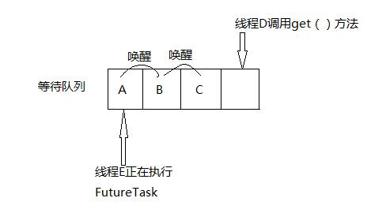

# Executor - FutureTask 类

原文：https://blog.csdn.net/tongdanping/article/details/79630637


## 一. 什么是Future 和 FutureTask？

一直以来，大家都对 FutureTask 这个 Future 不理解，什么叫做“未来的任务”呢？这个 Future 体现在什么地方呢？

FutureTask 的 Future 就源自于它的异步工作机制。如果在主线程中直接写一个函数来执行任务，这是同步的任务，也就是说，必须等待这个函数返回后，主线程才能继续执行接下来的事情。但是，如果这个函数返回的结果对接下来的任务并没有任何的参与（或者说没有任何意义），那么等待函数的返回就是很浪费时间。而 FutureTask 就提供了一个异步的返回结果的机制：当执行一个 FutureTask 的时候，可以接着做别的任务，在将来的某个时间，FutureTask 任务完成后会返回 FutureTask 对象来包装返回的结果，只要调用这个对象的 get 方法即可获得返回值。

当然，多线程中继承 ThreadPoolExecutor 和 实现 Runnable 也可以实现异步工作机制，可是他们没有返回值。这时可以使用 FutureTask 包装 Runnable 或者 Callable 对像，再使用 FutureTask 来执行任务。

Future 接口和其唯一的实现类 FutureTask 类一般用于表示异步计算的结果。Future 接口下提供方法来检查计算是否完成，等待期完成，并检索计算结果。结果如果再计算完成后使用方法 get 进行检索，如果有必要，阻塞，直到准备就绪。取消由 cancel 方法执行，isCancelled 方法用来检测计算是否被取消，isDone 方法用于检测计算是否完成。提供其他方法来确定任务是否正常完成或被取消。

## 二. FutureTask 的使用

根据 FutureTask 被执行的进度，FutureTask 对象可以处于以下 3 种状态：

* **未启动**：创建一个 FutureTask 对象，但没有执行 futureTask.run( )
* **已启动**：处在 funtureTask.run( ) 方法被执行的过程中
* **已完成**：futureTask.run( ) 正常执行结束，或者 futureTask 被取消 (futureTask.cancel( )) ，或者执行 futureTask.run( ) 时抛出异常而异常结束

### 2.1 FutureTask的启动

FutureTask 实现了 Future 接口和 Runnable 接口，因此 FutureTask 对象的执行有两种方式：

1. 交给线程池的 Executor 或者 submit 方法执行：

   ```java
   import java.util.concurrent.*;
   import static java.util.concurrent.TimeUnit.MILLISECONDS;
   
   class Test {
   	public static void main(String[] args) throws 
                         InterruptedException {
           ThreadPoolExecutor tpe = 
               new ThreadPoolExecutor(5, 10,100, 
                   MILLISECONDS, 
                   new ArrayBlockingQueue<Runnable>(5));
   
           // 用FutureTask包装Runnable或者Callable对象
           FutureTask<String> future = 
               new FutureTask<String>(new Callable<String>() {
                   
               @Override
               public String call() {
   				try{
                       String a = "return String";
                       return a;
                   } catch(Exception e){
                       e.printStackTrace();
                       return "exception";
                   }
               }
           });
           
           //交给线程池的Execute或submit方法执行
           tpe.submit(future);
   		try {
               System.out.println(future.get());
           } catch(Exception e){
               e.printStackTrace();
           } finally {
           	tpe.shutdown();
           }
       }
   }
   ```

   

2. 由调用线程直接执行：在调用线程中执行 futureTask.run( ) 方法：

   把上面例子中 ***tpe.submit(future);***  改成 :  ***future.run();***

### 2.2 FutureTask 执行完成后结果的获取

1. 在已经启动的状态调用 futureTask.get( ) 可能会导致调用线程阻塞，直到 futureTask 执行完毕，然后得到返回的 FutureTask 对象，调用 futureTask.get() 获得任务的返回值
2. 在已完成状态下调用 futureTask.get( )，将导致调用线程立即返回（正常完成，得到 FutureTask 对象）或者抛出异常（被取消或者因异常而结束）

### 2.3 futureTask 被取消

1. 在未启动状态调用 futureTask.cancel( ) 会导致该任务**永远不会**再执行
2. 在已启动状态：
   * 调用 futureTask.cancel( true ) 会以中断的方式尝试停止任务，如果该任务不响应中断则无法停止 - *不一定能中断线程执行*
   * 调用 futureTask.cancel( false ) 将不会对正在执行的线程产生影响，也就是说已启动的线程会让它执行完毕
3. 在已完成状态调用 futureTask.cancel( ) 则会返回 false

## 三. FutureTask的实现

**FutureTask 是一个基于 AQS 同步队列实现的一个自定义同步组件**，通过对同步状态  state 的竞争实现 acquire 或者 release 操作。

FutureTask 的内部类 Sync 实现了 AQS 接口，通过对 tryAcquire 等抽象方法的重写和模版方法的调用来实现内部类 Sync 的 tryAcquireShared 等方法，然后聚合 Sync 的方法来实现 FutureTask 的 get、cancel 等方法。

FutureTask 的 get 方法最终会调用 AQS.acquireSharedInterruptibly 方法，这个方法**操作（调用）成功的条件是：同步状态为 RAN 或者 CANCELLED**。也就是说如果这个FutureTask有线程E 正在执行，那么这个 FutureTask 的状态是 RUN，因此 AQS.acquireSharedInterruptibly 方法调用失败，此时调用 get 方法的线程被阻塞，添加到等待队列中（如下图线程D，其中 A、B、C 是已经被阻塞添加到等待队列中的线程）。当前面执行 FutureTask 的线程E 执行完毕，那么以原子方式更新同步状态 state 的值为 RAN，并执行 AQS.release 方法，然后唤醒等待队列中的第一个节点中的线程A，此时线程A 出队列获得同步状态，并原子设置 state 为 RUN，当线程A 执行完毕，把 state 原子更新为 RAN，然后唤醒线程B，以此类推。因此，可以看出对于一个 FutureTask，同一时间只有一个线程执行这个任务。



## 四 FutureTask 使用场景

1. 当一个线程需要等待另一个线程，把某个任务执行完以后它才能继续执行时
2. 有若干线程执行若干任务，每个任务最多只能被执行一次
3. 当多个线程试图执行一个任务，但只能允许一个线程执行此任务，其它线程需要等这个任务被执行完毕以后才能继续执行时