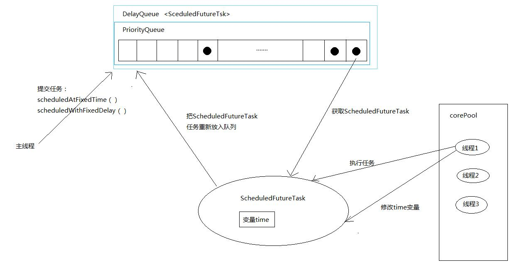

# Executor - ScheduledThreadPoolExecutor

原文：https://blog.csdn.net/tongdanping/article/details/79627491


ScheduledThreadPoolExecutor类继承了ThreadPoolExecutor并实现了ScheduledExecutorService接口。主要用于**在给定的延迟后执行任务或者定期执行任务**。作用类似于java.util包下的Timer类，但是比Timer功能更强大、更灵活，因为Timer只能控制单个线程延迟或定期执行，而ScheduledThreadPoolExecutor对应的是多个线程的后台线程。

### 一. ScheduledThreadPoolExecutor 创建

可以利用Executors工厂类来创建两种ScheduledThreadPoolExecutor：ScheduledThreadPoolExecutor 和 SingleThreadScheduledExecutor。

#### 1.1 ScheduledThreadPoolExecutor

适用于若干个（固定）线程延迟或者定期执行任务，同时为了满足资源管理的需求而需要限制后台线程数量的场景。

```java
ScheduledExecutorService stp = 
    Executors.newScheduledThreadPool(int threadNums);

ScheduledExecutorService stp = 
    Executors.newScheduledThreadPool(int threadNums, 
                                  ThreadFactory threadFactory);
```


#### 1.2 SingleThreadScheduledExecutor

适用于需要单个线程延时或者定期的执行任务，同时需要保证各个任务顺序执行的应用场景。

```java
ScheduledExecutorService stse = 
    Executors.newSingleThreadScheduledExecutor(int threadNums);

ScheduledExecutorService stp = 
    Executors.newSingleThreadScheduledExecutor(int threadNums, 
                                  ThreadFactory threadFactory);
```


### 二. ScheduledThreadPoolExecutor 的实现

通过查看源码，可以发现 ScheduledThreadPoolExecutor 的实现主要是通过把任务封装为 ***ScheduledFutureTask*** 来实现。ScheduledThreadPoolExecutor通过它的***scheduledAtFixedTime( )*** 方法或者 ***scheduledWithFixedDelay( )*** 方法向阻塞队列添加一个实现了 ***RunnableScheduledFutureTask*** 接口的 ***ScheduledFutureTask*** 类对象。

ScheduledFutureTask主要包括3个成员变量：

```java
private final long sequenceNumber;
private long time;
private final long period;
```

* sequenceNumber: 序列号，用于保存任务添加到阻塞队列的顺序
* time: 用于保存该任务将要被执行的具体时间
* period: 周期，用于保存任务执行的间隔周期

此外，ScheduledTreadPoolExecutor的阻塞队列是用 ***DelayQueue*** 实现的，可以实现元素延时 delayTime 后才能获取元素，在 ScheduledThreadPoolExecutor 中，**DelayQueue 内部封装了一个 PriorityQueue，来对任务进行排序**。首先对 time 排序，time小的在前，如果 time 一样，则 sequence 小的在前，也就是说如果time一样，那么先被提交的任务先执行。

因为DelayQueue是一个无界的队列，因此线程池的maximumPoolSize是无效的。ScheduledThreadPoolExecutor的工作流程大致如下：



- 主线程把调用ScheduledFutureTask对象的 scheduledAtFixedRate( ) 或者scheduledWithFixedDelay( ) 方法把 Runnable 或者 Callable 对象包装成ScheduledFutureTask 对象添加到阻塞队列中
- 线程池中的线程1从阻塞队列中获取到期的 ScheduledFutureTask 任务，并执行任务（到期的意思就是当前时间大于time）
- 执行完任务后把成员变量 time 改为下次要执行任务的时间，然后把新的ScheduledFutureTask 任务重新放入阻塞队列中