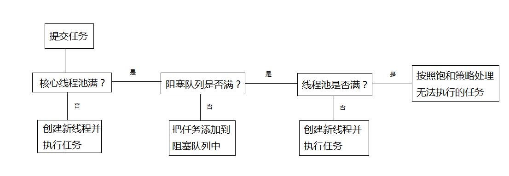
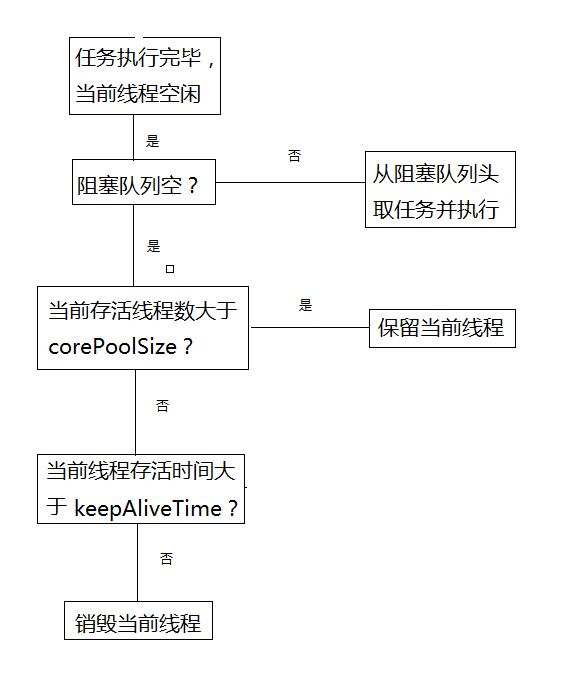

# 线程池的工作原理及使用

原文：https://blog.csdn.net/tongdanping/article/details/79600513


## 一. 线程池概念

### 1.1 什么是线程池

**线程池**是指在初始化一个多线程应用程序过程中创建一个线程集合，然后在需要执行新的任务时重用这些线程而不是新建一个线程。线程池中线程的数量通常完全取决于可用内存数量和应用程序的需求。然而，增加可用线程数量是可能的。线程池中的每个线程都有被分配一个任务，一旦任务已经完成了，线程回到池子中并等待下一次分配任务。

### 1.2 为什么要用线程池

因为创建和销毁线程都是需要时间的，特别是需要创建大量线程的时候，时间和资源的消耗是不可忽略的，而合理的使用线程池中已经创建的线程，可以减少创建和销毁线程而花费的时间和资源。

### 1.3 线程池的优点

* **降低资源消耗**：通过线程的重用可以降低创建和销毁线程花费的时间和资源
* **提高响应速度**：任务到达时，因为利用线程池中已经创建好的线程，可以不用等待线程创建而直接执行任务
* **提高线程的可管理性**：线程池允许开启多个任务而不用为每个线程设置属性（便于管理）；线程池根据当前在系统中运行的进程来优化线程时间片（调优）；线程池可以限制创建线程的数量，如果无限制的创建线程，不仅会消耗资源，还会降低系统的稳定性

## 二. 线程池原理

当向线程池提交一个任务后，线程池处理任务的流程大致如下：

1. 判断**核心线程池**是否满了。如果没有，那么创建线程并执行任务；若满了，那么进入第2步
2. 判断存放任务的**阻塞队列**是否满了。如果没有，那么就把任务添加到阻塞队列中，否则进入第3步
3. 判断线程池是否满了。如果没有，则创建线程并执行任务；如果满了，那么进入饱和策略（RejectionExecutionHandler）
4. 如果核心线程池的线程执行完当前任务，那么立刻从阻塞队列头获取任务并执行；如果队列为空，且当前线程超过了存活时间（keepAliveTime），那么判断当前线程数是否大于核心线程池的最大数（corePoolSize）？如果是，那么销毁当前线程，如果没有，则保留当前线程。因此，当创建的线程数大于核心线程池的最大数（corePoolSize），在所有任务执行完毕以后，线程池最终线程数会回到corePoolSize

流程大致可以通过下图来表达：





**注意**：

为什么要使用“核心线程池 + 阻塞队列 + 线程池” 这样的设计思路呢？

因为创建新线程需要获取全局锁。为了避免频繁的获取全局锁，因此使用了一个阻塞队列来存储任务。如果核心线程池中的线程执行的任务周期短，那么在执行完毕后立刻从阻塞队列中获取任务，就避免了重新创建新线程，使线程的重复利用率提高。然而如果核心线程池中线程执行的任务周期长，使得阻塞队列满了还不断的提交任务，这个时候在创建线程，使用一个核心线程池 + 线程池的方案，是因为核心线程池的容量不能太大，不然阻塞队列的缓存作用就降低了。但是线程池数量如果太小，就限制了并发的线程数，降低了CPU的利用率。

## 三. 线程池的使用

通过 ThreadPoolExecutor 来创建线程池（ThreadPoolExecutor 是 Executor 框架中很重要的一个实现类）。

### 3.1 线程池的创建

```java
ThreadPoolExcutor tpe = new ThreadPoolExecutor(int corePoolSize, 
                                               int maximumPoolSize, 
                                               long keepAliveTime, 
                                               TimeUnit timeUnit, 
                                               BlockingQueue<Runnable> runnableTaskQueue, 
                                               RejectedExecutionHandler handler);
```

初始化参数很多：

* **corePoolSize**：核心线程池大小。如果调用了 prestartAllCoreThread() 方法，那么线程池会提前创建并启动所有基本线程

* **maximumPoolSize**：线程池大小。需要大于等于 corePoolSize

* **keepAliveTime**：线程空闲后，线程存活时间。如果任务多，任务周期短，可以调大 keepAliveTime，提高线程利用率

* **timeUnit**：存活时间的单位，有天（DAYS）、小时(HOURS)、分（MINUTES）、秒（SECONDS）、毫秒（MILLISECONDS）、微秒（MICROSECONDS）、纳秒（NANOSECONDS）

* **runnableTaskQueue**：阻塞队列。可以使用ArrayBlockingQueue，LinkedBlockingQueue，SynchronousQueue、PriorityBlockingQueue

* **handler**：饱和策略的句柄。当线程池满了的时候，任务无法得到处理，这时需要饱和策略来处理无法完成的任务。饱和策略中有4种处理策略：

  * **AbortPolicy**：默认策略，直接抛出异常
  * **CallerRunsPolicy**：只是用调用者所在线程来运行任务
  * **DiscardOldestPolicy**：丢弃队列中最老的任务，并执行当前任务
  * **DiscardPolicy**：不处理，直接把当前任务丢弃

  当然也可以自定义饱和策略，需要实现 RejectedExecutionHandler 接口，比如记录日志或者持久化不能存储的任务等。

### 3.2 向线程池提交任务

提交任务的两种方法：execute() 和 submit()

#### 3.2.1 execute

execute 用于**提交没有返回值的任务**，所以无法判断任务是否被线程执行过：

```java
import java.util.concurrent.ThreadPoolExecutor;
import java.util.concurrent.ArrayBlockingQueue;
import static java.util.concurrent.TimeUnit.MILLISECONDS;

class Test {
    public static void main(String[] args) throws InterruptedException {
        ThreadPoolExecutor tpe = 
            new ThreadPoolExecutor(
               5, 10, 100, 
               MILLISECONDS, 
               new ArrayBlockingQueue<Runnable>(5));
        // execute 用于提交没有返回值的任务
        tpe.execute(new Thread(new Runnable(){
            @override
            public void run() {
                try {
                    System.out.println("Thread 1 execute work");
                } catch(Exception e) {
                    e.printStackTrace();
                }
            }
        }));
        tpe.shutdown();
    }
}
```

 

#### 3.2.2 submit

submit 用于**需要返回值的对象，返回一个 Future 对象，可以通过 future 对象判断任务是否被线程执行**。可以通过 future 对象的 get() 方法获取返回值。 get() 方法会阻塞当前线程直到 future 对象被返回，也可以调用 get( long timeout, TimeUnit unit) 来实现由等待时间的获取返回值。如果超时仍没有返回值，则立刻返回，这时候任务可能没有执行完成。

```java
import java.unitl.concurrent.Callable;
import java.util.concurrent.ThreadPoolExecutor;
import java.util.concurrent.ArrayBlockingQueue;
import static java.util.concurrent.TimeUnit.MILLISECONDS;
import java.util.concurrent.FutureTask;
import java.util.concurrent.Future;

class Test {
    public static void main(String[] args) throws InterruptedException {
        ThreadPoolExecutor tpe = 
            new ThreadPoolExecutor(
               5, 10, 100, 
               MILLISECONDS, 
               new ArrayBlockingQueue<Runnable>(5));
        
        Future<String> future = 
            tpe.submit(new Callable<String>(){
            @override
            public String call() {
                try {
                    String a = "return String";
					return a;
                } catch(Exception e) {
                    e.printStackTrace();
                    return "exception";
                }
            }
        });
        try {
            System.out.println(future.get());
        }catch(Exception e) {
            e.printStackTrace();
        }finally{
        	tpe.shutdown();
        }
    }
}
```


### 3.3 关闭线程池

可以通过 shutdown( ) 或者 shutDownNow( ) 来关闭线程池。

原理：遍历线程池中的线程，逐个调用线程的 interrupt( ) 方法来中断线程，所以不响应中断的线程可能永远无法终止

1. shutDown:把线程池的状态设置为SHUTDOWN，然后中断所有没有正在执行任务的线程，而已经在执行任务的线程继续执行直到任务执行完毕
2. shutDownNow：把当前线程池状态设为STOP，尝试停止所有的正在执行或者暂停的线程，并返回等待执行的任务的列表

在调用了 shutDown 或者 shutDownNow 后，调用 isShutDown( ) 返回true；当所有任务都关闭后，调用 isTerminaed() 方法返回true（注意关闭线程池和所有线程关闭是不同的）。

## 四. 线程池的合理配置

1. **CPU 密集型**：线程数配置尽可能的少，比如配置 $N_{cpu} + 1$ 个。可以通过 Runtime.getRuntime().avaliableProcessors( ) 方法获得当前设备的CPU数量
2. **IO密集型**：需要**尽可能多线程数**，比如配置 $2 * N_{cpu}$ 个。因为IO处理时线程阻塞的时间很长，导致CPU空闲时间很长，多一点线程可以提高CPU利用率
3. **混合型任务**：如果可以拆分，最好拆分成 “CPU密集型任务 + IO密集型”任务，只要这两个拆分后的任务执行时间相差没有太大，那么拆分后的吞吐量将高于串行执行的吞吐量，如果时间相差太大，就没有必要分解
4. **优先级不同的任务**：使用PriorityQueue作为阻塞队列。（如果一直有优先级高的任务进来，可能导致优先级低的任务无法执行）
5. **执行时间不同的任务**：可以交给不同规模的线程池来执行；或者使用PriorityQueue 作为阻塞队列，把执行时间短的任务优先级设置高一点，让时间短的任务先执行
6. **建议使用有界队列**，这样可以保证系统的稳定性，如果队列时无界的，那么一直有任务进来就一直往阻塞队列添加节点，可能导致内存溢出