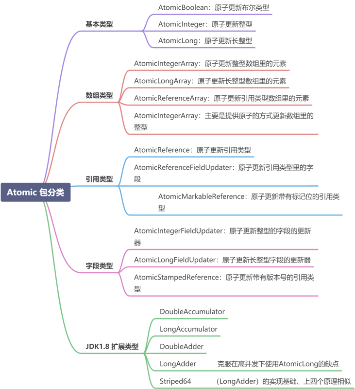
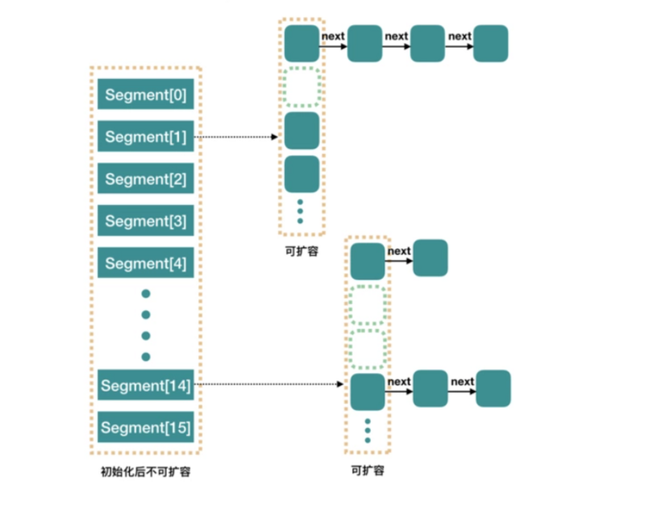
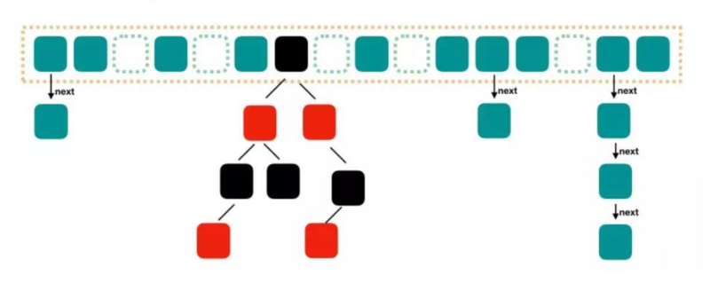
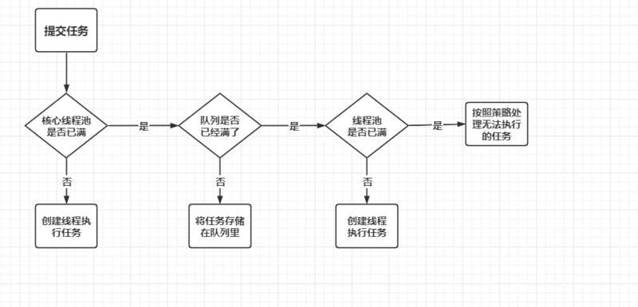
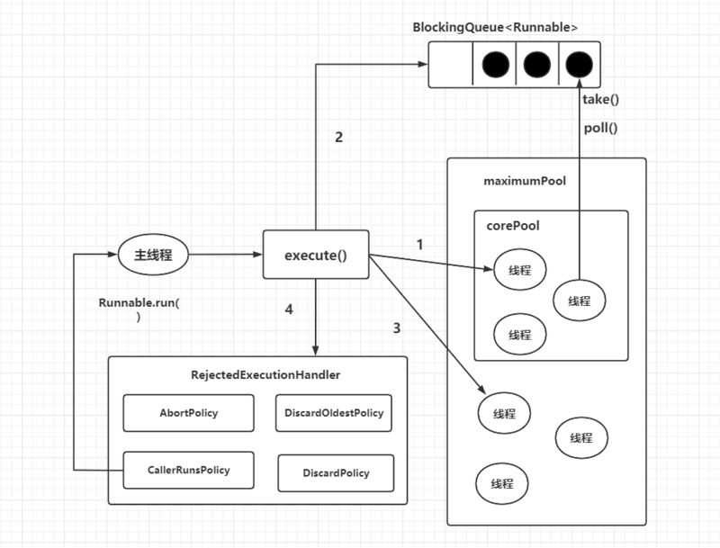

# JUC 面试题

原文：https://www.toutiao.com/a6888560122751091212/

### 什么是 CAS？

CAS（Compare And Swap），指比较并交换。CAS算法 CAS (V, E, N) 包含 3 个参数：V 表示要更新的变量， E 表示预期的值， N 表示新值。 而且，仅在 V 值等于 E 值时，才会将 V 值设置为 N；如果 V 值和 E 值不同，则说明已经有了其他线程做了更新，当前线程什么都不做。最后，CAS 返回当前 V 的真实值。**Concurrent 包下所有类**底层都是依靠 CAS 操作来实现的。而 ***sun.misc.Unsafe*** 提供了一系列 CAS 操作。

### CAS 有什么缺点？

* ABA 问题
* 自旋问题
* 范围不能灵活控制

### 对 CAS 中的 ABA 产生有什么解决方案？

首先，什么是 ABA问题呢？线程 1 从内存的 V 位置取出 A，然后线程 2 也从内存中取出 A，并将 V 位置的数据首先改为 B，接着又将 V 位置的数据修改为 A。线程 1 在进行 CAS 操作时会发现内存中依然是 A，线程 1 操作成功。尽管从线程 1 的角度来说， CAS 操作是成功的，但是该过程中其实 V 位置的数据发生了变化，线程1 没有感知到罢了。这在某些场景下可能会出现过程数据不一致的问题。

要解决这个问题，可以通过“版本号（version）”的方式来解决。在 atomic 包中提供了 AtomicStampedReference 这个类，它是专门用来解决 ABA 问题的。

### CAS 自旋导致的问题？

由于单次 CAS 不一定能执行成功，所以 CAS 往往是配合着循环来实现的。有的时候甚至是死循环，不停的进行重试，直到线程竞争不激烈的时候，才能修改成功。

CPU 资源也是一直在被消耗的，这会对性能产生很大的影响。所以需要根据实际情况来选择是否使用CAS。在高并发的场景下，通常 CAS 的效率是不高的。

### CAS 范围不能灵活控制

不能灵活控制线程安全的范围。只能针对某一个，而不是多个共享变量的，不能针对对个共享变量同时进行 CAS 操作，因为这多个变量之间是独立的，简单的把原子操作组合到一起，并不具备原子性。

### 什么是 AQS？

AQS，AbstractQueuedSynchronizer ，抽象同步队列。它是实现同步器的基础组件，并发包中锁的底层就是使用 AQS 实现的。AQS 定义了一套多线程访问共享资源的同步框架，学多同步类的实现都依赖于它。例如，常用的 Synchronized、ReentrantLock、ReentrantReadWriteLock、Semaphore、CountDownLatch 等。该框架下的锁会先尝试以 CAS 乐观锁去获取锁，如果获取不到，则会转为悲观锁（如 ReentrantLock）

### AQS共享资源的方式

* 独占式：只有一个线程能执行，具体的Java实现有 ReentrantLock
* 共享式：多个线程可同时执行，具体的Java实现有Semaphore和CountDownLatch

### Atomic 原子更新

Java 从 JDK1.5 开始提供的

java.util.concurrent.atomic 包，方便程序员在多线程环境下，无锁地进行原子操作。在 Atomic 包里一共有 12 个类，四种原子更新方式，分别是：原子更新基本类型、原子更新数组、原子更新引用、原子更新字段。JDK1.8 后又新增了几个原子类。如下图：

常用的 AtomicLong 方法

* long getAndIncrement( )：以原子方式将当前值加1，返回**旧值** （即：i++）
* long incrementAndGet( )：以原子方式将当前值加1 ，返回**新值**（即：++i）
* long getAndDecrement()：以原子方式将当前值减1，返回**旧值**（即：i--）
* long decrementAndGet()：以原子方式将当前值减1，返回**新值**（即：--i）
* long addAndGet(int delta)：以原子方式将输入的数值与实例中的值（AtomicLong 里的 value）相加，并返回结果

### AtomicInteger 和 Synchronized 的异同点

#### 相同点

* 都是线程安全

#### 不同点

* **原理不同**

  synchronized 背后的是 monitor 锁。在执行同步代码之前，需要首先获取到 monitor 锁，执行完毕后，再释放锁。 而原子类，线程安全的原理是利用 CAS 操作

* **适用范围不同**

  原子类使用范围是比较局限的。一个原子类仅仅是一个对象，不够灵活。而 Sychronized 的使用范围就要广泛很多。比如说 Synchronized 既可以修饰一个方法，又可以修饰一段代码。相当于可以根据需要，非常灵活地控制应用范围

* **控制粒度不同**

  原子变量的粒度是比较小的。它可以把竞争范围缩小到变量级别。通常情况下，synchronized 锁的粒度都要大于原子变量的粒度

* **性能不同**

  synchronzied 是一种典型的悲观锁，而原子类使用的是乐观锁

### 原子类 与 Volatile 的异同

* 原子类，解决原子性问题
* volatile，解决可见性问题

### ConcurrentHashMap JDK1.7 vs 1.8

#### JDK 1.7 

JDK1.7 中的 ConcurrentHashMap 内部进行了 Segment 分段，Segment 继承了 ReentrantLock，可理解为一把锁，各个 Segment 之间都是相互独立上锁的，相互不影响。

相比于之前的 Hashtable，每次操作都需要把整个对象锁住而言，大大提高了并发效率。因为它的锁与锁之间是相互独立的，而不是整个对象只有一把锁。

每个Segment的底层数据结构与 HashMap 相似，仍然是数组和链表组成的拉链法结构。默认有 0 ～ 15 共 16 个 Segment，所以最多可以同时支持 16 个线程并发操作（操作分别分布在不同的 Segment 上）。16 这个默认值可以在初始化的时候设置成其他值，**但是一旦确认初始化之后，是不可以扩容的**。

#### JDK1.8

图中的节点有三种类型：

* 第一种是最简单的，空着的位置代表当前还没有元素来填充
* 第二种就是和 HashMap 非常类似的拉链法结构，在每个槽中会首先填入第一个节点，但是后续如果计算出相同的 hash 值，就用链表的形式往后进行延伸
* 第三种结构就是红黑树结构。这是 Java 7 的 ConcurrentHashMap 中所没有的结构，在此之前，大家应该很少接触这种数据结构

链表长度大于某一个阈值（默认是8），满足容量从链表的形式转化为红黑树的形式。

红黑树是每个节点都带有颜色属性的二叉查找树，颜色为红色或者黑色，红黑树的本质是对二叉查找树BST 的一种平衡策略，可以理解为是一种平衡二叉查找树，查找效率高，会自动平衡，防止极端不平衡从而影响查找效率的情况发生，红黑树每个节点要么是红色，要么是黑色，但**根节点永远是黑色**。

### ConcurrentHashMap的 get 过程

* 计算 Hash 值，并由此值找到对应的槽点
* 如果数组是空的或者该位置是 null，那么直接返回 null
* 如果该位置的节点刚好就是对应的值节点，直接返回该节点的值
* 如果该位置节点是红黑树或者正在扩容，就用 find 方法继续查找
* 否则就是链表，进行遍历查找

### ConcurrentHashMap 的 put 过程

* 

### 什么是阻塞队列？

阻塞队列（BlockingQueue）是一个支持两个附加操作的队列。这两个附加的操作支持阻塞的插入和移除方法。

* 支持阻塞的插入方法：当队列满时，列表会阻塞插入元素的线程，直到队列不满
* 支持阻塞的移除方法：队列为空时，获取元素的线程会等待队列变为非空

阻塞队列常用于生产者和消费者的场景。生产者是向队列里添加元素的线程，消费者是从队列里取元素的线程。阻塞队列就是生产者用来存放元素，消费者就是用来获取元素的容器。

### 线程池

#### 线程池的优势

* 降低资源消耗：
* 提高响应速度：
* 提高线程的可管理性：

#### 线程池的实现原理

当提交一个新任务到线程池时，线程池的处理流程如下：

* 线程池判断核心线程池里的线程是否都在执行任务。如果不是，就创建一个新的工作线程来执行任务；如果核心线程池里的线程都在执行任务，则进入下个流程
* 线程池判断工作队列是否已经满了。如果工作队列没有满，则将新提交的任务存储在这个工作队列里；如果工作队列满了，则进入下个流程
* 线程池判断线程池的线程是否都处于工作状态。如果没有，则创建一个新的工作线程来执行任务；如果已经满了，则交给饱和策略来处理这个任务

ThreadPoolExecutor执行execute()方法的示意图 如下:

ThreadPoolExecutor 执行 execute 方法，分下面四种情况：

1. 如果当前运行的线程少于 corePoolSize，则创建新线程来执行任务（注意：执行这一步，需要获取全局锁）
2. 如果运行的线程等于或多于 corePoolSize，则将任务加入 BlockingQueue
3. 如果无法将任务加入 BlockingQueue（队列已满），则创建新线程来处理任务（注意：执行这一步需要获取全局锁）
4. 如果创建新线程将使当前运行的线程超出 maximumPoolSize，任务将被拒绝，并调用 RejectedExcutionHandler.rejectedExecution( ) 方法

ThreadPoolExecutor 采取了上述步骤的总体设计思路，是为了在执行 execute( ) 方法时，尽可能地避免全局锁。在 ThreadPoolExecutor 完成预热之后（当前运行的线程数大于等于 corePoolSize），几乎所有的 execute( ) 方法调用都是执行步骤2，而步骤2 步需要获取全局锁。