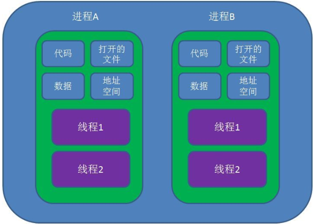

# 进程、线程与协程

原文：https://www.jianshu.com/p/6dde7f92951e

## 一. 什么是进程和线程

**进程**是应用程序的启动实例，进程拥有**代码和打开的文件资源、数据资源、独立的内存空间**。

**线程** 从属于进程，是程序的实际执行者。一个进程至少包含一个主线程，也可以有更多的子线程。线程拥有自己的**栈空间**。

对操作系统而言，线程是最小的**执行单元**，进程是最小的**资源管理单元**。无论是**进程还是线程，都是由操作系统所管理的**。

### 1.1 线程的状态

线程具有 **5** 种状态：初始化、可运行、运行中、阻塞、销毁

### 1.2 线程间协作

最经典的例子就是***生产者/消费者***模式，即若干个生产者线程向队列中生产数据，若干个消费者线程从队列中消费数据

### 1.3 生产者/消费者的性能问题是什么

* 涉及到同步锁
* 涉及到线程阻塞状态和可运行状态之间的切换
* 涉及到线程上下文切换

## 二. 什么是协程

协程（Coroutines）是一种比线程更加轻量级的存在。正如一个进程可以拥有多个线程一样，一个线程可以拥有多个协程。

协程不是被操作系统内核所管理的，而是**完全由程序所控制，也就是在用户态执行**。这样带来的好处是，性能大幅提升，因为不会像线程切换那样消耗资源。

协程不是进程也不是线程，而**是**一个**特殊的函数**。**这个函数可以在某个地方挂起，并且可以重新在挂起处继续执行**。所以说，协程和进程、线程相比，并不是一个维度的概念。

一个进程可以包含多个线程，一个线程也可以包含多个协程。简单而言，一个线程内可以由多个这样的特殊函数在运行，但是有一点必须明确：**一个线程的多个协程的运行时串行的**。如果是多核CPU，多个进程或一个进程内的多个线程是可以并行运行的，但是一个线程内协程却**绝对**是串行，无论CPU有多少个核。毕竟协程虽然是一个特殊的函数，但仍然是一个函数。一个线程内可以运行多个函数，但是这些函数都是串行运行的。当一个协程运行时，其它协程必须挂起。

### 2.1 进程、线程、协程三者对比

* 协程既不是进程也不是线程，**协程仅仅是一个特殊的函数**，协程它进程和进程不是一个维度的
* 一个进程可以包含多个线程，一个线程可以包含多个协程
* 一线程内的多个协程虽然可以切换，但是多个协程是串行执行的，只能在一个线程内运行，没法利用CPU多核能力
* 协程与进程一样，切换时存在上下文切换问题的

### 2.2 上写文切换

* **进程**的**切换者是操作系统**（OS），切换时机是根据操作系统自己的切换策略，用户是无感知的。**进程的切换内容包括：也全局目录、内核栈、硬件上下文，切换内容保存在内存中**。进程切换过程是由“用户态到内核态，再到用户态”的方式，切换效率低下
* **线程**的**切换者是操作系统**（OS），切换时机是根据操作系统自己的切换策略，用户无感知。**线程的切换内容包括：内核栈和硬件上下文，切换内容在内核栈中**。线程切换的过程是由“用户态到内核态再到用户态”，切换效率中等
* 协程的切换者是用户（编程者或者应用），切换时机是用户自己的程序所决定的。**协程的切换内容是：硬件上下文、切换内存保存在用户自己的变量（用户栈或者堆）中**。协程的切换过程只有用户态，没有陷入内核态，因此切换效率高。

