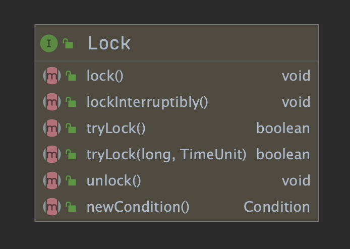

# ReentrantLock的4个使用注意事项

原文：https://www.toutiao.com/a6995904739191882252/?log_from=8554d414f797f_1631071151301


JDK 1.5 之前 synchronized 的性能是比较低的，但在 JDK 1.5 中，官方推出一个重量级功能 Lock，一举改变了 Java 中锁的格局。JDK 1.5 之前当谈到锁时，只能使用内置锁 synchronized，但如今锁的实现又多了一种显式锁 Lock


## 1 Lock简介

Lock 是一个顶级接口，它的所有方法如下图所示：



它的子类如下：


通常使用 ReentrantLock 来定义其实例，它们之间的关系如下图所示：


## 2 ReentrantLock 使用

先来看看 ReentrantLock 的基础使用：

```java
public class LockExample {
  // 创建锁对象
  private final ReentrantLock lock = new ReentrantLock();
  public void method() {
    lock.lock(); // 加锁
    try {
      ... // biz codes ...
    } finally {
      lock.unlock(); // 释放锁
    }
  }
}
```

ReentrantLock 在创建之后，有两个关键性的操作：

- 加锁操作：lock()
- 释放锁操作：unlock()

## 3 ReentrantLock 的注意事项

### 3.1 ReentrantLock 默认为非公平锁

很多人都会认为 ReentrantLock 默认实现是公平锁，其实并非如此，默认情况是**非公平锁**，主要是出于性能方面的考虑。如下面代码所示：

```java
import java.util.concurrent.locks.ReentrantLock;

public class LockExample {
  // 创建锁对象
  private static final ReentrantLock lock = new ReentrantLock();
  
  public static void main(String[] args) {
    // 定义线程任务
    Runnable runnable = new Runnable() {
      @Override
      public void run() {        
        lock.lock(); // 加锁
        try {
          // 打印执行线程的名字
          System.out.println("线程:"Thread.currentThread().getName());
        } finally {
          lock.unlock(); // 释放锁
        }
      }
    };
    // 启动多个线程
    for (int i=0;i < 10; i++){
      new Thread(runnable).start();
    } 
  }
}
```

上述程序运行的结果：


从运行的结果来看，ReentrantLock 默认情况下为非公平锁。因为线程的名称是根据创建的先后顺序递增的，所以如果是公平锁，那么线程的执行应该是有序递增的，但从上述的结果可以看出，线程的执行和打印是无序的，这说明 ReentrantLock 默认情况下为非公平锁。

如果要让 ReentrantLock 使用公平锁，只需要在创建 ReentrantLock 时，设置一个 true 的构造参数即可。更改处的代码如下：

```java
  // 创建锁对象
  private static final ReentrantLock lock = new ReentrantLock(true);
```

再次执行，得到如下的结果：


从上述结果可以看出，当我们显式的给 ReentrantLock 设置了 true 的构造参数之后，ReentrantLock 就变成了公平锁，线程获取锁的顺序也变成有序的了。

从 ReentrantLock 的源码也可以看出，它究竟是公平锁还是非公平锁，其部分源码如下：

```java
public ReentrantLock() {
  sync = new NonfairSync();
}

public ReentrantLock(boolean fair) {
  sync = fair ? new FairSync() : new NonfairSync();
}
```

### 3.2 在 finally 中释放锁

**使用 ReentrantLock 时一定要记得释放锁，否则就会导致该锁一直被占用，其他使用该锁的线程则会永久的等待下去**，所以在使用 ReentrantLock 时，一定要在 finally 中释放锁，这样就可以保证锁一定会被释放。

#### 3.2.1 反例

```java
import java.util.concurrent.locks.ReentrantLock;

public class LockExample {
    // 创建锁对象
    private static final ReentrantLock lock = new ReentrantLock();
    public static void main(String[] args) {
        // 加锁操作
        lock.lock();
        System.out.println("Hello,ReentrantLock.");
        // 此处会报异常,导致锁不能正常释放
        int number = 1 / 0;
        // 释放锁
        lock.unlock();
        System.out.println("锁释放成功!");
    }
}
```

以上程序执行的结果如下：


从上述结果可以看出，当出现异常时锁未被正常释放，这样就会导致其他使用该锁的线程永久的处于等待状态。

#### 3.2.2 正例

```java
import java.util.concurrent.locks.ReentrantLock;

public class LockExample {
    // 创建锁对象
    private static final ReentrantLock lock = new ReentrantLock();
    public static void main(String[] args) {
      // 加锁操作
      lock.lock();
      try {
        System.out.println("Hello,ReentrantLock.");
        // 此处会报异常,导致锁不能正常释放
        int number = 1 / 0;
        // 释放锁
      } finally{
        lock.unlock();
        System.out.println("锁释放成功!");
    }
}
```

以上程序的执行结果如下：


从上述结果可以看出，虽然方法中出现了异常情况，但并不影响 ReentrantLock 锁的释放操作，这样其他使用此锁的线程就可以正常获取并运行了。

### 3.3 锁不能被释放多次

lock 操作的次数和 unlock 操作的次数必须一一对应，且**不能出现一个锁被释放多次的情况**，因为这样就会导致程序报错。

#### 3.3.1 反例

一次 lock 对应了两次 unlock 操作，导致程序报错并终止执行，示例代码如下：

```java
import java.util.concurrent.locks.ReentrantLock;

public class LockExample {
    // 创建锁对象
    private static final ReentrantLock lock = new ReentrantLock();

    public static void main(String[] args) {
        // 加锁操作
        lock.lock();
        
        // 第一次释放锁
        try {
            System.out.println("执行业务 1~");
            // 业务代码 1......
        } finally {
            // 释放锁
            lock.unlock();
            System.out.println("锁释锁");
        }

        // 第二次释放锁
        try {
            System.out.println("执行业务 2~");
            // 业务代码 2......
        } finally {
            // 释放锁
            lock.unlock();
            System.out.println("锁释锁");
        }
        // 最后的打印操作
        System.out.println("程序执行完成.");
    }
}
```

以上程序的执行结果如下：


从上述结果可以看出，执行第 2 个 unlock 时，程序报错并终止执行了，导致异常之后的代码都未正常执行。

### 3.4 Lock不能在 try 代码块内

在使用 ReentrantLock 时，需要注意不要将加锁操作放在 try 代码中，这样会导致未加锁成功就执行了释放锁的操作，从而导致程序执行异常。

#### 3.4.1 反例

```java
import java.util.concurrent.locks.ReentrantLock;

public class LockExample {
    // 创建锁对象
    private static final ReentrantLock lock = new ReentrantLock();

    public static void main(String[] args) {
        try {
            // 此处异常
            int num = 1 / 0;
            // 加锁操作
            lock.lock();
        } finally {
            // 释放锁
            lock.unlock();
            System.out.println("锁释锁");
        }
        System.out.println("程序执行完成.");
    }
}
```

以上程序的执行结果如下：


从上述结果可以看出，如果将加锁操作放在 try 代码中，可能会导致两个问题：

1. 未加锁成功就执行了释放锁的操作，从而导致了新的异常；
2. 释放锁的异常会覆盖程序原有的异常，从而增加了排查问题的难度。

## 总结

本文介绍了 Java 中的显式锁 Lock 及其子类 ReentrantLock 的使用和注意事项，Lock 在 Java 中占据了锁的半壁江山，但在使用时却要注意 4 个问题：

1. 默认情况下 ReentrantLock 为非公平锁而非公平锁；
2. 加锁次数和释放锁次数一定要保持一致，否则会导致线程阻塞或程序异常；

1. 加锁操作一定要放在 try 代码之前，这样可以避免未加锁成功又释放锁的异常；
2. 释放锁一定要放在 finally 中，否则会导致线程阻塞。