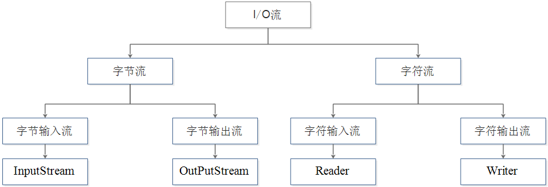
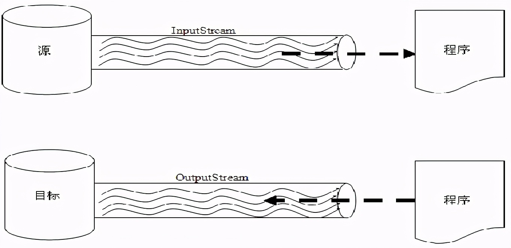
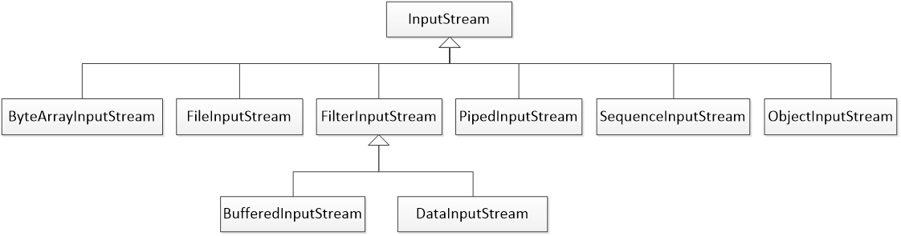
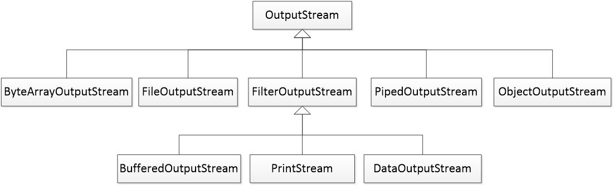
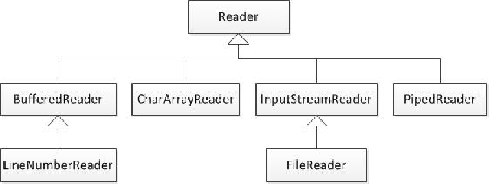
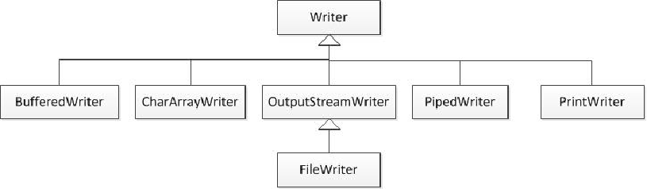
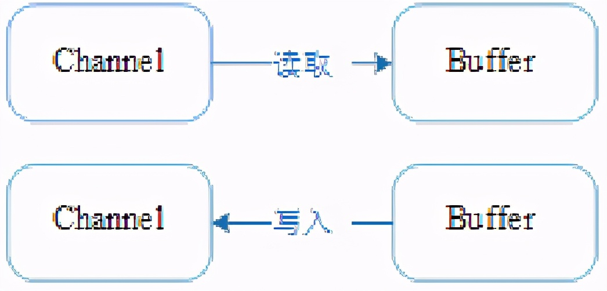

# Java I/O 流知识体系

原文：https://www.toutiao.com/a6998437404717908510/


## 1 I/O，

​        I/O (Input/Output) 流，是Java实现输入/输出的基础，他可以方便地实现数据的输入和输出操作。

### 1.1 同步与异步、阻塞与非阻塞

* **同步**：一个任务在完成之前不做其他操作，必须等待
* **异步**：一个任务在完成之前，可以进行其他操作
* **阻塞**：是相对于CPU来说的，挂起当前线程，不能做其他操作，只能等待
* **非阻塞**：无需挂起当前线程，可以去执行其他操作

### 1.2 什么是BIO

​        **BIO，同步并阻塞**，**服务器实现模式为：一个连接一个线程**，即客户端有连接请求时，服务器端就需要启动一个线程进行处理，没有处理完之前，此线程不能做其他操作（如果是单线程的情况下，传输的文件很大怎么办？），对于多连接，可以通过连接迟机制来改善。**BIO方式适用于连接数目比较小且固定的架构**，这种方式对服务器资源要求比较高，并发局限于应用中，JDK1.4之前的唯一选择。但是这种程序直观，易于理解。

### 1.3 什么是NIO

​        **NIO，同步非阻塞**，**服务器实现模式为：一个连接一个线程**，即客户端发送的连接请求都会注册到**多路复用器**上，多路复用器轮询到连接有 **I/O** 请求时才启动一个线程进行处理。**NIO 方式适用于连接数目多且连接比较短（轻操作）的架构**，比如聊天服务器，并发局限于应用中，编程比较复杂，JDK1.4后开始支持。

### 1.4 什么是AIO

​        **AIO，异步非阻塞**，**服务器实现模式为一个有效请求一个线程**，客户端的 I/O 请求都是由操作系统先完成了再通知服务器应用去启动线程进行处理。**AIO 方式适用于连接数目多且连接比较长（重操作）的架构**，比如相册服务器，充分调用操作系统参与并发操作，编程比较复杂，JDK1.7之后开始支持。

​        AIO 属于 NIO 包中的类实现，其实 IO 主要分为 BIO 和 NIO，AIO 只是附加品，解决 I/O 不能异步的实现。在以前，很少有 Linux 系统支持 AIO， Windows 的 IOCP 就是该 AIO 模型。但是现在的服务器一般都支持 AIO 操作。

### 1.5 I/O 流分类

1. **字节流**和**字符流**

   根据流操作的数据单位的不同，可以分为字节流和字符流

2. **输入流**和**输出流**

   根据流传输方向的不同，又可以分为输入流和输出流

3. **节点流**和**处理流**

   根据流的功能不同，可以分为节点流和处理流

### 1.6 I/O流结构

​        Java 中的 I/O 流主要是定义在 java.io 包中，其中有4个类为流的顶级类，分别是 ***InputStream*** 和 ***OutputStream***、***Reader*** 和 ***Writer***。



#### 1.6.1 说明

​        *InputStream* 和 *OutputStream* 是字节流，而 *Reader* 和 *Writer* 是字符流；

​       *InputStream* 和 *Reader* 是输入流，而 *OutputStream* 和 *Writer* 是输出流；

## 2 字节流

​        在计算机中，无论是文本、图片、音频还是视频，所有文件都是以二进制（字节）形式存在的，I/O流中针对字节的输入/输出提供了一系列的流，统称为字节流。

### 2.1 说明

​        字节流是程序中最常用的流。

​        在JDK中，所有的字节输入流都继承自 *InputStream*，所有的字节输出流都继承自 *OutputStream*。

### 2.2 InputStream 和 outputSteam示意图



​        InputStream 被看成一个输入管道，OutputSteam 被看成一个输出管道，数据通过 InputSteam 从源设备输入到程序，通过 OutputStream 从程序输出到目标设备，从而实现数据的传输。

### 2.3 InputStream 的常用方法

| 方法声明                             | 功能描述                                                     |
| ------------------------------------ | ------------------------------------------------------------ |
| int read()                           | 从输入流读取**一个8位的字节**，把它转换为 0 ~ 255 之间的整数，并返回这一整数。**当没有可用字节时，返回 -1** |
| int read(byte[] b)                   | 从输入流读取若干字节，把它们保存到参数 b 指定的字节数组中，返回的整数表示读取字节的数目 |
| int read(byte[] b, int off, int Len) | 从输入流读取若干字节，把它们保存到参数 b 指定的字节数组中，off 指定字节数组开始保存数据的起始下标，len 表示读取的字节数目 |
| void close()                         | 关闭此输入流并释放与该流关联的所有系统资源                   |

说明：

* 前三个 read 方法都是用来读数据的，分按字节读取和按字节数组读取
* 进行 I/O 操作时，应该调用 close 方法关闭流，从而释放当前 I/O 流所占的系统资源

### 2.4 OutputStream 的常用方法

| 方法声明                               | 功能描述                                                   |
| -------------------------------------- | ---------------------------------------------------------- |
| void write()                           | 向输出流写入**一个字节**                                   |
| void write(byte[] b)                   | 把参数 b 指定的字节数组的所有字节写到输出流                |
| void write(byte[] b, int off, int Len) | 将制定 byte 数组中从偏移量 off 开始的 len 个字节写入输出流 |
| void flush()                           | 刷新此输出流并强制写出所有缓冲的输出字节                   |
| void close()                           | 关闭此输出流并释放与该流关联的所有系统资源                 |

说明：

* 前三个 write 方法都是用来写数据的，分按字节写入和按字节数组写入
* flush 方法用来将当前输出流缓冲区（通常是字节数组）中的数据强制写入到目标设备，此过程称为**刷新**
* close 方法是用来关闭流并释放与当前IO流相关的系统资源

### 2.5 InputStream 与 OutputStream 的继承体系

#### 2.5.1 InputStream



#### 2.5.2 OutputStream



### 2.6 字节流读写文件

​        针对文件的读写操作，JDK提供了两个类：FileInputStream 和 FileOutputStream。

​        FileInputStream 是 InputStream 的子类，它是操作文件的字节输入流，专门用于读取文件中的数据。从文件读取数据是重复的操作，因此需要通过循环来实现数据的持续读取。

#### 2.6.1 读取文件示例

​        本示例用于读取test.txt文件的内容

```java
...
FileInputStream in = new FileInputStream("test.txt");
int b = 0;
while( (b = in.read()) != -1) {
  System.out.println(b);
}
in.close();
```

注意：

​        在读取文件时，必须保证文件在相应的目录下存在，并且可读，否则会抛出FileNotFoundException。

#### 2.6.2 写入文件示例

​        本示例把字符串内容写入文件 out.txt：

```java
...
FileOutputStream out = new FileOutputStream("out.txt");
String str = "hello";
out.write(str.getBytes());
out.close();
```

注意：

​        通过 FileOutputStream 向一个已经存在的文件中写入数据，该文件中的数据首先会被清空，再写入新的数据。若希望在已经存在的文件内容之后追加新内容，则可以使用构造函数 *FileOutputStream(String fileName, boolean append)* 来创建文件输出流对象，并把append参数的值设置为 *true*。如：

```java
...
FileOutputStream out = new FileOutputStream("out.txt", true);
String str = " world";
out.write(str.getBytes());
out.close();
```

执行后，out.txt的内容为： hello world

#### 2.6.3 close 的处理

​        I/O 流在进行数据读写操作时会出现异常，为了保证 I/O 流的 close() 方法一定被执行，释放占用的系统资源，通常会将关闭流的操作写在 finally 代码块中：

```java
finally {
  try {
    if ( in != null) in.close();  
  } catch(Exception e) {
    e.printStackTrace();
  }
  try {
    if (out != null) out.close();
  } catch(Exception e) {
    e.printStackTrace();
  }
}
```

### 2.7 文件拷贝

​        I/O 流通常都是成对出现，即输入流和输出流一起使用。例如文件拷贝需要通过输入流读取源文件中的数据，并通过输出流将数据写入新文件。看一下示例：

```java
FileInputStream in = new FileInputStream("sources/src.jpg");
FileOutputStream out = new FileOutputStream("target/dest.jpg");
int len = 0;
long beginTime = System.currentTimeMillis();
while ( (len = in.read()) != -1) {
  out.write(len);
}
long endTime = System.currentTimeMillis();
System.out.println("花费时间为："+(endTime-beginTime) +"毫秒");
in close();
out.close();
```

说明：

​        上述示例在拷贝过程中，通过while循环将字节逐个进行拷贝。在拷贝文件时，由于计算机性能等各方面原因，会导致拷贝文件所消耗的时间不确定，因此每次运行程序的结果并不一定相同。

### 2.8 字节流缓冲区

​        在文件拷贝过程中，通过以字节形式逐个拷贝，效率非常低。为此，可以设定一个字节数组作为缓冲区，在拷贝文件时，就可以一次性读取多个字节的数据。

#### 2.8.1 拷贝文件示例

```java
...
FileInputStream in = new FileInputStream("sources/src.jpg");
FileOutputStream out = new FileOutputStream("target/dest.jpg");
int len = 0;
byte[] buff = new byte[1024]; // 1k bytes
long beginTime = System.currentTimeMillis();
while ((len = in.read(buff)) != -1) {
  out.write(buff, 0, len);
}
ong endTime = System.currentTimeMillis();
System.out.println("花费时间为："+(endTime-beginTime) +"毫秒");
in.close();
out.close();
```

​        程序中的缓冲区就是一块内存，该内存主要用于存放暂时输入/输出的数据，由于使用缓冲区减少了对文件的操作次数，所以可以提高读写数据的效率。

### 2.9 字节缓冲流

​        除了定义**字节缓冲区**来提高文件拷贝的效率外，I/O 中还提供了两个**字节缓冲流**来提高文件拷贝效率：*BufferedInputStream 和 BufferedOutputStream*。它们的构造方法中，分别接收 *InputStream* 和 *OutputStream* 类型的参数作为对象，在读写数据时提供缓冲功能。

​        缓冲流的示意图：


#### 2.9.1 代码示例

```java
...
BufferedInputStream bis = new BufferedInputStream( new FileInputStream("sources/src.jpg"));
BufferedOutputStream bos = new BufferedOutputSteram(new FileOutputStream("target/dest.jpg"));
int len = 0;
long beginTime = System.currentTimeMillis();
while ((len = bis.read())!= -1) {
  bos.write(len);
}
long endTime = System.currentTimeMillis();
System.out.println("花费时间为："+(endTime-beginTime) +"毫秒");
bis.close();
bos.close();
```

​        拷贝文件所消耗的时间明显减少了很多，这说明使用字节缓冲流同样可以有效的提高程序的传输效率。

​        这种方式与字节流的缓冲区类似，都对数据进行了缓冲，从而有效的提高了数据的读写效率。

## 3 字符流

​        JDK提供了用于**实现字符操作**的字符流，同字节流一样，字符流也有两个抽象的顶级父类，分别是 *Reader* 和 *Writer*。

​         Reader 和 Writer 的继承关系：





### 3.1 字符流操作文件

​        想从文件中直接读取字符便可以使用字符输入流FileReader，通过此流可以从文件中读取一个或一组字符。

​        **逐个字符读取文件**示例：

```java
FileReader fileReader = new FileReader("reader.txt");
int len = 0;
while ((len = fileReader.read()) != -1) {
    System.out.print((char)len);
}
fileReader.close();
```

​        写入字符就需要使用FileWriter类，该类是Writer的一个子类（**逐个字符写入**文件）：

```java
FileWriter fileWriter = new FileWriter("writer.txt");
fileWriter.write("轻轻的我走了，\r\n");
fileWriter.write("正如我轻轻的来；\r\n");
fileWriter.write("我轻轻的招手，\r\n");
fileWriter.write("作别西天的云彩。\r\n");
fileWriter.close();
```

​        同理：使用字符流向文件追加写入数据，需要调用重载的构造方法：

```java
FileWriter fileWriter = new FileWriter("writer.txt",true)
```

​        使用字符流逐个字符的读写文件也需要频繁的操作文件，效率仍非常低。为此，同字节流操作文件一样，也可以使用提供的字符流缓冲区（类似于字节流缓冲区）和字符缓冲流（类似于字节缓冲流）进行读写操作，来提高执行效率。

​        字符流缓冲区需要定义一个字符数组作为字符缓冲区，通过操作字符缓冲区来提高文件读写效率。

​        字符缓冲流需要使用 *BufferedReader* 和 *BufferedWriter*，其中 *BufferedReader* 用于对字符输入流进行操作，*BufferedWriter* 用于对字符输出流进行操作。**在 *BufferedReader* 中有一个 *readLine()* 方法，用于一次读取一行文本**。

### 3.2 使用字符流缓冲区拷贝文件示例

```java
FileReader fileReader = new FileReader("reader.txt");
FileWriter fileWriter = new FileWriter("writer.txt");
int len  = 0;
char[] buff = new char[1024]; // 1k
while((len = fileReader.read(buff)) != -1) {
  fileWriter.write(buff, 0, len);
}
fileReader.close();
fileWriter.close();
```

### 3.3 使用字符缓冲流拷贝文件

```java
BufferedReader br = new BufferedReader(new FileReader("reader.txt"));
BufferedWriter bw = new BufferedWriter(new FileWriter("writer.txt"));
String str = null;
while((str = br.readLine()) != null) {
  bw.write(str);
  bw.newLine();
}
br.close();
bw.close();
```

### 3.4 转换流

​        在JDK中，提供了两个类用于实现将***字节流转换为字符流***，它们分别是 *InputStreamReader* 和 *OutputStreamWriter*。

​        *InputStreamReader* 是 Reader的子类，它可以将一个字节流转换成字符流，方便直接读取字符；*OutputStreamWriter* 是 Writer 的子类，可以将一个字节流转换成字符流，方便直接写入字符。

#### 3.4.1 转换流操作文件的示意图


#### 3.4.2 使用转换流拷贝文件示例

```java
FileInputStream in = new FileInputStream("reader.txt");
InputStreamReader isr = new InputStreamReader(in);
BufferedReader br = new BufferedReader(isr);
FileOutputStream out = new FileOutputStream("writer.txt");
OutputStreamWriter osw = new outputStreamWriter(out);
BufferedWriter bw = new BufferedWriter(osw);
String line = null;
while ((line = br.readLine()) != null) {
  bw.write(line);
  bw.newLine();
}
br.close();
bw.close();
```

## 4 File 类

### 4.1 File 类的作用

​        File 类用于封装一个路径，这个路径可以是从系统盘符开始的绝对路径，也可以是相对于当前目录而言的相对路径。封装的路径可以指向一个文件，也可以指向一个目录。在 File 类中提供了针对这些文件或目录的一些常规操作。

### 4.2 File 类常用的构造方法

| 方法声明                          | 功能描述                                                     |
| --------------------------------- | ------------------------------------------------------------ |
| File(String pathName)             | 通过指定一个字符串类型的文件路径来创建一个新的 File 对象     |
| File(String parent, String child) | 根据指定的一个**字符串类型**的父路径和一个**字符串类型**的子路径（包括文件名称）创建一个 File 对象 |
| File(File parent, String child)   | 根据指定的**File 类型**的父路径和**字符串类型**的子路径（包括文件名称）创建一个 File 对象 |

### 4.3 File 类的常用方法

| 方法声明                             | 功能描述                                                     |
| ------------------------------------ | ------------------------------------------------------------ |
| boolean exists()                     | 判断File对象对应的文件或目录是否存在，若存在则返回ture，否则返回false |
| boolean delete()                     | 删除File对象对应的文件或目录，若成功删除则返回true，否则返回false |
| boolean createNewFile()              | 当File对象对应的文件不存在时，该方法将新建一个此File对象所指定的新文件，若创建成功则返回true，否则返回false |
| String getName()                     | 返回File对象表示的文件或文件夹的名称                         |
| String getPath()                     | 返回File对象对应的路径                                       |
| String getAbsolutePath()             | 返回File对象对应的绝对路径（在Unix/Linux等系统上，如果路径是以正斜线/开始，则这个路径是绝对路径；在Windows等系统上，如果路径是从盘符开始，则这个路径是绝对路径） |
| String getParent()                   | 返回File对象对应目录的父目录（即返回的目录不包含最后一级子目录） |
| boolean canRead()                    | 判断File对象对应的文件或目录是否可读，若可读则返回true，反之返回false |
| boolean canWrite()                   | 判断File对象对应的文件或目录是否可写，若可写则返回true，反之返回false |
| boolean isFile()                     | 判断File对象对应的是否是文件（不是目录），若是文件则返回true，反之返回false |
| boolean isDirectory()                | 判断File对象对应的是否是目录（不是文件），若是目录则返回true，反之返回false |
| boolean isAbsolute()                 | 判断File对象对应的文件或目录是否是绝对路径                   |
| long lastModified()                  | 返回1970年1月1日0时0分0秒到文件最后修改时间的毫秒值          |
| long length()                        | 返回文件内容的长度                                           |
| String[] list()                      | 列出指定目录的全部内容，只是列出名称                         |
| String[] list(FilenameFilter filter) | 接收一个FilenameFilter参数，通过该参数可以只列出符合条件的文件 |
| File[] listFiles()                   | 返回一个包含了File对象所有子文件和子目录的File数组           |

### 4.4 对当前目录下的txt文件操作-示例

```java
File file = new File("example.txt");
System.out.println("文件名称:" + file.getName());
System.out.println("文件的相对路径:" + file.getPath());
System.out.println("文件的绝对路径:" + file.getAbsolutePath());
System.out.println("文件的父路径:" + file.getParent());
System.out.println(file.canRead() ? "文件可读" : "文件不可读");
System.out.println(file.canWrite() ? "文件可写": "文件不可写");
System.out.println(file.isFile() ? "是一个文件" :"不是一个文件");
System.out.println(file.isDirectory()? "是一个目录":"不是一个目录");
System.out.println(file.isAbsolute() ? "是绝对路径": "不是绝对路径");
System.out.println("最后修改时间为:" + file.lastModified());
System.out.println("文件大小为:" + file.length() + " bytes");
System.out.println("是否成功删除文件"+file.delete());
```

### 4.5 遍历目录下的文件

​         File 类中有一个 *list()* 方法，该方法用于遍历某个指定目录下的所有文件的名称。

​         示例：

```java
File file = new File("/home/tester/cha07");
if (file.isDirectory()) {
    String[] fileNames = file.list();
    Arrays.stream(fileNames).forEach(f -> System.out.println(f));
}
```

​        File 类中提供了一个重载的 *list(FilenameFilter filter)* 方法，该方法接收一个 *FilenameFilter* 接口类型的参数，其中定义了一个抽象方法 *accept(File dir, String name)* 用于依次对指定 File 的所有子目录或文件进行迭代。

​        示例：

```java
File file = new File("/home/tester/cha07");
if (file.isDirectory()) {
    String[] fileNames = file.list((dir,name) -> name.endsWith(".txt"));
    Arrays.stream(fileNames).forEach(f -> System.out.println(f));
}
```

### 4.6 递归遍历目录文件

```java
public static void main(String[] args) {
    File file = new File("/home/tester/cha07");
    fileDir(file);
}

public static void fileDir(File file){
    File[] listFiles = file.listFiles();
    for (File file: listFiles) {
        if (file.isDirectory()){
            fileDir(file);
        }
        System.out.println(file);
    }
}
```

### 4.7 删除文件及目录-递归调用

```java
public static void main(String[] args){
    File files = new File("/home/tester/cha07");
    deleteDir(files);
}

public static void deleteDir(File files) {
    File[] listFiles = file.listFiles();
    for (File file: listFiles) {
        if (files.isDirectory()){
            deleteDir(file);
        }
        file.delete();
    }
    files.delete();
}
```

​        Java 中删除目录的操作，是通过 Java 虚拟机直接删除而不走回收站的，文件一旦被删除，就无法恢复了。

## 5 RandomAccessFile

​        在 IO 包中，提供了一个 RandomAccessFile 类，它不属于流类，但具有读写文件数据的功能，可以随机从文件的任何位置开始并以指定的操作权限（如只读、可读写等）执行读写数据的操作。

### 5.1 RandomAccessFile 构造方法

| 方法声明                                   | 功能描述                                                   |
| ------------------------------------------ | ---------------------------------------------------------- |
| RandomAccessFile(File file, String mode)   | 使用参数file指定被访问的文件，并使用mode来指定访问模式     |
| RandomAccessFile(String name, String mode) | 使用参数name指定被访问文件的路径，并使用mode来指定访问模式 |

​        RandomAccessFile(String name,String mode) 中的参数 ***mode*** 用于指定访问文件的模式，也就是文件的操作权限。

​        参数 mode 取值：

* r：以只读的方式打开文件。如果执行写操作，会报 *IOException* 异常
* rw：以“读写”的方式打开文件。如果文件不存在，会自动创建文件
* rws：以“读写”的方式打开文件。与“rw”相比，它要求对文件的**内容或元数据**的每个更新都同步写入到底层的存储设备
* rwd：以“读写”方式打开。与“rw”相比，它要求对文件的**内容**的每个更新都同步写入到底层的存储设备

### 5.2 原理

​        RandomAccessFile 对象包含了一个记录指针来标识当前读写处的位置。

1. 当新建 RandomAccessFile 对象时，该对象的文件记录指针会在文件开始处（即标识为 0 的位置）
2. 当读写了 n 个字节后，文件记录指针会向后移动 n 个字节
3. 除了按顺序读写外，RandomAccessFile 对象还可以自由的移动记录指针，既可以向前移动，也可以向后移动

### 5.3 RandomAccessFile 常用方法

| 方法声明                       | 功能描述                                             |
| ------------------------------ | ---------------------------------------------------- |
| long  getFilePointer()         | 返回当前读写指针所在的位置                           |
| void seek(long pos)            | 设定读写指针的位置，与文件开头相隔pos个字节数        |
| int skipBytes(int n)           | 使读写指针从当前位置开始，跳过 n 个字节              |
| void write(byte[] b)           | 将指定的字节数组写入到这个文件，并从当前文件指针开始 |
| void setLength(long newLength) | 设置此文件的长度                                     |
| final String readLine()        | 从指定文件当前指针读取下一行内容                     |

​        *seek(long pos)* 方法可以使 RandomAccessFile 对象中的记录指针向前、向后自动移动，通过 getFilePointer() 方法，便可以获取文件当前记录指针的位置。

### 5.4  示例

```java
RandomAccessFile raf = new RandomAccessFile("time.txt","rw");
int times = Integer.parseInt(raf.readLine()) - 1;
if (times > 0) {
    System.out.println("您还可以试用"+ times+"次！");
    raf.seek(0);
    raf.write(times+" ").getBytes();    
} else {
    System.out.println("试用次数已经用完！");
}
raf.close();
```


## 6 对象序列化

​        对象序列化有什么作用？

​        程序在运行过程中，可能需要将一些数据永久的保存在磁盘上，而数据在 Java 中都是保存在对象当中的。那么要怎么将对象中的数据保存到磁盘上呢？这时候就需要使用 Java 中的对象序列化。

​        **定义**：对象的序列化（Serializable）是指将一个 Java 对象转换成一个 I/O 流中字节序列的过程。

​        **目的**：为了将对象保存到磁盘中，或允许在网络中直接传输对象。

​        对象序列化可以使内存中的 Java 对象转换成为平台无关的二进制流；既可以将这种二进制流持久地保存在磁盘上，又可以通过网络将这种二进制流传输到另一个网络节点；其他程序在获得了这种二进制流后，还可以将它恢复成原来的 Java 对象；这种将 I/O 流中的字节序列恢复为 Java 对象的过程被称为反序列化（Deserialize）。

### 6.1 可序列化类

​        想让某个对象支持序列化，那么这个对象所在的类必须是可序列化的。在Java 中，可序列化类必须实现 *Serializable* 或 *Externalizable* 两个接口之一。

1. 实现 Serializable 接口
   * 系统自动存储必要信息
   * Java 内部支持，易实现，只需要实现该接口即可，不需要其他代码支持
   * 性能较差
   * 容易实现，实际开发使用较多
2. 实现 Externalizable 接口
   * 由程序员决定存储的信息
   * 接口中提供了两个空方法，实现该接口必须为两个方法提供实现
   * 性能较好
   * 编程复杂度大

### 6.2 Serializable实现示例

```java
public class Person implements Serializable {
    // 为该类指定一个 serialVersionUID 变量值
    private static final long serialVersionUID = 1L;
    // 声明变量
    private int id;
    private String name;
    private int age;
    //...  getter & setter
}
```

1. 指定类实现序列化接口
2. 标识 Java 类的序列化版本。如果不显示的定义 *serialVersionUID* 变量值，那么将由 JVM根据类的相关信息计算出一个值

### 6.3 提示

​        *serialVersionUID* 适用于 Java 的序列化机制。在反序列化时，JVM 会把传来的字节流中的 *serialVersionUID* 与本地相应实体类的 *serialVersionUID* 进行比较，如果相同就可以进行反序列化，否则就会出异常。

​        因此，为了在反序列化时确保序列化版本的兼容性，最好在每一个要序列化的类中加入 *private static final long serialVersionUID* 的变量值，具体数值可自定义（默认是 *1L*，系统还可以根据类名、接口名、成员方法及属性等生成的一个 64 位 的哈希字段）。这样，某个对象被序列化后，即使它所对应的类被修改了，该对象也依然可以被正确的反序列化。

## 7 NIO

​        从 JDK1.4 开始，Java提供了一系列改进的用于处理输入/输出的新功能。这些功能被称之为NIO （new I/O）。

​        NIO 采用内存映射文件的方式来处理输入/输出，它将文件或文件的一段区域映射到内存，这样就可以像访问内存一样来访问文件了。

​        在 NIO 中，使用的是 Channel 和 Buffer。

​        数据总是从通道读入缓冲器，或从缓冲器写入通道。

### 7.1 NIO相关包

* **java.nio**：主要包含各种与 Buffer 相关的类
* **java.nio.channnels**：主要包含与 Channel 和 Selector（多线程相关选择器） 相关的类
* **java.nio.channels.spi**：主要包含与 Channel 相关的服务提供者编程接口
* **java.nio.charset**：主要包含与字符集相关的类
* **java.nio.charset.spi**：主要包含与字符集相关的服务提供者编程接口

### 7.2 NIO 三大核心


* **Buffer**：Buffer 本质是一个数组缓冲区，读入或者写入到 Channel 中的所有对象都会先放在 Buffer 中
* **Channel**：Channel 是对传统的输入/输出的模拟，在NIO中，所有的数据都需要通过通道流的形式传输
* **Selecter**：Selecter 用于监听多个通道的事件（例如：连接打开、数据到达等），主要用于多个线程处理

#### 7.2.1 Buffer

​        Java NIO 中的 Buffer 用于和NIO中的 Channel 进行交互，交互时数据会从 Channel 读取到 buffer，或从 buffer 写入到 Channel 中。



​        Buffer 类似于一个数组，它可以保存多个**类型相同**的数据。

​        Buffer 是一个抽象类，其子类有 ByteBuffer，CharBuffer、DoubleBuffer、FloatBuffer、IntBuffer、LongBuffer 和 ShortBuffer。

​        Buffer 子类中最常用的是ByteBuffer 和 ChartBuffer。

​        如何使用Buffer呢？

* Buffer 类的子类中并没有提供构造方法，因此不能通过构造方法来创建对象。
* 创建 Buffer 对象，通常会通过子类中的 ***static xxxBuffer allocate(int capacity).  方法来实现（其中，xxx表示不同的数据类型，而 capacity 表示容量）

##### 7.2.1.1 Buffer 三个重要概念

* **capacity（容量）**

  缓冲器的 **capacity（容量）表示该 buffer 的最大数据容量**，即最多可以存储多少数据。缓冲器的容量值不能为负数，也不能够改变。

* **limit（界限）**

  **limit 表示 buffer 容器中不可被读取的区域的第一个索引**，即位于 buffer 容器中索引为 0 到 limit 之间的区域都可以进行读取操作。缓冲器的 **limit 值从不为负，也从不大于其容量**。

* **position（位置）**

  用于指定下一个可以被读写的缓冲器位置索引。新创建的 Buffer 对象，position 的默认值为 0，每进行一次读取或写入操作，position 的值都会自动向后移动一步。

##### 7.2.1.2 Buffer 常用方法

| 方法声明                         | 功能描述                                                     |
| -------------------------------- | ------------------------------------------------------------ |
| int capacity()                   | 获取缓冲区的大小                                             |
| Buffer clear()                   | 清除缓冲区，将position设置为0，limit设置为capacity           |
| Buffer flip()                    | 反转缓冲区，先将limit设置为当前position位置，然后再将position设置为0 |
| boolean hasRemaining()           | 判断当前位置（position）和界限（limit）之间是否还有元素      |
| int limit()                      | 获取Buffer的limit位置                                        |
| Buffer limit(int newLimit)       | 设置 limit 的值，并返回一个新的 limit 缓冲区对象             |
| Buffer mark()                    | 设置 Buffer 的标记（mark），只能在 0 与 position 之间做标记  |
| int position()                   | 获取 Buffer 中 position 的值                                 |
| Buffer position(int newPosition) | 设置 Buffer 的 position，并返回位置被修改之后的Buffer对象    |
| int remaining()                  | 获取当前位置和界限之间的元素个数                             |
| Buffer reset()                   | 将此缓冲区的位置重置为先前标记的位置                         |
| Buffer rewind()                  | 倒带缓冲区，将 position 设置为0，并取消设置的标记            |

#### 7.2.2 Channel

​        Channel 可以异步的执行 I/O 读写操作。

​        **Channel 的读写操作是双向的**，既可以从 Channel 中读取数据，又可以写数据到 Channel，而**流的读写操作通常都是单向的**。

​        Channel 可以直接将指定文件的部分或者全部直接映射成 Buffer。

​        Channel 只能与 Buffer 进行交互，程序不鞥直接读写 Channel 中的数据。

##### 7.2.2.1 主要实现类

​        Channel 接口的实现类主要包括 DatagramChannel、FileChannel、Pipe.SinkChannel、Pipe.SourceChanne、ServerSocketChannel、SocketChannel 等。

* **DatagramChannel**： 用于支持 **UDP** 网络通信
* **FileChannel**：用于从文件中读取数据
* **Pipe.SinkChannel 和 Pipe.SourceChanne**： 用于支持线程之间的通信
* **ServerSocketChannel 和 SocketChannel**： 用于支持 **TC P** 网络通信


​        Channel 对象并不是通过构造方法来创建的，而是通过传统 I/O 的 *getChannel()* 方法来获取对应的 Channel。

​        不同的流，所获取的 Channel 是不同的，例如 FileInputStream 和 FileOutputStream 获取的是 FileChannel，同时还可以使用 RandomAccessFile 获取该对象。

​        PipedInputStream 和 PipedOutputStream 所获得的是 Pipe.SinkChannel 和  Pipe.SourceChannel。

##### 7.2.2.2 Channel - FileChannel常用方法

| 方法声明                                                     | 功能描述                                                     |
| ------------------------------------------------------------ | ------------------------------------------------------------ |
| MappedByBuffer map(MapMode mode, long position, long size)   | 将该通道文件的区域直接映射到内存中。其中，第一个参数用于执行映射时的模式，包含**只读、读写**等模式；第二个参数，表示映射区域开始的文件中的位置；第三个参数，表示要映射区域的大小 |
| long position()                                              | 返回该通道的文件位置                                         |
| int read(ByteBuffer dst)                                     | 从第一个通道读取一个字节序列到给定的缓冲区                   |
| int read(ByteBuffer dst, long position)                      | 从给定的文件位置开始，从这个通道读取一个字节序列到给定的缓冲区 |
| long read(ByteBuffer[] dsts, int offset,  int length)        | 从这个通道读取一个字符序列到给定的缓冲区的子序列             |
| long size()                                                  | 返回该通道文件的当前大小                                     |
| long transferTo(long position, long count, WritableByteChannel target) | 读取该通道文件中给定位置的字节数，并将它们写入目标通道       |
| int write(ByteBuffer src)                                    | 从给定的缓冲区写入这个通道的字节序列                         |
| long write(ByteBuffer[] srcs, int offset, int length)        | 从给定缓冲区的子序列中写入该通道的字节序列                   |
| int write(ByteBuffer src, long position)                     | 从给定的缓冲区开始，从给定的文件位置开始向该通道写入一个字节序列 |

##### 7.2.2.3 FileChannel拷贝文件示例

```java
RandomAccessFile infile = new RandomAccessFile("source/src.jpg", "rw");
FileChannel inChannel = infile.getChannel();
RandomAccessFile outfile = new RandomAccessFile("target/dest.jpg","rw");
FileChannel outChannel = outfile.getChannel();
// 使用 transferTo() 方法进行整体复制
long transferTo = inChannel.transferTo(0, inChannel.size(), outChannel);
if (transferTo > 0) {
    System.out.println("复制成功")；
}
infile.close();
inChannel.close();
outfile.close();
outChannel.close();
```

## 8 NIO 2

​        JDK 7 引入了新的 I/O API，对原有 I/O API 中的功能进行改进，这个改进之后的 NIO 就称为 NIO 2。

​        NIO 2 最大的改进是提供了全面的文件输入/输出以及文件系统的访问与支持，并且增加了 java.nio.file 包及其子包，而且还提供基于异步Channel的输入/输出。

### 8.1 Path 接口

​        Path 接口是一个共用在文件系统中定位文件的对象，通常表示一个依赖于系统的文件路径。

​        除此之外，NIO 2 还提供了 ***Paths*** 和 ***Files*** 两个工具类。

* Paths 类中提供了两个返回 Path 的静态方法，通过这两个方法可以创建 Path 对象；

* Files 类中提供了大量的静态方法来操作文件

#### 8.1.1 Path接口常用方法

| 方法声明                       | 功能描述                                                     |
| ------------------------------ | ------------------------------------------------------------ |
| boolean endsWith(String other) | 判断当前路径是否以指定的字符串结尾                           |
| Path getName(int index)        | 返回次路径的名称元素作为路径对象                             |
| int getNameCount()             | 返回路径中名称元素的数量                                     |
| path getParent()               | 返回父路径，如果次路径没有父路径，则返回null                 |
| Path getRoot()                 | 返回该路径的根组件作为路径对象，如果此路径没有根组件，则返回 null |
| Path toAbsolutePath()          | 返回表示此路径的绝对路径的路径对象                           |
| URI toUri()                    | 返回表示此路径的 URI 地址                                    |

#### 8.1.2 示例

```java
Path path = Paths.get("/home/tester/test.txt");
System.out.println("path的根路径：" + path.getRoot());
System.out.println("path的父路径：" + path.getParent());
System.out.println("path中的路径名称数：" + path.getNameCount());
for (int i=0; i< pat.getNameCount(); i++ ){
    Path name = path.getName(i);
    System.out.println("索引为" + i + " 的路径的名称为： " + name);
}
System.out.println("path的URI路径为：" + path.toUri());
System.out.println("path的绝对路径：" + path.toAbsolutePath());
```

​        示例中首先使用 Paths 的 get() 方法创建了 Path 对象，然后分别使用 Path 对象中国呢的各种方法输出对象中的路径信息。

### 8.2 Files工具类常用方法

| 方法声明                                                     | 功能描述                                                     |
| ------------------------------------------------------------ | ------------------------------------------------------------ |
| static Path createDirectories(Path dir, FileAttribute<?>... attrs) | 创建多级文件目录                                             |
| static Path createFile(Path path, FileAttribute<?>... attrs) | 创建一个新的空文件，如果文件已经存在，则创建失败             |
| static Path copy(Path source, Path target, CopyOption... options) | 该文件将一个文件复制到目标文件，并使用选项参数指定如何执行复制 |
| static List<String> readAllLines(Path path)                  | 从文件中读取所有行                                           |
| static long size(Path path)                                  | 返回文件的大小（**以字节为单位**）                           |
| static Stream<Path> list(Path dir)                           | 将指定路径转换为Stream流对象                                 |
| static Path write(Path path, Iterable<? extends CharSequence> lines, OpenOption... options ) | 将文本行写入文件，并传入指定的写入模式                       |

#### 8.2.1 示例

```java
Path directoryPath = Paths.get("/home/tester/sample");
Files.createDirectories(directoryPath);
System.out.println("目录创建成功!");
Path filePath = Paths.get("/home/tester/test.txt");
Files.createFile(filePath);
List<String> list = new ArrayList<String>();
list.add("这是一个测试文件");
Files.write(filePath, list, StandardOpenOption.APPEND);
List<String> lines = Files.readAllLines(filePath);
System.out.println("文件的大小为：" + Files.size(filePath));
System.out.println("文件中的内容为：" + lines);
```

​        示例中演示了Files工具类的一些用法，包括文件的创建、写入、读取等功能。

关于Files类中更多方法的使用，读者可查找官方文档来学习。
